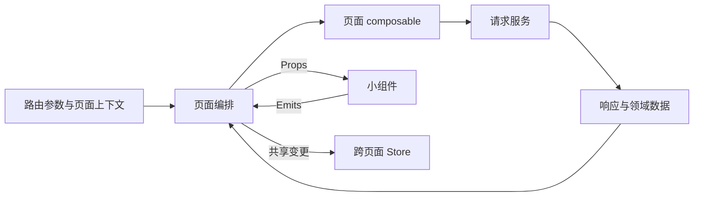

# 页面开发规范

**文档版本**：V1.0
**日期**：2026-09-24
**状态**：已发布

---

## 1. 引言

### 1.1 编写目的

本规范定义页面与小组件的职责边界、拆分策略、状态管理、数据流、异步处理和测试要求，解决大页面同时承担布局、数据、业务交互和视觉样式的维护问题。

本规范采用“大页面负责编排，小组件负责实现”的结构：页面保留跨区域的数据和流程编排，小组件承载边界清晰、可独立理解和测试的展示或交互职责。业务页面目标和交互流程由需求与设计文档提供，组件库和样式工具由项目依赖确定。

### 1.2 适用范围

适用于新增页面、页面重构、复杂表单、列表页、详情页、编辑器、仪表盘、弹层页面和包含多个独立区域的交互页面。

### 1.3 与其他规范的关系

- 前端分层、TypeScript、路由和请求基础见 `docs/00-spec/03-frontend.md`。
- 通用视觉、状态、响应式和可访问性见 `docs/00-spec/18-frontend-design.md`。
- 滚动区域和滚动拥有者见 `docs/00-spec/13-scroll-container.md`。
- 页面具体业务目标、文案、字段和交互流程由需求、设计和交互文档定义。
- 组件库和样式工具由项目依赖决定，本规范不新增或替代组件库。

### 1.4 定义与缩写

| 术语 | 定义 |
| --- | --- |
| 页面 | 对应一个可导航交互单元的顶层容器，负责页面级状态编排和区域组合。 |
| 小组件 | 职责边界清晰的局部展示或交互单元，可独立理解、测试和复用。 |
| 页面容器 | 负责组织页面区域、间距、滚动和响应式布局的组件或样式单元。 |
| 业务组件 | 包含领域数据或业务规则的组件，不应与纯展示组件混淆。 |
| 组合式逻辑 | 可复用的状态、副作用和交互流程，通常由 composable 承载。 |
| 页面局部状态 | 只在一个页面或区域使用的状态，不应无理由提升为全局状态。 |
| 跨页面状态 | 需要被多个页面或路由共享的状态，应集中管理并定义生命周期。 |

---

## 2. 页面模型与职责边界

### 2.1 分层职责

| 层级 | 主要职责 | 不应承担的职责 |
| --- | --- | --- |
| 页面 | 路由参数消费、页面级权限门禁、请求编排、区域组合和页面级错误边界 | 重复实现通用小组件的内部细节 |
| 页面容器 | 页面布局、区域排列、响应式容器和滚动边界 | 业务规则、请求编排和全局状态 |
| 小组件 | 单一区域的展示、表单、列表项、面板、弹层或交互 | 页面级路由流程、跨区域数据编排和隐式全局副作用 |
| composable | 可复用状态、副作用、表单逻辑、异步流程和生命周期清理 | 页面布局和无关的跨页面状态 |
| service | 请求构造、响应解包和传输适配 | UI 状态、路由跳转、弹窗和页面布局 |
| store | 跨页面或跨路由共享的状态及其公开变更方法 | 单个组件的临时输入状态和纯展示计算 |

### 2.2 UI-PAGE-01：页面是编排容器

页面应负责：

- 消费并校验路由参数；
- 建立页面级权限和资源门禁；
- 组合页面容器和小组件；
- 编排跨区域的数据加载、保存、删除和刷新；
- 维护页面级加载、空态、错误和重试边界；
- 在离开页面时清理自身拥有的副作用和状态。

页面不应把所有数据请求、弹窗实现、表格渲染和表单细节都堆叠在同一个文件中。

### 2.3 UI-PAGE-02：小组件只承担清晰局部职责

一个小组件应能用一句话说明其职责，例如“展示资源列表”“编辑一组表单字段”“提供选择器弹层”。如果一个组件同时负责请求、路由、多个独立表单、布局和全局提示，应优先拆分。

小组件可以拥有纯展示所需的局部状态，但不应隐式修改跨页面状态。必须修改共享状态时，应通过明确的 store 方法或页面事件完成。

### 2.4 页面结构示意

```text
ResourceListPage
├── PageHeader                 页面标题、状态和主要操作
├── ResourceFilterBar          搜索、筛选和视图控制
├── ResourceTable              资源数据、展示和行级操作
├── ResourceEmptyState         空数据、错误和无权限状态
└── ResourcePagination         分页和结果统计
```

页面模板应优先表达区域关系和组件组合，不应在一个模板中重复实现多个小组件的内部结构。

---

## 3. 页面拆分策略

### 3.1 拆分信号

出现以下任一信号时，应评估是否提取小组件或 composable：

- 页面同时包含多个可以独立命名的内容区域；
- 同一段结构或交互逻辑在页面内重复出现；
- 单个区域拥有独立的加载、空态、错误或提交状态；
- 模板中出现大量条件分支、事件处理或局部样式；
- 一个区域需要独立测试、复用或权限控制；
- 页面同时承担多个复杂表单、列表、编辑器和弹层流程；
- 页面状态之间存在明显的独立生命周期；
- 页面文件的脚本、模板或样式已经难以独立审查。

### 3.2 软性审查阈值

文件行数只能作为拆分提醒，不能作为唯一标准。新增或重构页面出现以下情况时，应在评审中说明是否需要拆分：

- 页面脚本、模板或样式合计约 300 行以上，且包含两个以上独立区域；
- 页面超过约 500 行，或单个区域包含复杂状态机；
- 同一页面存在多个异步流程、多个弹层或多个独立表单；
- 组件测试必须依赖大量页面级初始化才能运行。

超过阈值不表示必须机械拆文件；保留在页面中的代码必须职责单一，并有明确的复用或复杂度理由。

### 3.3 页面保留内容

以下内容通常保留在页面层：

- 页面级数据编排和跨区域状态协调；
- 路由参数与页面权限门禁；
- 页面容器、区域排列和页面级响应式布局；
- 多个小组件之间的选择、提交和导航流程；
- 页面级错误边界和离开页面清理。

### 3.4 小组件提取内容

以下内容通常适合提取为小组件：

- 可独立描述的展示区域；
- 重复出现的卡片、表格项、过滤栏、详情面板或状态块；
- 具有独立 Props/Emits/Slots 接口的表单或编辑器区域；
- 需要独立加载、空态、错误和权限状态的区域；
- 具有清晰视觉边界和交互边界的弹层、抽屉或面板。

### 3.5 何时提取 composable

当逻辑不依赖具体布局、但包含状态、副作用、表单规则或异步流程时，应优先提取 composable。典型情况包括搜索防抖、分页状态、表单校验、异步保存、事件订阅和跨区域选择状态。

如果逻辑只服务于一个小组件且没有复用价值，可以保留为组件本地逻辑；不要为了形式完整创建只有一个调用方的抽象层。

---

## 4. 数据流与状态归属

### 4.1 推荐数据流



箭头表示主要数据方向。小组件不直接绕过页面或 composable 修改页面级数据。

### 4.2 UI-PAGE-03：状态必须有唯一拥有者

每类状态只能有一个明确的拥有者：

| 状态类型 | 推荐拥有者 | 说明 |
| --- | --- | --- |
| 路由参数和页面模式 | 页面/路由层 | 页面消费并转换为明确参数 |
| 页面查询、表单草稿和提交状态 | 页面或页面 composable | 不应无理由进入全局 Store |
| 小组件输入和展示状态 | 小组件 | 通过 Props/Emits 与页面同步 |
| 可复用异步流程 | composable | 负责竞态、取消、重试和清理 |
| 跨页面共享状态 | store | 只暴露必要状态和变更方法 |
| 请求构造和响应解包 | service | 不持有 UI 状态 |

### 4.3 UI-PAGE-04：遵循单向数据流

页面通过 Props 向小组件传递数据，小组件通过 Emits 向页面报告变化或意图。需要组合内容时使用 Slots。双向绑定必须有明确的 `update:*` 事件和值类型，不得通过直接修改 Props 实现状态同步。

### 4.4 异步流程

页面和 composable 必须明确处理：

- 首次加载与刷新；
- 竞态请求和过期响应；
- 取消订阅、定时器和观察器；
- 失败后的重试入口；
- 提交中的重复点击防护；
- 页面离开或上下文变化后的清理；
- 乐观更新失败时的回滚或重新加载。

禁止用组件卸载后仍可能写回状态的隐式异步任务。请求结果写入状态前应确认请求仍然有效。

### 4.5 缓存与持久化

- 页面状态默认在页面离开时释放；
- 跨页面复用的数据应说明来源、更新时机、失效策略和错误恢复方式；
- 只持久化必要的会话信息，不得把敏感凭证或完整业务对象无必要地写入持久化存储；
- 作用域、用户或权限变化时，必须清理依赖旧上下文的缓存和页面状态。

---

## 5. 组件接口与文件组织

### 5.1 Props、Emits 与 Slots

- Props 表达小组件需要的数据和配置，不应传入与职责无关的完整页面对象；
- Emits 表达用户意图或状态变化，不应把组件内部实现细节泄漏给页面；
- Slots 用于内容扩展和结构组合，默认插槽保持稳定的基础结构；
- 双向绑定只用于确实需要双向同步的值，并定义更新事件名称；
- 组件接口应使用明确的 TypeScript 类型，避免以宽泛对象承载多个无关职责。

### 5.2 UI-PAGE-05：保持组件接口稳定

组件接口应满足以下要求：

- Props、Emits 和 Slots 名称应清晰并与组件职责一致，避免暴露内部实现或页面细节；
- 必填、可选和默认值边界清晰；
- 事件触发条件明确，不因内部渲染变化产生意外事件；
- 组件可以独立挂载和测试，不要求页面提供隐式全局状态；
- 组件升级时优先保持向后兼容，无法兼容时记录迁移说明。

### 5.3 文件组织

推荐按职责组织：

```text
pages/
  resource-list/
    ResourceListPage.vue
    components/
      ResourceFilterBar.vue
      ResourceTable.vue
    composables/
      useResourceList.ts
    types.ts
components/
  resource/
    ResourceCard.vue
    ResourceEmptyState.vue
```

目录名称可以根据项目约定调整，但页面、页面私有组件、可复用组件和组合式逻辑应有清晰边界。页面私有的小组件不必无条件提升为全局公共组件。

### 5.4 命名

- 页面组件使用能表达页面职责的名称；
- 小组件使用名词或“区域 + 职责”的名称，避免 `Common`、`Base`、`Index` 等无法表达边界的名称；
- Props 使用清晰的业务或展示语义，避免 `data1`、`info`、`obj` 等模糊命名；
- Emits 使用动词或 `update:*` 约定；
- Composable 使用 `use` 前缀，并保持返回值和副作用命名明确。

---

## 6. 页面实现流程

### 6.1 开发顺序

1. 明确页面任务、路由输入、权限门禁和页面状态；
2. 绘制页面区域和组件边界；
3. 先定义数据模型、Props/Emits/Slots 和状态拥有者；
4. 实现页面容器和小组件的正常状态；
5. 补齐加载、空态、错误、权限、提交中和成功状态；
6. 接入请求、重试、清理和响应式行为；
7. 添加页面、composable 和小组件测试；
8. 进行视觉、键盘、窄屏和长内容验收。

### 6.2 请求和副作用边界

- 页面可以直接编排 service，也可以调用页面级 composable；小组件默认不直接依赖 service。
- 小组件确实需要请求时，应通过明确的局部 composable 或上层事件进入数据流，并说明其生命周期。
- service 不得触发路由跳转、弹窗、消息提示或修改组件状态。
- 页面离开时必须清理本页创建的监听器、定时器、订阅和未完成副作用。
- 失败提示应使用统一错误处理机制，业务错误和技术错误应可区分。

### 6.3 UI-PAGE-06：页面负责完整状态

页面必须提供适用场景下的首次加载、刷新、空数据、错误、无权限、提交中、成功和重试状态。小组件可以拥有局部展示状态，但不能因为状态分散而使页面缺少整体反馈。

### 6.4 UI-PAGE-07：小组件不得成为隐藏的页面

小组件不得通过直接导入页面、修改路由、读取未声明的全局变量或触发隐式跳转来承担页面流程。需要页面级行为时，必须通过 Emits 或注入的明确端口向上表达。

### 6.5 UI-PAGE-10：页面离开时清理副作用

页面卸载或路由离开时，必须清理本页创建的定时器、事件监听、订阅、观察器和未完成异步任务。composable 应提供明确的清理边界，页面测试应验证组件卸载后不会继续写回状态或触发不可见副作用。

---

## 7. 测试与质量

### 7.1 测试分层

| 对象 | 最低覆盖内容 |
| --- | --- |
| 纯函数和工具 | 正常值、边界值、非法值和格式化 |
| composable | 状态转换、异步成功/失败、竞态、取消和清理 |
| 小组件 | 渲染、Props、Emits、用户交互、禁用和关键状态 |
| 页面 | 路由输入、权限门禁、数据编排、区域组合和错误恢复 |
| 页面集成 | 关键用户流程、请求边界、提交保护和状态切换 |

### 7.2 UI-PAGE-08：按职责测试

测试应验证行为和边界，而不是绑定内部实现细节。小组件测试不得依赖完整页面初始化；页面测试应覆盖跨区域流程和状态清理；composable 测试应重点覆盖副作用和竞态。

### 7.3 验收场景

至少手动验证以下场景：

- 首次进入、刷新和重新进入页面；
- 空数据、请求失败、权限不足和数据过期；
- 快速重复搜索、切换筛选和离开页面；
- 提交中重复点击、保存失败和重试；
- 键盘导航、焦点恢复、屏幕阅读器可识别名称；
- 窄屏、长文本、长列表和减少动效偏好；
- 页面内小组件的状态不会错误影响其他区域。

---

## 8. 大页面迁移策略

### 8.1 UI-PAGE-09：渐进式拆分

大页面重构应按以下顺序进行：

1. 记录当前行为和状态矩阵；
2. 先提取无副作用的展示区域；
3. 再提取具有明确 Props/Emits/Slots 的交互区域；
4. 将可复用异步逻辑提取为 composable；
5. 最后收敛页面级编排和共享状态；
6. 每一步保持功能和视觉行为可验证。

不得以一次性重写全部页面为前提，也不得在拆分过程中同时改变业务规则、接口契约和视觉设计。

### 8.2 迁移原则

- 先建立测试或可重复的验收记录，再移动代码；
- 保持对外 Props、Emits、路由和请求契约稳定，除非另有设计变更；
- 小组件提取后应删除页面中的重复逻辑，而不是保留两份实现；
- 发现原有状态、样式或依赖问题时，记录并单独确认，不在拆分任务中静默改变业务语义；
- 旧页面可以按风险分批迁移，新页面必须遵循本规范。

---

## 9. 页面开发审查清单

| 编号 | 检查项 | 通过标准 |
| --- | --- | --- |
| UI-PAGE-01 | 页面职责 | 页面主要承担编排、门禁、组合和页面级状态。 |
| UI-PAGE-02 | 小组件职责 | 每个小组件职责可独立说明和测试。 |
| UI-PAGE-03 | 状态归属 | 每类状态有唯一拥有者，没有隐式重复状态。 |
| UI-PAGE-04 | 单向数据流 | Props 向下、Emits 向上，Slots 用于内容扩展。 |
| UI-PAGE-05 | 接口稳定 | Props、Emits、Slots 类型明确且边界稳定。 |
| UI-PAGE-06 | 状态完整 | 页面和小组件覆盖适用的异步和权限状态。 |
| UI-PAGE-07 | 依赖边界 | 小组件不隐藏页面路由、服务或共享状态依赖。 |
| UI-PAGE-08 | 分层测试 | 页面、composable、小组件按职责测试。 |
| UI-PAGE-09 | 渐进迁移 | 拆分过程保持行为可验证，未混合无关业务变更。 |
| UI-PAGE-10 | 页面清理 | 页面离开后副作用、订阅和局部状态得到清理。 |

---

## 10. 参考

- 前端工程基础：`docs/00-spec/03-frontend.md`
- 前端通用设计：`docs/00-spec/18-frontend-design.md`
- 滚动容器专项：`docs/00-spec/13-scroll-container.md`
- 前端质量门禁：`docs/00-spec/07-quality.md`
- API 契约：`docs/00-spec/05-api.md`

---

**文档结束**
