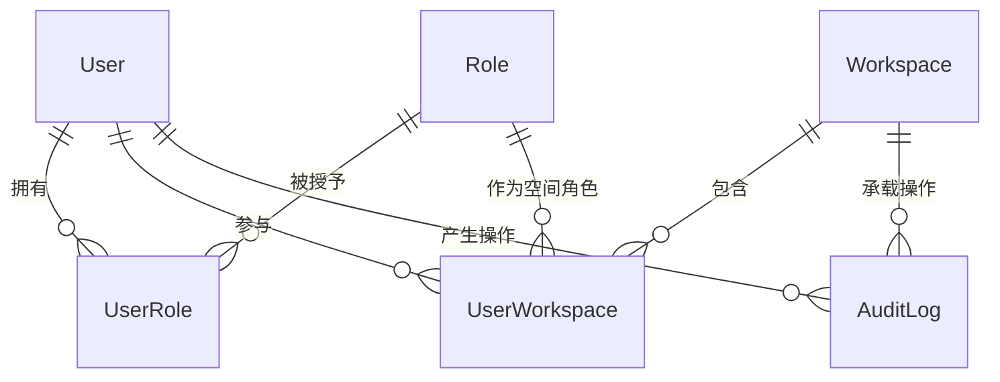

# 软件测试平台——系统管理模块概要设计

**文档版本**：V1.0  
**日期**：2026-10-01  
**状态**：起草中  

---

## 1. 引言

### 1.1 编写目的

对系统管理模块进行概要设计，明确子模块划分、认证与权限等核心机制、数据实体关系与接口职责边界，为详细设计与开发提供依据。

### 1.2 范围与对应需求

对应需求分册 `docs/01-requirements/01-system-management/02-srs-system-management.md` 及其数据概览、用户管理、空间管理、角色管理、审计查询、系统初始化六个页面分册；本分册为模块总览，页面级子模块的设计分别见对应分册（见 2.1）。跨模块公共数据与接口约定见 `docs/02-high-level-design/04-hld-data-interface.md`，部署与安全约束见 `docs/02-high-level-design/05-hld-deployment-security.md`。

### 1.3 定义与缩写

| 术语 | 定义 |
| ---- | ---- |
| 系统角色 | 作用于管理端的角色，仅分配管理端权限（沿用需求分册定义） |
| 工作空间角色 | 作用于某个工作空间的角色，通过用户-空间关联授予 |
| 权限码 | 形如 `模块:操作` 的权限标识，如 `user:view` |
| 上下文头 | 标识当前工作空间 / 项目的请求头，不出现在 URL 中 |

## 2. 模块划分

### 2.1 子模块清单

    系统管理模块（/admin 管理端）
    ├── 数据概览        → 03-hld-system-management-dashboard
    ├── 用户管理        → 04-hld-system-management-user
    ├── 空间管理        → 05-hld-system-management-workspace
    ├── 角色管理        → 06-hld-system-management-role
    ├── 审计查询        → 07-hld-system-management-audit
    └── 系统初始化      → 08-hld-system-management-init（公开入口，不进导航）

### 2.2 职责简述

* **数据概览**：全平台聚合口径的关键指标与趋势展示，管理端默认落地页，不设独立权限点。
* **用户管理**：平台账号的生命周期维护（启用/禁用/锁定三态流转）与系统角色分配，不提供删除。
* **空间管理**：全局工作空间的新建、详情维护、成员构成与归档/重新启用。
* **角色管理**：系统角色与工作空间角色的定义、权限点配置与关联用户管理。
* **审计查询**：全平台操作与登录记录的条件检索、分页列表与统计概览，只读脱敏。
* **系统初始化**：首次部署后的管理员创建与密码设置，登录域公开引导页。

### 2.3 与相邻模块的关系

* **空间管理模块（业务端）**：本模块的空间管理为全局管理视角，工作空间内的成员日常维护、项目管理归业务端空间管理模块；两侧共用同一工作空间实体与成员关系。
* **业务功能模块**：用户、角色与工作空间是业务功能的授权基础，业务端权限由本模块定义的角色权限派生。
* **认证与上下文**：登录、令牌与初始化检测属本模块的公共入口，被所有管理端与业务端页面复用。

## 3. 核心机制设计

### 3.1 认证与上下文

* 系统首次部署后，任何页面先检查初始化状态，未初始化则引导至初始化页设置管理员密码，完成后进入登录流程。
* 登录成功颁发短期访问令牌与长期刷新令牌；网关中间件验证令牌，提取用户 ID、全部角色及合并后的权限列表。
* 管理端请求仅要求用户拥有至少一个系统角色。
* 业务端上下文请求通过请求头传递工作空间 / 项目标识（除「我的空间」列表与创建入口外必须携带工作空间上下文），中间件校验归属；上下文标识禁止出现在 URL 或请求体中。
* 角色或权限变更后无需重新登录：工作空间权限由拦截器在请求进入时实时注入，管理端权限按令牌与权限列表实时判断。
* 前端按当前用户权限码控制菜单与按钮显隐。

### 3.2 角色与权限模型

* **角色分类**：系统角色（仅管理端）与工作空间角色（作用于单个工作空间），同一用户可拥有多个系统角色，并在不同工作空间各自拥有一个工作空间角色。
* **权限合并**：用户最终权限 = 系统角色权限 ∪ 当前工作空间角色权限（并集）。
* **作用域**：角色与权限点均带作用域标记（全局 / 工作空间），系统角色配置系统级权限点，工作空间角色配置空间级权限点。
* **全量权限**：角色可声明拥有对应作用域下的全部权限码，运行时自动注入，无需逐个配置；预置「系统管理员」角色即属此类，不可删除、不可修改。
* **权限存储**：角色的权限码集合随角色持久化，权限点以树形（一级模块 / 二级模块）组织，新增功能追加节点即可扩展。
* **授权管理边界**：系统管理员在用户管理中只分配系统角色；工作空间角色可在角色管理中关联，也可由空间管理员在成员管理中设置。

### 3.3 管理端布局与导航菜单派生

* 管理端壳层为「顶部导航栏 + 左侧分组侧栏 + 内容区」；顶栏承载平台标识与全局入口，侧栏承载管理端功能菜单。
* **菜单单一真相源**：功能菜单项与路由合并声明（展示名、图标、排序、所属分组、所需权限），导航层按当前路由所处模式取回声明并做权限过滤，派生侧栏分组与菜单；未声明菜单元信息的路由不产生菜单项。
* 当前模式由当前路由派生，不由页面命令式切换，避免路由与菜单双份配置漂移。
* 侧栏分组规则：无分组声明的菜单置顶（数据概览），其余按分组标题连续分组（组织与权限）内按排序升序；权限过滤后为空的分组整体不展示。
* 具体声明字段与派生流程见《前端导航与菜单注册架构设计》（`docs/03-architecture/03-navigation-architecture.md`），菜单呈现与交互见《全局导航与菜单交互系统设计》（`docs/05-interaction-design/02-global-navigation.md`）。

### 3.4 管理端数据隔离例外

管理端接口不注入工作空间 / 项目上下文，按系统权限做全局查询；页面中的空间 ID、用户 ID 等为被管理资源标识，服务端一律按系统权限与资源归属校验，不视为调用者的活动上下文（数据隔离总口径见 `docs/02-high-level-design/04-hld-data-interface.md` 第 1.3 节）。

## 4. 数据设计

实体与关系（实体级，字段、DDL 与索引留详细设计 `docs/04-detailed-design/01-system-management/02-system-management-overview.md`）：

| 实体 | 职责 |
| ---- | ---- |
| User | 平台账号，含状态（启用/禁用/锁定）与密码凭据 |
| Role | 角色，含类型（系统/工作空间）、作用域、全量权限标记与权限码集合 |
| UserRole | 用户与系统角色的多对多关联 |
| Workspace | 工作空间，含活跃/归档状态 |
| UserWorkspace | 用户-空间关联，含该空间内的工作空间角色 |
| Permission | 权限点，树形组织，按作用域划分 |
| AuditLog | 审计记录，承载操作与登录行为的追溯 |

## 5. 接口设计概要

资源与职责划分（路径、方法与报文留详细设计；公共约定见 `docs/02-high-level-design/04-hld-data-interface.md`）：

| 资源 | 职责 | 归属 |
| ---- | ---- | ---- |
| 认证与初始化 | 初始化状态检测、初始化设置、登录、令牌刷新、修改密码、当前权限获取 | 公开 / 登录域 |
| 用户 | 列表、创建、详情、更新、状态流转、批量启用/禁用、重置密码 | 管理端 |
| 工作空间（管理端） | 列表、创建、详情、更新、归档/重新启用、成员查看与维护 | 管理端 |
| 角色与权限 | 角色 CRUD、权限点树、权限配置、关联用户维护 | 管理端 |
| 数据概览 | 平台指标统计聚合 | 管理端 |
| 审计 | 审计分页查询、统计聚合 | 管理端 |

上下文标识通过请求头传递，不出现在 URL 中；管理端接口仅需系统角色，数据概览不设独立权限点。

## 6. 设计约束与原则

* 系统角色仅用于管理端，工作空间角色用于业务端，权限边界不混用。
* 用户不提供删除，仅状态流转；角色删除受预置标记与关联约束限制。
* 预置角色与预置权限全量锁定，不参与编辑。
* 权限点树形管理，新增功能追加节点即可扩展，不改权限合并机制。
* 所有异常经统一错误码抛出，错误码为 10 位（框架全局错误码除外）。
* 上下文标识只经请求头传递（C4），管理端域不读取活动上下文。

## 修改记录

| 版本 | 日期 | 说明 |
| ---- | ---- | ---- |
| V1.0 | 2026-10-01 | 初始版本 |
| V1.0 | 2026-10-02 | 数据隔离原则引用改指数据与接口设计分册 |
