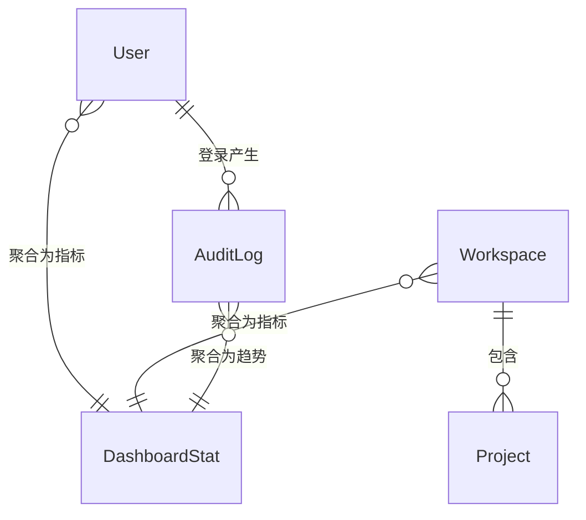

# 软件测试平台——数据概览概要设计

**文档版本**：V1.0  
**日期**：2026-10-01  
**状态**：起草中  

---

## 1. 引言

### 1.1 编写目的

对系统管理模块的数据概览页进行概要设计，明确指标聚合机制、数据实体关系与接口职责，为详细设计与开发提供依据。

### 1.2 范围与对应需求

对应需求分册 `docs/01-requirements/01-system-management/03-srs-system-management-dashboard.md`；模块公共机制（认证、权限、导航）见 `docs/02-high-level-design/01-system-management/02-hld-system-management.md`。

### 1.3 定义与缩写

| 术语 | 定义 |
| ---- | ---- |
| 活跃用户 | 某自然日内按用户去重的登录用户数（沿用需求分册定义） |
| 数据截至 | 统计生成时间，展示于页面副标题 |

## 2. 模块划分

### 2.1 页面构成

    数据概览（管理端默认落地页）
    ├── 页面头部（标题、副标题、刷新）
    ├── 关键指标卡 ×4（用户总数 / 工作空间 / 项目总数 / 今日活跃）
    ├── 趋势与分布图 ×2（近 14 日活跃用户 / 用户状态分布）
    └── 最近创建的空间（表格）

### 2.2 职责边界

* 全平台聚合口径，不按工作空间或项目拆分，不提供时间范围选择与报表导出。
* 无独立权限点：可进入管理端即可读取，菜单由管理端整体守卫控制。
* 指标卡、图表与空间表格三个区块独立加载、互不影响，任一区块失败仅在该区块提供重试。

## 3. 核心机制设计

### 3.1 指标聚合

* 指标全部由既有实体聚合派生（用户、工作空间、项目、登录行为），不引入独立事实表或预聚合存储，保证口径与业务数据始终一致。
* 脚注类辅助指标（较上周新增、启用用户数、活跃/归档数、近 7 日新增）与主指标同源同次计算，避免展示口径漂移。
* 统计生成时间随响应返回，页面据以渲染「数据截至」副标题。

### 3.2 趋势与分布

* 近 14 日活跃趋势按自然日切片、按日去重登录用户数，无记录日期补 0 后形成连续序列。
* 用户状态分布按启用/禁用/锁定三态分组计数，与用户总数在同一次统计中保证合计一致。
* 图表计算为纯函数式的数据变换，输入统计序列、输出视图数据，不持有状态。

### 3.3 加载与刷新

* 进入页面自动加载；「刷新」重新拉取指标、图表与空间表格第一页数据。
* 页面级加载遮罩仅覆盖首次加载；刷新时已展示数据保持可见，避免整页闪烁。

## 4. 数据设计

实体与关系（只读聚合，无新增实体；实体定义见 `docs/02-high-level-design/01-system-management/02-hld-system-management.md` 第 4 节）：

| 聚合视图 | 来源实体 | 说明 |
| ---- | ---- | ---- |
| 指标卡 | User、Workspace、Project、AuditLog（登录记录） | 主值与脚注同源计算 |
| 活跃趋势 | AuditLog（登录记录） | 按日去重，补 0 连续 |
| 状态分布 | User | 按状态分组计数 |
| 最近空间 | Workspace | 按创建时间倒序取页 |

## 5. 接口设计概要

资源与职责划分（路径、方法与报文留详细设计）：

| 资源 | 职责 | 归属 |
| ---- | ---- | ---- |
| 概览统计 | 指标卡与图表数据、统计生成时间 | 管理端 |
| 最近空间 | 最近创建的空间分页列表 | 管理端 |

概览统计与最近空间可分块获取，支撑区块独立加载与局部重试；管理端接口按系统角色授权。

## 6. 设计约束与原则

* 保持只读：不提供导出、不修改任何业务数据。
* 不新增事实表与定时聚合任务，聚合实时计算；量级增长成为瓶颈时的预聚合优化留待后续评估，不在本期设计内。
* 区块间加载互不阻塞，错误局部化呈现。
* 需求分册标注本页为新版设计，交互细节见 `docs/05-interaction-design/01-system-management/03-system-management-ui-dashboard.md`。

## 修改记录

| 版本 | 日期 | 说明 |
| ---- | ---- | ---- |
| V1.0 | 2026-10-01 | 初始版本 |
