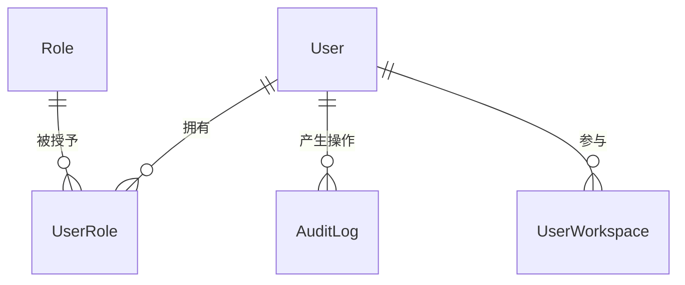

# 软件测试平台——用户管理概要设计

**文档版本**：V1.0  
**日期**：2026-10-01  
**状态**：起草中  

---

## 1. 引言

### 1.1 编写目的

对系统管理模块的用户管理页进行概要设计，明确账号状态机、会话失效机制、数据实体关系与接口职责，为详细设计与开发提供依据。

### 1.2 范围与对应需求

对应需求分册 `docs/01-requirements/01-system-management/04-srs-system-management-user.md`；模块公共机制（认证、角色分配、导航）见 `docs/02-high-level-design/01-system-management/02-hld-system-management.md`。

### 1.3 定义与缩写

| 术语 | 定义 |
| ---- | ---- |
| 三态 | 用户状态启用 / 禁用 / 锁定，仅启用允许登录（沿用需求分册定义） |
| 会话失效 | 受影响账号已登录的令牌立即作废，需重新登录 |

## 2. 模块划分

### 2.1 页面构成

    用户管理
    ├── 用户列表（筛选栏 + 表格 + 分页）
    │     ├── 行操作（编辑 / 启用 / 禁用 / 锁定 / 重置密码）
    │     └── 批量操作（批量启用 / 批量禁用）
    └── 用户表单（新建与编辑共页，按模式调整可编辑范围）

### 2.2 职责边界

* 只维护账号本身与系统角色分配；工作空间归属由全局空间管理维护，本模块不涉及。
* 不提供删除账号功能，账号生命周期止于状态流转。
* 用户名、邮箱全局唯一，由本模块创建时校验。

## 3. 核心机制设计

### 3.1 状态机

    启用 ⇄ 禁用
    启用 ⇄ 锁定
    禁用 ⇄ 锁定

* 三态两两相互可流转，仅「启用」允许登录；禁用与锁定均阻断登录，历史数据保留。
* 批量操作仅覆盖启用/禁用两个方向，不提供批量锁定或解锁。
* 状态变更为原位更新，不触碰账号的其他属性。

### 3.2 会话失效

* 禁用、锁定、重置密码成功后，该账号此前已登录的会话立即失效（令牌撤销），强制重新登录。
* 启用操作不终止已有会话。
* 会话失效在服务端按账号维度撤销，前端不承担失效判断。

### 3.3 凭据与凭据重置

* 密码长度策略为 8~64 字符，平台统一；新建与重置走同一策略校验。
* 重置密码由管理员发起，需二次确认目标账号；编辑态改密与重置共用同一凭据更新入口。

### 3.4 系统角色分配

* 用户表单以复选方式分配系统角色，可不勾选（无系统角色即不可进管理端）。
* 分配角色只影响系统角色维度，工作空间角色不受影响。

## 4. 数据设计

实体与关系（字段、DDL 与索引留详细设计 `docs/04-detailed-design/01-system-management/02-system-management-overview.md`）：

| 实体 | 职责 |
| ---- | ---- |
| User | 账号主体，状态三态与凭据的载体 |
| UserRole | 用户与系统角色的多对多关联 |
| AuditLog | 状态变更、重置密码等管理操作的追溯记录 |

用户-空间归属不在本模块维护，经 `UserWorkspace` 实体与空间管理共用。

## 5. 接口设计概要

资源与职责划分（路径、方法与报文留详细设计）：

| 资源 | 职责 | 归属 |
| ---- | ---- | ---- |
| 用户列表 | 条件检索、分页查询 | 管理端 |
| 用户 | 创建、详情、属性更新（编辑态不可改用户名） | 管理端 |
| 用户状态 | 单个与批量的启用/禁用/锁定流转 | 管理端 |
| 用户凭据 | 重置密码 | 管理端 |

状态流转与重置密码成功后由服务端触发会话失效；接口按 `user:*` 权限码授权，上下文标识不参与。

## 6. 设计约束与原则

* 不提供删除接口，禁止实现任何形式的物理删号入口。
* 状态变更只更新状态字段，不做整行替换（部分更新）。
* 唯一性（用户名、邮箱）在服务端强校验，前端提示不作为约束。
* 二次确认、强制下线等交互与安全细节见 `docs/05-interaction-design/01-system-management/04-system-management-ui-user.md` 与详细设计。

## 修改记录

| 版本 | 日期 | 说明 |
| ---- | ---- | ---- |
| V1.0 | 2026-10-01 | 初始版本 |
