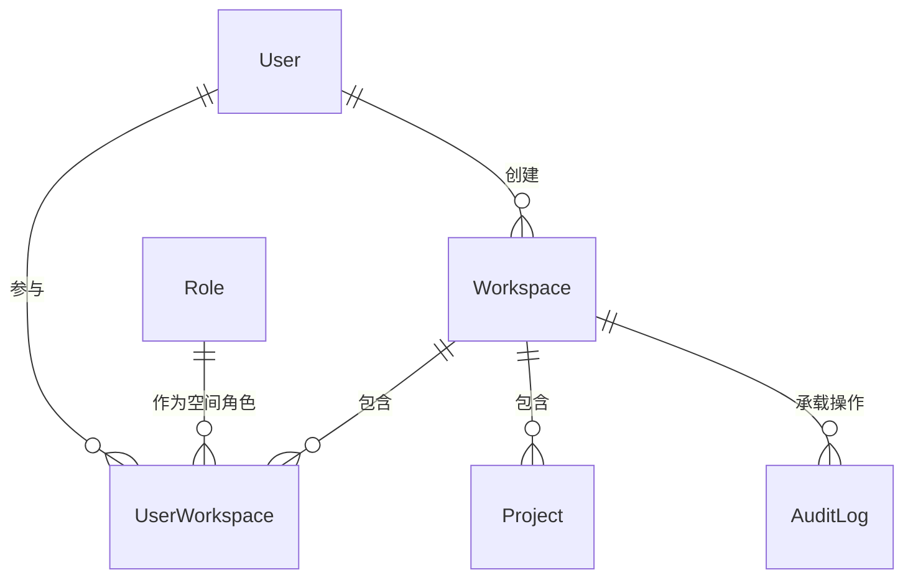

# 软件测试平台——空间管理概要设计

**文档版本**：V1.0  
**日期**：2026-10-01  
**状态**：起草中  

---

## 1. 引言

### 1.1 编写目的

对系统管理模块的空间管理页进行概要设计，明确工作空间状态机、成员构成机制、数据实体关系与接口职责，为详细设计与开发提供依据。

### 1.2 范围与对应需求

对应需求分册 `docs/01-requirements/01-system-management/05-srs-system-management-workspace.md`；模块公共机制见 `docs/02-high-level-design/01-system-management/02-hld-system-management.md`；业务端视角的空间与成员日常维护对应需求分册 `docs/01-requirements/02-space-management/01-readme.md`。

### 1.3 定义与缩写

| 术语 | 定义 |
| ---- | ---- |
| 空间管理员 | 工作空间内拥有管理权限的工作空间角色持有者（沿用需求分册定义） |
| 归档 | 工作空间只读冻结状态，成员归属保留 |

## 2. 模块划分

### 2.1 页面构成

    空间管理
    ├── 空间列表（状态筛选 + 关键字搜索 + 新建入口）
    ├── 新建空间对话框（名称 + 管理员 + 描述）
    └── 空间详情
          ├── 页头（名称、状态、归档/重新启用入口）
          ├── 基本信息与统计（名称、创建人、描述、成员数、项目数）
          └── 成员列表（添加、改角色、移除）

### 2.2 职责边界

* 全局管理视角：创建空间并指定首名管理员、维护基本信息与成员构成、归档与重新启用。
* 列表页只读浏览，状态变更入口收敛在详情页头部。
* 与业务端空间管理共用同一工作空间实体与成员关系，不做数据复制。

## 3. 核心机制设计

### 3.1 状态机

    活跃 ──归档（输入空间名称确认）──> 归档
    归档 ──重新启用（立即生效）────> 活跃

* 空间状态仅活跃/归档两态；名称全局唯一（2~50 字符），描述上限 200 字符。
* 归档不要求空间下无项目，不解散成员归属；归档期间整页只读，重新启用后基本信息与成员关系原样生效，无需重新添加。
* 归档确认采用输入当前空间名称的防误触方式，重新启用不设二次确认。

### 3.2 首名管理员

* 创建空间必须单选一名启用状态的用户作为空间管理员，创建成功即以管理员身份加入，成为该空间首个成员。
* 成员的加入、角色调整与移除构成成员生命周期；不可将最后一名空间管理员降级，保证空间始终有管理者。

### 3.3 成员维护

* 添加成员按用户搜索后多选，逐人指定空间角色；已是成员的自动跳过。
* 角色调整行内即时生效，失败时还原展示并刷新；移除需二次确认。
* 仅启用状态用户可被添加；归档态成员列表只读。

## 4. 数据设计

实体与关系（字段、DDL 与索引留详细设计 `docs/04-detailed-design/01-system-management/02-system-management-overview.md`）：

| 实体 | 职责 |
| ---- | ---- |
| Workspace | 空间主体，名称唯一、活跃/归档状态载体 |
| UserWorkspace | 成员关系，含空间角色与加入时间 |
| Project | 空间下的项目，统计口径来源 |

空间创建人与创建时间随 Workspace 记录；成员数、项目数由成员与项目实体聚合派生。

## 5. 接口设计概要

资源与职责划分（路径、方法与报文留详细设计）：

| 资源 | 职责 | 归属 |
| ---- | ---- | ---- |
| 工作空间列表 | 状态筛选、关键字检索、分页 | 管理端 |
| 工作空间 | 创建（含首名管理员）、详情、基本信息更新 | 管理端 |
| 空间状态 | 归档、重新启用 | 管理端 |
| 空间成员 | 成员分页、添加、调整空间角色、移除 | 管理端 |

创建与成员维护同时作用于 Workspace 与 UserWorkspace 两个实体，属同一资源的组合操作；接口按 `workspace:*` 权限码授权。

## 6. 设计约束与原则

* 空间不提供删除，生命周期止于归档；归档仅冻结状态、保留成员归属。
* 归档/重新启用只变更状态字段（部分更新），不级联改写项目与成员数据。
* 最后一名空间管理员不可降级或移除的约束由服务端保证。
* 页面级交互与状态分支见 `docs/05-interaction-design/01-system-management/05-system-management-ui-workspace.md`。

## 修改记录

| 版本 | 日期 | 说明 |
| ---- | ---- | ---- |
| V1.0 | 2026-10-01 | 初始版本 |
