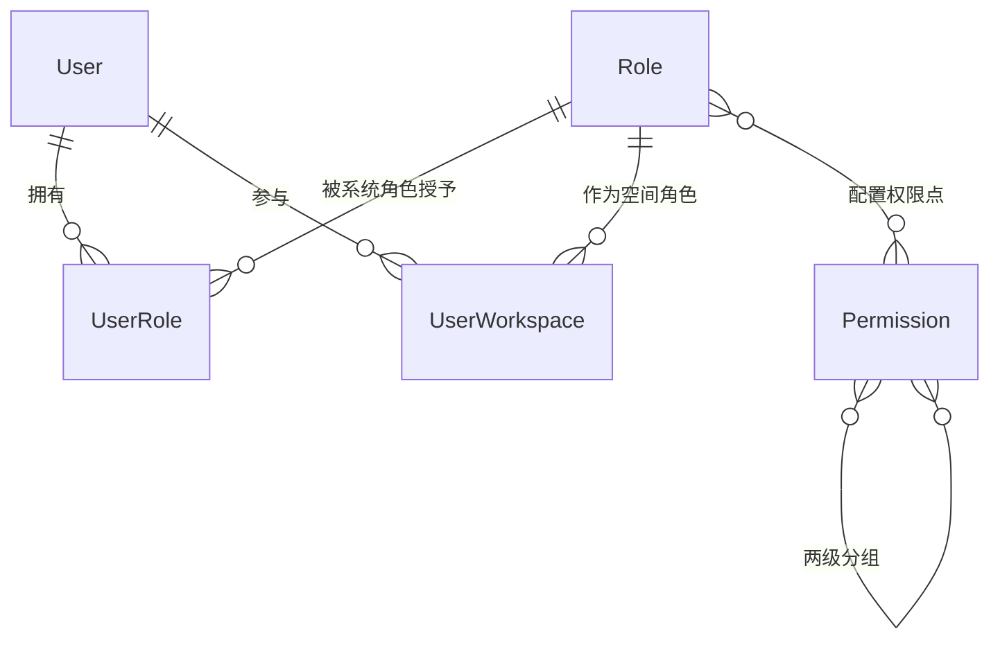

# 软件测试平台——角色管理概要设计

**文档版本**：V1.0  
**日期**：2026-10-01  
**状态**：起草中  

---

## 1. 引言

### 1.1 编写目的

对系统管理模块的角色管理页进行概要设计，明确角色分类与权限配置机制、数据实体关系与接口职责，为详细设计与开发提供依据。

### 1.2 范围与对应需求

对应需求分册 `docs/01-requirements/01-system-management/06-srs-system-management-role.md`；角色权限模型与权限合并机制见 `docs/02-high-level-design/01-system-management/02-hld-system-management.md` 第 3.2 节。

### 1.3 定义与缩写

| 术语 | 定义 |
| ---- | ---- |
| 预置角色 | 系统内置、不可删除、权限不可修改的角色（沿用需求分册定义） |
| 权限点 | 按一级模块 / 二级模块两级组织的可授权操作单元 |

## 2. 模块划分

### 2.1 页面构成

    角色管理（左右分栏）
    ├── 左侧角色列表
    │     ├── 系统角色分组（新增入口）
    │     └── 工作空间角色分组（新增入口）
    └── 右侧详情区
          ├── 权限点标签页（两级分组表格 + 全选 + 保存/撤销）
          └── 关联用户标签页（搜索添加 + 行内移除 + 分页）

### 2.2 职责边界

* 双分组始终展示：系统角色分组管理管理端权限，工作空间角色分组管理空间级权限。
* 角色名称全局唯一；预置「系统管理员」角色不可重命名、不可删除、权限全量锁定。
* 本页负责角色定义与授权关系，工作空间角色亦可由空间成员管理设置，两处入口写同一份关联数据。

## 3. 核心机制设计

### 3.1 角色维护

* 新增在对应分组下创建，重命名与删除仅对选中角色可用；删除前二次确认，删除后右侧详情随之清空。
* 删除角色须先解除其与用户、空间的关联授权，避免悬空引用。

### 3.2 权限配置

* 权限点按一级模块、二级模块两级分组呈现，同一一级模块多行合并展示模块名。
* 勾选结果与已保存结果比对驱动「保存 / 撤销修改」的可用性；撤销恢复到上次保存状态，保存以结果刷新基线。
* 全量权限角色的配置面板整体锁定，不显示保存与撤销操作——权限由作用域自动注入，不走手动配置路径。
* 权限变更即时生效：已登录用户下次请求由权限注入机制取到新权限，无需重新登录。

### 3.3 关联用户

* 系统角色关联按用户维度管理；工作空间角色关联按「用户 × 空间」维度管理——添加须同时选空间，移除时多空间持有需按空间勾选。
* 候选用户仅限启用状态且未关联者；列表按角色分页查询，空页自动回退到末页。

## 4. 数据设计

实体与关系（字段、DDL 与索引留详细设计 `docs/04-detailed-design/01-system-management/02-system-management-overview.md`）：

| 实体 | 职责 |
| ---- | ---- |
| Role | 角色主体：类型、作用域、全量权限标记、权限码集合、预置标记 |
| Permission | 权限点定义，两级树形结构 |
| UserRole | 用户与系统角色的授予关系 |
| UserWorkspace | 用户在某空间持有的工作空间角色 |

## 5. 接口设计概要

资源与职责划分（路径、方法与报文留详细设计）：

| 资源 | 职责 | 归属 |
| ---- | ---- | ---- |
| 角色 | 列表（按类型分组）、创建、重命名、删除、详情 | 管理端 |
| 角色权限 | 权限点树读取、权限码集合保存 | 管理端 |
| 角色关联用户 | 分页查询、添加、移除（含按空间维度） | 管理端 |

角色资源按类型参数区分系统/工作空间角色；权限码的注入与生效由认证与上下文机制承担，本页接口只负责维护关系数据。

## 6. 设计约束与原则

* 预置角色与预置权限点由种子数据保证，接口层禁止编辑与删除。
* 权限配置为整体提交（保存时提交勾选全集），避免逐点增量带来的中间态。
* 角色-用户关系仅更新关联表，不改写用户或角色本体（部分更新）。
* 交互细节（角色树、权限表格、关联用户组件）见 `docs/05-interaction-design/01-system-management/06-system-management-ui-role.md`。

## 修改记录

| 版本 | 日期 | 说明 |
| ---- | ---- | ---- |
| V1.0 | 2026-10-01 | 初始版本 |
