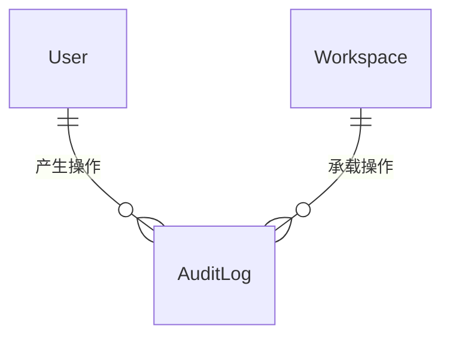

# 软件测试平台——审计查询概要设计

**文档版本**：V1.0  
**日期**：2026-10-01  
**状态**：起草中  

---

## 1. 引言

### 1.1 编写目的

对系统管理模块的审计查询页进行概要设计，明确审计写入与查询机制、数据实体关系与接口职责，为详细设计与开发提供依据。

### 1.2 范围与对应需求

对应需求分册 `docs/01-requirements/01-system-management/07-srs-system-management-audit.md`（先行需求：页面尚未实现，需求按已确认的详细设计提炼）；模块公共机制见 `docs/02-high-level-design/01-system-management/02-hld-system-management.md`。

### 1.3 定义与缩写

| 术语 | 定义 |
| ---- | ---- |
| 审计记录 | 一次业务操作或登录行为的追溯条目（沿用需求分册定义） |
| 操作类型 | 登录 / 新增 / 修改 / 删除的分类标记 |

## 2. 模块划分

### 2.1 页面构成

    审计查询（全平台口径）
    ├── 查询条件区（时间范围 / 操作类型 / 操作人 / 对象类型 + 查询/重置）
    ├── 统计概览（按所选对象类型与起始日期逐日操作次数趋势）
    └── 结果列表（分页表格，按记录时间倒序）

### 2.2 职责边界

* 只读浏览能力：不提供编辑、删除审计记录的操作。
* 审计数据全平台级，不按工作空间或项目拆分查询。
* 入口按审计查看权限过滤，无权限不显示入口。
* 写入不在本页职责内：审计由业务操作与登录流程经事件产生，本页仅消费。

## 3. 核心机制设计

### 3.1 写入机制

* 审计采用事件驱动写入：业务操作在服务层完成后发布事件，监听器统一落库，登录行为由认证流程直接写入。
* 一条记录承载：记录时间、操作人、操作类型、操作对象（类型与标识）、变更摘要、请求来源。
* 变更摘要取关键字段的前后变化概要，不保存全量快照；登录记录无变更内容。
* 敏感信息在写入侧即按脱敏口径处理，存储与展示均不落明文。

### 3.2 查询与统计

* 各查询条件可任意组合，未选条件不参与筛选，条件间为「且」的关系；条件修改须点「查询」生效。
* 结果列表按记录时间倒序分页；统计概览与结果列表随同一次查询刷新，统计范围由对象类型与起始日期决定。
* 统计与列表分属两个聚合口径（逐日计数 / 逐条明细），互不阻塞，单侧失败局部重试。

### 3.3 追加式约束

* 审计记录只增不改不删，页面与接口均不提供写回路径；历史记录在操作人改名、账号禁用后仍按当时快照展示。

## 4. 数据设计

实体与关系（字段、DDL 与索引留详细设计）：

| 实体 | 职责 |
| ---- | ---- |
| AuditLog | 审计记录主体：时间、操作人、操作类型、操作对象（类型与标识）、变更摘要、请求来源 |

审计记录复用平台既有审计日志能力，不新增独立事实表；登录记录与业务操作记录同表按操作类型区分。

## 5. 接口设计概要

资源与职责划分（路径、方法与报文留详细设计）：

| 资源 | 职责 | 归属 |
| ---- | ---- | ---- |
| 审计查询 | 多条件组合的分页明细查询 | 管理端 |
| 审计统计 | 按对象类型与起始日期的逐日计数聚合 | 管理端 |

两资源仅提供读取方法；写入不经由管理端接口，由业务操作与登录流程的事件产生。接口按审计查看权限码授权。

## 6. 设计约束与原则

* 审计数据只增不删，禁止实现任何审计记录的更新或删除入口。
* 脱敏在写入侧完成，不依赖展示层兜底。
* 页面当前尚未实现，本分册约束实现范围与验收口径，落地状态以需求分册的先行需求说明为准。
* 查询与统计接口需覆盖时间、类型、操作人、对象四类条件的索引支撑，具体索引设计留详细设计（遵循 C9）。

## 修改记录

| 版本 | 日期 | 说明 |
| ---- | ---- | ---- |
| V1.0 | 2026-10-01 | 初始版本 |
