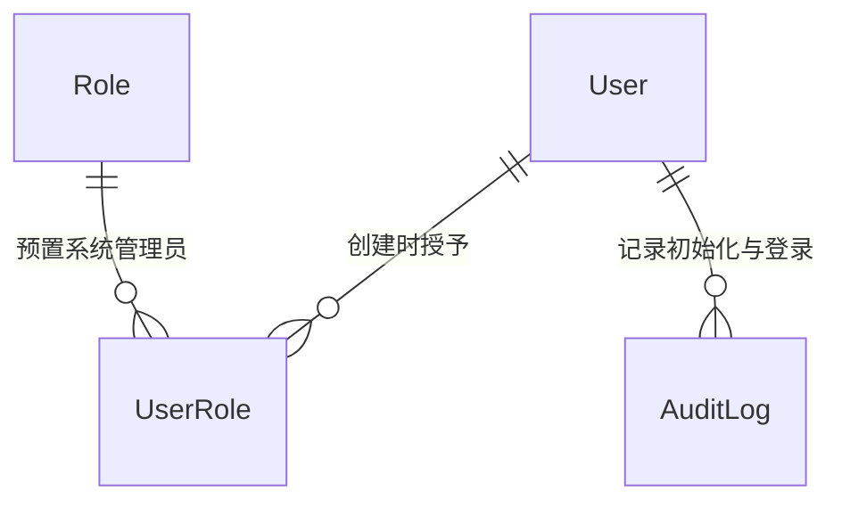

# 软件测试平台——系统初始化概要设计

**文档版本**：V1.0  
**日期**：2026-10-01  
**状态**：起草中  

---

## 1. 引言

### 1.1 编写目的

对系统管理模块的系统初始化页进行概要设计，明确初始化状态判定、管理员创建机制、数据实体关系与接口职责，为详细设计与开发提供依据。

### 1.2 范围与对应需求

对应需求分册 `docs/01-requirements/01-system-management/08-srs-system-management-init.md`；认证与上下文的公共机制见 `docs/02-high-level-design/01-system-management/02-hld-system-management.md` 第 3.1 节。

### 1.3 定义与缩写

| 术语 | 定义 |
| ---- | ---- |
| 初始化 | 首次部署后创建系统管理员账号并设置密码的一次性过程 |
| 公开入口 | 无需登录即可访问的页面入口 |

## 2. 模块划分

### 2.1 页面构成

    系统初始化（公开入口，不进入管理端导航）
    ├── 初始化检测（登录页与初始化页进入时自动检测）
    ├── 初始化表单（登录名只读 + 管理员密码 + 确认密码）
    └── 初始化完成（提示 + 跳转登录页）

### 2.2 职责边界

* 初始化在认证流程之前，是登录的前置条件；未初始化时平台不可正常使用。
* 只创建一个登录名固定的管理员账号，不提供注册其他账号的入口。
* 初始化完成后本页退场，后续账号创建归用户管理。

## 3. 核心机制设计

### 3.1 状态判定与引导

* 登录页加载时检测初始化状态：未初始化自动跳转初始化页；初始化页进入时同样检测，已初始化则跳回登录页，检测期间展示加载态。
* 检测异常不阻断：网络失败时登录页照常展示、初始化页照常展示表单，避免初始化入口因瞬时故障不可达。
* 初始化完成后再次访问初始化页不展示表单，只能经登录页进入系统。

### 3.2 一次性初始化

    读取初始化状态
      ├── 已初始化 → 返回「系统已初始化，请直接登录」
      └── 未初始化 → 校验密码策略 → 创建 admin 账号
                      → 授予系统管理员角色（预置、全量权限）
                      → 置为已初始化 → 引导登录

* 初始化判定与账号创建必须原子完成，重复提交不产生第二个账号。
* 登录名预填 `admin` 且只读，创建的账号显示名称为「系统管理员」。
* 密码策略与平台一致（8~64 字符）；长度为强制校验，字母/数字/符号为建议性提示，不阻止提交。

### 3.3 初始化后的权限起点

* 系统管理员角色为预置角色，拥有全部系统权限且不可删除，保证初始化后管理员必能进入管理端补齐用户与空间。
* 使用顺序不设约束：可先建用户，也可先建工作空间。

## 4. 数据设计

实体与关系（无新增实体，复用用户与角色；字段、DDL 留详细设计）：

| 复用实体 | 初始化中的职责 |
| ---- | ---- |
| User | 承载 admin 账号（登录名、显示名称、凭据、启用状态） |
| Role / UserRole | 预置系统管理员角色的授予关系 |
| AuditLog | 初始化完成与后续登录的追溯记录 |

初始化状态由系统内既有判定依据推导（预置管理员账号是否已创建），不引入独立状态表。

## 5. 接口设计概要

资源与职责划分（路径、方法与报文留详细设计）：

| 资源 | 职责 | 归属 |
| ---- | ---- | ---- |
| 初始化状态 | 查询系统是否已初始化 | 公开（无需认证） |
| 初始化设置 | 提交登录名与密码，创建管理员账号 | 公开（无需认证） |

初始化资源为唯一的免认证写入口，除认证域外不存在其他匿名可达接口；后续登录、令牌签发见认证资源（`docs/02-high-level-design/04-hld-data-interface.md` 第 2.2 节）。

## 6. 设计约束与原则

* 防重复初始化由服务端保证，前端提示不作为约束。
* 初始化接口为一次性写入口，初始化完成后应恒返回已初始化语义。
* 本页不进入管理端导航，由登录页检测状态后引导，导航派生规则不覆盖本页。
* 登录名固定预填不可编辑的需求由页面约束，服务端仍按统一校验规则验证。

## 修改记录

| 版本 | 日期 | 说明 |
| ---- | ---- | ---- |
| V1.0 | 2026-10-01 | 初始版本 |
