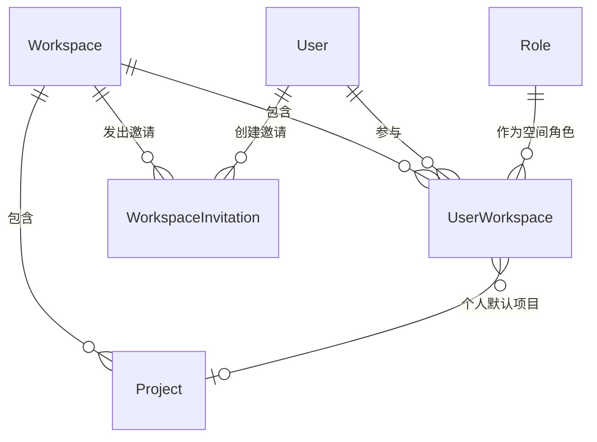

# 软件测试平台——空间管理模块概要设计

**文档版本**：V1.0  
**日期**：2026-10-01  
**状态**：起草中  

---

## 1. 引言

### 1.1 编写目的

对空间管理模块进行概要设计，明确页面级子模块划分、活跃工作空间与导航权限等核心机制、数据实体关系与接口职责边界，为详细设计与开发提供依据。

### 1.2 范围与对应需求

对应需求分册 `docs/01-requirements/02-space-management/02-srs-space-management.md` 及我的空间、空间信息、成员管理、项目列表、加入空间五个页面分册；本分册为模块总览，页面级子模块的设计分别见对应分册（见 2.1）。跨模块公共数据与接口约定见 `docs/02-high-level-design/07-hld-data-interface.md`，部署与安全约束见 `docs/02-high-level-design/08-hld-deployment-security.md`。

### 1.3 定义与缩写

| 术语 | 定义 |
| ---- | ---- |
| 工作空间 | 承载成员与项目的业务单元（沿用需求分册定义） |
| 活跃工作空间 | 当前业务上下文所指向的唯一工作空间 |
| 空间域 | 业务端中处于工作空间上下文下的导航与页面集合 |
| 上下文头 | 标识当前工作空间 / 项目的请求头，不出现在 URL 中 |
| 空间角色 | 用户在某个工作空间内持有的工作空间角色 |
| 公开域 | 无需登录即可访问的页面与接口入口 |

## 2. 模块划分

### 2.1 子模块清单

    空间管理模块（业务端）
    ├── 我的空间        → 03-hld-space-management-my-workspace
    ├── 空间信息        → 04-hld-space-management-info
    ├── 成员管理        → 05-hld-space-management-member
    ├── 项目列表        → 06-hld-space-management-project
    └── 加入空间        → 07-hld-space-management-invite-join（公开入口，不进导航）

### 2.2 职责简述

* **我的空间**：归属空间的检索、范围筛选与真实计数、活跃空间切换与创建入口，为登录后的落地页。
* **空间信息**：当前活跃空间基础资料的展示与维护，以及成员数、项目数统计与快捷入口。
* **成员管理**：当前活跃空间的成员构成维护、直接批量邀请与邀请链接的生成、跟踪和失效。
* **项目列表**：当前活跃空间内项目的浏览、创建、编辑、设为默认、归档、启封与删除。
* **加入空间**：凭邀请链接加入空间的公开入口，完成链接校验、账号分支与加入登录一体化流程。

### 2.3 与相邻模块的关系

* **系统管理模块**：全局视角的工作空间创建、归档/重新启用与成员维护见 `docs/02-high-level-design/01-system-management/05-hld-system-management-workspace.md`；两侧共用同一工作空间实体与成员关系，业务端不做数据复制。
* **功能测试模块**：项目是空间上下文与项目内功能之间的桥梁，进入项目后顶栏动态菜单切换为项目内功能入口；项目自身的生命周期管理归本模块（见 2.1）。
* **认证与权限**：登录、令牌与角色权限模型由系统管理模块提供，本模块只消费权限码，权限模型见 `docs/02-high-level-design/01-system-management/02-hld-system-management.md` 第 3.2 节。

## 3. 核心机制设计

### 3.1 活跃工作空间上下文

* 业务用户可同时归属多个工作空间，活跃工作空间唯一；无论归属一个还是多个，均由用户在我的空间页手动选择进入，系统不自动激活（见 `docs/02-high-level-design/02-space-management/03-hld-space-management-my-workspace.md` 第 3.3 节）。
* 前端持有活跃空间标识，随业务请求经上下文头携带；服务端校验当前用户属于该空间后，将空间条件注入查询，校验失败即拒绝请求。
* 切换完成后所有业务数据按新空间重新加载，不残留上一个空间的数据；已归档空间不可切换为活跃空间，也不可进入其业务功能。
* 当前活跃空间的成员关系被移除时不自动切换：继续访问该空间的业务功能被拒绝并提示，需在我的空间页手动切换到其他空间；无剩余归属空间时业务功能不可用。
* 我的空间列表与创建空间是「无活跃空间上下文」的例外（按用户归属范围查询），其余空间域接口均须携带上下文头；上下文标识禁止出现在 URL 与请求体中（C4）。

### 3.2 空间域导航与权限派生

* 处于空间上下文时，顶栏动态菜单按固定顺序呈现空间信息、成员管理、项目列表；进入项目后动态菜单切换为项目内功能入口。
* 菜单项按所需权限码过滤，无权限的菜单项不展示；未选择活跃空间时，不展示空间域菜单并提示选择一个工作空间。
* 「我的空间」与「加入空间」不进入顶栏动态菜单；空间域页面可经地址直达，页面内可编辑性仍按对应权限判定，与菜单显隐解耦。

### 3.3 数据隔离

* 业务数据经所属项目 → 工作空间间接隔离，查询层强制附加上下文条件，原则见 `docs/02-high-level-design/07-hld-data-interface.md` 第 1.3 节。
* 管理端不注入工作空间上下文、按系统权限全局查询，例外口径见 `docs/02-high-level-design/01-system-management/02-hld-system-management.md` 第 3.4 节；本模块为业务端视角，两侧共用实体但权限判定来源不同。

### 3.4 公开邀请入口

* 加入空间属公开域：无需登录即可打开，页面打开即校验邀请凭据，再引导完成邮箱确认、密码验证或注册。
* 加入与登录一步完成，成功后以该空间为活跃空间进入其项目列表；公开接口只返回目标空间名称等最小信息，不发放任何业务数据。

## 4. 数据设计

实体与关系（实体级，字段、DDL 与索引留详细设计 `docs/04-detailed-design/02-space-management/02-space-management-overview.md`）：

| 实体 | 职责 |
| ---- | ---- |
| Workspace | 工作空间主体，名称全局唯一，活跃 / 归档状态载体 |
| UserWorkspace | 用户-空间成员关系，含空间角色、加入时间、最近访问时间与个人默认项目 |
| Project | 空间下的项目，名称空间内唯一，含活跃 / 归档状态 |
| WorkspaceInvitation | 邀请链接，含令牌、过期时间、使用上限与使用计数 |
| Role | 角色定义，由系统管理模块维护，本模块只读取空间角色 |

成员数、项目数、用例数与项目状态数量均为聚合派生值，不冗余存储；最近访问时间随成员关系记录，承载我的空间排序口径。

## 5. 接口设计概要

资源与职责划分（路径、方法与报文留详细设计；公共约定见 `docs/02-high-level-design/07-hld-data-interface.md`）：

| 资源 | 职责 | 归属 |
| ---- | ---- | ---- |
| 我的空间 | 归属空间分页列表、范围计数、名称检索、创建空间 | 业务端（无活跃空间上下文） |
| 活跃空间 | 切换活跃空间并记录访问时间 | 业务端（上下文头为目标空间） |
| 空间信息 | 当前空间详情查询、基础信息更新、成员与项目统计 | 业务端 |
| 空间成员 | 成员分页与筛选、角色调整、移除、退出、批量邀请 | 业务端 |
| 邀请链接 | 生成、列表、完整凭据复制、失效 | 业务端 |
| 项目 | 列表、状态数量统计、创建、更新、归档、启封、删除、个人默认项目 | 业务端 |
| 邀请凭据 | 链接校验、邮箱账号分支、加入并登录 | 公开域 |

## 6. 设计约束与原则

* 上下文标识只经请求头传递（C4），不出现在 URL 与请求体中。
* 数据更新只写入实际传入字段（C11），空间信息与项目信息均为部分更新。
* 空间不提供删除，生命周期止于归档；归档 / 重新启用由管理端办理，业务端只读展示归档状态。
* 空间内至少保留一名管理员的约束由服务端保证，前端提示不作为唯一防线。
* 邀请凭据完整值仅在创建成功或用户明确复制时展示，列表只呈现脱敏凭据。
* 所有异常经统一错误码抛出，错误码为 10 位（框架全局错误码除外）。
* 页面级交互与状态分支见 `docs/05-interaction-design/02-space-management/02-space-ui-overview.md`。

## 修改记录

| 版本 | 日期 | 说明 |
| ---- | ---- | ---- |
| V1.0 | 2026-10-01 | 初始版本 |
| V1.0 | 2026-10-02 | 数据隔离原则引用改指数据与接口设计分册 |
