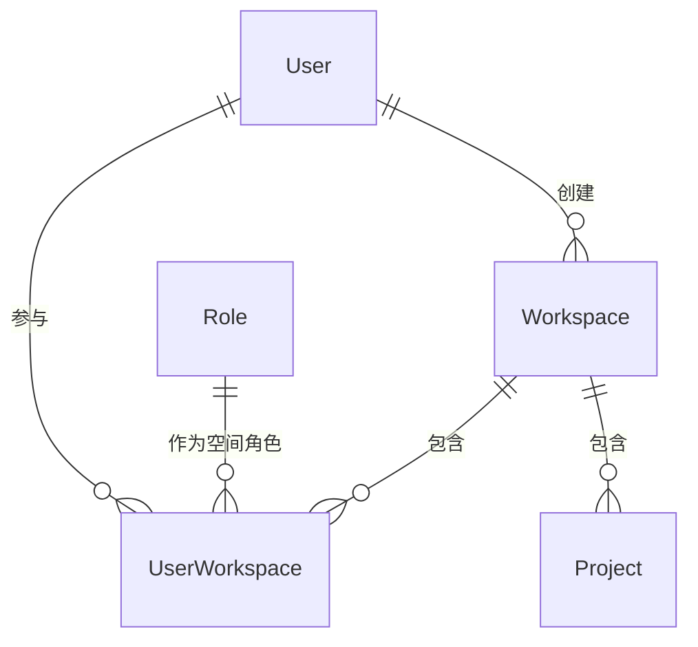

# 软件测试平台——我的空间概要设计

**文档版本**：V1.0  
**日期**：2026-10-01  
**状态**：起草中  

---

## 1. 引言

### 1.1 编写目的

对空间管理模块的我的空间页进行概要设计，明确检索排序与计数口径、活跃空间切换、空间创建等机制，数据实体关系与接口职责，为详细设计与开发提供依据。

### 1.2 范围与对应需求

对应需求分册 `docs/01-requirements/02-space-management/03-srs-space-management-my-workspace.md`；模块公共机制见 `docs/02-high-level-design/02-space-management/02-hld-space-management.md`；跨模块公共约定见 `docs/02-high-level-design/04-hld-data-interface.md`。

### 1.3 定义与缩写

| 术语 | 定义 |
| ---- | ---- |
| 范围分段 | 「全部 / 我管理的 / 已归档」三项归属范围筛选，各带真实计数 |
| 最近访问时间 | 当前用户最近一次成功进入某空间的时间，为空表示从未进入 |
| 空间卡片 | 归属空间在网格中的展示单元 |

## 2. 模块划分

### 2.1 页面构成

    我的空间
    ├── 页头（页面标题、引导语、新建空间入口）
    ├── 工具栏（范围分段 · 名称搜索 · 最近访问排序提示）
    ├── 卡片网格（默认每页 12 条，可选 12 / 24 / 48）
    │     └── 空间卡片（名称、描述、真实角色、成员数、项目数、用例数、状态标识）
    ├── 分页（列表上方提示刷新，失败时错误条）
    └── 新建空间对话框（名称 · 管理员 · 描述）

### 2.2 职责边界

* 只处理当前用户归属范围内的检索、展示、切换与创建，不承载空间内部信息维护。
* 本页为「无活跃空间上下文」的例外：按用户归属查询，不依赖上下文头（见模块总览 3.1）。
* 归档空间只读展示，不提供任何进入业务功能的入口。

## 3. 核心机制设计

### 3.1 排序、检索与计数口径

* 排序按当前用户最近访问时间倒序；无访问记录的空间排在其后，依次按加入时间倒序、创建时间倒序、空间标识升序兜底，保证顺序稳定。
* 名称检索为不区分大小写的模糊匹配，输入即检索、回车立即检索、清空即恢复；范围分段与关键词可组合，任一条件变化后回到第一页。
* 范围分段与分页总数基于同一名称关键词实时计算：「全部」含活跃与已归档，「我管理的」仅含本人担任管理员的活跃空间，「已归档」仅含已归档空间；分页总数只统计当前选中范围与关键词下的结果。
* 首次加载以骨架占位，完成前分段与搜索不可操作；已加载后的重新查询不清空既有内容。

### 3.2 空间卡片统计聚合

* 成员数、项目数、用例数由成员、项目与用例实体实时聚合派生，不冗余存储；千分位为展示层格式化，不改变统计口径。
* 角色标签取当前用户在该空间的空间角色真实名称，不以行为描述替代。
* 「当前空间」「已归档 / 只读」标识由活跃空间标识与空间状态派生。

### 3.3 切换活跃工作空间

    点击非归档卡片 → 校验成员关系与空间状态
        → 更新活跃空间标识并记录本次访问时间
        → 存在个人默认项目 → 进入该项目工作台
        → 无个人默认项目 → 进入该空间项目列表

* 切换期间禁止重复点击；切换失败时停留在本页并提示原因，活跃空间保持不变。
* 已归档卡片不产生任何跳转；无论归属一个还是多个空间均需在本页手动选择进入，系统不自动激活（见模块总览 3.1）。
* 活跃空间的成员关系被移除后不自动切换，继续访问被拒绝并提示，需在本页手动切换到其他空间。

### 3.4 创建工作空间

* 三处创建入口（页头按钮、网格末尾卡片、空态按钮）均按创建空间权限展示，服务端同样校验该权限。
* 创建为同一资源的组合操作：写入 Workspace 并同步写入首名管理员的 UserWorkspace，事务内完成。
* 名称必填且平台内全局唯一、2~50 字符；管理员单选，默认当前登录用户；描述可选、最多 200 字符。
* 创建成功后清空名称关键词、范围回到「全部」并刷新列表，保证新空间立即可见。

## 4. 数据设计

实体与关系（字段、DDL 与索引留详细设计 `docs/04-detailed-design/02-space-management/02-space-management-overview.md`）：

| 实体 | 职责 |
| ---- | ---- |
| Workspace | 空间主体，名称、描述、状态与创建信息载体 |
| UserWorkspace | 成员关系，含空间角色、加入时间与最近访问时间 |
| Project | 卡片项目数与切换后默认项目分流的来源 |
| Role | 卡片角色标签的空间角色名称来源 |

成员数、项目数与用例数为聚合派生值；最近访问时间随成员关系记录，切换成功时更新。

## 5. 接口设计概要

资源与职责划分（路径、方法与报文留详细设计）：

| 资源 | 职责 | 归属 |
| ---- | ---- | ---- |
| 我的空间列表 | 归属空间分页、范围计数、名称检索 | 业务端（无活跃空间上下文） |
| 活跃空间 | 切换活跃空间、记录访问时间 | 业务端（上下文头为目标空间） |
| 工作空间 | 创建（含首名管理员） | 业务端（无活跃空间上下文） |

创建与切换同时作用于 Workspace 与 UserWorkspace，属同一资源的组合操作；创建按创建空间权限码授权。

## 6. 设计约束与原则

* 空间不提供删除，本页只读展示归档状态，归档由管理端办理。
* 创建空间的权限门控前端与服务端双重生效，未授权请求以统一错误码拒绝。
* 最近访问时间只在切换成功时更新，失败不得产生脏值。
* 页面级交互与状态分支（骨架、空态、错误、刷新）见 `docs/05-interaction-design/02-space-management/03-space-ui-my-workspace.md`，详细设计见 `docs/04-detailed-design/02-space-management/03-space-management-my-workspace.md`。

## 修改记录

| 版本 | 日期 | 说明 |
| ---- | ---- | ---- |
| V1.0 | 2026-10-01 | 初始版本 |
