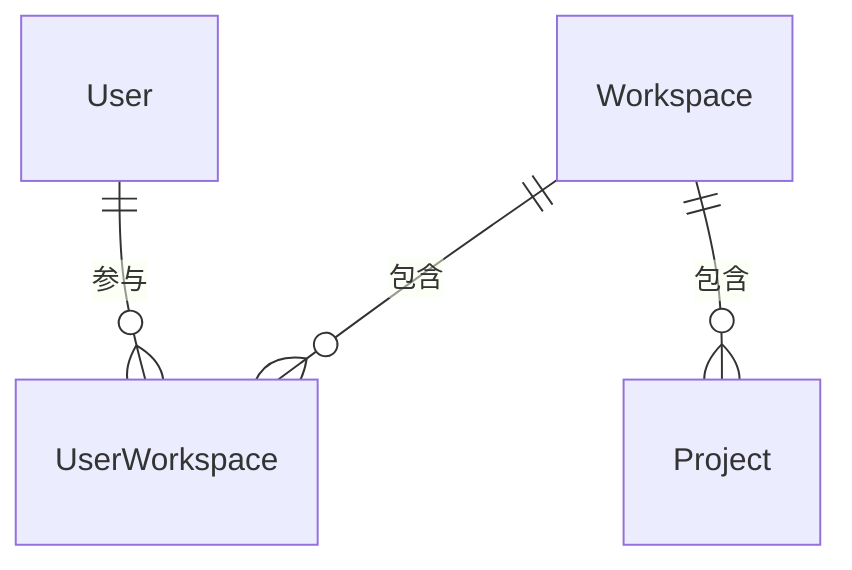

# 软件测试平台——空间信息概要设计

**文档版本**：V1.0  
**日期**：2026-10-01  
**状态**：起草中  

---

## 1. 引言

### 1.1 编写目的

对空间管理模块的空间信息页进行概要设计，明确空间上下文载入、基础信息维护与统计聚合机制，数据实体关系与接口职责，为详细设计与开发提供依据。

### 1.2 范围与对应需求

对应需求分册 `docs/01-requirements/02-space-management/04-srs-space-management-info.md`；模块公共机制见 `docs/02-high-level-design/02-space-management/02-hld-space-management.md`；跨模块公共约定见 `docs/02-high-level-design/04-hld-data-interface.md`。

### 1.3 定义与缩写

| 术语 | 定义 |
| ---- | ---- |
| 基础信息 | 空间 ID、创建人、创建时间等只读信息与名称、描述等可编辑信息的合称 |
| 部分更新 | 只写入实际传入字段的数据更新语义 |
| 空间信息编辑能力 | 决定名称与描述是否可编辑的权限判定 |

## 2. 模块划分

### 2.1 页面构成

    空间信息
    ├── 页头（标题「空间信息」、副标题「空间基础资料与运行统计」）
    ├── 基础信息
    │     ├── 只读：空间 ID、创建人、创建时间
    │     └── 可编辑：名称、描述（按编辑能力呈现「保存修改」）
    ├── 统计卡（成员数 → 成员管理页 · 项目数 → 项目列表页）
    └── 状态（加载遮罩、保存提示、失败提示、权限门控）

### 2.2 职责边界

* 只承载空间信息的查看与基础资料维护，不提供归档、删除、退出空间等操作，相关能力在其他页面办理。
* 菜单入口按空间信息查看权限过滤，页面内可编辑性按空间信息编辑能力判定，两者独立。
* 统计卡同时作为进入成员管理页与项目列表页的快捷入口。

## 3. 核心机制设计

### 3.1 空间上下文载入

* 进入页面自动加载当前活跃空间；地址中指定其他空间时按该空间加载，并将其切换为当前活跃空间（上下文头为目标空间）。
* 空间不存在或当前用户不属于该空间时按加载失败提示，不展示过期数据。

### 3.2 基础信息维护

* 名称与描述按空间信息编辑能力开放编辑，校验通过才发起保存；空间 ID、创建人与创建时间只读，不参与更新。
* 保存提交去除首尾空白后的名称与描述；名称必填、2~50 字符且平台内全局唯一，描述可留空、最长 500 字符。
* 更新采用部分更新语义（C11）：只写入本次实际传入的字段，只读字段不作为更新载体。
* 保存成功后刷新页面信息与顶部活跃空间名称；重名时服务端拒绝并提示名称已存在。
* 本页不因空间归档而额外禁用编辑，可编辑性仅取决于编辑能力判定。

### 3.3 统计聚合与快捷入口

* 成员数与项目数随空间信息一同聚合加载，未就绪或为空时显示 0，切换活跃空间后随之更新。
* 成员卡进入当前空间成员管理页，项目卡进入当前空间项目列表页，目标页面的可见性仍按各自查看权限判定。

## 4. 数据设计

实体与关系（字段、DDL 与索引留详细设计 `docs/04-detailed-design/02-space-management/02-space-management-overview.md`）：

| 实体 | 职责 |
| ---- | ---- |
| Workspace | 名称、描述、创建信息与状态的载体，本页维护对象 |
| UserWorkspace | 成员关系，成员数统计来源 |
| Project | 项目数统计来源 |

空间 ID、创建人与创建时间随 Workspace 记录；成员数与项目数由成员与项目实体聚合派生。

## 5. 接口设计概要

资源与职责划分（路径、方法与报文留详细设计）：

| 资源 | 职责 | 归属 |
| ---- | ---- | ---- |
| 空间信息 | 当前空间详情查询、名称与描述更新 | 业务端 |
| 空间统计 | 成员数、项目数聚合 | 业务端（随空间信息一同加载） |

详情查询与统计可由同一资源聚合返回；更新按空间信息编辑权限码授权，上下文头为空间标识。

## 6. 设计约束与原则

* 本页不提供归档、删除、退出空间入口，生命周期能力由管理端与其他页面承载。
* 名称全局唯一由服务端校验，前端校验不作为唯一防线。
* 更新只写入实际传入字段（C11），只读字段不参与更新。
* 页面级交互与状态分支见 `docs/05-interaction-design/02-space-management/04-space-ui-workspace-detail.md`，详细设计见 `docs/04-detailed-design/02-space-management/04-space-management-workspace-admin.md`。

## 修改记录

| 版本 | 日期 | 说明 |
| ---- | ---- | ---- |
| V1.0 | 2026-10-01 | 初始版本 |
