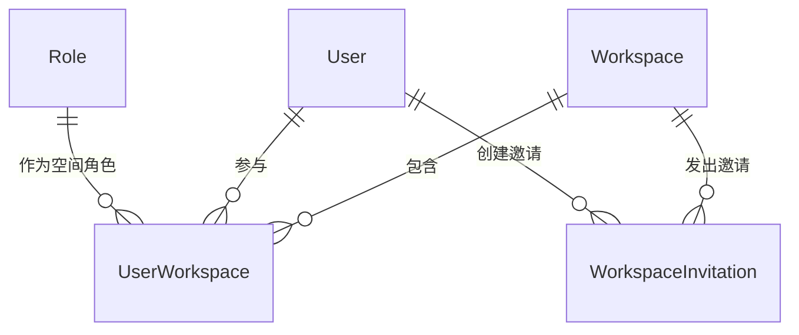

# 软件测试平台——成员管理概要设计

**文档版本**：V1.0  
**日期**：2026-10-01  
**状态**：起草中  

---

## 1. 引言

### 1.1 编写目的

对空间管理模块的成员管理页进行概要设计，明确成员检索与脱敏、成员生命周期约束、直接邀请与邀请链接机制，数据实体关系与接口职责，为详细设计与开发提供依据。

### 1.2 范围与对应需求

对应需求分册 `docs/01-requirements/02-space-management/05-srs-space-management-member.md`；模块公共机制见 `docs/02-high-level-design/02-space-management/02-hld-space-management.md`；跨模块公共约定见 `docs/02-high-level-design/07-hld-data-interface.md`。

### 1.3 定义与缩写

| 术语 | 定义 |
| ---- | ---- |
| 空间管理员 | 工作空间内持有管理权限的空间角色持有者（沿用需求分册定义） |
| 直接邀请 | 从平台启用状态业务用户中搜索并批量加入当前空间 |
| 邀请链接 | 以令牌扩招成员的凭据，可设有效期与使用上限 |
| 脱敏凭据 | 邀请链接令牌的截断展示形式 |

## 2. 模块划分

### 2.1 页面构成

    成员管理
    ├── 页头（邀请成员 · 生成链接 · 复制邀请链接）
    ├── 成员列表卡
    │     ├── 标题与成员总数
    │     ├── 搜索（姓名 / 邮箱）· 角色筛选
    │     ├── 成员行（用户、角色、加入时间、操作）
    │     └── 分页（每页 20 条）
    └── 邀请链接卡（按邀请管理权限呈现）
          ├── 链接列表（脱敏凭据、使用次数、过期时间、状态、创建时间）
          └── 分页（每页 20 条）

### 2.2 职责边界

* 所有数据与操作仅作用于当前活跃空间，不影响用户在其他空间的归属。
* 「邀请链接」卡片与页头链接操作按邀请管理权限呈现，成员操作按成员管理权限呈现。
* 直接邀请只面向平台内启用状态业务用户；链接加入的流程归公开入口（见 `docs/02-high-level-design/02-space-management/07-hld-space-management-invite-join.md`）。

## 3. 核心机制设计

### 3.1 成员检索与敏感信息脱敏

* 成员列表按姓名 / 邮箱关键词与角色组合筛选，任一条件变化回到第一页，翻页保留当前筛选；角色选项为本空间可分配角色。
* 邮箱脱敏在服务端按访问者身份处理：仅空间管理员返回完整邮箱，普通成员（含本人所在行）一律返回脱敏值，前端不承担脱敏职责。
* 成员总数与分页列表同口径，按当前空间的成员关系计算。

### 3.2 成员生命周期与管理员约束

    加入（直接邀请 / 邀请链接）→ 调整空间角色 → 移除或自行退出

* 改角色与移除需成员管理权限，自行退出为本人自助操作；无权限用户对他人行不呈现任何操作。
* 改角色为行内即时生效的单字段更新，失败时还原展示并刷新为最新数据；移除与退出需二次确认。
* 服务端保证空间至少保留一名管理员：降级最后一名管理员、移除最后一名管理员（含其自行退出）一律拒绝，前端提示不作为唯一防线。
* 角色调整只更新成员关系中的空间角色字段，不改动成员的其他归属数据。

### 3.3 直接邀请

* 按姓名、用户名或邮箱搜索平台内启用状态业务用户，多选批量提交，新成员以空间成员角色加入。
* 候选列表不预先排除已有成员；提交结果按「成功添加人数 + 因已是成员被跳过人数」汇总，重复加入不视为失败、不重复写入。

### 3.4 邀请链接

    生成（可选有效期 · 可选最大使用次数 1~10000）
      → 有效 ──使用计数递增──> 已达上限
      → 有效 ──到达过期时间──> 已过期
      → 有效 / 已达上限 ──失效──> 已失效

* 令牌绑定目标空间，创建成功即返回完整令牌；列表只呈现脱敏凭据，完整值仅在创建成功弹窗或用户明确复制时给出。
* 状态由存储字段派生，不冗余存储状态历史：未设置有效期显示「永不过期」，未设置上限显示「不限」。
* 仅「有效」与「已达上限」的链接可复制、可失效；已过期与已失效链接不再提供复制与失效操作。
* 使用计数在链接加入成功时递增，计数与上限校验在同一事务内完成，避免并发超限。

## 4. 数据设计

实体与关系（字段、DDL 与索引留详细设计 `docs/04-detailed-design/02-space-management/02-space-management-overview.md`）：

| 实体 | 职责 |
| ---- | ---- |
| UserWorkspace | 成员关系，含空间角色、加入时间，承担至少一名管理员的约束校验 |
| User | 成员与邀请候选的账号来源，提供姓名、用户名、邮箱与启用状态 |
| Role | 本空间可分配角色选项与角色标签名称来源 |
| WorkspaceInvitation | 邀请链接，含令牌、创建者、过期时间、使用上限与使用计数 |

邀请链接状态为派生值，由过期时间、使用计数与失效标记共同决定，不独立持久化。

## 5. 接口设计概要

资源与职责划分（路径、方法与报文留详细设计）：

| 资源 | 职责 | 归属 |
| ---- | ---- | ---- |
| 空间成员 | 成员分页与检索、角色调整、移除、退出、成员总数 | 业务端 |
| 成员邀请 | 按关键词搜索可邀请用户、批量加入（跳过已有成员） | 业务端 |
| 邀请链接 | 生成、列表、失效 | 业务端 |
| 邀请凭据 | 完整凭据返回（复制场景） | 业务端 |

列表与检索按成员查看权限码授权，成员变更按成员管理权限码授权，链接操作按邀请管理权限码授权；上下文头为空间标识。

## 6. 设计约束与原则

* 至少保留一名管理员由服务端校验保证，相关校验与写入在同一事务内完成。
* 邮箱脱敏与凭据脱敏均在服务端完成，敏感信息不下发到无权限客户端。
* 邀请凭据完整值不进入列表接口响应，仅创建与复制场景返回。
* 角色调整与链接失效只更新实际传入字段（C11）。
* 页面级交互与状态分支见 `docs/05-interaction-design/02-space-management/05-space-ui-member.md`，详细设计见 `docs/04-detailed-design/02-space-management/04-space-management-workspace-admin.md`。

## 修改记录

| 版本 | 日期 | 说明 |
| ---- | ---- | ---- |
| V1.0 | 2026-10-01 | 初始版本 |
