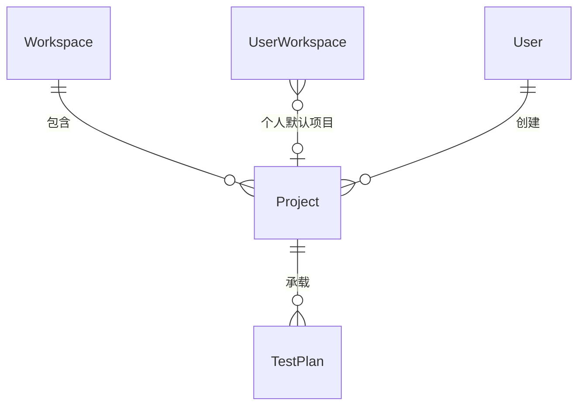

# 软件测试平台——项目列表概要设计

**文档版本**：V1.0  
**日期**：2026-10-01  
**状态**：起草中  

---

## 1. 引言

### 1.1 编写目的

对空间管理模块的项目列表页进行概要设计，明确项目状态机、唯一性与统计口径、个人默认项目与归档校验机制，数据实体关系与接口职责，为详细设计与开发提供依据。

### 1.2 范围与对应需求

对应需求分册 `docs/01-requirements/02-space-management/06-srs-space-management-project.md`；模块公共机制见 `docs/02-high-level-design/02-space-management/02-hld-space-management.md`；跨模块公共约定见 `docs/02-high-level-design/04-hld-data-interface.md`。

### 1.3 定义与缩写

| 术语 | 定义 |
| ---- | ---- |
| 活跃项目 | 可进入、可编辑的正常状态项目 |
| 已归档项目 | 只读冻结状态项目，不可进入、不可编辑 |
| 个人默认项目 | 用户在某空间内的个人偏好项目，用于切换空间后的落地分流 |
| 状态数量 | 按状态口径独立统计的项目计数 |

## 2. 模块划分

### 2.1 页面构成

    项目列表
    ├── 页头（页面标题、当前空间项目说明、新建项目入口）
    ├── 筛选条（状态分段「活跃 / 已归档」 · 名称或描述搜索 · 最近更新排序提示）
    ├── 项目卡片网格（每页 20 条，滚动加载）
    │     └── 状态、默认标识、名称、描述、起止日期、创建人、创建时间、操作
    └── 新建 / 编辑对话框（名称 · 描述 · 开始时间 · 结束时间）

### 2.2 职责边界

* 所有数据与操作仅作用于当前活跃空间；菜单入口按项目查看权限过滤。
* 本页承载项目生命周期管理（创建、编辑、设为默认、归档、启封、删除），项目进入后的功能归功能测试等项目内模块。
* 状态数量由独立统计提供，不从当前列表数据推导。

## 3. 核心机制设计

### 3.1 项目状态机

    活跃 ──归档（校验无未开始 / 进行中测试计划）──> 已归档
    已归档 ──启封（立即生效）──────────────────> 活跃
    已归档 ──删除（二次确认，逻辑删除）────────> （移出列表）

* 归档、启封与删除仅空间管理员可见，且删除只对已归档项目提供；编辑入口限空间管理员或项目创建人。
* 归档前校验该项目下无未开始或进行中的测试计划，存在时归档失败并提示；校验在服务端执行。
* 归档与删除同时清除工作空间成员对该项目的个人默认项目设置，启封不涉及该清理。
* 已归档项目不可进入、不可编辑；仅活跃项目可进入。

### 3.2 唯一性与统计口径

* 项目名称在当前工作空间内唯一，重名创建或保存被拒绝；所属工作空间创建后不可变更。
* 状态数量应用当前关键字、忽略当前状态，独立统计返回，不依赖列表分页数据。
* 列表按最近更新时间倒序，状态分段标注真实数量，默认选中活跃分段；搜索按名称或描述包含匹配，条件变化后重新加载。

### 3.3 个人默认项目

* 同一空间内每位成员至多一个个人默认项目，重新设置即替换原设置；仅维护个人偏好，不进入项目、不改变项目数据。
* 设置时校验目标项目属于当前空间且为活跃状态。
* 切换活跃空间后按个人默认项目分流：有默认项目进入该项目工作台，否则进入项目列表（见 `docs/02-high-level-design/02-space-management/03-hld-space-management-my-workspace.md` 第 3.3 节）。

### 3.4 创建、编辑与进入校验

* 项目自动归属当前活跃空间，创建后状态为活跃；名称必填、最长 100 字符，描述与起止时间可选，结束时间不得早于开始时间。
* 编辑复用创建字段，更新按部分更新语义执行（C11），只写入本次实际传入的字段。
* 进入项目时校验该项目属于当前活跃空间且状态为活跃，否则拒绝并提示项目不存在。

## 4. 数据设计

实体与关系（字段、DDL 与索引留详细设计 `docs/04-detailed-design/02-space-management/02-space-management-overview.md`）：

| 实体 | 职责 |
| ---- | ---- |
| Project | 项目主体，名称、描述、起止时间、状态与创建信息载体 |
| UserWorkspace | 个人默认项目偏好载体，成员数统计来源 |
| TestPlan | 归档前「无未开始 / 进行中计划」校验的关联对象 |

状态数量与项目数按 Project 聚合派生；个人默认项目随成员关系记录，归档与删除时批量清除。

## 5. 接口设计概要

资源与职责划分（路径、方法与报文留详细设计）：

| 资源 | 职责 | 归属 |
| ---- | ---- | ---- |
| 项目列表 | 分页列表、状态分段、名称或描述检索 | 业务端 |
| 项目统计 | 按状态独立统计数量 | 业务端 |
| 项目 | 创建、详情、更新、归档、启封、删除 | 业务端 |
| 个人默认项目 | 设置与清除当前用户的个人默认项目 | 业务端 |

列表与统计按项目查看权限码授权，创建按项目创建权限码授权，归档 / 启封 / 删除按空间管理权限码授权；上下文头为空间标识，项目标识只用于定位资源、不作为活动上下文。

## 6. 设计约束与原则

* 归档前计划校验由服务端执行，失败以统一错误码提示，前端提示不作为唯一防线。
* 删除为逻辑删除（C5），不物理清除项目及其测试资产。
* 项目更新只写入实际传入字段（C11），不以整行查询结果作为更新载体。
* 个人默认项目为个人偏好数据，不改变项目实体，也不影响其他成员。
* 页面级交互与状态分支见 `docs/05-interaction-design/02-space-management/06-space-ui-project.md`，详细设计见 `docs/04-detailed-design/02-space-management/04-space-management-workspace-admin.md`。

## 修改记录

| 版本 | 日期 | 说明 |
| ---- | ---- | ---- |
| V1.0 | 2026-10-01 | 初始版本 |
