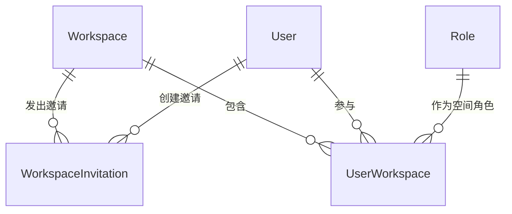

# 软件测试平台——加入空间概要设计

**文档版本**：V1.0  
**日期**：2026-10-01  
**状态**：起草中  

---

## 1. 引言

### 1.1 编写目的

对空间管理模块的加入空间页进行概要设计，明确公开入口的凭据校验、账号分支与加入登录一体化机制，数据实体关系与接口职责，为详细设计与开发提供依据。

### 1.2 范围与对应需求

对应需求分册 `docs/01-requirements/02-space-management/07-srs-space-management-invite-join.md`；邀请链接的生成与管理见 `docs/02-high-level-design/02-space-management/05-hld-space-management-member.md`；跨模块公共约定见 `docs/02-high-level-design/04-hld-data-interface.md`，安全约束见 `docs/02-high-level-design/05-hld-deployment-security.md`。

### 1.3 定义与缩写

| 术语 | 定义 |
| ---- | ---- |
| 邀请凭据 | 邀请链接中携带的令牌，绑定目标空间 |
| 公开域 | 无需登录即可访问的页面与接口入口 |
| 账号分支 | 按邮箱是否已有账号进入的密码验证或注册流程 |

## 2. 模块划分

### 2.1 页面构成

    加入空间（公开入口，不进导航）
    ├── 链接校验（加载态 / 无效错误态）
    ├── 邮箱确认（邮箱输入 · 下一步）
    ├── 账号分支
    │     ├── 已有账号（只读邮箱 · 密码 · 加入并登录）
    │     └── 新用户（只读邮箱 · 姓名 · 密码 · 创建并加入）
    └── 结果（成功进入该空间项目列表 / 失败原因提示）

### 2.2 职责边界

* 属公开域，全流程无需预先登录；只消费邀请凭据，不提供其他业务操作。
* 邀请链接的生成、复制与失效归成员管理页，本页只负责凭据的校验与消费。
* 成功后以该空间为活跃空间并进入其项目列表，落地逻辑与我的空间页的切换流程一致。

## 3. 核心机制设计

### 3.1 凭据校验与状态口径

    打开页面 → 自动校验令牌
      ├── 缺少令牌参数 → 「邀请链接无效：缺少令牌参数」
      ├── 不存在 / 已过期 / 已被撤销 / 已达使用上限 → 「邀请链接已失效或不存在」
      ├── 校验请求失败（网络异常、限流）→ 错误态并展示原因
      └── 有效 → 展示目标空间名称，进入邮箱输入步骤

* 有效响应只返回目标空间名称等最小信息，不发放任何业务数据。
* 错误态始终提供返回登录的入口，保证用户可退出流程。

### 3.2 邮箱确认与账号分支

* 邮箱输入提交后按平台账号是否存在分流：已有账号进入密码验证步骤，未检测到账号进入创建账号步骤。
* 邮箱格式与非空校验在提交前完成，校验不通过不发起查询；查询失败停留当前步骤，已填内容不丢失。

### 3.3 加入与登录一步完成

    已有账号：密码匹配 → 建立成员关系 → 登录
    新用户：姓名 + 密码 → 创建账号 → 建立成员关系 → 登录

* 加入成功递增凭据使用计数，上限校验与计数递增在同一事务内完成；已是目标空间成员时幂等处理，直接按已加入状态登录进入。
* 成功后以该空间为活跃空间进入其项目列表；已有账号与新账号分别返回对应成功提示。
* 新用户仅需一次提交完成注册与加入，成功后无需再次输入密码。

### 3.4 失败口径与防护

* 典型失败原因：凭据不存在或已失效、已过期、已被撤销、已达最大使用次数、密码错误、邮箱格式不正确、请求过于频繁。
* 提交失败不创建账号、不建立成员关系、不递增使用计数；每步提交期间按钮进入加载态并禁用，防止重复提交。
* 公开域接口按安全分册执行防暴力破解与限流，失败信息不泄露目标空间的成员构成。

## 4. 数据设计

实体与关系（字段、DDL 与索引留详细设计 `docs/04-detailed-design/02-space-management/02-space-management-overview.md`）：

| 实体 | 职责 |
| ---- | ---- |
| WorkspaceInvitation | 邀请凭据，含令牌、目标空间、过期时间、使用上限与使用计数 |
| User | 账号分支的判定对象，新用户在加入流程中创建 |
| UserWorkspace | 加入成功后建立的成员关系，默认空间成员角色 |
| Role | 默认加入角色与新成员角色的来源 |

凭据状态为派生值（有效 / 已过期 / 已被撤销 / 已达上限），使用计数与成员关系写入保持一致。

## 5. 接口设计概要

资源与职责划分（路径、方法与报文留详细设计）：

| 资源 | 职责 | 归属 |
| ---- | ---- | ---- |
| 邀请凭据 | 令牌校验、目标空间信息返回 | 公开域 |
| 账号分支 | 按邮箱查询是否已有账号 | 公开域 |
| 加入 | 密码验证加入、注册并加入、活跃空间落地 | 公开域 |

公开域接口不接受活跃空间上下文头，凭据令牌即全部请求依据；加入成功后由登录态承载后续业务请求。

## 6. 设计约束与原则

* 公开域接口只返回最小必要信息，不下发成员、项目等业务数据。
* 令牌校验、计数递增与成员关系建立在同一事务内完成，失败不留任何副作用。
* 使用计数以服务端结果为准，不依赖前端提交次数，防止并发超限。
* 新用户创建与成员关系建立一次提交完成，避免半完成状态。
* 防暴力破解、限流与全链路 HTTPS 见 `docs/02-high-level-design/05-hld-deployment-security.md`。
* 页面级交互与状态分支见 `docs/05-interaction-design/02-space-management/07-space-ui-invite-join.md`，详细设计见 `docs/04-detailed-design/02-space-management/05-space-management-invite-join.md`。

## 修改记录

| 版本 | 日期 | 说明 |
| ---- | ---- | ---- |
| V1.0 | 2026-10-01 | 初始版本 |
