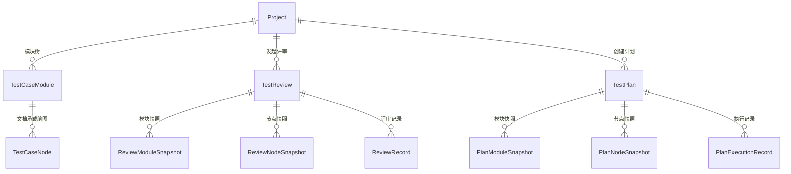

# 软件测试平台——功能测试模块概要设计

**文档版本**：V1.0  
**日期**：2026-10-01  
**状态**：起草中  

---

## 1. 引言

### 1.1 编写目的

对功能测试模块（测试用例管理、测试评审管理、测试计划管理）进行概要设计，明确子模块划分、关联引用与快照、评审与计划状态机等核心机制、数据实体关系与接口职责边界，为详细设计与开发提供依据。

### 1.2 范围与对应需求

对应需求分册 `docs/01-requirements/03-function-testing/02-srs-business-features.md` 第 1.1 节，覆盖测试用例管理（模块树、脑图实时协作编辑、关联与引用）、测试评审管理、测试计划管理；缺陷管理为独立模块，见 `docs/01-requirements/04-bug-management/01-readme.md`。跨模块公共数据与接口约定见 `docs/02-high-level-design/04-hld-data-interface.md`，部署与安全约束见 `docs/02-high-level-design/05-hld-deployment-security.md`。

### 1.3 定义与缩写

| 术语 | 定义 |
| ---- | ---- |
| 模块树 | 项目下承载用例组织结构的无限层级树，节点分目录与文档两类 |
| 目录 | 模块树节点，可包含子目录与文档 |
| 文档 | 模块树节点，不再包含子模块，唯一挂载一个脑图 |
| 脑图节点 | 文档脑图中的任意节点，构成树形结构 |
| 用例节点 | 被标记为用例的脑图节点，额外拥有优先级、前置条件、测试步骤、预期结果、标签等属性 |
| 快照 | 评审 / 计划发起时复制的模块树与文档脑图节点集合，与其原始数据解耦 |
| 关联节点树 | 快照按关联用例节点裁剪后的展示视图，仅含关联节点的祖先与子孙 |
| 上下文头 | 标识当前工作空间 / 项目的请求头，不出现在 URL 中 |

## 2. 模块划分

### 2.1 子模块结构

    功能测试模块（业务端 · 项目工作区）
    ├── 测试用例管理
    │   ├── 模块树（目录 / 文档）
    │   └── 脑图协作编辑（用例节点）
    ├── 测试评审管理
    │   ├── 发起与调整规划用例
    │   ├── 详情与评审操作（标记 / 评论 / 记录）
    │   └── 同步、完成与驳回
    └── 测试计划管理
        ├── 创建与调整规划用例
        ├── 详情与执行跟踪
        └── 同步、状态流转与执行历史

### 2.2 职责简述

* **测试用例管理**：项目下无限层级模块树的维护，文档脑图的多人实时协作编辑与用例节点属性维护，向测试评审与测试计划提供用例关联引用。
* **测试评审管理**：基于快照的用例评审，含发起、关联节点树展示、节点标记与评论、评审记录、调整规划用例、同步最新用例、完成与驳回。
* **测试计划管理**：基于快照的执行管理，含计划创建、关联节点树展示、执行结果标记、执行历史、调整规划用例、同步最新用例与计划状态流转。

### 2.3 与相邻模块的关系

* **空间管理模块（项目）**：所有功能测试活动均在当前选定的项目内进行，活跃工作空间上下文不变；模块树、评审与计划经项目归属到工作空间，项目自身的生命周期管理归空间管理模块。
* **需求管理与 AI 能力模块**：AI 生成链产物经人工确认后回写本模块的模块树与用例节点并建立派生追溯边，回写复用本模块的用例维护入口，不另设通道；追溯边由 AI 能力模块拥有并维护。
* **缺陷管理模块**：计划执行的失败结果可关联缺陷，缺陷侧反查关联的用例节点与计划；两侧以用例节点标识关联，缺陷生命周期归缺陷管理模块。

## 3. 核心机制设计

### 3.1 模块树与文档承载

* 模块树为目录、文档两级节点的无限层级树，支持新建、重命名、删除与拖拽排序；排序结果即用例选择与展示的默认顺序。
* 文档是脑图协作的房间边界：一个文档挂载一个脑图、对应一个协作房间，进入文档即加入该房间；文档内不再划分层级，脑图层级完全由节点关系承载。
* 删除约束：目录必须为空方可删除；删除文档级联删除其脑图节点与全部用例数据，属不可恢复操作。
* 用例节点是关联引用的最小粒度：评审与计划从模块树进入文档脑图选取用例节点，可跨文档多选；普通脑图节点不可被关联，也不参与评审与执行统计。

### 3.2 脑图实时协作

* 用户进入文档后建立 WebSocket 连接并加入该文档的协作房间（房间边界见 3.1），连接认证与端点约定见 `docs/02-high-level-design/04-hld-data-interface.md` 第 2.5 节。
* 编辑操作以增量消息发送服务端，服务端校验权限与工作空间归属后持久化并广播给同一文档的在线用户。
* 冲突处理采用乐观锁或 CRDT 算法保证最终一致性。

### 3.3 关联引用与快照机制

* 评审与计划共用同一快照机制：发起时复制当时完整项目模块树与所涉文档的全部脑图节点，存入专用快照表，与原始数据解耦。
* 快照是评审与计划的事实源视图：关联用例数、进度、通过率与节点状态图标均基于快照计算；原始用例在发起后被修改不影响既有快照，直至发起人手动同步。
* 详情页以关联节点树呈现（向上取祖先、向下取子孙，高亮关联用例节点）；涉及多文档时左侧提供快照文档树，切换查看对应快照脑图。
* 调整规划用例在评审 / 计划未结束时开放，按差量更新快照：新增文档生成快照、移除文档删除快照（已产生的标记 / 执行记录保留）、保留文档补入新增节点；评审与计划的差异仅在补入节点的初始处理——评审补入节点重刷关联状态（取消关联的节点保留已有标记、不再计入统计），计划补入节点初始状态为「待执行」。
* 同步最新用例手动触发，按原始节点 ID 匹配更新快照并保留全部已产生的记录；原始节点已删除时在快照中标记为已删除，其既有记录只读展示。

### 3.4 测试评审状态机

    待评审 ──首次提交标记──> 进行中 ──全部关联用例通过且发起人完成──> 已通过（终态·冻结）
      │                        │
      │                        └──发起人驳回──> 已驳回 ──发起人重新发起──> 进行中
      └────────发起人驳回────────────┘

* 参与者对关联节点树上的节点执行标记（仅用例节点可标记「通过 / 不通过 / 重置为待评审」三态）或添加评论；每次提交生成一条评审记录，并同步更新快照节点的最后标记状态。
* 完成条件为硬约束：仅当全部关联用例评审通过（无待评审、无不通过）时才允许完成；完成后快照冻结，任何人均只能查看。
* 已驳回评审可由发起人重新发起回到进行中，既有标记与评论保留；终态（已通过 / 已驳回）后不可新增或修改评审记录。
* 调整规划用例与同步最新用例仅在未结束状态（待评审 / 进行中）由发起人操作；参与者必须是当前活跃工作空间成员，发起人不兼任参与者。

### 3.5 测试计划状态机

    新建 ──开始执行──> 进行中 ──负责人完成──> 已完成 ──关闭──> 已关闭（终态）
      │                   │
      └──负责人阻塞──> 已阻塞 ──负责人恢复──> 进行中

* 关联用例初始化为「待执行」；负责人或指定执行人对标记为关联的用例节点标记执行结果（通过 / 失败 / 阻塞 / 待执行四态）并填写备注，每次提交生成一条执行记录并同步更新快照节点的最后执行结果。
* 阻塞期间计划暂停执行：不可标记执行结果、调整规划用例、同步最新用例或完成；阻塞与恢复仅限计划负责人，已阻塞计划仅可恢复为进行中或直接删除。
* 关闭计划时检查是否存在未执行用例，存在则提示确认；关闭后执行结果不可再修改。
* 同步最新用例在进行中由负责人操作，保留全部执行记录；计划负责人与实际执行人必须是当前工作空间成员，只有被关联的用例节点可被标记执行结果。

### 3.6 记录与历史追溯

* 评审记录与执行记录均为追加式流水，节点级历史按时间排序返回完整变更过程；节点上回显的最后标记 / 最后执行结果是快照内的冗余字段，仅服务树形视图快速展示。
* 记录表是历史的唯一事实源：调整规划用例移除关联不删除既有记录，同步最新用例保留既有记录，快照重建不回溯改写记录。

## 4. 数据设计

实体与关系（实体级，与 `docs/02-high-level-design/04-hld-data-interface.md` 第 1 节保持一致；字段、DDL 与索引留详细设计 `docs/04-detailed-design/03-function-testing/02-project-workspace-overview.md`）：

| 实体 | 职责 |
| ---- | ---- |
| TestCaseModule | 模块树节点（目录 / 文档），文档节点承载脑图 |
| TestCaseNode | 脑图节点（普通 / 用例），树形结构，用例节点携带用例属性 |
| TestReview | 评审基本信息，含发起人、参与者与评审状态 |
| ReviewModuleSnapshot | 评审时刻的模块树快照 |
| ReviewNodeSnapshot | 评审文档节点快照，冗余最后评审标记与关联状态 |
| ReviewRecord | 评审记录（标记变更与评论的追加式流水） |
| TestPlan | 计划基本信息，含负责人、执行环境与计划状态 |
| PlanModuleSnapshot | 计划时刻的模块树快照 |
| PlanNodeSnapshot | 计划文档节点快照，冗余最后执行结果 |
| PlanExecutionRecord | 执行记录（结果、执行人与备注的追加式流水） |

快照实体与原始模块树、脑图节点解耦存储；评审与计划对同一文档的快照相互独立，互不影响；需求追溯边由 AI 能力模块拥有，本模块不持久化链路数据。

## 5. 接口设计概要

资源与职责划分（路径、方法与报文留详细设计；公共约定见 `docs/02-high-level-design/04-hld-data-interface.md`）：

| 资源 | 职责 | 归属 |
| ---- | ---- | ---- |
| 模块树 | 目录与文档节点的新增、重命名、删除、拖拽排序与树查询 | 业务端（项目上下文） |
| 脑图文档与节点 | 文档打开、节点增删改移、用例节点属性维护；实时协作经 WebSocket 文档通道 | 业务端（项目上下文） |
| 用例关联选取 | 供评审 / 发起计划从模块树与文档脑图跨文档多选用例节点 | 业务端（项目上下文） |
| 测试评审 | 发起、列表关键字检索与状态筛选、详情关联节点树、标记与评论、评审记录、完成、驳回与重新发起、同步、调整规划用例 | 业务端（项目上下文） |
| 测试计划 | 创建、列表关键字检索与状态筛选、详情关联节点树、执行标记、执行历史、阻塞、恢复、完成、关闭与删除、同步、调整规划用例 | 业务端（项目上下文） |

上下文标识通过请求头传递，不出现在 URL 中；全部接口遵循既有认证与工作空间 / 项目上下文校验， WebSocket 协作消息遵循 `docs/02-high-level-design/04-hld-data-interface.md` 第 2.5 节约定。

## 6. 设计约束与原则

* 上下文标识只经请求头传递（C4），不出现在 URL 与请求体中。
* 快照与原始数据解耦，评审终态（已通过 / 已驳回）与已关闭计划的数据只读；任何展示与统计不得绕过快照回读原始用例。
* 评审参与者、计划负责人与实际执行人必须是当前活跃工作空间成员；发起人不兼任参与者；阻塞、恢复、完成与删除计划仅限计划负责人。
* 数据更新只写入实际传入字段（C11），标记、评论与执行结果均为部分更新。
* 所有异常经统一错误码抛出，错误码为 10 位（框架全局错误码除外）。
* 数据经项目归属到工作空间，遵循数据库通用约定（`docs/00-spec/20-contracts/02-database.md`），无物理外键。
* 删除文档为级联删除且不可恢复，前端必须二次确认，交互细节见 `docs/05-interaction-design/03-function-testing/01-readme.md`。

## 修改记录

| 版本 | 日期 | 说明 |
| ---- | ---- | ---- |
| V1.0 | 2026-10-01 | 初始版本 |
| V1.0 | 2026-10-02 | 吸收业务功能核心机制分册：新增脑图实时协作（3.2），快照机制并入 3.3 |
