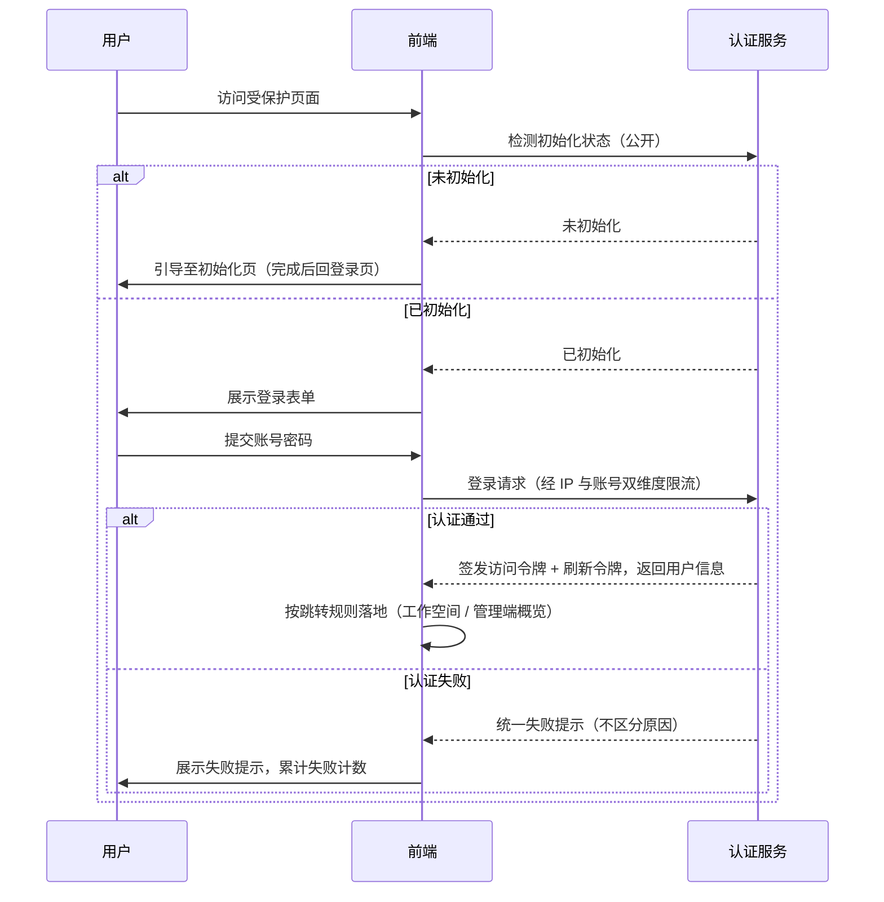
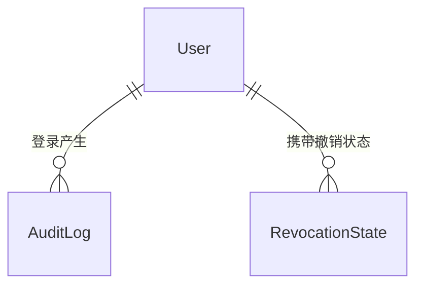

# 软件测试平台——登录、令牌刷新与限流设计

**文档版本**：V1.0  
**日期**：2026-10-01  
**状态**：起草中

---

## 1. 引言

### 1.1 编写目的

对平台通用认证能力——登录、令牌刷新、限流——进行概要设计，明确机制划分、数据实体与接口职责边界，作为各模块公共认证入口的设计基线，为详细设计与开发提供依据。

### 1.2 范围与对应需求

对应需求分册 `docs/01-requirements/03-srs-common.md`，覆盖登录、令牌刷新、限流三类能力。与其他文档的职责划分：

- 本文是登录 / 令牌刷新 / 限流机制的单一设计事实源，其余文档引用本文，不重复定义；
- 系统初始化引导（登录的前置衔接）见 `docs/02-high-level-design/01-system-management/08-hld-system-management-init.md`；系统管理模块的认证与上下文描述（角色变更后的权限生效口径）见 `docs/02-high-level-design/01-system-management/02-hld-system-management.md` 第 3.1 节；
- 认证接口清单与公共报文约定见 `docs/02-high-level-design/04-hld-data-interface.md` 第 2.2 节；
- 部署与全局安全约束见 `docs/02-high-level-design/05-hld-deployment-security.md`；
- 限流阈值、令牌撤销等工程口径以 `docs/00-spec/40-security/01-security.md` 为唯一来源，本文只描述机制与职责，不重复罗列数值；
- 限流、登录失败计数与令牌撤销优先复用 migoo 基础框架能力，工程不自建平行实现（C10）；组件选择、配置项与验证要求见 `docs/00-spec/10-engineering/03-migoo-framework.md`，本文只约定能力边界与职责划分。

### 1.3 定义与缩写

| 术语 | 定义 |
| ---- | ---- |
| 访问令牌 | 业务调用的身份凭证，短期有效，过期后经刷新令牌续期（沿用需求分册定义） |
| 刷新令牌 | 仅用于续期访问令牌的长期凭证，不用于业务调用（沿用需求分册定义） |
| 令牌撤销 | 使已签发令牌提前失效的处置，撤销后该令牌一律拒绝（沿用需求分册定义） |
| 限流 | 对单位时间内请求数超阈值的调用予以拒绝的防护机制（沿用需求分册定义） |
| 登录失败锁定 | 同一账号连续登录失败达阈值后在锁定期内拒绝登录（沿用需求分册定义） |
| 公开接口 | 无需登录即可访问的接口，须显式列入白名单（沿用需求分册定义） |

## 2. 系统总体设计

### 2.1 认证链路的分层职责

    ┌──────────────────────────────┐
    │            前端（SPA）         │
    │  登录表单 · 令牌保存与自动刷新    │
    │  路由守卫（体验层，非安全边界）   │
    └──────────────┬───────────────┘
                   │ HTTPS（Authorization 请求头）
    ┌──────────────┴───────────────┐
    │         服务端认证链（安全边界）  │
    │  限流 → 公开白名单/令牌校验 →    │
    │  撤销判定 → 业务处理            │
    └──────────────┬───────────────┘
                   │
    ┌──────────────┴───────────────┐
    │            数据层              │
    │  业务库存用户与审计              │
    │  共享状态存储承载撤销、失败计数、   │
    │  限流计数（多实例一致）           │
    └──────────────────────────────┘

- **前端**：负责登录交互、令牌的保存与临期自动刷新、未登录跳转；路由守卫只改善体验，不作为安全边界。
- **服务端**：凭据校验、令牌签发与校验、撤销判定、限流计数全部在服务端执行；公开接口经显式白名单放行，其余请求一律要求有效访问令牌。
- **数据层**：用户与登录审计入业务库；撤销状态、登录失败计数与限流计数属窗口型共享状态，由框架状态存储（`StateStore`）统一承载，多实例判定一致。

### 2.2 登录流程

初始化衔接、登录后跳转目标的详细规则分别见初始化分册与需求分册 `docs/01-requirements/03-srs-common.md` 3.1，本文不重复。

## 3. 核心机制设计

### 3.1 登录

* 登录为公开入口，受 IP 与账号标识双维度限流；提交前不校验令牌，提交后由服务端完成凭据校验与账号状态检查。
* 认证通过签发**短期访问令牌 + 长期刷新令牌**，并返回用户信息与是否拥有工作空间，前端据此决定跳转目标（跳转规则见 `docs/01-requirements/02-srs-overview.md` 5.2）。
* 认证失败（含账号不存在、密码错误、禁用、锁定）一律返回同一提示，不泄露账号存在性；失败计入账号维度计数，连续失败达阈值进入锁定，锁定期内拒绝并返回锁定错误。失败计数、锁定判定与成功后清零均由框架登录失败锁定能力承载，工程不自建失败计数器。
* 登录成功、失败与锁定均写入审计（登录审计结构见审计详细设计，此处只约定事件来源为认证流程）。

### 3.2 令牌模型与刷新

* **双令牌分工**：访问令牌用于业务调用校验，短期有效、无状态校验；刷新令牌仅用于调用刷新接口换取新令牌对，不进入业务请求。
* **刷新时机**：访问令牌临期或已过期时由前端自动发起刷新，用户无感知；同一时刻的多个待刷新请求合并为一次刷新，其余等待并复用结果。
* **刷新结果**：成功轮换新的令牌对并继续原请求；失败（刷新令牌过期、无效或已撤销）则清除本地会话，回落登录页。
* **撤销触发点**：

  | 触发点 | 撤销范围 | 效果 |
  | ---- | ---- | ---- |
  | 登出 | 当前会话的访问令牌与刷新令牌 | 本次会话终止，后续校验一律拒绝 |
  | 账号禁用 / 锁定 / 批量禁用 | 该账号全部存量令牌 | 已登录会话即时失效，且状态恢复前无法重新登录 |
  | 管理员重置密码 / 自助修改密码 | 该账号全部存量令牌 | 存量会话失效，重新登录后新令牌不受影响 |
  | 角色或权限变更 | 不撤销令牌 | 已登录会话按变更后权限实时生效（见 `docs/02-high-level-design/01-system-management/02-hld-system-management.md` 第 3.1 节） |

* **校验口径**：访问令牌的无状态校验与撤销状态校验互补——命中撤销状态即拒绝；撤销经框架安全组件提供的撤销钩子实现（登出撤销当前令牌、用户级撤销覆盖全部存量令牌），撤销状态存于共享状态存储，其故障降级口径见 3.3 第 5 条。登出由框架登出过滤器承载，业务登出逻辑在应用登出接口内完成。

### 3.3 限流与登录失败锁定

**能力选型**：限流、失败计数与锁定统一使用 migoo 框架的 Web 层限流能力（单接口限流与服务级自定义 Key 限流）与安全层登录失败锁定能力，计数与状态统一走框架状态存储（`StateStore`），工程不自建限流器与失败计数器（C10）；配置项、阈值与降级口径见 `docs/00-spec/10-engineering/03-migoo-framework.md` 与 `docs/00-spec/40-security/01-security.md`。

1. **两类防护**：接口限流按**来源 IP** 计数，作用于全部公开接口与认证接口；登录失败锁定按**账号标识** 计数，仅作用于登录。
2. **作用场景**：登录、令牌刷新、系统初始化设置、邀请公开接口、报告分享免登录查看、密码设置（自助与管理员重置）；各端点独立计数，互不影响。窗口与阈值的数值唯一来源为 `docs/00-spec/40-security/01-security.md` 6.1 场景表，本文不复制。
3. **错误口径**：超限统一返回限流错误（HTTP 429），账号锁定返回锁定错误（HTTP 423）；两类响应均不区分触发键、不泄露账号是否存在。
4. **计数一致性**：计数与锁定状态经框架状态存储（`StateStore`，检测到 Redis 时自动切换为共享实现）承载，多实例部署下判定一致；认证成功清零账号连续失败计数，IP 维度按固定窗口滚动重置。
5. **故障降级**：计数或撤销状态存储不可用时按失败开放放行并记录告警，不因防护组件故障阻断认证链路；降级事件可观测。
6. **前端行为**：429 提示「请求过于频繁，请稍后再试」，423 提示失败次数过多所致并引导稍后重试；不据此推断账号状态。
7. **配置性**：窗口、阈值与限流总开关集中配置、可审计；Mock 访问等业务侧限流沿用同一机制，但按业务路径独立声明（见 `docs/01-requirements/05-api-testing/05-api-srs-mock-service.md`）。

## 4. 数据设计

实体与状态（实体级，字段、DDL 与索引留详细设计）：

| 对象 | 类型 | 职责 |
| ---- | ---- | ---- |
| AuditLog（登录记录） | 业务持久化 | 登录成功 / 失败 / 锁定的行为追溯，结构复用既有审计实体 |
| RevocationState（令牌撤销状态） | 共享状态 | 账号级签发截止与单令牌撤销判定，支撑撤销触发点（见 3.2） |
| LoginFailureCounter（登录失败计数） | 窗口型状态 | 账号维度失败计数与锁定截止时间 |
| RateLimitCounter（限流计数） | 窗口型状态 | 接口 × 维度键的固定窗口计数 |

**业务规则**：窗口型状态非业务表，不由工程自建存储，统一经框架状态存储（`StateStore`）承载（默认单机实现，检测到 Redis 自动切换为多实例共享实现，应用可注入 Bean 覆盖），超期自动失效；撤销状态的保留期不短于刷新令牌最长有效期；令牌本体为自包含凭证，业务库不持久化全量令牌内容。

## 5. 接口设计概要

资源与职责划分（路径、方法与报文见 `docs/02-high-level-design/04-hld-data-interface.md` 第 2.2 节，字段级设计留详细设计）：

| 资源 | 职责 | 归属 |
| ---- | ---- | ---- |
| 认证与初始化 | 初始化状态检测、初始化设置、登录、令牌刷新、登出、修改密码、当前权限获取 | 公开 / 登录域 |

* 限流不新增独立资源，以横切方式作用于上述公开接口与各业务接口。
* 业务请求统一经 `Authorization` 请求头携带访问令牌；工作空间 / 项目上下文经请求头传递，不出现在 URL 中（C4）。
* 登出为匿名可达接口但必须携带待撤销令牌，撤销失败不阻断前端本地清理。

## 6. 设计约束与原则

* 认证、撤销与限流必须在服务端执行，前端路由守卫不作为安全边界。
* 限流、登录失败计数与令牌撤销优先复用 migoo 框架能力（限流组件、登录失败锁定、Token 撤销钩子、状态存储），工程不自建平行实现（C10）；仅在框架能力无法覆盖的业务场景做扩展，扩展点同样复用框架状态存储。
* 令牌不得出现在 URL、查询参数、日志与错误响应中。
* 公开接口必须显式列入白名单，未列入者一律要求有效令牌；白名单变更须可审计。
* 限流窗口、阈值与开关集中配置，数值的唯一来源为 `docs/00-spec/40-security/01-security.md` 第 6.1 节，禁止各端点各自取值。
* 撤销状态、登录失败计数与限流计数共享同一状态存储与同一故障降级口径（失败开放 + 告警）。
* 登录、刷新、登出与安全事件（禁用、锁定、重置密码）全部产生审计事件，审计写入失败是否阻断按审计规范的风险口径执行。
* 所有异常经统一错误码抛出：限流 429、账号锁定 423 属框架全局错误码，业务错误码为 10 位（C3）。
* 上下文标识只经请求头传递（C4）；数据与状态存储遵循既有数据库与缓存通用约定（`docs/00-spec/20-contracts/02-database.md`）。

---

## 修改记录

| 版本 | 日期 | 说明 |
| ---- | ---- | ---- |
| V1.0 | 2026-10-01 | 初始版本 |
| V1.0 | 2026-10-01 | 限流、失败计数与令牌撤销明确优先复用 migoo 框架能力（C10） |
