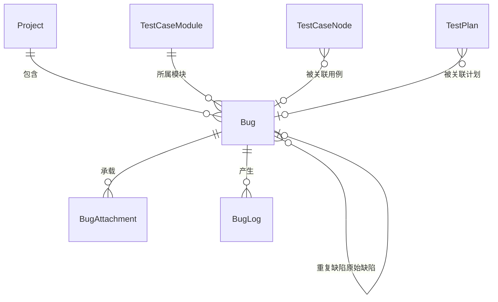

# 软件测试平台——缺陷管理模块概要设计

**文档版本**：V1.0  
**日期**：2026-10-01  
**状态**：起草中  

---

## 1. 引言

### 1.1 编写目的

对缺陷管理模块进行概要设计，明确子模块划分、缺陷状态机与操作记录等核心机制、数据实体关系与接口职责边界，为详细设计与开发提供依据。

### 1.2 范围与对应需求

对应需求分册 `docs/01-requirements/04-bug-management/02-srs-bug-management.md`，覆盖缺陷列表与看板双视图、状态流转与处理操作、提交缺陷与缺陷详情。跨模块公共数据与接口约定见 `docs/02-high-level-design/07-hld-data-interface.md`，部署与安全约束见 `docs/02-high-level-design/08-hld-deployment-security.md`；AI 新增的缺陷分析行为（趋势度量、自动分类分诊、重复缺陷检测）属 AI 能力模块，见 `docs/02-high-level-design/07-ai-capability/02-hld-ai-capability.md`。

### 1.3 定义与缩写

| 术语 | 定义 |
| ---- | ---- |
| 短 ID | 缺陷展示用的截短标识（沿用需求分册的列表列定义） |
| 激活 | 缺陷四态之一，指未修复的有效待处理状态（沿用需求分册定义） |
| 重复缺陷 | 解决方案取值之一，须指定存在的原始缺陷且不能为自身 |
| 操作记录 | 每次状态变更与信息更新产生的追加式流水 |
| 上下文头 | 标识当前工作空间 / 项目的请求头，不出现在 URL 中 |

## 2. 模块划分

### 2.1 子模块结构

    缺陷管理模块（业务端 · 项目工作区）
    ├── 列表视图
    │   ├── 快捷过滤 / 组合筛选 / 关键词搜索 / 分页
    │   └── 行操作（详情、解决、拒绝、关闭、激活、确认、指派、复制）
    ├── 看板视图
    │   └── 按状态分列的卡片与拖拽流转
    ├── 提交缺陷
    │   └── 表单登记、附件上传与复制回填
    └── 缺陷详情
        ├── 内容与属性编辑、附件管理
        ├── 关联用例与关联计划
        └── 操作记录时间线与底栏操作

### 2.2 职责简述

* **列表视图**：分页表格承载全部缺陷的检索与行级处理入口，快捷过滤与更多筛选共用同一套查询条件。
* **看板视图**：按状态分列展示卡片，通过拖拽完成看板内合法的状态流转，与列表视图共用筛选条件。
* **提交缺陷**：项目内登记新缺陷、指派处理人，支持携带源缺陷回填的复制入口。
* **缺陷详情**：全量信息查看与编辑、附件管理、关联用例与关联计划维护、操作记录追溯与全部处理操作。

### 2.3 与相邻模块的关系

* **功能测试模块**：缺陷可关联测试用例与进行中的测试计划，两侧以用例节点标识关联；缺陷生命周期归本模块，计划执行失败结果反向关联缺陷由功能测试模块发起，见 `docs/02-high-level-design/03-function-testing/02-hld-function-testing.md` 第 2.3 节。
* **空间管理模块**：缺陷经所属项目归属到工作空间，数据隔离与活跃上下文机制沿用 `docs/02-high-level-design/02-space-management/02-hld-space-management.md` 第 3.1 节；处理人须为当前工作空间成员，成员关系由该模块维护。
* **AI 能力模块**：趋势与质量度量、自动分类与分诊、重复缺陷检测由 AI 能力模块供给，本模块只提供缺陷数据与既有筛选入口；AI 建议一律待确认态，不自动改写已提交缺陷字段。
* **数据隔离**：通用口径见 `docs/02-high-level-design/07-hld-data-interface.md` 第 1.3 节，本分册不重复描述。

## 3. 核心机制设计

### 3.1 缺陷状态机

    激活 ──解决──> 已修复 ──关闭──> 已关闭 ──激活──> 激活
      │  ↑            │  ↑
      │  └──激活──────┘  └──激活── 已关闭
      ├──拒绝──> 已拒绝 ──关闭──> 已关闭
      ↑            │
      └──激活──────┘

* 四态转换必须符合上述关系，非法流转由服务端拒绝并给出提示，前端不作为唯一防线。
* 解决须选择解决方案并填写备注，解决方案为「重复缺陷」时须指定存在的原始缺陷且非自身；拒绝与关闭须填写说明。
* 处理人随流转回设：解决或拒绝后回到创建人；重开后指向原解决人（无则原拒绝人）；重开累计次数并在详情回显。
* 确认仅对激活且未确认的缺陷开放，经二次确认标记为有效待处理；解决动作隐式视为确认。
* 指派须选择当前工作空间成员，已关闭缺陷不可指派。
* 看板内可完成的流转限定为激活 → 已修复、已修复 → 已关闭、已修复 → 激活、已关闭 → 激活；涉及已拒绝状态的流转只在列表视图与详情页进行。

### 3.2 双视图共用筛选

* 列表与看板共用同一套快捷过滤、更多筛选与关键词搜索条件，页内切换视图不重置条件。
* 快捷过滤「未修复的」与手动状态条件并存时以快捷过滤为准；条件变化回到第一页，重置清空全部条件后重新查询。
* 看板列状态与状态筛选条件不一致时该列不展示数据；已拒绝缺陷不进入看板，仅列表可见。

### 3.3 操作记录与只读口径

* 每次状态变更与信息更新追加一条操作记录（操作人、操作类型、说明），时间线按时间排序构成完整历史；记录为追加式，不回溯改写。
* 已关闭缺陷整体只读：内容、属性、附件均不可变更，仅保留「激活」操作；平台不提供缺陷删除功能。
* 信息保存只提交实际变化的字段，处理人的变更统一经指派动作完成。

## 4. 数据设计

实体与关系（实体级，字段、DDL 与索引留详细设计 `docs/04-detailed-design/04-bug-management/02-project-workspace-bug.md`）：

| 实体 | 职责 |
| ---- | ---- |
| Bug | 缺陷主体，四态状态机载体，含解决方案、确认标记与重开计数 |
| BugAttachment | 缺陷附件记录（文件名、大小、上传人），与文件存储解耦 |
| BugLog | 操作记录（操作人、操作类型、说明的追加式流水） |

缺陷的处理人、解决人、拒绝人、关闭人为当前工作空间成员的用户引用；关联用例与关联计划为跨模块引用，本模块不复制用例与计划数据；重复缺陷指向同项目内的另一缺陷。缺陷数量与状态分布为聚合派生值，不冗余存储。

## 5. 接口设计概要

资源与职责划分（路径、方法与报文留详细设计；公共约定见 `docs/02-high-level-design/07-hld-data-interface.md`）：

| 资源 | 职责 | 归属 |
| ---- | ---- | ---- |
| 缺陷集合 | 分页列表（筛选、快捷过滤、关键词）、创建、批量状态统计 | 业务端（项目上下文） |
| 缺陷 | 详情、属性与内容的部分更新 | 业务端（项目上下文） |
| 状态流转 | 解决、拒绝、关闭、激活（含重复缺陷指定与变更说明校验） | 业务端（项目上下文） |
| 确认与指派 | 确认缺陷、重新指派处理人 | 业务端（项目上下文） |
| 操作记录 | 单缺陷的操作历史查询 | 业务端（项目上下文） |
| 附件 | 上传、列表、下载、删除 | 业务端（项目上下文） |

上下文标识通过请求头传递，不出现在 URL 中；全部接口遵循既有认证与工作空间 / 项目上下文校验，缺陷数据限定在当前项目内。

## 6. 设计约束与原则

* 上下文标识只经请求头传递（C4），不出现在 URL 与请求体中。
* 数据更新只写入实际传入字段（C11），缺陷属性与内容均为部分更新。
* 缺陷不提供删除，生命周期止于关闭；已关闭缺陷整体只读，仅保留激活。
* 处理人、指派目标必须为当前工作空间成员，校验由服务端保证。
* 附件单文件大小受限，上传须经类型白名单与文件头校验，下载禁止类型嗅探（`docs/00-spec/40-security/` 相关规范）。
* 所有异常经统一错误码抛出，错误码为 10 位（框架全局错误码除外）。
* 缺陷数据经项目归属到工作空间，遵循数据库通用约定（`docs/00-spec/20-contracts/02-database.md`），无物理外键。
* 页面级交互与状态分支（含空态、加载、错误、权限不足）见 `docs/05-interaction-design/04-bug-management/02-workspace-ui-bug.md`。

## 修改记录

| 版本 | 日期 | 说明 |
| ---- | ---- | ---- |
| V1.0 | 2026-10-01 | 初始版本 |
| V1.0 | 2026-10-02 | 数据隔离口径引用改指数据与接口设计分册 |
