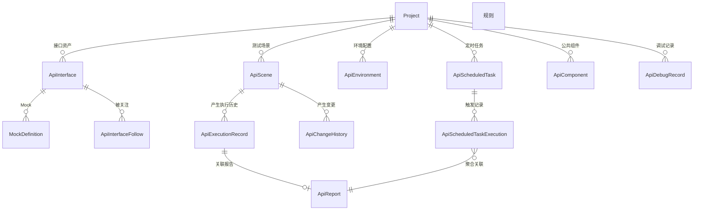

# 软件测试平台——接口测试模块概要设计

**文档版本**：V1.0  
**日期**：2026-10-01  
**状态**：起草中  

---

## 1. 引言

### 1.1 编写目的

对接口测试模块进行概要设计，明确子模块划分、执行引擎与格式转换等核心机制、数据实体关系与接口职责边界，为详细设计与开发提供依据。

### 1.2 范围与对应需求

对应需求分册 `docs/01-requirements/05-api-testing/02-api-srs-overview.md` 及其快速调试、接口管理、Mock 服务、测试场景、接口测试报告、定时任务、公共需求、项目设置八个分册（见 `docs/01-requirements/05-api-testing/01-readme.md`）；本分册为模块总览，子模块级设计分别见对应分册（见 2.1）。跨模块公共数据与接口约定见 `docs/02-high-level-design/07-hld-data-interface.md`，登录、令牌刷新与限流等公共认证机制见 `docs/02-high-level-design/03-hld-common.md`，部署与安全约束见 `docs/02-high-level-design/08-hld-deployment-security.md`。

### 1.3 定义与缩写

| 术语 | 定义 |
| ---- | ---- |
| 接口定义 | 被测接口的规范化描述，是测试场景与 Mock 服务的资产底座（沿用需求分册定义） |
| 测试场景 | 多个取样器步骤按顺序编排的步骤序列，用于场景级自动化回归（沿用需求分册定义） |
| 取样器 | 执行一次请求的最小测试单元，首期支持 http 与 jdbc 两类（沿用需求分册定义） |
| Ryze | 平台直接引入的测试执行框架，平台执行引擎基于其构建（沿用需求分册定义） |
| Ryze 标准格式 | 执行引擎可识别的标准 JSON 结构，由平台自有模型在执行时实时解析生成（沿用需求分册定义） |
| 环境 | 项目级配置集合，融合默认配置、数据源、全局变量与全局前置/后置处理器（沿用需求分册定义） |
| 套件报告 | 定时任务聚合多个场景执行生成的报告，按「场景 → 步骤」两级展示（沿用需求分册定义） |
| 上下文头 | 标识当前工作空间 / 项目的请求头，不出现在 URL 中 |

## 2. 模块划分

### 2.1 子模块清单

    接口测试模块（业务端 · 项目工作区）
    ├── 快速调试          → 03-hld-api-quick-debug
    ├── 接口管理          → 04-hld-api-interface-management
    ├── Mock 服务         → 05-hld-api-mock-service
    ├── 测试场景          → 06-hld-api-test-scenario
    ├── 接口测试报告      → 07-hld-api-test-report
    ├── 定时任务          → 08-hld-api-scheduled-task
    ├── 公共机制          → 09-hld-api-common（请求参数与认证、处理器、验证器、变量与内置函数、执行引擎）
    └── 项目设置          → 10-hld-api-project-settings（环境管理、公共组件）

### 2.2 职责简述

* **快速调试**：多标签单请求调试，支持服务端执行与本地执行，可保存为接口定义。
* **接口管理**：接口定义资产的集中管理（新建、导入、引用关系、变更历史），是场景与 Mock 的数据底座。
* **Mock 服务**：按匹配规则模拟接口响应，解除对真实服务的联调依赖。
* **测试场景**：场景步骤编排与平台内执行，生成场景报告，沉淀执行与变更历史。
* **接口测试报告**：场景报告与套件报告的查看、分享与删除。
* **定时任务**：场景执行与接口同步的 Cron 周期调度，统一任务管理与执行记录。
* **公共机制**：请求参数与认证模型、前置/后置处理器、验证器、内置函数与变量引用、执行引擎的跨子模块公共设计。
* **项目设置**：平台级统一设置框架下本域的两个配置模块——环境管理与公共组件。

### 2.3 与相邻模块的关系

* **空间管理模块（项目）**：本模块全部数据归属项目、按项目隔离，经项目归属到工作空间；项目与项目级统一模块树（与功能测试用例文档共享）归空间管理与功能测试模块维护。
* **功能测试模块**：与本模块共享项目统一模块树进行资产组织；项目设置框架为各业务域共用入口，配置项按业务域归属过滤。
* **缺陷管理模块**：接口测试失败结果可关联缺陷，本模块不承载缺陷生命周期。
* **定时任务与调度**：任务归属项目，触发的场景执行进入本模块执行引擎的统一并发队列。

## 3. 核心机制设计

### 3.1 执行引擎与格式转换

* 调试请求与场景执行统一由平台执行引擎在服务端执行，引擎基于 Ryze 框架构建；平台以自有字段模型存储全部接口测试数据，不持久化 Ryze 文档。
* 执行时将平台自有模型实时解析为 Ryze 标准 JSON（场景映射为顶层集合，步骤映射为取样器子节点，环境配置映射为配置元件），转换对用户无感；转换失败则拒绝执行并给出可定位的转换错误信息，不产生部分执行结果。
* 执行结果由引擎结果树收集回平台自有格式，生成报告并回写执行历史；Ryze 结果树随报告快照留存，用于结果回溯与转换问题定位。
* 首期启用 HTTP 与 JDBC 取样器；其他协议、自定义验证器/提取器/函数基于 Ryze 扩展机制预留，平台不实现与 Ryze 语义不一致的平行能力。

### 3.2 并发与队列

* 执行任务统一纳入资源池并发队列，最大并发数为系统配置项（默认 5），同一项目共享并发配额。
* 超出并发数的任务排队等待，队列长度可配置；超出队列长度时拒绝执行并提示。手动执行与定时触发统一排队。
* 执行超时按请求级「响应超时」配置控制，超时任务标记为超时失败并记录。

### 3.3 数据隔离与上下文

* 接口定义、场景、环境、Mock、报告、公共组件、定时任务均归属项目，查询层按项目上下文强制过滤，遵循既有数据隔离原则。
* 上下文标识（工作空间 / 项目）经请求头传递，不出现在 URL 与请求体中。
* 例外：报告分享链接在有效期内免登录访问，仅凭分享令牌校验报告范围，不建立用户活动上下文。

### 3.4 数据生命周期

* 报告、执行历史、调试记录与变更历史量大，统一按系统配置的清理策略自动清理（默认保留 90 天），清理行为记录日志；清理后执行历史保留元数据、详情置为「执行结果被清理」。
* 逻辑删除贯穿全部实体；删除接口定义时其关联 Mock 的引用关系同步失效。

## 4. 数据设计

实体与关系（实体级，字段、DDL 与索引留详细设计 `docs/04-detailed-design/05-api-testing/02-api-testing-infra-overview.md`；与 `docs/02-high-level-design/07-hld-data-interface.md` 第 1 节保持一致）：

| 实体 | 职责 |
| ---- | ---- |
| ApiInterface | 接口定义（协议、方法、路径、参数、响应示例），场景与 Mock 的资产底座 |
| ApiInterfaceFollow | 接口关注关系（我关注的视图） |
| MockDefinition | Mock 规则（匹配条件、响应定义、延迟、启停、命中统计） |
| ApiScene | 测试场景（名称、模块、优先级、参数与步骤树的载体） |
| ApiEnvironment | 环境（默认配置、数据源、全局变量、全局前置/后置处理器） |
| ApiComponent | 公共组件资产（处理器 / 验证器 / 提取器） |
| ApiDebugRecord | 调试请求快照与执行结果（服务端执行） |
| ApiExecutionRecord | 场景执行历史，与报告关联 |
| ApiReport | 场景报告与套件报告的结果快照、分享链接与有效期 |
| ApiScheduledTask | 定时任务（类型、Cron、启用状态、绑定对象） |
| ApiScheduledTaskExecution | 任务触发记录（触发方式、结果、失败原因、关联报告或导入结果） |
| ApiChangeHistory | 接口与场景的变更序号追溯 |
| ApiImportRecord | 导入操作结果（新增 / 更新 / 失败统计与失败明细） |

所有新增表遵循平台数据库规范：`id`、`created_at`、`updated_at`、`is_deleted`，禁止物理外键（C5），索引遵循 C9；报告与执行历史大表按清理策略管理。

## 5. 接口设计概要

资源与职责划分（路径、方法与报文留详细设计；公共约定见 `docs/02-high-level-design/07-hld-data-interface.md`）：

| 资源 | 职责 | 归属 |
| ---- | ---- | ---- |
| 调试 | 调试请求执行、调试记录查询与管理 | 项目级（项目上下文） |
| 接口定义 | 列表、新建、编辑、复制、删除、关注、cURL 与 Swagger 导入、引用关系与变更历史 | 项目级（项目上下文） |
| Mock | 规则 CRUD、启停、调试、命中统计、地址获取 | 项目级（项目上下文） |
| 测试场景 | 场景与步骤 CRUD、复制、执行触发、执行状态查询 | 项目级（项目上下文） |
| 执行 | 执行状态查询、取消 | 项目级（项目上下文） |
| 报告 | 列表、详情、删除、分享生成与校验 | 项目级（项目上下文）；分享访问为公开入口 |
| 定时任务 | 任务 CRUD、启停、立即执行、执行记录 | 项目级（项目上下文） |
| 环境 | 环境 CRUD、导入导出、数据源测试、变量维护 | 项目级（项目上下文） |
| 公共组件 | 资产 CRUD、启停、复制引入 | 项目级（项目上下文） |

上下文标识通过请求头传递，不出现在 URL 中；全部接口遵循既有认证与工作空间 / 项目上下文校验，报告分享访问为唯一的免登录例外。

## 6. 设计约束与原则

* 平台自有模型是唯一持久化事实源，不持久化 Ryze 文档；Ryze 标准 JSON 仅执行时生成。
* 全部数据按项目隔离，上下文只经请求头传递（C4）。
* 数据更新只写实际传入字段（C11），变更历史与执行历史为追加式只读记录。
* 所有异常经统一错误码抛出，错误码为 10 位（框架全局错误码除外）。
* 凭据类配置（认证信息、数据源密码）加密存储、脱敏展示，不下发前端明文；环境变量值为明文存储展示。
* 数据库遵循通用约定（`docs/00-spec/20-contracts/02-database.md`）：无物理外键、逻辑删除、索引符合 C9。
* 本地执行模式结果仅展示、不持久化，不消耗执行引擎并发资源（该模式暂缓交付）。
* 首期范围不含非 HTTP/JDBC 协议与 Mock 独立部署形态，数据模型与执行引擎按多协议扩展预留。

## 修改记录

| 版本 | 日期 | 说明 |
| ---- | ---- | ---- |
| V1.0 | 2026-10-01 | 初始版本 |
