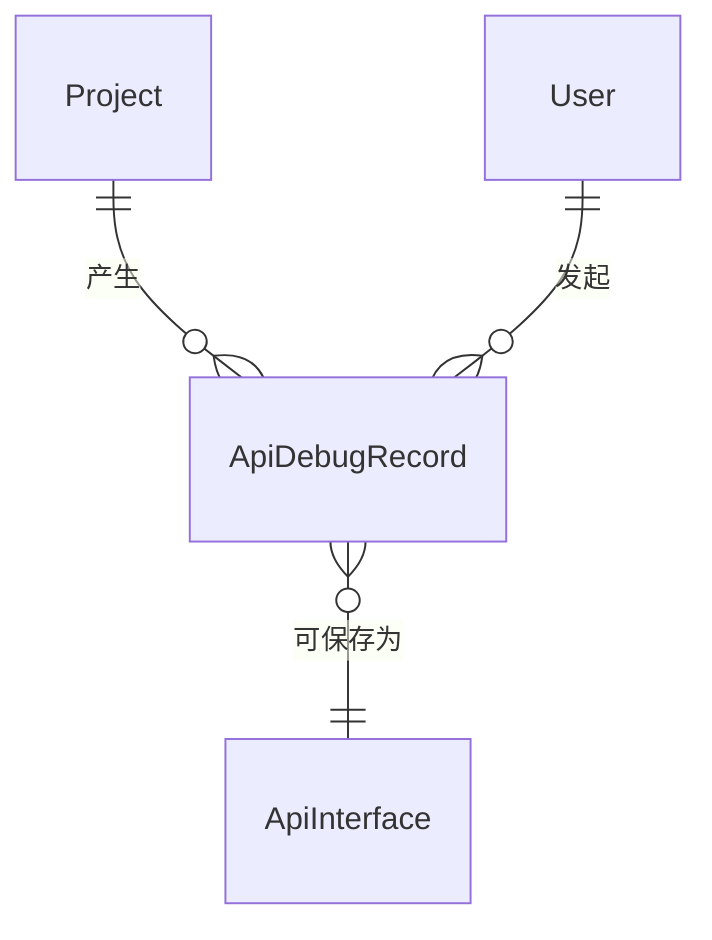

# 软件测试平台——快速调试概要设计

**文档版本**：V1.0  
**日期**：2026-10-01  
**状态**：起草中  

---

## 1. 引言

### 1.1 编写目的

对接口测试模块的快速调试子模块进行概要设计，明确双执行模式、标签会话与历史记录机制、数据实体关系与接口职责，为详细设计与开发提供依据。

### 1.2 范围与对应需求

对应需求分册 `docs/01-requirements/05-api-testing/03-api-srs-quick-debug.md`；模块公共机制（执行引擎、请求参数模型、变量与内置函数）见 `docs/02-high-level-design/05-api-testing/09-hld-api-common.md`，模块总览见 `docs/02-high-level-design/05-api-testing/02-hld-api-overview.md`。

### 1.3 定义与缩写

| 术语 | 定义 |
| ---- | ---- |
| 调试标签 | 一个独立维护请求/响应状态的调试会话（沿用需求分册定义） |
| 服务端执行 | 由平台执行引擎在服务端发起请求的执行模式（沿用需求分册定义） |
| 本地执行 | 由用户本机代理客户端发起请求的执行模式，结果不持久化（沿用需求分册定义） |
| 调试记录 | 服务端执行后自动保存的请求快照与响应结果（沿用需求分册定义） |

## 2. 模块划分

### 2.1 页面构成

    快速调试
    ├── 标签栏（新建 / 切换 / 关闭 / 重命名，最多 10 个）
    ├── 请求编辑器（Params / Auth / Headers / Body 页签）
    ├── 响应区（Body / Headers / Cookies 页签，Pretty / Raw / Preview 视图）
    ├── URL 栏（协议、方法、执行模式切换、[保存]）
    └── 历史记录（页面级固定标签，不可关闭，位于标签栏末尾）

### 2.2 职责边界

* 只负责单请求的构造与即时执行；执行留痕（报告、执行历史）由测试场景承担，调试执行不产生报告。
* 服务端执行的调试请求可保存为接口定义，保存后即成为接口管理资产，生命周期归接口管理子模块。
* 本地执行结果不持久化为平台报告或调试记录（仅浏览器本地缓存），不可保存为接口资产。

## 3. 核心机制设计

### 3.1 双执行模式

* **服务端执行（默认）**：请求经平台执行引擎在服务端发起，纳入统一并发队列，验证服务端网络策略与可达性；执行完成后自动落调试记录。
* **本地执行**：由本地代理客户端（或浏览器插件）从用户本机发起，用于调试本地环境或绕过服务端网络限制；不消耗执行引擎并发资源，仅记录操作行为、不记录请求明细（该模式暂缓交付）。
* 执行模式作用于标签维度，切换模式只影响后续执行，不改写历史记录。

### 3.2 标签会话管理

* 每个标签独立维护请求与响应状态；标签首次执行后自动以「方法 + URL 路径末段」命名，支持双击重命名。
* 关闭含未保存修改的标签弹出二次确认；最后一个标签关闭后自动创建空白标签，标签栏始终至少有一个标签。
* 请求配置支持 `${变量名}` 与内置函数引用，变量来源为环境变量，求值规则见公共机制分册。

### 3.3 历史记录与恢复

* 服务端执行完成即自动保存请求快照与响应结果为调试记录，按时间倒序保留最近 200 条，超出自动淘汰最旧记录。
* 恢复即创建新标签并回填请求配置，同时在响应区展示该次响应结果；历史记录支持搜索、重命名、删除。
* 本地执行不进入历史记录的持久化集合，仅存浏览器本地缓存。

### 3.4 cURL 导入

* 粘贴 cURL 命令仅解析请求描述（方法、URL、请求头、请求体），填充当前激活标签；不执行 cURL 命令本身，也不执行其中的脚本或文件引用。
* 解析失败给出明确提示，不改变当前标签已有内容。

## 4. 数据设计

实体与关系（字段、DDL 与索引留详细设计 `docs/04-detailed-design/05-api-testing/11-quick-debug.md`）：

| 实体 | 职责 |
| ---- | ---- |
| ApiDebugRecord | 服务端执行的请求快照与响应结果，历史记录的持久化载体 |
| ApiInterface | 保存目标资产，由本子模块创建后归接口管理子模块维护 |
| User | 调试发起人，本地执行的浏览器缓存不经此实体 |

本地执行结果不落库，不产生实体记录。

## 5. 接口设计概要

资源与职责划分（路径、方法与报文留详细设计）：

| 资源 | 职责 | 归属 |
| ---- | ---- | ---- |
| 调试执行 | 服务端执行调试请求，返回响应结果 | 项目级（项目上下文） |
| 调试记录 | 历史列表（分页）、重命名、删除、按条恢复 | 项目级（项目上下文） |
| 保存为接口 | 调试请求落库为接口定义（新建或归属已有接口） | 项目级（项目上下文） |

本地执行不经平台接口，由本地代理通道完成；调试执行遵循公共请求参数与认证模型（见公共机制分册）。

## 6. 设计约束与原则

* 未保存的调试请求执行后不产生持久化数据；保存后资产归接口管理，受其引用保护规则约束。
* 历史记录淘汰为自动滚动（保留最近 200 条），删除单条记录需用户显式操作。
* cURL 导入只解析描述不执行命令，防注入。
* 凭据类认证配置加密存储，不下发前端明文。
* 调试记录按项目数据生命周期统一清理（默认 90 天）。
* 所有异常经统一错误码抛出，错误码为 10 位（框架全局错误码除外）。

## 修改记录

| 版本 | 日期 | 说明 |
| ---- | ---- | ---- |
| V1.0 | 2026-10-01 | 初始版本 |
