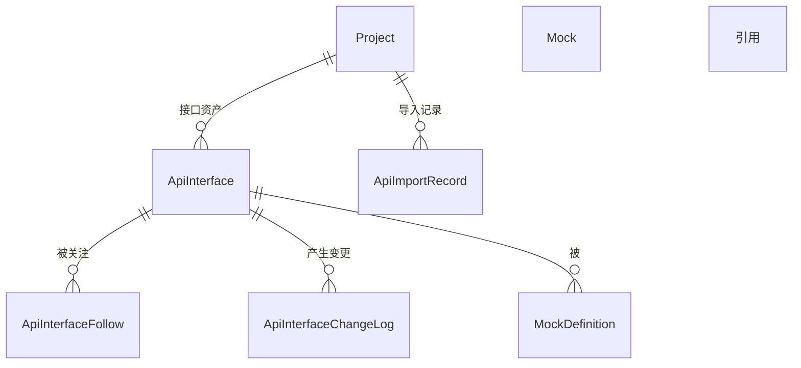

# 软件测试平台——接口管理概要设计

**文档版本**：V1.0  
**日期**：2026-10-01  
**状态**：起草中  

---

## 1. 引言

### 1.1 编写目的

对接口测试模块的接口管理子模块进行概要设计，明确接口定义资产模型、导入与引用保护机制、数据实体关系与接口职责，为详细设计与开发提供依据。

### 1.2 范围与对应需求

对应需求分册 `docs/01-requirements/05-api-testing/04-api-srs-interface-management.md`；模块公共机制见 `docs/02-high-level-design/05-api-testing/09-hld-api-common.md`，模块总览见 `docs/02-high-level-design/05-api-testing/02-hld-api-overview.md`。定时导入的任务调度机制见 `docs/02-high-level-design/05-api-testing/08-hld-api-scheduled-task.md`。

### 1.3 定义与缩写

| 术语 | 定义 |
| ---- | ---- |
| 接口定义 | 被测接口的规范化描述，是场景与 Mock 的资产底座（沿用需求分册定义） |
| 引用关系 | 接口被测试场景或 Mock 引用的关联关系（沿用需求分册定义） |
| 变更历史 | 接口每次保存变更产生的记录，含变更序号（沿用需求分册定义） |
| 场景模块 | 项目级统一模块树，与测试场景、功能用例文档共享（沿用需求分册定义） |

## 2. 模块划分

### 2.1 页面构成

    接口管理
    ├── 模块树（项目统一模块树，按资产类型筛选）
    ├── 接口列表（筛选栏：ID / 名称 / 模块 / 协议；视图：我关注的 / 我创建的 / 全部）
    │     └── 行操作（编辑 / 复制 / 删除 / 关注）
    ├── 接口编辑器（新建与编辑，请求参数与响应示例）
    ├── 导入入口（cURL 单条或多条、Swagger URL、定时导入配置）
    └── 接口预览（详情、引用关系、变更历史、调试入口）

### 2.2 职责边界

* 接口定义是本模块的唯一核心资产，测试场景的「系统请求」与 Mock 均以接口定义为源。
* 接口名称在所属模块内唯一，模块归属复用项目统一模块树，本模块不另建独立模块体系。
* 调试入口向快速调试子模块传递接口请求参数，资产本身仍在本模块维护。

## 3. 核心机制设计

### 3.1 资产引用与删除保护

* 接口被场景或 Mock 引用时禁止直接删除，服务端校验引用关系并提示引用方，需先解除引用。
* 引用关系为只读派生信息：由场景导入方式（复制 / 链接引用）与 Mock 归属关系推导，不单独提供人工编辑入口。
* 删除接口时其关联 Mock 的引用关系同步失效（Mock 跟随 API 的响应来源失效，规则本身按 Mock 子模块语义处置）。

### 3.2 导入与增量同步

* **cURL 导入**：解析命令文本为接口定义，支持单条与多条；格式非法的条目跳过并给出失败清单，不阻断整体导入。
* **Swagger URL 导入**：按文档地址拉取 OpenAPI 2.0/3.0 定义并解析为接口定义；目标地址需满足安全校验策略（防 SSRF，口径见详细设计）。
* **定时导入**：由定时任务按 Cron 周期拉取 Swagger URL，增量更新策略与手动导入一致——以「接口路径 + 方法」匹配，已存在覆盖更新、不存在新增；被手动修改过的接口定义不被覆盖（导入策略为系统配置项）。
* 导入结果统一落导入记录，可查看新增 / 更新 / 失败统计与失败明细。

### 3.3 复制与关注

* 复制以源接口为模板打开新建态编辑器并回填全部定义，保存后产生独立副本，与源接口无关联。
* 关注关系独立于创建关系，支撑「我关注的 / 我创建的 / 全部」三个视图；关注不产生引用保护。

### 3.4 变更历史

* 每次保存（新建、编辑、导入覆盖、复制落库）产生一条变更记录并递增变更序号，只读展示。
* 变更历史记录变更人与变更时间，内容快照粒度（完整或差异）留详细设计确定。

## 4. 数据设计

实体与关系（字段、DDL 与索引留详细设计 `docs/04-detailed-design/05-api-testing/08-interface-management-overview.md`）：

| 实体 | 职责 |
| ---- | ---- |
| ApiInterface | 接口定义主体（协议、方法、路径、参数、响应示例、模块归属） |
| ApiInterfaceFollow | 接口关注关系，支撑视图切换 |
| ApiInterfaceChangeLog | 接口变更历史，含变更序号 |
| ApiImportRecord | 每次导入的结果统计与失败明细 |
| MockDefinition | 作为引用关系的被引用方出现，归属 Mock 子模块 |

场景对接口的引用（复制 / 链接引用）由场景侧步骤数据承载，关系实体见测试场景分册。

## 5. 接口设计概要

资源与职责划分（路径、方法与报文留详细设计）：

| 资源 | 职责 | 归属 |
| ---- | ---- | ---- |
| 接口定义 | 列表（分页与筛选）、新建、详情、编辑、复制、删除 | 项目级（项目上下文） |
| 接口关注 | 关注 / 取消关注 | 项目级（项目上下文） |
| 导入 | cURL 解析导入、Swagger URL 导入、导入记录查询 | 项目级（项目上下文） |
| 引用关系 | 查询被场景 / Mock 引用的清单（删除前校验依据） | 项目级（项目上下文） |
| 变更历史 | 按对象查询变更记录列表 | 项目级（项目上下文） |

上下文标识通过请求头传递，不出现在 URL 中；删除接口须先通过引用校验。

## 6. 设计约束与原则

* 被引用的接口禁止删除，引用方提示为服务端强约束，前端提示不作为约束。
* 接口名称唯一性（模块内）在服务端强校验。
* 定时导入不覆盖手动修改的接口，导入策略只允许经系统配置调整。
* 导入解析失败条目跳过并留痕，导入部分成功不回滚已成功部分。
* 变更历史为只读追加记录，不提供编辑与删除接口。
* 数据更新只写实际传入字段（C11）；所有异常经统一错误码抛出，错误码为 10 位（框架全局错误码除外）。

## 修改记录

| 版本 | 日期 | 说明 |
| ---- | ---- | ---- |
| V1.0 | 2026-10-01 | 初始版本 |
