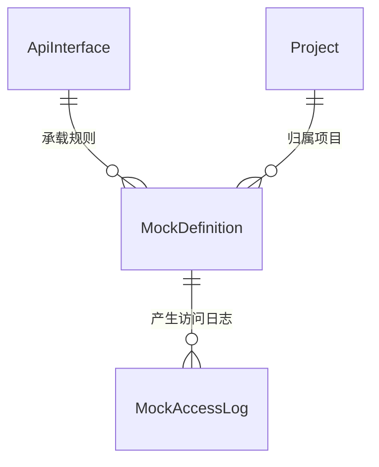

# 软件测试平台——Mock 服务概要设计

**文档版本**：V1.0  
**日期**：2026-10-01  
**状态**：起草中  

---

## 1. 引言

### 1.1 编写目的

对接口测试模块的 Mock 服务子模块进行概要设计，明确规则匹配引擎、访问与限流机制、数据实体关系与接口职责，为详细设计与开发提供依据。

### 1.2 范围与对应需求

对应需求分册 `docs/01-requirements/05-api-testing/05-api-srs-mock-service.md`；模块总览见 `docs/02-high-level-design/05-api-testing/02-hld-api-overview.md`，Mock 访问限流的公共口径见 `docs/02-high-level-design/03-hld-common.md`。

### 1.3 定义与缩写

| 术语 | 定义 |
| ---- | ---- |
| Mock | 按配置规则模拟接口响应的能力（沿用需求分册定义） |
| 匹配规则 | 请求方法、路径、请求头、请求参数构成的命中条件（沿用需求分册定义） |
| 跟随 API | Mock 未配置响应时跟随接口定义响应示例的开关（沿用需求分册定义） |
| 命中次数 | Mock 规则被外部请求命中命中的累计计数（沿用需求分册定义） |

## 2. 模块划分

### 2.1 页面构成

    Mock 服务
    ├── Mock 列表（按接口模块组织，启停 / 编辑 / 删除，命中次数与最近命中时间）
    ├── Mock 配置页（匹配条件、响应定义、延迟、跟随 API、启停）
    ├── Mock 调试（配置页内直接执行一次请求）
    └── Mock 地址（一键复制访问地址）

### 2.2 职责边界

* Mock 归属接口管理的模块组织体系，可从接口定义创建（继承路径与方法）或独立创建。
* 面向外部依赖方提供免登录访问，平台内管理操作仍按项目权限控制。
* 不承载真实业务逻辑，仅按规则回放响应；启停状态即时生效，不重启服务。

## 3. 核心机制设计

### 3.1 规则匹配

* 匹配按「请求方法 + 路径 + 匹配条件」顺序逐条比对，取第一条命中规则回放响应。
* 无命中规则时返回 404，不回退到任意默认响应。
* 路径匹配支持与真实接口同构的路径（含路径参数占位），具体匹配算法（精确 / 模板 / 通配）留详细设计确定。

### 3.2 访问与限流

* Mock 地址与真实接口同构，仅以平台提供的 Mock 域名 / 端口区分；端口复用主端口或独立端口由部署配置决定。
* 访问不要求请求方具备平台登录态；平台侧实施单 Mock 路径 QPS 上限（可配置），超限返回 429。
* 访问量计入访问日志与审计，支撑命中次数与最近命中时间统计。

### 3.3 响应生成

* 响应定义含状态码、响应头、响应体与可选延迟（模拟慢响应），内容支持环境变量与内置函数动态生成，求值规则见公共机制分册。
* 跟随 API 开启且 Mock 自身未配置响应时，回放接口定义中的响应示例；接口定义删除后跟随来源失效，按未配置响应处置。
* 命中统计按规则累计，启停不重置计数（清零口径留详细设计确定）。

## 4. 数据设计

实体与关系（字段、DDL 与索引留详细设计 `docs/04-detailed-design/05-api-testing/21-mock-service-overview.md`）：

| 实体 | 职责 |
| ---- | ---- |
| MockDefinition | Mock 规则主体（匹配条件、响应定义、延迟、启停、跟随开关、命中统计） |
| MockAccessLog | 外部访问流水，支撑命中统计与审计追溯 |
| ApiInterface | 规则来源与跟随 API 的响应示例来源，归属接口管理子模块 |

## 5. 接口设计概要

资源与职责划分（路径、方法与报文留详细设计）：

| 资源 | 职责 | 归属 |
| ---- | ---- | ---- |
| Mock 定义 | 列表、新建（自接口继承或独立）、编辑、删除 | 项目级（项目上下文） |
| Mock 状态 | 启停 | 项目级（项目上下文） |
| Mock 调试 | 配置页内执行一次匹配验证 | 项目级（项目上下文） |
| Mock 命中统计 | 命中次数与最近命中时间查询 | 项目级（项目上下文） |
| Mock 访问 | 按同构路径回放响应 | 公开入口（免登录，按 QPS 限流） |

上下文标识通过请求头传递且不出现在 URL 中（管理侧）；Mock 访问为公开入口，仅凭路径匹配，不建立用户活动上下文。

## 6. 设计约束与原则

* Mock 访问免登录但必须限流与留痕，单路径 QPS 上限为可配置项，超限返回 429。
* 匹配取第一条命中规则，无命中即 404，不隐式兜底。
* 启停即时生效，不依赖服务重启。
* 接口定义删除时关联 Mock 的引用关系同步失效，避免跟随来源指向已删除资产。
* 响应体中的敏感信息遵循项目数据安全策略，命中统计与访问日志按数据生命周期清理。
* 所有异常经统一错误码抛出，错误码为 10 位（框架全局错误码除外）。

## 修改记录

| 版本 | 日期 | 说明 |
| ---- | ---- | ---- |
| V1.0 | 2026-10-01 | 初始版本 |
