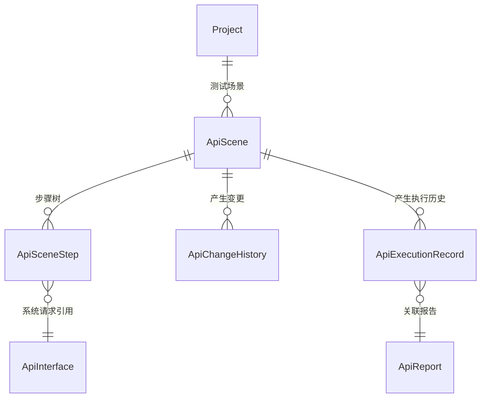

# 软件测试平台——测试场景概要设计

**文档版本**：V1.0  
**日期**：2026-10-01  
**状态**：起草中  

---

## 1. 引言

### 1.1 编写目的

对接口测试模块的测试场景子模块进行概要设计，明确场景步骤编排、引用与变量优先级、执行失败语义等核心机制、数据实体关系与接口职责，为详细设计与开发提供依据。

### 1.2 范围与对应需求

对应需求分册 `docs/01-requirements/05-api-testing/06-api-srs-test-scenario.md`；模块公共机制（请求参数模型、处理器与验证器、变量与内置函数、执行引擎）见 `docs/02-high-level-design/05-api-testing/09-hld-api-common.md`，模块总览见 `docs/02-high-level-design/05-api-testing/02-hld-api-overview.md`。报告生成与分享见 `docs/02-high-level-design/05-api-testing/07-hld-api-test-report.md`，定时触发的场景执行见 `docs/02-high-level-design/05-api-testing/08-hld-api-scheduled-task.md`。

### 1.3 定义与缩写

| 术语 | 定义 |
| ---- | ---- |
| 测试场景 | 多个取样器步骤按顺序编排的步骤序列（沿用需求分册定义） |
| 系统请求 | 从接口定义导入的 http 取样器步骤（沿用需求分册定义） |
| 自定义请求 | 不落库的 HTTP 请求步骤，可粘贴 cURL（沿用需求分册定义） |
| 链接引用 | 跟随源数据变化的步骤引用方式，参数值与启用状态可独立调整（沿用需求分册定义） |
| 执行历史 | 场景每次执行产生的记录，与报告关联（沿用需求分册定义） |

## 2. 模块划分

### 2.1 页面构成

    测试场景
    ├── 场景列表（模块树组织、优先级、关注、筛选与视图）
    ├── 场景编辑器
    │     ├── 场景属性（名称、模块、优先级）
    │     ├── 参数页签（常量、列表参数）
    │     ├── 前置 / 后置页签（场景级处理器）
    │     └── 步骤树（http 取样器 / jdbc 取样器，步骤级处理器、验证器、提取器）
    ├── 执行控制（执行、单步骤执行、批量调试、启用 / 禁用、移动）
    ├── 执行历史页签（时间、结果、报告入口）
    └── 变更历史页签（同接口管理语义）

### 2.2 职责边界

* 场景是留痕执行的最小单位：需要报告与执行历史的执行一律经场景，快速调试不产生报告。
* 模块归属复用项目统一模块树（与接口定义、功能用例文档共享），本子模块不另建模块体系。
* 场景以自有字段模型存储，执行时才转换为 Ryze 标准格式，本子模块不维护 Ryze 文档。

## 3. 核心机制设计

### 3.1 步骤树与引用模式

* 步骤类型首期为 http 取样器（系统请求 / 自定义请求）与 jdbc 取样器（数据库请求）。
* 系统请求的导入方式分**复制**与**链接引用**：复制产生独立副本、与源无关联；链接引用跟随源接口的参数与启用状态变化，但本步骤的参数值与启用状态可独立调整。
* 自定义请求不落库为接口定义，仅存在于场景步骤内；jdbc 步骤依赖环境中的数据源。
* 步骤级操作（启用 / 禁用、复制、删除、插入、移动）为局部更新，不触发场景整体重排之外的副作用。

### 3.2 变量与参数优先级

* 执行期变量（处理器 / 提取器产生）> 场景参数 > 环境参数，同名变量按该优先级取值。
* 报告对每个步骤使用的变量标注来源层级（环境 / 场景 / 提取器），支撑执行结果调试。
* 变量与内置函数的求值规则统一见公共机制分册。

### 3.3 执行与失败语义

* 场景执行由平台执行引擎在服务端进行，纳入统一并发队列；执行状态经轮询查询直至终态。
* 任一步骤失败即终止后续步骤，未执行步骤在报告中标记为未执行（跳过）。
* 执行前将场景模型转换为 Ryze 标准格式，转换失败则拒绝执行并给出可定位错误，不产生部分执行结果。
* 场景页 [运行] 直接产生的报告不进报告列表，在执行历史中以弹窗查看；定时任务（含立即执行）触发的执行聚合为套件报告。

### 3.4 历史与引用保护

* 变更历史记录每次保存并递增变更序号，只读展示，语义同接口管理。
* 执行历史为追加式记录，手动删除报告不影响执行历史查看；报告被系统清理后执行历史详情显示「执行结果被清理」。
* 被定时任务选中的场景禁止直接删除，需先删除任务或移除选中（保护规则见定时任务分册）。

## 4. 数据设计

实体与关系（字段、DDL 与索引留详细设计 `docs/04-detailed-design/05-api-testing/12-test-scenario-overview.md`）：

| 实体 | 职责 |
| ---- | ---- |
| ApiScene | 场景主体（名称、模块、优先级、参数、场景级处理器），步骤树与变量的载体 |
| ApiSceneStep | 场景步骤（类型、排序、启用状态、引用方式与源 ID、步骤级配置）；具体存储形态（独立表或场景内嵌）留详细设计确定 |
| ApiChangeHistory | 场景变更历史（场景维度），含变更序号 |
| ApiExecutionRecord | 场景执行历史（时间、方式、结果、报告关联） |
| ApiInterface | 系统请求步骤的引用源，归属接口管理子模块 |
| ApiReport | 执行结果快照，归属报告子模块 |

## 5. 接口设计概要

资源与职责划分（路径、方法与报文留详细设计）：

| 资源 | 职责 | 归属 |
| ---- | ---- | ---- |
| 测试场景 | 列表（分页与筛选）、新建、详情、编辑、复制、删除、关注 | 项目级（项目上下文） |
| 场景步骤 | 新增（导入系统请求 / 自定义请求 / jdbc）、编辑、启用禁用、移动、删除、单步骤执行 | 项目级（项目上下文） |
| 场景执行 | 触发执行、执行状态查询、取消 | 项目级（项目上下文） |
| 执行历史 | 场景维度的执行记录列表与报告入口 | 项目级（项目上下文） |
| 变更历史 | 场景变更记录列表 | 项目级（项目上下文） |

上下文标识通过请求头传递，不出现在 URL 中；删除场景须先通过定时任务引用校验。

## 6. 设计约束与原则

* 场景自有模型为唯一持久化事实源，不持久化 Ryze 文档；转换失败即拒绝执行、不留部分结果。
* 执行失败即终止后续步骤，失败语义不得由前端改写。
* 链接引用跟随源变化，复制为独立副本；引用方式一经落库不随源接口导入自动改变。
* 执行历史与变更历史为追加式只读记录，报告清理不抹除执行历史元数据。
* 被定时任务引用的场景禁止删除，保护为服务端强约束。
* 数据更新只写实际传入字段（C11）；所有异常经统一错误码抛出，错误码为 10 位（框架全局错误码除外）。
* 交互细节见 `docs/05-interaction-design/05-api-testing/08-scenario-ui-overview.md`。

## 修改记录

| 版本 | 日期 | 说明 |
| ---- | ---- | ---- |
| V1.0 | 2026-10-01 | 初始版本 |
