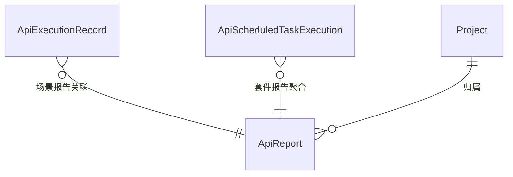

# 软件测试平台——接口测试报告概要设计

**文档版本**：V1.0  
**日期**：2026-10-01  
**状态**：起草中  

---

## 1. 引言

### 1.1 编写目的

对接口测试模块的报告子模块进行概要设计，明确场景 / 套件两级报告模型、分享与生命周期机制、数据实体关系与接口职责，为详细设计与开发提供依据。

### 1.2 范围与对应需求

对应需求分册 `docs/01-requirements/05-api-testing/07-api-srs-test-report.md`；模块总览见 `docs/02-high-level-design/05-api-testing/02-hld-api-overview.md`，执行与报告生成机制见 `docs/02-high-level-design/05-api-testing/09-hld-api-common.md` 与 `docs/02-high-level-design/05-api-testing/08-hld-api-scheduled-task.md`。

### 1.3 定义与缩写

| 术语 | 定义 |
| ---- | ---- |
| 场景报告 | 单个场景执行结果的报告（`scene`）（沿用需求分册定义） |
| 套件报告 | 定时任务聚合多个场景执行生成的报告（`suite`），按「场景 → 步骤」两级展示（沿用需求分册定义） |
| 执行历史 | 场景每次执行产生的记录，与报告关联（沿用需求分册定义） |
| 分享链接 | 有效期内免登录访问报告的令牌化地址（沿用需求分册定义） |

## 2. 模块划分

### 2.1 页面构成

    接口测试报告
    ├── 报告列表（筛选执行方式 / 时间范围，分页；仅定时任务来源）
    │     └── 行操作（查看 / 分享 / 删除，勾选批量删除）
    ├── 报告详情
    │     ├── 场景报告（步骤级明细，步骤可查看请求与响应）
    │     └── 套件报告（场景列表 → 场景步骤明细两级下钻）
    ├── 分享弹窗（现有分享记录展示与复制 / 重新生成）
    └── 执行记录入口（场景执行记录内 [报告] 弹窗，覆盖场景页 [运行] 产生的报告）

### 2.2 职责边界

* 报告只读，由执行产生，本子模块不承载执行本身；报告的删除与分享是本子模块仅有的变更操作。
* 报告列表只收录定时任务（含调度页立即执行）来源的报告；场景页 [运行] 产生的报告不经列表，在执行历史弹窗查看。
* 执行历史归测试场景子模块维护，报告被清理后执行历史仍保留元数据。

## 3. 核心机制设计

### 3.1 两级报告模型

* 报告按粒度分 `scene` 与 `suite` 两类；套件报告内嵌的场景明细复用场景报告的数据结构，前端按同一套渲染规则呈现，仅外层多一层「场景」聚合。
* 报告名称在执行时固化：场景报告为场景名 + 执行时间戳，套件报告为任务名 + 执行时间戳。
* 执行时的 Ryze 结果树随报告留存快照，用于结果回溯与转换问题定位；步骤明细的请求 / 响应内容取自该结果树并截断存储，防大响应撑爆存储。

### 3.2 关联关系

* 场景报告与场景执行历史一对一；套件报告对应一次任务触发的多条逐场景执行历史，共享同一报告关联，任务触发记录亦关联该套件报告。
* 删除套件报告不影响被圈选的场景与产生它的执行记录。
* 手动删除报告不影响执行历史查看详情；系统清理报告后执行历史详情显示「执行结果被清理」。

### 3.3 分享机制

* 具备报告查看 / 分享权限的成员即可生成分享链接，不设全局开关；生成时选择有效期（默认 7 天）。
* 链接在有效期内免登录访问，仅凭分享令牌校验报告范围，不建立用户活动上下文；过期即失效，不保留可访问的匿名报告。
* 已有未过期分享时，分享弹窗直接展示现有记录（链接、有效期、分享者）并提供复制；重新生成显式覆盖旧链接与分享者。
* 复制的分享内容为带描述文本（报告名称、链接、有效期、分享者）；套件报告分享后按「场景 → 步骤」两级展示。

### 3.4 生命周期与清理

* 报告与执行历史共享系统清理策略（默认保留 90 天，系统配置项），清理行为记录日志。
* 报告删除不可恢复，删除与清理的差异仅在于前者由用户显式触发、后者由系统批量执行。

## 4. 数据设计

实体与关系（字段、DDL 与索引留详细设计 `docs/04-detailed-design/05-api-testing/28-test-report-overview.md`）：

| 实体 | 职责 |
| ---- | ---- |
| ApiReport | 报告主体（粒度、名称、状态、结果汇总、结果明细、分享令牌与有效期、Ryze 快照） |
| ApiExecutionRecord | 场景执行历史，场景报告的关联方（测试场景子模块维护） |
| ApiScheduledTaskExecution | 任务触发记录，套件报告的聚合关联方（定时任务子模块维护） |
| Project | 报告按项目隔离归属 |

套件内嵌场景明细为报告结果数据集的组成部分，不独立成表；明细结构见详细设计。

## 5. 接口设计概要

资源与职责划分（路径、方法与报文留详细设计）：

| 资源 | 职责 | 归属 |
| ---- | ---- | ---- |
| 报告列表 | 分页查询、执行方式与时间范围筛选（仅定时任务来源） | 项目级（项目上下文） |
| 报告详情 | 场景 / 套件两级明细、步骤请求响应查看 | 项目级（项目上下文） |
| 报告删除 | 单个与批量删除 | 项目级（项目上下文） |
| 报告分享 | 生成、查询现有分享、重新生成、复制内容 | 项目级（项目上下文） |
| 分享访问 | 按分享令牌免登录读取报告 | 公开入口（令牌校验 + 过期失效） |

上下文标识通过请求头传递，不出现在 URL 中；分享访问为免登录例外，仅凭令牌定位报告。

## 6. 设计约束与原则

* 报告只读；除删除与分享外不提供任何编辑入口。
* 场景页 [运行] 的报告不进报告列表，列表口径为定时任务来源，前端不得绕过。
* 分享链接免登录但必须限期失效，过期即拒绝；重新生成覆盖旧链接。
* 报告内容含敏感信息（请求头 Token、响应体业务数据）时，分享遵循项目数据安全策略。
* 报告与执行历史按统一清理策略管理，清理后保留元数据、详情置为「执行结果被清理」。
* 所有异常经统一错误码抛出，错误码为 10 位（框架全局错误码除外）。

## 修改记录

| 版本 | 日期 | 说明 |
| ---- | ---- | ---- |
| V1.0 | 2026-10-01 | 初始版本 |
