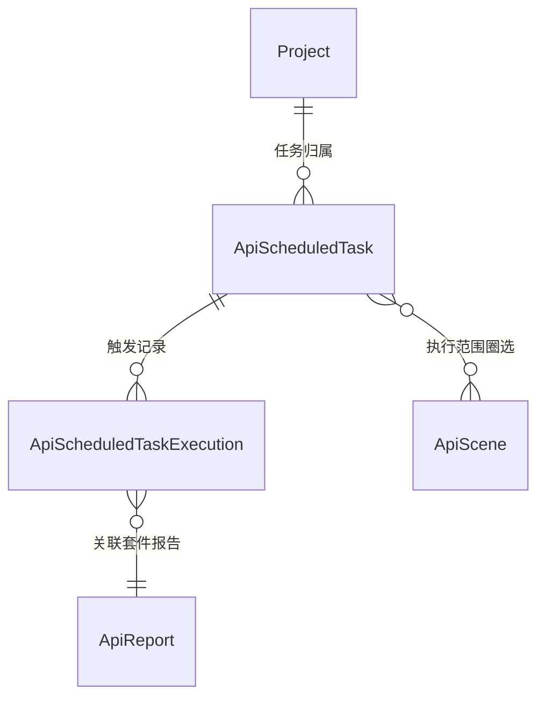

# 软件测试平台——定时任务概要设计

**文档版本**：V1.0  
**日期**：2026-10-01  
**状态**：起草中  

---

## 1. 引言

### 1.1 编写目的

对接口测试模块的定时任务子模块进行概要设计，明确任务类型与调度机制、防重入与引用保护、数据实体关系与接口职责，为详细设计与开发提供依据。

### 1.2 范围与对应需求

对应需求分册 `docs/01-requirements/05-api-testing/08-api-srs-scheduled-task.md`；模块总览见 `docs/02-high-level-design/05-api-testing/02-hld-api-overview.md`，执行引擎与并发队列见 `docs/02-high-level-design/05-api-testing/09-hld-api-common.md`，套件报告模型见 `docs/02-high-level-design/05-api-testing/07-hld-api-test-report.md`，接口同步的导入策略见 `docs/02-high-level-design/05-api-testing/04-hld-api-interface-management.md`。

### 1.3 定义与缩写

| 术语 | 定义 |
| ---- | ---- |
| 测试计划任务 | 按执行范围批量执行测试场景的任务类型（沿用需求分册定义） |
| 接口同步任务 | 周期拉取 Swagger URL 并增量更新接口定义的任务类型（沿用需求分册定义） |
| 执行记录 | 任务每次触发产生的记录（触发时间、方式、结果、失败原因）（沿用需求分册定义） |
| 套件报告 | 任务一次触发聚合多个场景执行生成的报告（沿用需求分册定义） |

## 2. 模块划分

### 2.1 页面构成

    定时任务
    ├── 任务列表（任务名称、类型、执行范围、调度表达式、启用状态、上次 / 下次执行）
    │     └── 行操作（编辑 / 启停 / 立即执行 / 删除 / 执行记录）
    ├── 任务表单
    │     ├── 测试计划任务（执行范围：全部 / 指定模块 / 指定场景，目标环境）
    │     └── 接口同步任务（Swagger JSON 地址）
    ├── 调度配置（Cron 表达式、常用预设、下次执行时间预览）
    └── 执行记录（触发时间、触发方式、结果、失败原因、报告或导入结果入口）

### 2.2 职责边界

* 任务归属项目，按项目隔离；统一承载场景执行与接口同步两类周期调度，不引入独立于本模块的其他调度入口。
* 任务不拥有执行能力：场景执行交由执行引擎统一排队，接口同步复用导入机制；本模块只负责调度触发、记录与状态管理。
* 测试计划任务的目标环境由任务绑定，执行时以任务绑定环境为唯一执行环境。

## 3. 核心机制设计

### 3.1 调度与防重入

* Cron 表达式保存时校验合法性，不通过不可保存；保存时预览下次执行时间；调度精度为分钟级，按服务器时区计算触发时间。
* 同一任务上一次执行未结束时，本次触发跳过——不重复触发、不累计补偿。
* 定时触发的执行进入执行引擎统一并发队列，与手动执行同队列排队；执行失败不自动重试，可经「立即执行」手动补跑。
* 停用后不再触发；删除任务不影响已产生的执行记录与报告。

### 3.2 测试计划任务执行

* 执行范围三种方式：全部（项目内已发布可执行场景）、指定模块（多选）、指定场景（多选）。
* 圈选基于实时数据（非快照），每次触发时校验场景为已发布状态且归属当前项目；草稿场景跳过执行并留痕提示。
* 一次触发将圈选的多个场景聚合为整体执行，完成后聚合生成一份套件报告（报告名 = 任务名 + 执行时间戳），逐场景落执行历史并共享该报告关联。
* 任务以创建者身份与权限执行；创建者退出项目后任务停用。

### 3.3 接口同步任务执行

* 按 Cron 周期拉取指定 Swagger JSON 地址，增量更新策略与手动导入一致（接口路径 + 方法匹配，手动修改过的接口不被覆盖）。
* 每次触发的导入结果（新增 / 更新 / 失败数）落执行记录，可查看失败明细。

### 3.4 引用保护与执行记录

* 被任务执行范围选中的场景或模块禁止直接删除，需先删除任务或移除选中；保护为服务端强约束。
* 每次触发（定时或手动）产生一条执行记录，含触发时间、触发方式、结果（成功 / 失败 / 超时）、失败原因与关联产物（套件报告或导入结果）。
* 任务列表展示最近一次执行状态；执行记录为追加式只读流水，删除任务后保留。

## 4. 数据设计

实体与关系（字段、DDL 与索引留详细设计 `docs/04-detailed-design/05-api-testing/25-scheduled-task-overview.md`）：

| 实体 | 职责 |
| ---- | ---- |
| ApiScheduledTask | 任务主体（名称、类型、Cron、启用状态、绑定对象、执行范围、创建者） |
| ApiScheduledTaskExecution | 任务触发记录（触发时间与方式、结果、失败原因、关联报告或导入结果） |
| ApiReport | 套件报告，任务触发的聚合产物，归属报告子模块 |
| ApiScene | 执行范围圈选对象，归属测试场景子模块 |

任务与场景的圈选关系（全部 / 模块 / 场景多选）由任务自身配置承载，不单独建立关联表；具体存储形态留详细设计确定。

## 5. 接口设计概要

资源与职责划分（路径、方法与报文留详细设计）：

| 资源 | 职责 | 归属 |
| ---- | ---- | ---- |
| 定时任务 | 列表、新建、编辑、删除、启停 | 项目级（项目上下文） |
| 任务执行 | 立即执行、Cron 校验与下次执行时间预览 | 项目级（项目上下文） |
| 任务执行记录 | 执行记录列表、最近执行状态、失败原因与产物入口 | 项目级（项目上下文） |

上下文标识通过请求头传递，不出现在 URL 中；删除任务须先通过执行范围引用校验（对被引用场景 / 模块的删除保护在场景侧校验）。

## 6. 设计约束与原则

* Cron 校验不通过不可保存；调度为分钟级、按服务器时区触发。
* 防重入为硬约束：上次未结束则本次跳过，不排队补触发。
* 定时与手动执行统一进并发队列，不另设独立执行通道。
* 执行失败不自动重试；通知渠道沿用平台既有消息能力，平台无消息中心时仅记录失败状态（预留）。
* 被任务引用的场景 / 模块禁止删除，保护为服务端强约束。
* 任务以创建者身份执行，创建者退出项目后任务停用。
* 所有异常经统一错误码抛出，错误码为 10 位（框架全局错误码除外）。

## 修改记录

| 版本 | 日期 | 说明 |
| ---- | ---- | ---- |
| V1.0 | 2026-10-01 | 初始版本 |
