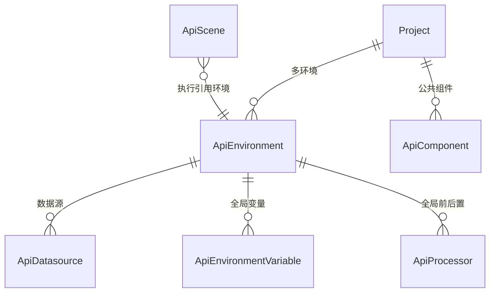

# 软件测试平台——项目设置概要设计

**文档版本**：V1.0  
**日期**：2026-10-01  
**状态**：起草中  

---

## 1. 引言

### 1.1 编写目的

对接口测试模块在项目设置下的两个配置模块——环境管理与公共组件——进行概要设计，明确设置框架接入方式、环境配置与组件引入机制、数据实体关系与接口职责，为详细设计与开发提供依据。

### 1.2 范围与对应需求

对应需求分册 `docs/01-requirements/05-api-testing/10-api-srs-project-settings.md`（项目设置通用规则、环境管理 US-API-005、公共组件 US-API-008）；模块总览见 `docs/02-high-level-design/05-api-testing/02-hld-api-overview.md`，处理器与验证器的执行语义见 `docs/02-high-level-design/05-api-testing/09-hld-api-common.md`。设置框架本身为平台级能力，各业务域共享，配置项按业务域归属过滤展示。

### 1.3 定义与缩写

| 术语 | 定义 |
| ---- | ---- |
| 项目设置 | 平台级统一项目配置入口，配置项按业务域归属标注与过滤（沿用需求分册定义） |
| 环境 | 项目级配置集合，默认配置、数据源、全局变量与全局前置/后置处理器的载体（沿用需求分册定义） |
| 数据源 | JDBC 连接配置，供前置/后置 jdbc 处理器使用（沿用需求分册定义） |
| 公共组件 | 项目级可复用的处理器 / 验证器 / 提取器资产（沿用需求分册定义） |
| 复制引入 | 组件引入方式，得到独立副本、与源资产无关联（沿用需求分册定义） |

## 2. 模块划分

### 2.1 模块构成

    项目设置（平台级框架 · 本域配置项）
    ├── 环境管理
    │     ├── 环境列表（新建 / 复制 / 编辑 / 删除 / 导入 / 导出）
    │     ├── 默认配置（环境级 http 默认配置）
    │     ├── 数据源（连接配置、连接测试）
    │     ├── 全局变量（单个 / 批量维护）
    │     └── 前置 / 后置（环境级全局处理器）
    └── 公共组件
          ├── 资产列表（四类：前置处理器 / 后置处理器 / 验证器 / 提取器）
          └── 引入选择器（快速调试与测试场景内的复制引入入口）

### 2.2 职责边界

* 设置框架由平台层统一建设：本域只定义归属 `common` 与 `api_test` 的配置项，其他业务域配置项在本域界面不可见、不可改。
* 环境管理是执行的配置前提：场景与调试执行通过目标环境获得域名、数据源、变量与全局处理器。
* 公共组件只负责资产的维护与选取，引入后的副本配置与生命周期归使用方（调试请求、场景 / 步骤）。

## 3. 核心机制设计

### 3.1 设置框架接入

* 配置项显式标注业务域归属（`common` 通用 / `api_test` 接口测试 / `func_test` 功能测试），界面按当前业务域过滤展示，跨域配置相互独立。
* 新业务域接入时在设置框架下扩展其归属配置项，不重复建设独立设置入口。
* 本域的环境管理与公共组件配置项归属 `api_test`，仅在接口测试业务域的设置入口下可见。

### 3.2 环境配置与继承

* 环境归属项目、项目内可见可用，支持配置多个环境；场景执行时选择目标环境，缺省使用项目默认环境。
* 环境配置项与 Ryze 对应一致（默认配置、数据源、全局变量、全局前后置处理器），执行时合并进 Ryze 标准格式作为请求步骤默认值；平台不提供 Ryze 之外的平行配置项。
* 请求步骤引用环境后 URL 只填接口路径，域名取自环境默认配置；合并优先级遵循「环境默认配置 < 场景级 < 步骤级」，同名配置子级覆盖父级。
* 环境级全局前置/后置对环境中所有请求生效，与请求自身处理器同名并存时均执行，顺序遵循处理器层级语义（见公共机制分册 3.2）。
* 数据源供 jdbc 处理器使用，支持连接测试；驱动覆盖常见数据库（MySQL、PostgreSQL、Oracle、SQLServer、Redis）。

### 3.3 环境导入导出与删除保护

* 导入支持「覆盖」开关：开启时重名环境覆盖，关闭时重名环境跳过（不新增）。
* 删除前校验引用：被场景引用的环境禁止删除（强制保护）；被定时任务绑定的环境同样受保护。
* 导出时敏感信息（数据源密码等）脱敏或需授权导出；数据源密码加密存储。

### 3.4 公共组件与复制引入

* 组件分四类（前置处理器、后置处理器、验证器、提取器），结构与公共能力对应一致；启用 / 停用状态只影响资产选择器可见性，不影响已配置场景的正常执行。
* 引入为**仅复制**：引入时以源组件为模板打开新建面板回填配置，保存后得到独立副本，源组件后续修改 / 删除不影响副本；停用的组件不可再引入，已引入副本不受影响。
* 组件共享范围为项目级（项目成员浏览与复制引入、项目维护者维护）；作用域的进一步扩展（空间级、全局级）留详细设计确定。

## 4. 数据设计

实体与关系（字段、DDL 与索引留详细设计 `docs/04-detailed-design/05-api-testing/17-environment-management-overview.md` 与 `docs/04-detailed-design/05-api-testing/06-api-testing-infra-common-component.md`）：

| 实体 | 职责 |
| ---- | ---- |
| ApiEnvironment | 环境主体（名称、默认配置、导入导出与引用保护） |
| ApiDatasource | 数据源（名称、引用名、驱动、连接 URL 与凭据、最大连接数） |
| ApiEnvironmentVariable | 环境级全局变量 |
| ApiProcessor | 环境级全局前置 / 后置处理器 |
| ApiComponent | 公共组件资产（类型、配置、排序、启用状态、维护人） |
| ApiScene | 环境的引用方，执行时选择目标环境（测试场景子模块维护） |

环境配置的具体存储形态（主表内嵌 JSONB 或分表）与公共组件的作用域字段留详细设计确定。

## 5. 接口设计概要

资源与职责划分（路径、方法与报文留详细设计）：

| 资源 | 职责 | 归属 |
| ---- | ---- | ---- |
| 环境 | 列表、新建、详情、编辑、复制、删除、导入、导出 | 项目级（项目上下文） |
| 数据源 | 配置维护与连接测试 | 项目级（项目上下文） |
| 环境变量 | 单个与批量的新增、编辑、删除 | 项目级（项目上下文） |
| 公共组件 | 资产列表、新建、编辑、复制、删除、启停 | 项目级（项目上下文） |
| 组件引入 | 按类型与作用域查询可引入资产、执行复制引入 | 项目级（项目上下文） |

上下文标识通过请求头传递，不出现在 URL 中；环境与组件的删除均须通过引用校验。

## 6. 设计约束与原则

* 配置项按业务域归属过滤，跨域配置互不干扰；设置框架不重复建设。
* 环境配置项与 Ryze 保持一致，平台不引入平行配置项；字段映射留详细设计确定。
* 被场景引用或被任务绑定的环境禁止删除，保护为服务端强约束。
* 引入为仅复制，副本与源资产无关联；停用组件不可引入、不影响既有副本。
* 数据源密码等凭据加密存储、导出脱敏；环境变量值明文存储与展示。
* 同名变量按执行期 > 场景参数 > 环境参数的优先级取值。
* 数据更新只写实际传入字段（C11）；所有异常经统一错误码抛出，错误码为 10 位（框架全局错误码除外）。
* 交互细节见 `docs/05-interaction-design/05-api-testing/11-environment-ui-overview.md` 与 `docs/05-interaction-design/05-api-testing/23-project-settings-ui-overview.md`。

## 修改记录

| 版本 | 日期 | 说明 |
| ---- | ---- | ---- |
| V1.0 | 2026-10-01 | 初始版本 |
