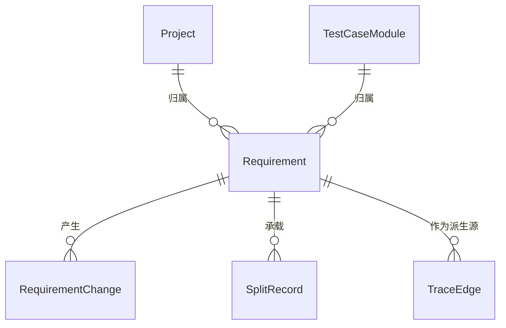

# 软件测试平台——需求管理概要设计

**文档版本**：V1.0  
**日期**：2026-10-01  
**状态**：起草中

---

## 1. 引言

### 1.1 编写目的

对需求管理模块进行概要设计，明确模块划分、核心机制、数据实体关系与接口职责，为详细设计与开发提供依据。

### 1.2 范围与对应需求

对应需求分册 `docs/01-requirements/06-requirement-management/02-srs-requirement-management.md`，覆盖需求模型与状态机、需求拆解、变更影响标记、追溯入口。需求拆解、影响分析与覆盖状态由 AI 能力模块供给，AI 底座机制见 `docs/02-high-level-design/07-ai-capability/02-hld-ai-capability.md`；跨模块公共数据与接口约定见 `docs/02-high-level-design/04-hld-data-interface.md`。

### 1.3 定义与缩写

| 术语 | 定义 |
| ---- | ---- |
| 需求条目 | 平台内业务需求的登记单位与追溯起点（沿用需求分册定义） |
| 拆解建议 | AI 按模块拆分产出的待确认需求集合 |
| 影响标记 | 沿追溯边对下游受影响项的标记 |

## 2. 模块划分

### 2.1 模块位置

    业务功能模块
    ├── 功能测试（测试用例 / 测试评审 / 测试计划）
    ├── 缺陷管理
    ├── 接口测试
    └── 需求管理
        ├── 需求列表
        ├── 需求详情与编辑
        ├── 需求导入与拆解
        ├── 追溯视图入口
        └── 变更与影响标记

### 2.2 职责简述

* **需求列表**：检索、筛选、覆盖状态展示（覆盖状态由 AI 覆盖分析供给）、确认与归档入口。
* **需求详情与编辑**：属性与内容维护、状态确认、变更记录查看。
* **需求导入与拆解**：大需求文档导入、AI 按模块拆分、建议采纳落库。
* **追溯视图入口**：向 AI 能力模块委托下游链路与矩阵查询，本模块只提供入口与上下文。
* **变更与影响标记**：触发影响分析并维护「变更 → 标记 → 重新确认 → 刷新」闭环。

### 2.3 与相邻模块的关系

* **项目与模块树**：需求归属项目，拆解产出的模块归属对接项目模块树。
* **AI 能力模块**：拆解、影响分析、覆盖状态均经 AI 底座的任务引擎与矩阵服务供给，本模块不自建 AI 通道。
* **AI 生成链**：已确认需求是生成链的唯一输入，生成产物经确认后回写模块与用例并建立派生追溯边。

## 3. 核心机制设计

### 3.1 需求模型与状态机

单层需求条目，不设下级拆分单元；条目归属模块，是追溯的最小粒度。状态机：

    草稿 ──确认──> 已确认 <──重新确认── 已变更
      ↑               │                    ↑
      │               └──修改标题/描述/模块──┘
      └──────────── 取消归档 ────────────┐
                                         ↓
                     已归档（只读，二次确认进入）

编号在条目落库时按项目内序号分配，项目内唯一；状态流转不打断既有追溯边，归档条目的历史链路保留可查。

### 3.2 需求拆解流水线

文档导入与条目内「AI 拆分」两个入口共用一条流水线：

    提交输入 → AI 后台解析任务 → 拆分建议（待确认态）
        → 人工采纳（逐条 / 批量 / 修改后）→ 编号分配 + 落库 + 来源关联
        → 驳回（保留建议记录，不落库）

拆解复用 AI 底座的任务生命周期、待确认与审计机制；导入场景同时将原始文件挂为来源附件，建议可回溯原文位置。

### 3.3 变更影响标记

已确认需求的标题、描述或模块归属被修改时触发：需求状态转入「已变更」→ 请求 AI 影响分析 → 沿追溯边标记下游受影响项（模块、脑图、用例、评审、计划）→ 需求重新确认后重新执行影响分析刷新标记。影响标记只改变追溯边状态，不修改下游内容本身；标记期间不阻断下游编辑。

### 3.4 追溯入口的职责边界

本模块只提供入口与上下文（当前项目、当前需求）；矩阵视图、链路视图、覆盖分析与追溯边的人工修正全部由 AI 能力模块的矩阵服务承载，两侧通过接口概要（见第 5 节）约定的资源交互。

## 4. 数据设计

实体与关系（实体级，字段、DDL 与索引留详细设计）：

| 实体 | 职责 |
| ---- | ---- |
| Requirement | 需求条目，状态机载体与追溯起点 |
| RequirementChange | 需求变更记录（操作人、类型、前后摘要的时序记录） |
| SplitRecord | 拆解记录（来源文档或原条目、拆分建议与采纳结果） |
| TraceEdge | 追溯边，由 AI 能力模块拥有并维护，此处仅示意需求条目作为派生边的源 |

## 5. 接口设计概要

资源与职责划分（路径、方法与报文留详细设计）：

| 资源 | 职责 | 归属 |
| ---- | ---- | ---- |
| 需求条目 | 列表、详情、属性与内容维护、确认、归档与取消归档 | 业务端 |
| 导入与拆解任务 | 提交导入 / 拆分、查询进度、采纳与驳回拆分建议 | 业务端 |
| 影响分析 | 触发影响分析、查询受影响项与处置结果 | 业务端 |
| 追溯视图 | 查询下游链路与覆盖状态（委托 AI 能力模块矩阵服务） | 业务端 |

上下文标识通过请求头传递，不出现在 URL 中；全部接口遵循既有认证与工作空间 / 项目上下文校验。

## 6. 设计约束与原则

* 不提供需求删除，仅支持归档；编号项目内唯一。
* 拆解与影响分析必须走 AI 底座的任务引擎，禁止在本模块内重复实现 AI 调用与任务通道。
* 追溯边的唯一事实源在 AI 能力模块，本模块不持久化链路数据。
* 拆解建议一律为待确认态，采纳前不落库；采纳后人工修改不被 AI 自动覆盖。
* 需求数据经项目归属到工作空间，遵循既有数据隔离与数据库通用约定（`docs/00-spec/20-contracts/02-database.md`）。
