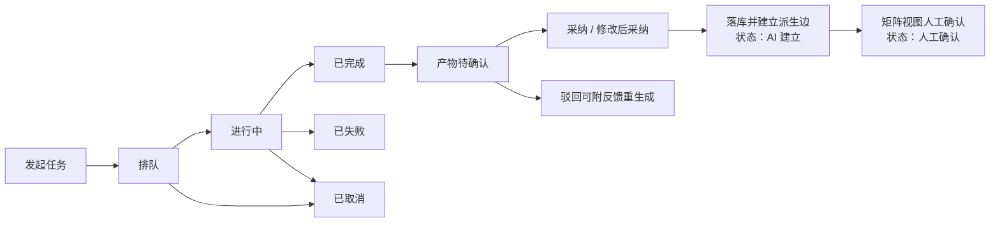
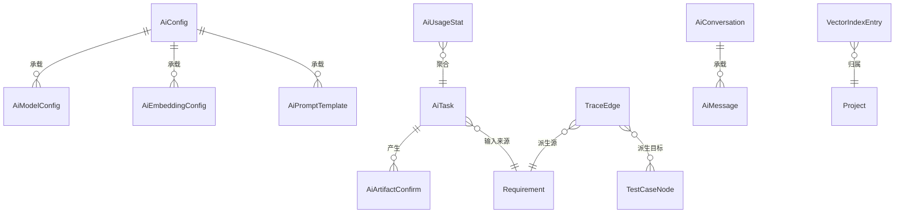

# 软件测试平台——AI 能力概要设计

**文档版本**：V1.0  
**日期**：2026-10-01  
**状态**：起草中

---

## 1. 引言

### 1.1 编写目的

对 AI 能力模块进行概要设计，阐明 AI 底座与四个能力域的模块划分、核心机制、数据实体关系、接口职责、部署依赖与安全设计，为详细设计与开发提供依据。

### 1.2 范围与对应需求

对应需求模块 `docs/01-requirements/07-ai-capability/01-readme.md`（总册 `02-srs-ai-capability.md` 及生成链、智能助手、缺陷分析、辅助功能四个分册），覆盖 AI 配置与使用分析、知识与检索、追溯矩阵、任务与确认通用规则。测试评审 / 测试计划的快照机制沿用既有概要设计（`docs/02-high-level-design/03-function-testing/02-hld-function-testing.md` 第 3.3 节），向量检索遵循既有数据库约定（`docs/00-spec/20-contracts/02-database.md`）。

### 1.3 定义与缩写

| 术语 | 定义 |
| ---- | ---- |
| AI 底座 | 面向全部能力域的公共能力层（配置、任务、检索、解析、矩阵） |
| 能力域 | 构建在底座之上的四类业务能力：生成链、智能助手、缺陷分析、辅助功能 |
| 场景提示词 | 按业务场景编排的模型指令模板，可自定义覆盖默认值 |
| 派生边 / 快照引用边 | 追溯矩阵的两类边，定义见需求总册 |

## 2. 系统总体设计

### 2.1 AI 能力在总体架构中的位置

AI 能力位于服务层内，向上承接管理端配置与业务端能力入口，向下依赖数据层与外部模型服务：

    ┌──────────────────────────────────────────┐
    │                  前端（SPA）              │
    │  管理端（AI 配置与用量）  业务端（四能力域入口）│
    └────────────────┬─────────────────────────┘
                     │ HTTP / WS
    ┌────────────────┴─────────────────────────┐
    │                 服务层                     │
    │  既有业务服务（用例 / 评审 / 计划 / 缺陷…）   │
    │  ┌────────────────────────────────────┐  │
    │  │ AI 能力模块                         │  │
    │  │  AI 底座 ── 配置中心 · 任务引擎       │  │
    │  │         ── RAG 检索 · 多模态解析      │  │
    │  │         ── 追溯矩阵 · 覆盖分析        │  │
    │  │  能力域 ── 生成链 · 助手 · 缺陷分析 · 辅助│  │
    │  └────────────────────────────────────┘  │
    └───────┬───────────────────────┬───────────┘
            │                       │
    ┌───────┴────────┐    ┌─────────┴──────────┐
    │ 数据层          │    │ 外部模型服务（可配置） │
    │ 关系库 · 向量能力 │    │ 生成模型 · 向量 API   │
    │ （pgvector 既定）│    │ 云端 API / 私有化端点 │
    └────────────────┘    └────────────────────┘

### 2.2 供给与降级原则

* **供给不锁定**：生成模型与向量 API 均为可配置端点，可为云端 API 或私有化部署，可多条配置并存。
* **全局可控**：AI 总开关关闭后全平台 AI 入口不可用，进行中任务终止，既有数据与追溯关系保留可查。
* **故障隔离**：模型 / 向量服务不可用只影响 AI 能力（任务失败可重试、入口降级提示），平台核心测试功能不受影响。

## 3. 模块划分

### 3.1 模块总览

    AI 能力模块
    ├── AI 底座
    │   ├── AI 配置中心（总开关 · 多模型 · 向量 API · 场景提示词 · 用量统计）
    │   ├── AI 任务引擎（异步执行 · 进度 · 取消重试 · 审计）
    │   ├── RAG 与向量化检索（索引维护 · 限权检索 · 来源引用）
    │   ├── 多模态解析（图片 / 文档附件 → 文本中间结果）
    │   └── 追溯矩阵与覆盖分析（追溯边 · 矩阵 / 链路视图 · 覆盖分析 · 影响分析）
    └── 能力域
        ├── AI+需求 生成链
        ├── 智能助手
        ├── 缺陷分析
        └── 辅助功能（用例补全 / 级别推荐 / 执行顺序推荐）

### 3.2 职责简述

* **AI 配置中心**：系统管理端的 AI 治理入口；管理总开关、多模型配置、向量 API 配置、业务场景提示词，并提供使用情况分析。
* **AI 任务引擎**：全部 AI 操作的统一执行通道，负责任务生命周期、进度、取消重试与全程审计；能力域不自建任务通道。
* **RAG 与向量化检索**：业务数据索引维护与限权检索，为生成与问答提供带来源引用的上下文。
* **多模态解析**：将图片与文档附件解析为文本中间结果，供导入与生成流水线消费。
* **追溯矩阵与覆盖分析**：维护派生边与版本化快照引用边，提供矩阵 / 链路视图、AI 覆盖分析与影响分析，是追溯关系的唯一事实源。
* **四个能力域**：面向业务场景组合底座能力，产出一律为待确认态，经人工确认落库。

## 4. 核心机制设计

### 4.1 AI 配置中心

配置分五类，全部为系统级、仅系统管理端可操作并记审计：

| 配置 | 生效规则 |
| ---- | ---- |
| 总开关 | 关闭时全平台 AI 入口不可用，进行中任务终止置失败 |
| 多模型配置 | 多条并存，指定默认模型；各能力域可覆盖默认；逐条连通性测试与启用 / 停用 |
| 向量 API 配置 | 独立于生成模型，可来自不同供应商；未配置则 RAG 与相似检测不可用 |
| 场景提示词 | 按场景自定义覆盖默认值，仅影响该场景的后续调用，不改变已生成产物 |
| 用量统计 | 由任务执行数据聚合（调用量、成败与时延、token 消耗），供趋势与下钻分析 |

### 4.2 AI 任务生命周期与生成物确认流

通用规则：任务提交即返回、进度可见、完成通知发起人；人工编辑过的产物仅在显式重新生成并二次确认后可被覆盖；每次发起、采纳、驳回均记审计。四个能力域共用该生命周期与确认口径。

### 4.3 追溯矩阵与覆盖分析

* **双边模型**：派生边（需求 → 模块 → 脑图文档 → 用例节点 → 测试用例）由 AI 生成建立；快照引用边（测试用例 ⇢ 评审 / 计划）为带版本的部分快照，评审意见与计划项挂到用例级引用边。矩阵视图与链路视图均由追溯边派生展示。
* **覆盖分析**：后台任务，按需发起或在上游变更、需求重新确认时触发；对需求与相关用例做语义比对，产出已覆盖 / 部分覆盖 / 未覆盖及依据；结论可人工复核修正，人工判定优先于 AI，AI 分析不得覆盖人工判定。
* **影响分析**：需求变更后沿派生边与引用边计算受影响项，供逐项处置；处置只改变追溯边状态，不修改下游内容。

### 4.4 RAG 与向量化检索

索引对象为平台内文本类业务数据；索引随数据变更同步更新，归档与逻辑删除数据不再被检索；检索先按业务归属与权限过滤再执行相似检索，无权限数据不得进入任何 AI 上下文；生成与问答产出必须携带可跳转的来源引用，来源缺失视为不合格产出。

### 4.5 多模态解析

输入为用户上传的图片与文档附件（需求导入的 PRD、截图等），输出为带原文定位的文本中间结果，进入需求拆解等流水线后同样处于待确认态，供人工对照原文核验。

### 4.6 降级与容错

模型或向量 API 调用失败（不可用、超时、限流）时任务置失败并给出原因，可重试；依赖检索的能力在检索不可用时提示不可用，不降级为无引用生成；总开关关闭时进行中任务终止，已确认产物不受影响。

## 5. 数据设计

实体与关系（实体级，字段、DDL 与索引留详细设计）：

| 实体 | 职责 |
| ---- | ---- |
| AiConfig / AiModelConfig / AiEmbeddingConfig / AiPromptTemplate | AI 配置中心四类配置的实体承载 |
| AiTask | AI 任务（类型、输入来源、状态、进度、产物清单） |
| AiArtifactConfirm | 生成物确认记录（采纳方式、操作人） |
| TraceEdge | 追溯边（类型、目标版本、三态与待重新确认状态），矩阵的唯一事实源 |
| AiUsageStat | 按时间 / 模型 / 能力域聚合的用量统计 |
| AiConversation / AiMessage | 智能助手会话与消息 |
| VectorIndexEntry | 向量索引条目（来源业务对象、所属工作空间、索引状态） |

## 6. 接口设计概要

资源与职责划分（路径、方法与报文留详细设计）：

| 资源 | 职责 | 归属 |
| ---- | ---- | ---- |
| AI 配置 | 总开关、模型配置集、向量 API、场景提示词的维护与连通性测试 | 管理端 |
| AI 用量统计 | 趋势、分布、异常提示与任务下钻查询 | 管理端 |
| AI 任务 | 提交、进度查询、取消、重试、产物确认与驳回 | 业务端 |
| 追溯矩阵 | 矩阵视图、链路视图、覆盖分析结论与人工修正、影响分析处置 | 业务端 |
| 助手会话 | 会话管理、消息发送、变更预览、执行回执 | 业务端 |
| 能力域建议 | 补全、级别、顺序、分类分诊、重复检测等建议的产出与采纳 | 业务端 |

上下文标识通过请求头传递，不出现在 URL 中；全部接口遵循既有认证与工作空间 / 项目上下文校验，AI 能力不放宽任何既有权限。

## 7. 部署视图增补

* AI 能力引入外部依赖：生成模型端点与向量 API 端点，由系统管理端配置，可为云端 API 或私有化部署；平台自身不绑定具体供应商。
* 向量存储依托数据库既有向量能力（`docs/00-spec/20-contracts/02-database.md`），不引入独立向量中间件的强制要求。
* AI 任务的异步执行依托平台既有服务端能力，具体选型留架构与详细设计；前后端分离与合并打包两种部署方案（`docs/02-high-level-design/05-hld-deployment-security.md`）均适用，AI 模块不改变既有部署形态。

## 8. 安全设计

* **密钥安全**：模型与向量 API 密钥保存后不可回显，仅支持替换，不落日志。
* **出站最小化**：使用云端模型时，出站内容仅限任务必需上下文，是否启用云端接入由系统管理员决定。
* **上下文限权**：进入检索与生成的上下文严格限于当前用户有权限的工作空间与项目，跨工作空间数据不得进入任何 AI 任务。
* **管理边界**：AI 配置与用量分析仅系统管理端可见可用；全部配置操作与 AI 采纳记录记审计。
* **产出可信**：来源引用缺失的产出不得进入待确认态；生成物未经确认不落库。

## 9. 设计约束与原则

* **待确认态为全局约束**：AI 产出一律不直接生效，人工确认后才落库；人工判定优先于 AI。
* **单一事实源**：任务、确认与审计机制全部在底座实现，能力域复用不重复实现；追溯边由矩阵服务唯一维护。
* **快照语义沿用**：AI 圈选建议确认后走既有评审 / 计划创建流程，不改变快照机制（`docs/02-high-level-design/03-function-testing/02-hld-function-testing.md` 第 3.3 节）。
* **供给不锁定**：不绑定具体模型供应商，配置决定供给。
* **上下文不出 URL**：工作空间 / 项目上下文经请求头传递（C4）。
* **数据约定**：实体须满足既有数据库通用约定（逻辑删除、无物理外键、索引规范，`docs/00-spec/20-contracts/02-database.md`），字段级设计留详细设计。

## 修改记录

| 版本 | 日期 | 说明 |
| ---- | ---- | ---- |
| V1.0 | 2026-10-01 | 初始版本 |
| V1.0 | 2026-10-02 | 快照机制引用改指功能测试概要设计分册 |
