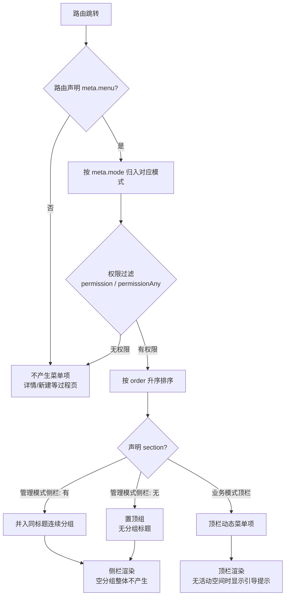

# 软件测试平台——前端导航与菜单注册架构设计

**文档版本**：V1.0
**日期**：2026-09-23
**状态**：起草中

***

## 1. 设计目标

定义前端导航模式（管理模式 / 工作空间模式 / 项目模式）、壳层结构与菜单注册机制，满足以下要求：

* **单一真相源**：菜单、模式与路由同源声明，杜绝"路由表 + 独立菜单配置 + 页面命令式切换"多处维护导致的状态漂移与不一致。
* **权限驱动**：菜单项与路由访问均按权限码自动显隐，无权限的入口不渲染、不可达。
* **可扩展**：新增页面只需在路由注册处补一条声明，无需改动导航层代码。
* **两种壳层**：管理模式（顶栏 + 左侧分组侧栏）与业务模式（顶栏 + 动态菜单 + 内容区）共用同一套注册与派生机制。

***

## 2. 导航模式与壳层结构

### 2.1 三种导航模式

| 模式 | 触发条件（由路由派生） | 壳层 | 菜单呈现 |
| ---- | ---- | ---- | ---- |
| 管理模式 `admin` | 当前路由位于 `/admin/*` 且声明 `mode: 'admin'` | AdminLayout：顶栏 + 左侧分组侧栏 + 内容区 | 侧栏按分组渲染（见 4.2） |
| 工作空间模式 `workspace` | 当前路由声明 `mode: 'workspace'` | BusinessLayout：顶栏 + 动态菜单 + 内容区 | 顶栏动态菜单（空间信息/成员管理/项目列表） |
| 项目模式 `project` | 当前路由声明 `mode: 'project'` | BusinessLayout：顶栏 + 动态菜单 + 内容区 | 顶栏动态菜单（功能测试/缺陷管理/接口测试等） |
| 无模式 `none` | 未声明 `mode`（如登录页、我的空间列表） | — 或 BusinessLayout | 不产生动态菜单 |

模式由**当前路由的声明派生**，页面不做命令式模式切换；命令式切换会造成"路由已变而模式未变"的双真相源漂移（历史问题，已修复）。

### 2.2 管理模式壳层

    ┌────────────────────────────────────────────────────────────┐
    │ [⚡RoboTest] [系统管理]        [我的空间] [系统管理] [🔔] [头像▾] │ ← 顶栏 48px
    ├───────────┬────────────────────────────────────────────────┤
    │ 概览       │                                                │
    │  数据概览  │            内容区（悬浮白卡）                    │
    │ 组织与权限 │         （根据路由切换内容）                      │
    │  用户管理  │                                                │
    │  角色管理  │                                                │
    │  空间管理  │                                                │
    │ 平台配置   │                                                │
    │  AI 配置   │                                                │
    └───────────┴────────────────────────────────────────────────┘
      左侧侧栏
      （悬浮白卡，180px，无 Logo）

* 顶栏左侧：平台 Logo + 「系统管理」模式标签；平台标识位于顶栏而非侧栏。
* 左侧侧栏：固定宽 180px，浅色悬浮卡片形态，含分组标题与垂直菜单，不承载 Logo。
* 内容区：整幅悬浮白卡（与侧栏卡同描边、同圆角、同浮影），壳层形态细节见 `docs/05-interaction-design/03-visual-design.md` §6.1。

***

## 3. 菜单注册表（路由即菜单）

### 3.1 注册模型

路由注册时通过 `meta` 同时声明访问控制与菜单元信息：

| 字段 | 层级 | 含义 |
| ---- | ---- | ---- |
| `meta.public` | 路由 | 公开路由（登录/初始化/邀请等），免 Token |
| `meta.requiresAuth` | 路由 | 需要登录 |
| `meta.requiresAdmin` | 路由 | 需要系统角色或系统权限；权限列表未加载时先等待加载再判定（避免刷新被误重定向） |
| `meta.title` | 路由 | 页面标题（浏览器标签页），与菜单无关 |
| `meta.mode` | 路由 | 导航模式：`admin` / `workspace` / `project` / 缺省 |
| `meta.menu` | 路由 | **菜单元信息，缺省即不进任何菜单**（详情页、新建/编辑等过程页天然不产生菜单项） |

`meta.menu` 声明字段：

| 字段 | 必填 | 含义 |
| ---- | ---- | ---- |
| `label` | ✅ | 菜单展示名 |
| `icon` | ✅ | Element Plus 图标名 |
| `order` | ✅ | 排序权重（小者靠前），不依赖路由注册顺序 |
| `section` | ❌ | 侧栏分组标题；缺省 = 置顶不分组（仅管理模式侧栏使用） |
| `permission` | ❌ | 持该权限码才展示 |
| `permissionAny` | ❌ | 持任一权限码即展示（如接口测试对任一接口模块 view 权限开放） |

> 上下文标识（workspaceId 等）不进入 URL，动态路由段（如 `:workspaceId`）在渲染菜单时以活跃上下文填充（C4）。

### 3.2 注册示例（形态示意）

    meta: {
      title: '用户管理',
      mode: 'admin',
      menu: { label: '用户管理', icon: 'User', order: 10, section: '组织与权限', permission: 'user:view' }
    }

***

## 4. 派生与过滤机制

### 4.1 派生流程



### 4.2 管理端侧栏分组规则

| 规则 | 说明 |
| ---- | ---- |
| 分组来源 | 按路由声明的 `section` 值**连续**归组；当前实现产生三组：置顶组（数据概览）、组织与权限、平台配置 |
| 组内排序 | 组内按 `order` 升序：用户管理(10) → 角色管理(20) → 空间管理(30)，平台配置：AI 配置(40) |
| 空组消除 | 分组内菜单项经权限过滤后为空的，该分组整体不渲染 |
| 选中态 | 以当前路由路径匹配菜单项，命中项高亮 |

### 4.3 权限过滤与访问控制

* 菜单显隐：渲染时用当前用户合并权限码列表过滤 `permission` / `permissionAny`（权限来自 `POST /api/auth/permissions`）。
* 路由可达：`requiresAdmin` 路由在守卫中校验系统角色或任一系统权限；权限列表尚未加载时先等待加载完成再判定，避免管理员刷新管理页被误重定向。
* 无系统权限用户不渲染管理端入口；具体菜单项再按查看权限细分显隐。

***

## 5. 技术选型与取舍

| 方案 | 说明 | 取舍 |
| ---- | ---- | ---- |
| 独立菜单配置文件 | 菜单在导航组件侧单独维护一份树 | ❌ 与路由表双份维护：新增页面需改两处，顺序/权限口径易漂移；路由守卫与菜单显隐各判各的 |
| 页面命令式上报模式 | 页面挂载时调用导航 store 设置当前模式 | ❌ 出现"路由已跳转、模式未更新"的中间态，登录页等场景需打补丁纠正残留模式，双真相源导致状态漂移（历史问题） |
| **路由元数据声明（采用）** | 路由注册时一并声明 `mode` 与 `menu`，导航层从当前路由派生 | ✅ 单一真相源：菜单、模式、访问控制同源；新增页面一处声明即同时生效于地址栏、标签标题与菜单 |

结论：采用**路由元数据声明 + 导航层派生**。该结论与 `docs/06-spec/03-frontend.md` 的前端分层约束（路由 → 页面 → 组件）一致；字段级定义见 `web/src/router/index.ts` 类型声明，派生实现见 `web/src/stores/nav.ts`，壳层渲染见 `web/src/layouts/AdminLayout.vue` 与 `web/src/layouts/BusinessLayout.vue`。

***

## 6. 关键流程

```mermaid
flowchart TD
    A[登录成功] --> B{hasWorkspace?}
    B -- 是 --> C[跳转 /workspaces 我的空间]
    B -- 否 --> D{持任意系统权限?}
    D -- 是 --> E[跳转 /admin/dashboard 数据概览<br/>渲染 AdminLayout 左侧分组侧栏]
    D -- 否 --> C
    E --> F[点击顶栏 系统管理 图标<br/>需 hasSystemPermission] --> E
    C --> G[选择/持有活跃空间] --> H[进入 /workspace/*<br/>顶栏动态菜单切换为空间组]
    H --> I[进入项目] --> J[/workspace/projects/*<br/>顶栏动态菜单切换为项目组]
```

* 进入管理模式：点击顶栏「系统管理」图标（需 `hasSystemPermission`）→ 路由跳转 `/admin/dashboard` → 模式与侧栏随路由派生。
* 退出管理模式：顶栏「我的空间」回业务侧；管理模式与业务模式互不残留（模式随路由实时派生）。

***

## 7. 环境配置与质量保障

* 菜单/模式不依赖任何运行时配置项；权限码清单由后端权限点表维护，前端仅消费合并后的权限码列表。
* 维护约定：新增带菜单的页面只在路由注册处补 `meta.menu` 声明；**禁止**在页面内命令式切换导航模式、禁止另建菜单配置。
* 质量保障：菜单/模式相关逻辑集中在路由与导航 store，可由单元测试覆盖派生与权限过滤（见 `web/src/stores/` 测试）；提交前运行 `bash scripts/validate.sh --frontend`。

***

## 8. 参考资料

* 概要设计：`docs/02-high-level-design/02-high-level-design.md` §4.14
* 全局导航交互：`docs/05-interaction-design/02-global-navigation.md`
* 管理端布局交互：`docs/05-interaction-design/system-management/02-system-management-ui-overview.md` §2
* 视觉壳层形态：`docs/05-interaction-design/03-visual-design.md` §6.1
* 前端工程规范：`docs/06-spec/03-frontend.md`
