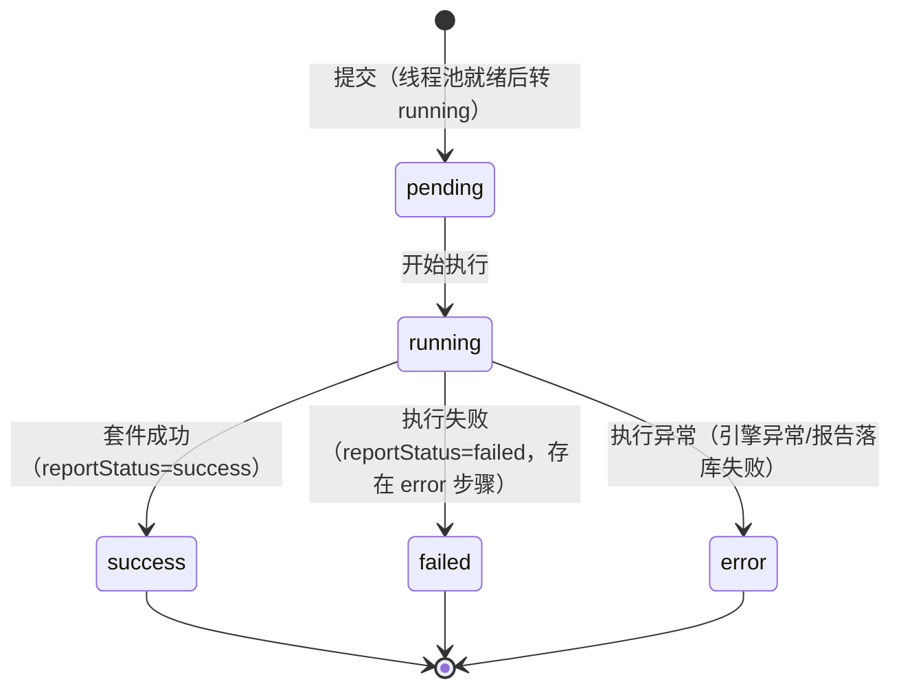
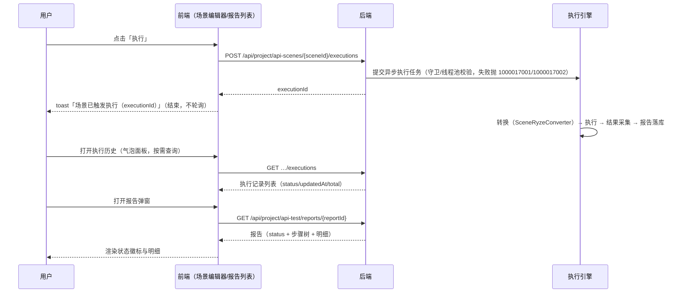

# 执行引擎详细设计说明书

**文档版本**：V1.0  
**日期**：2026-09-23  
**状态**：起草中

---

## 1. 执行引擎概述

执行引擎负责将接口场景（scene）编译为可执行的套件（suite）并交给底层执行框架运行，同时提供单步调试、草稿直跑、历史查询与报告落库能力。前后端边界如下：

- **前端**：仅负责触发执行与按需查询——触发后由 toast 提示 `场景已触发执行（executionId）`（快速调试为 `执行已启动`），**不轮询执行状态**；执行状态与结果通过「场景执行历史」（执行记录列表按 `updatedAt` 倒序、`total` 总数，`pending/running` 显示 `处理中` 徽标）与「测试报告」弹窗（`GET …/reports/{reportId}`）按需查看。
- **后端**：异步执行（提交线程立即返回 executionId），执行状态通过执行记录与报告持久化。

执行引擎核心接口（均需上下文请求头，权限见各接口；错误码见分册《接口测试基础平台详细设计说明书》§2.2）：

| 接口 | 方法 | 说明 | 权限 |
| --- | --- | --- | --- |
| `/api/project/api-scenes/{sceneId}/executions` | POST | 触发场景执行，请求体 `environmentId`（必填）；返回 `data` 为 executionId（UUID） | `api-scene:execute` |
| `/api/project/api-scenes/{sceneId}/executions` | GET | 场景执行历史（分页，状态为 `pending/running/success/failed/error` 的执行记录） | `api-scene:view` |
| `/api/project/api-scenes/{sceneId}/steps/{stepId}/debug` | POST | 单步调试：跳过前置步骤，仅执行当前步骤；请求体含 `environmentId`（必填）；返回 `{ validatorResults, extractedVariables }`（当前恒为空） | `api-scene:execute` |
| `/api/project/api-scenes/draft/execute` | POST | 草稿直跑：前端将编辑器中未保存的场景 JSON 原样提交，保存与执行原子化 | `api-scene:execute` |
| `/api/project/api-test/reports/{reportId}` | GET | 查看报告详情（进度与结果的权威来源） | `api-scene:view` |
| `/api/project/api-test/reports` | GET | 报告列表分页（仅 `source=schedule` 的 suite 级报告，即定时任务报告；场景执行报告经场景内报告接口查询） | `api-scene:view` |

**说明**：

- 执行状态**无独立 HTTP 查询接口**，也**没有取消执行的 HTTP 接口**（`ExecutionCancelRegistry` 仅由测试计划任务在取消计划时内部调用，场景执行侧无取消入口）。
- 前端调用 `createSceneExecution` 后即结束，`createDraftExecution` 同理（toast `执行已启动`）；历史与报告均为按需查询（执行历史气泡面板打开时查询、报告弹窗打开时查询）。
- 执行记录状态取值：`pending` / `running` / `success` / `failed` / `error`（`cancelled` 仅存在于取消注册表语义中，当前链路无法触达；无 `timeout` 状态）。

---

## 2. 执行模式与资源控制

### 2.1 场景步骤转换（`SceneRyzeConverter`）

- 场景步骤 `stepType`：`http` / `extractor` / `assertion`，转换为 ryze 步骤 `http` / `processor`。
- **步骤级提取器与断言合并为一个 ryze `processor` 步骤**：同一场景步骤内「提取器（`extractors`）+ 断言（`assertions`）」按顺序合并为一个 ryze `processor` 步骤的步骤级处理器链，提取器输出进入 `sample.variables` 上下文供断言引用；不单独产出 `extractor` / `assertion` 类型的 ryze 步骤。
- `variables`（全局变量）、`preProcessors` / `postProcessors`（步骤外的前置/后置处理器）分别映射为 ryze 的变量与处理器配置。
- **执行模式与并行度在「场景设置」中配置**（`executionMode` / `maxRetries` / `timeoutSeconds` 等），转换时写入 ryze suite 配置；执行中任务列表「并行执行」复选框不参与本次转换参数。
- 禁用步骤以 `skip` 标记参与转换，由执行框架产出 `skipped` 结果。
- 单步调试同样经该转换器，但**仅包含被调试步骤**（前置步骤不参与）。

### 2.2 资源控制（`ApiTestExecutorConfig`）

| 配置项（`ApiTestProperties`） | 默认值（代码） | 说明 |
| --- | --- | --- |
| `pool.core-size` / `pool.max-size` / `pool.queue-capacity` | 2 / 4 / 100 | 执行线程池；队列满时拒绝并抛 `1000017001`（场景执行与草稿直跑均可能触发） |
| `pool.keep-alive-seconds` | 60 | 空闲线程回收 |
| `guard.timeout-ms` | 120000 | 提交前置守卫超时；超时抛 `1000017002` |
| `quick-debug.*` | 0 / 10000 / 10000 | 快速调试资源限制；违反抛 `1000017002` |

- `1000017001`：执行队列已满（场景执行与草稿直跑共用同一资源池）。
- `1000017002`：快速调试资源限制 / 提交前置守卫超时。
- `1000017003`：仅 HTTP 步骤支持单步调试（对非 HTTP 步骤执行「单步调试」时抛出）。

### 2.3 执行状态

- 前端**不轮询**执行状态；触发执行的接口仅回传 executionId，历史与报告按需查询（见 §1、§3）。
- `stopOnFailure` 固定为 `true`：任一步骤失败（非 `skipped`）即中止后续步骤，但已产出的步骤结果全部保留。
- **请求级响应超时**：单个 HTTP 请求超时后该步骤判为失败并计入「请求超时」指标（快速判错映射 `1000017003`），不抛独立错误码（无场景级响应超时错误码）。

### 2.4 结果采集（`RyzeResultAdapter` / `RyzeResultSnapshotConverter`）

- 汇总：steps 数组按步骤序累加，分别统计 `passed / failed / error / skipped / disabled` 计数；`hasError = error > 0 || disabled > 0`；`hasFailure = failed > 0 || hasError`。
- 耗时：各步骤 `durationMs` 求和。
- 提取变量：合并所有步骤的 `variables` 输出。
- 断言明细：按步骤顺序平铺。
- 失败定位：首个 `failed/error` 步骤进入 `failedStep`。
- 步骤明细：由 `SnapshotVisitor` 遍历快照树产出（嵌套步骤树；响应体按 `max-body-bytes` 截断，超限时置 `truncated=true` 并移除响应体字节）。

---

## 3. 执行状态与结果查看

> 执行状态与结果**通过报告按需查看**，前端不主动轮询。

### 3.1 状态机与渲染口径

**执行记录状态机**（`SceneExecutionLauncher` 维护，随执行推进持久化）：



**报告状态**（落库于报告实体，前端据以渲染徽标）：

| 报告状态 | 判定 | 前端渲染（`useReportDisplay` / `useReportResultView`） |
| --- | --- | --- |
| `success` | 引擎无错误且断言全部通过 | 成功（绿） |
| `partial` | 引擎无错误但存在断言失败 / 跳过步骤（执行记录非 success 也非 error） | 部分失败（橙） |
| `failed` | 引擎存在错误步骤 / 报告状态映射为失败 | 失败（红） |
| 草稿直跑报告 | 无执行记录关联 | 运行中（`running` 徽标） |

**步骤状态渲染文案**（`useReportStepCard` / `ReportStepCard`）：`success`→`成功`、`failed`→`失败`、`error`→`执行异常`、`skipped`→`跳过`；断言明细 `ReportAssertionsTable`：`passed`→`通过`、`failed`→`失败`；提取器无独立状态，按 `message` 文案渲染成功/失败提示。

### 3.2 报告与明细状态口径

- **状态**：`pending` / `running` / `success` / `failed` / `error`。
- **步骤状态**：`success` / `failed` / `error` / `skipped`（禁用步骤以 `skipped` 参与，见 `ReportEntryVisitor`、`RyzeResultSnapshotConverter`）。
- **断言状态**：`passed` / `failed`（步骤级断言经 `report_entry_visitor` 展开至 `assertionEntries`）。
- **提取器**：无独立状态字段，前端依据 `message` 判断展示。
- **失败步骤**：取首个失败/异常步骤（`failedStep`）。

### 3.3 查看路径

- **场景执行历史**：`GET /api/project/api-scenes/{sceneId}/executions` 返回执行记录列表（`executionId` / `sceneId` / `status` / `createdAt` / `updatedAt` / `total`），`pending`、`running` 显示 `处理中` 徽标。
- **报告详情**：`GET /api/project/api-test/reports/{reportId}` 返回报告头 + 步骤树 + 断言/提取器明细；报告实体含 `status` 字段，前端据此渲染状态徽标（草稿直跑报告状态恒为 `running`）。
- **报告列表**：`GET /api/project/api-test/reports`（`source=schedule` 且 `report_type=suite`，即定时任务报告）。



---

## 4. 执行框架适配（ryze）

- **版本**：ryze 6.1.1（`server/pom.xml` 属性 `ryze.version`；适配层位于 `server/.../service/apitest/execution/adapters/ryze/`）。
- **Java 21**：使用 virtual thread 执行模型（由 ryze 框架内部调度）。
- **步骤类型**：HTTP 请求、前置/后置处理器（含提取器与断言）。
- **变量作用域**：全局变量 + 步骤级变量。
- **运行模式**：单场景执行。

---

## 5. 配置参考

执行引擎相关配置通过 `ApiTestProperties`（配置前缀 `api-test`）注入，**代码默认值即可运行**，`application.yaml` 中可按需覆盖（示例）：

```yaml
robotest:
  api-test:
    pool:
      core-size: 2
      max-size: 4
      queue-capacity: 100
      keep-alive-seconds: 60
    guard:
      timeout-ms: 120000
    quick-debug:
      max-concurrency: 0
      max-duration-ms: 10000
      max-requests: 10000
    report:
      max-body-bytes: 65536
```

> `robotest.api-test.*` 与配置类前缀 `api-test` 属不同命名空间；配置样例与默认值以《接口测试基础平台详细设计说明书》为准，本文仅列引擎运行必需项。

---

## 修改记录

| 版本 | 日期 | 说明 |
| --- | --- | --- |
| V1.0 | 2026-10-02 | 按前后端实现对齐：改为真实执行接口与非轮询查看口径，补充报告状态渲染对照与 ryze 6.1.1 版本信息 |
