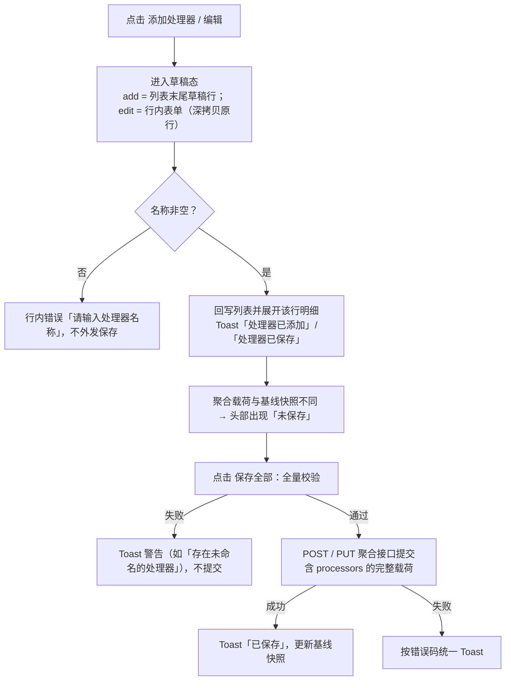

# 软件测试平台——全局处理器

**文档版本**：V1.0
**日期**：2026-09-23
**状态**：起草中

---

## 1. 引言

### 1.1 编写目的

编写本文档，对接口测试**环境级全局前置 / 后置处理器**进行详细设计，明确其数据结构、接口口径、业务逻辑与前端交互，为实现与联调提供依据。

### 1.2 范围

覆盖环境详情面板「前置处理器」「后置处理器」两个页签内的全部功能：处理器新增、编辑、只读明细、上移 / 下移排序、复制、删除、从公共组件引入（处理器与提取器），以及处理器随环境的聚合保存与执行口径。

不含处理器资产（公共组件）自身的管理与表单契约（见 `docs/04-detailed-design/05-api-testing/06-api-testing-infra-common-component.md`）、环境聚合接口与页面入口（见 `docs/04-detailed-design/05-api-testing/18-environment-management-env.md`）、场景级处理器（见 `docs/04-detailed-design/05-api-testing/14-test-scenario-step.md` 7.3）。

### 1.3 参考资料

- 《环境管理详细设计说明书总览》（`docs/04-detailed-design/05-api-testing/17-environment-management-overview.md`，2.1.5 处理器数据列）
- 《公共组件详细设计》（`docs/04-detailed-design/05-api-testing/06-api-testing-infra-common-component.md`，3.1 处理器配置、3.4 共享组件契约）
- 《API 测试基础设施详细设计说明书总览》（`docs/04-detailed-design/05-api-testing/02-api-testing-infra-overview.md`，2.2 错误码）
- Ryze 多协议测试框架文档（`https://xiaomisum.github.io/ryze/`）

---

## 2. 数据设计

### 2.1 processors 数组元素结构

处理器随环境聚合存储：JSONB 数组写入环境主表 `api_environment.processors` 列，元素无独立 `id`、不拆独立子表。表结构、约束与索引见 `docs/04-detailed-design/05-api-testing/17-environment-management-overview.md` 2.1.5。

| 字段 | 类型 | 必填 | 说明 |
| ---- | ---- | ---- | ---- |
| processorType | VARCHAR(20) | 是 | preprocessor / postprocessor，决定执行期前置 / 后置归组 |
| name | VARCHAR(100) | 是 | 处理器名称（同环境内可重复） |
| config | JSON | 是 | 处理器元素（结构见 2.2），缺省 `{}` |
| sortOrder | INT | 否 | 排序序号（缺省 0） |
| enabled | BOOLEAN | 否 | 启用状态（缺省 true），执行时据此过滤 |

### 2.2 处理器元素（config 列内容）结构

处理器元素与公共组件处理器、场景级处理器同构，顶层为平台存储结构：

```json
{
  "enabled": true,
  "sortOrder": 1,
  "testclass": "http",
  "config": { "method": "POST", "ref": "http_1", "path": "/oauth/token" },
  "extractors": [
    { "enabled": true, "source": "json_field", "expression": "$.data.token", "variableName": "token", "description": "访问令牌" }
  ]
}
```

- `testclass`：`http`（发送 HTTP 请求）或 `jdbc`（执行 SQL）。
- `config`：Ryze 配置键，执行时原样透传；键集见下表。
- `extractors`：处理器内嵌提取器行，行结构 `{ enabled, source, expression, variableName, description }`，与提取器资产字段一致（便于复制引入后回读）；全空行保存时丢弃。
- `enabled` / `sortOrder`：平台 overlay（副本），执行前剥离，不参与 Ryze 元件语义；取值随新建与草稿保存写入。

| 处理器类型 | `testclass` | `config` 键（与 Ryze 一致） |
| ---------- | ----------- | --------------------------- |
| 发送 HTTP 请求 | `http` | method / ref / path / headers / query / data / body |
| 执行 SQL | `jdbc` | datasource / sql / args |

- HTTP：`ref` 引用环境 HTTP 配置的 `refName`（取代原 `base_url`）；`method` 缺省 GET 且始终写入；`headers` / `query` / `data` 为 Map（忽略空键与未启用行）；`data`（表单）与 `body`（JSON / 原始文本）互斥，同一时刻仅写其一。
- JDBC：`datasource` 引用环境数据源的 `refName`；`sql` 为语句文本；`args` 为占位符值数组。
- 平台旧扁平结构键（`handlerType` / `url` / `contentType` / `dataSource` / `method` / `headers` / `body` / `sql` / `args`）不写入元素，保存时一并清除。
- 处理器级不承载异步与条件字段。

---

## 3. 接口详细设计

> 工作空间与项目上下文经 `X-Active-Workspace` / `X-Active-Project` 请求头传递，不出现在 URL 中。接口响应示例仅展示 `data` 字段内容（通用约定见 `docs/00-spec/20-contracts/01-api.md`）。

### 3.1 聚合读写接口（唯一入口）

处理器**随环境整体聚合提交**，无独立的处理器新增 / 更新 / 删除 / 排序 / 启停接口：

| 操作 | 路径 | 方法 | 权限 | 处理器段落 |
| ---- | ---- | ---- | ---- | ---------- |
| 查询详情 | `/api/project/environments/:id` | GET | `api-env:view` | 响应 `processors` 返回完整列表 |
| 创建环境 | `/api/project/environments` | POST | `api-env:edit` | 请求体 `processors` 随聚合载荷提交 |
| 更新环境 | `/api/project/environments/:id` | PUT | `api-env:edit` | 请求体 `processors` 随聚合载荷提交 |

路径定义与交互说明见 `docs/04-detailed-design/05-api-testing/18-environment-management-env.md` 1.2 / 1.3 / 1.4。

- **请求体（`processors` 段）**：

```json
{
  "name": "测试环境",
  "processors": [
    {
      "processorType": "preprocessor",
      "name": "Token 预置",
      "config": {
        "enabled": true,
        "sortOrder": 1,
        "testclass": "http",
        "config": {
          "method": "POST",
          "ref": "http_1",
          "path": "/oauth/token",
          "headers": { "Content-Type": "application/json" },
          "body": { "grant_type": "client_credentials" }
        },
        "extractors": [
          { "enabled": true, "source": "json_field", "expression": "$.data.token", "variableName": "token", "description": "访问令牌" }
        ]
      },
      "sortOrder": 1,
      "enabled": true
    },
    {
      "processorType": "postprocessor",
      "name": "订单落库",
      "config": {
        "enabled": true,
        "sortOrder": 2,
        "testclass": "jdbc",
        "config": { "datasource": "db_1", "sql": "INSERT INTO t_order (no) VALUES (?)", "args": ["${orderNo}"] }
      },
      "sortOrder": 2,
      "enabled": true
    }
  ]
}
```

- **响应（详情 `processors` 段）**：

```json
{
  "processors": [
    {
      "processorType": "preprocessor",
      "name": "Token 预置",
      "config": { "enabled": true, "sortOrder": 1, "testclass": "http", "config": { "method": "POST", "ref": "http_1", "path": "/oauth/token" }, "extractors": [] },
      "sortOrder": 1,
      "enabled": true
    }
  ]
}
```

- **校验规则**：`processorType` 必填且仅取 `preprocessor` / `postprocessor`（范围在服务层校验）；`name` 必填且 ≤100 字符；`sortOrder` 缺省 0；`enabled` 缺省 `true`；`config` 缺省 `{}`。更新为子资源整批替换语义：未传 `processors` 视为清空。
- **列表计数**：环境列表项的 `processorCount` 为 `processors` 数组长度，见 `docs/04-detailed-design/05-api-testing/18-environment-management-env.md` 1.1。

### 3.2 资产引入查询接口

「从公共组件引入」复用公共组件分页查询：

- **路径**：`GET /api/project/components`
- **参数**：`type` 取 `preprocessor` / `postprocessor`（处理器引入）或 `extractor`（提取器引入）；`enabled=true`；`pageNo=1`、`pageSize=100`；`keyword` 为名称关键词（空不传）。
- **权限**：`api-component:view`；接口定义见 `docs/04-detailed-design/05-api-testing/06-api-testing-infra-common-component.md` 1.1。

### 3.3 错误码

处理器无独立接口，无专属错误码；聚合保存的参数校验失败按通用校验错误返回。接口测试域错误码号段统一登记于 `docs/04-detailed-design/05-api-testing/02-api-testing-infra-overview.md` 2.2，本文不重复登记。

---

## 4. 业务逻辑设计

### 4.1 新增、编辑与保存



- **草稿态**：`none` / `add` / `edit` 三态，草稿不落列表直至保存。`add` 在列表末尾渲染草稿行（类型取当前页签，`testclass` 默认 `http`）；`edit` 深拷贝原行，取消时原样还原。
- **排序号赋值**：新增处理器的 `sortOrder` 取当前环境全部处理器 `sortOrder` 最大值 + 1（跨前置 / 后置取全局最大），同时写入 `processors` 元素与元素 overlay；元素 overlay 的 `enabled` 预置 `true`，与 `processors` 元素 `enabled` 一并提交。
- **保存全部**：处理器与其他四段配置共用聚合提交；提交前校验环境名称、HTTP 配置、数据源、变量与处理器名称，任一失败 Toast 警告且不提交。
- **启停口径**：当前实现不提供处理器启停编辑入口，新增与引入的处理器 `enabled` 恒为 `true`；执行侧仍按 `enabled` 过滤，为后续启停能力保留口径。

### 4.2 排序、复制与删除

- **上移 / 下移**：同类型相邻两行互换 `sortOrder` 与数组位置，选中态跟随被移动行；首行 [上移]、末行 [下移] 置灰。执行顺序以 `processors` 数组顺序（即列表展示顺序）为准，`sortOrder` 为随行元数据。
- **复制**：深拷贝元素后插入源行之后，重新分配本地标识；名称、`sortOrder`、`enabled` 沿用源处理器（不追加副本后缀、不重排序号），选中态指向副本。
- **删除**：将处理器移出数组；被删行处于展开或编辑草稿时一并收起，被删项为选中项时回落到该类型首行；变更计入「未保存」，随 [保存全部] 整体提交。
- **切换页签**：展开明细与草稿表单不跨页签残留，切走即收起；跨类型草稿被取消，非处理器页签清空处理器选中态。

### 4.3 从公共组件引入

- **引入处理器**：入口为面板头部 [从公共组件引入]（需编辑权限），选择器按 3.2 参数加载当前页签类型的启用资产，支持名称关键词搜索与多选。确认后逐条转换为处理器元素（`testclass` 取组件 `config`，非法值回落 `http`；`config` / `extractors` 原样复制），追加到列表末尾：名称取资产名称，`sortOrder` 取最大值 + 1，`enabled` 预置 `true`，Toast「已引入 N 个处理器」。引入为**复制**，得到独立副本，与源资产无关联。
- **引入提取器**：配置编辑器的「导入提取器」触发同一选择器（`type=extractor`、`enabled=true`），选中项转换为提取器行后平铺追加到**当前处理器**（草稿编辑中则落在草稿上），已有行保留，Toast「已引入 N 个提取器」。

### 4.4 执行口径

- **归组与过滤**：环境快照按 `processorType` 拆分为前置 / 后置两组，`enabled=false` 的元素在装配期被跳过。
- **元素标准化**：剥离平台 overlay（`enabled` / `sortOrder`）；提取器由平台行结构转换为 Ryze 元件格式 `{testclass, field, ref_name}`，来源为空或未启用的行被过滤，转换结果为空时移除 `extractors` 键；其余 `config` 原样透传，无其他执行层转换。
- **组合顺序**：单场景执行与调试中，环境前置置于场景前置之前、环境后置置于场景后置之后；多场景组合执行时环境处理器挂载顶层 suite，场景子 suite 仅携带场景自身处理器。
- **引用预选**：环境页编辑器隐藏引用选择，`ref` / `datasource` 在选项到达、类型切换时按 `isDefault=true` 自动预选，仅当用户尚未选择时生效，不覆盖已有取值。

---

## 5. 前端设计

### 5.1 页面结构

处理器位于环境详情面板的两个计数页签内（页签：HTTP / 变量 / 数据源 / 前置处理器 / 后置处理器），面板结构与保存入口见 `docs/04-detailed-design/05-api-testing/18-environment-management-env.md` 2。处理器页签内示意：

```
┌─ 环境详情面板 · [前置处理器(n)] / [后置处理器(n)] ──────────────────────┐
│                                        [＋ 添加处理器] [从公共组件引入] │
│ ┌────────────────────────────────────────────────────────────────────┐ │
│ │ 1 [HTTP][POST] Token 预置   ←悬浮→ [上移][下移][编辑][复制][删除]   │ │
│ │   └ 展开只读明细：名称 + 类型标签 + 「配置」参数行/代码块           │ │
│ │        + 「提取器」只读表格（来源/表达式/目标变量名/描述）          │ │
│ │ 2 [JDBC][SELECT] 订单落库                                         │ │
│ │ 3 [HTTP][GET] 编辑表单：名称(必填) + 「配置（随类型切换）」         │ │
│ │                      [取消] [保存]                                 │ │
│ └────────────────────────────────────────────────────────────────────┘ │
│ 空态：暂无前置处理器，点击 [＋ 添加处理器] 新增（后置页签同构）        │
└────────────────────────────────────────────────────────────────────────┘
```

- **列表行**：序号 + 类型标签（HTTP / JDBC）+ 摘要标签（HTTP 显示请求方法并按方法着色，JDBC 显示 SQL 首词）+ 名称（未填名称回落「处理器 N」）。行操作悬浮于行右端，键盘聚焦同样可见。
- **头部操作**：[＋ 添加处理器]、[从公共组件引入] 靠右排列，无编辑权限时置灰。
- **行内操作**：[上移] / [下移]（边界置灰）、[编辑]、[复制]、[删除]；表单展开期间该行操作替换为常显的 [取消] / [保存]。
- **只读明细**：点击行展开、再次点击收起，结构与公共组件明细一致，仅展示配置（参数行、SQL / 请求体代码块、键值对）与提取器表格，无数据的分区不渲染。

### 5.2 组件与状态

| 文件 | 职责 |
| ---- | ---- |
| `web/src/pages/project/api-testing/environment/EnvironmentProcessorPane.vue` | 列表行 / 草稿行同构渲染、名称校验、只读明细与行内操作 |
| `web/src/pages/project/api-testing/environment/EnvironmentDetailPanel.vue` | 处理器页签编排、事件接线、两个引入选择器 |
| `web/src/composables/project/api-testing/environment/useEnvironmentProcessors.ts` | 列表状态：按类型过滤、草稿三态、移动 / 复制 / 删除 / 提交、标签与显示名 |
| `web/src/composables/project/api-testing/environment/useEnvironmentDetailState.ts` | 聚合载荷与脏标记、保存全部校验、处理器 / 提取器引入选择器 |
| `web/src/components/project/api-testing/ProcessorConfigEditor.vue`（复用） | 元素编辑器：HTTP / JDBC 类型切换、请求配置与提取器；环境页传 `showTypeSelect=true`、`showRefSelect=false` |
| `web/src/components/project/api-testing/ProcessorConfigDetail.vue`（复用） | 元素只读明细：参数行、代码块与提取器表格 |
| `web/src/composables/project/api-testing/processorFormModel.ts` | 元素 ⇄ 表单编译、标签口径、默认值、组件资产 → 元素转换 |
| `web/src/composables/project/api-testing/processorDetailModel.ts` | 元素 → 只读配置行与提取器行（与编辑器同源解析） |
| `web/src/services/project/api-testing/environment.ts`、`web/src/services/project/api-testing/component.ts` | 聚合保存接口与引入查询接口 |
| `web/src/types/project/api-testing/apitest.ts` | `ApiProcessor` / `ApiEnvironmentSaveReq.processors` 类型定义 |

### 5.3 交互流程与状态分支

- **同一时刻仅一处展开**：编辑 / 新增表单与只读明细互斥；点击自身编辑行不收起，避免误丢编辑；新增草稿行不参与展开 / 收起，避免未保存内容被误关。
- **名称校验**：保存时名称为空则行内提示「请输入处理器名称」且不外发；输入后错误即时清除；保存全部阶段再校验全部处理器名称非空。
- **空态**：按页签显示引导文案「暂无前置处理器 / 暂无后置处理器，点击 [＋ 添加处理器] 新增」；新增草稿行不计入空态。
- **只读态**（无 `api-env:edit`）：头部两个按钮置灰、行内操作不渲染、无法进入编辑；点击行仍可展开只读明细。
- **加载与错误**：面板加载中显示 loading 遮罩；加载失败显示「环境详情加载失败」+ [重试]；保存与引入失败按错误码统一 Toast。
- **未保存标记**：以聚合载荷快照比对判定，处理器的增删改排均计入「未保存」，随 [保存全部] 一次提交并清除。

### 5.4 权限口径

- 环境模块入口与详情查看按 `api-env:view`；处理器的添加、编辑、排序、复制、删除、引入与 [保存全部] 按 `api-env:edit` 控制（面板 `canEdit`）。
- 引入选择器查询公共组件需 `api-component:view`。
- 上下文经 `X-Active-Workspace` / `X-Active-Project` 请求头传递，不出现在 URL 中。

---

## 6. 实施说明

- **无独立接口、无 DDL 变更**：处理器随环境创建 / 更新接口整体提交，表结构见 `docs/04-detailed-design/05-api-testing/17-environment-management-overview.md` 2.1.5。
- **复用公共组件前端件**：编辑与只读明细复用 `ProcessorConfigEditor` / `ProcessorConfigDetail`（环境页隐藏引用选择、保留 HTTP / JDBC 类型切换），组件契约见 `docs/04-detailed-design/05-api-testing/06-api-testing-infra-common-component.md` 3.4。
- **兼容与清洗**：保存时清除平台旧扁平结构键；丢弃全空提取器行；`headers` / `query` / `data` 忽略空键与未启用行；`data` 与 `body` 互斥。
- **注意点**：元素 overlay 的 `sortOrder` 在新增与草稿保存时写入，排序调整以 `processors` 元素 `sortOrder` 与数组顺序为准（执行按数组顺序），overlay 值在执行前剥离。
- **测试**：`web/src/pages/project/api-testing/environment/EnvironmentProcessorPane.spec.ts`（列表行 / 编辑表单 / 草稿行 / 只读明细）、`web/src/components/project/api-testing/ProcessorConfigEditor.spec.ts`（类型切换、引用预选、事件透传）、`web/src/components/project/api-testing/ProcessorConfigDetail.spec.ts`、`web/src/composables/project/api-testing/environment/useEnvironmentProcessors.spec.ts`。

---

## 修改记录

| 版本 | 日期 | 说明 |
| ---- | ---- | ---- |
| V1.0 | 2026-10-03 | 按实现对齐全局处理器设计并补齐章节骨架（接口详细设计 / 业务逻辑 / 前端设计 / 实施说明）：修正 HTTP 配置键与启用、排序口径，改写为页签平铺列表交互，新建修改记录 |
