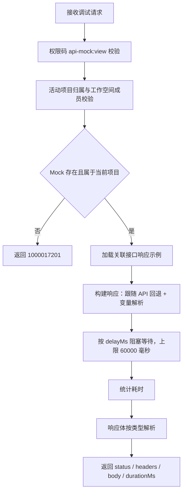

# 软件测试平台——调试

**文档版本**：V1.0
**日期**：2026-09-23
**状态**：起草中

---

## 1. Mock 调试

> 上下文标识（`X-Active-Workspace` / `X-Active-Project`）经请求头传递，不出现在 URL 与请求体中；Mock 表结构、页面入口与错误码总表见 `docs/04-detailed-design/05-api-testing/21-mock-service-overview.md`，管理端页面结构见 `docs/04-detailed-design/05-api-testing/22-mock-service-rules.md`。

调试是管理端对单条 Mock 定义的**只读模拟命中**：按 `id` 直接构建该 Mock 配置的响应并原样返回，不经过免登录访问链路，也不产生任何持久化数据。

### 1.1 执行 Mock 调试

- **路径**：`POST /api/project/mocks/:id/debug`
- **权限**：`api-mock:view`；服务端依次校验权限码、活动项目归属与工作空间成员身份。Mock 不存在或不属于当前项目时返回错误码 1000017201（`API_MOCK_NOT_FOUND`，按不存在处理，不泄露跨项目资源）。
- **请求体**：

```json
{
  "headers": { "Content-Type": "application/json" },
  "body": { "username": "admin", "password": "123456" }
}
```

- **参数说明**：`headers` 可选，键与值均为字符串；`body` 可选，任意 JSON 值；两字段均可整体缺省。
- **响应**（通用响应结构的 `data` 字段内容）：

```json
{
  "status": 200,
  "headers": { "Content-Type": "application/json" },
  "body": { "code": 200, "data": { "token": "mock-token-xxx" } },
  "durationMs": 5
}
```

- **响应字段**：

| 字段 | 类型 | 说明 |
| ---- | ---- | ---- |
| `status` | integer | Mock 配置的响应状态码（`response_status`，缺省 200） |
| `headers` | object | 构建出的响应头；缺少 `Content-Type` 时按响应体类型补缺省值 |
| `body` | object / string | 响应体类型为 `json` 时解析为对象，解析失败或其余类型回退原始字符串 |
| `durationMs` | integer | 本次调试耗时（毫秒），口径见 1.2 |

### 1.2 调试业务逻辑



**与真实访问链路的差异**（真实访问见 `docs/04-detailed-design/05-api-testing/24-mock-service-serving.md`）：

- **不执行匹配引擎**：不按方法与路径召回规则，不检查 `match_rules`，也不校验 `enabled`；响应完全由请求 `id` 对应的定义决定，因此不存在"命中哪条规则"的结果。
- **不产生持久化**：不更新 `hit_count` 与 `last_hit_at`，不写 `api_mock_access_log`，不生成可回看的调试记录。
- **不经接入层**：不经过 `MockAccessFilter`，无独立端口接入、单路径 QPS 限流与未命中放行逻辑。
- **延迟与耗时**：`delayMs` 缺省 0，超过 60000 毫秒按 60000 毫秒执行；`durationMs` 只统计阻塞等待的时间，响应构建与响应体解析不计入。
- **构建逻辑复用**：跟随 API 回退与 `${...}` 变量解析的口径与真实访问一致（见 `docs/04-detailed-design/05-api-testing/24-mock-service-serving.md` 第 4 章）。

### 1.3 数据与错误码

- 调试为只读操作：不新增表、不写入或修改任何字段，无 DDL 变更；Mock 定义与命中统计的表结构见 `docs/04-detailed-design/05-api-testing/21-mock-service-overview.md`。
- 业务错误码仅涉及 `1000017201`（Mock 不存在或跨项目）；无权限、参数非法等按框架全局错误码口径返回。错误码号段见 `docs/04-detailed-design/05-api-testing/02-api-testing-infra-overview.md` 2.2。

---

## 2. Mock 调试面板（前端）

### 2.1 入口与权限

- **入口**：接口测试壳页左侧菜单「Mock 服务」（子页切换写入 `?tab=mocks`）→ 列表操作列 [调试]；菜单项挂权限码 `api-mock:view`，口径见 `docs/04-detailed-design/05-api-testing/22-mock-service-rules.md` 2.1。
- **形态**：560px 右侧抽屉，标题「Mock 调试」，点击遮罩不关闭；抽屉内控件不单独挂权限码，请求由后端按 `api-mock:view` 校验。
- **打开时机**：每次打开抽屉均清空请求头、请求体与上一次响应结果。

### 2.2 请求构造

| 输入项 | 控件 | 提交规则 |
| ------ | ---- | -------- |
| 请求头 | 3 行文本域，标签「请求头 (JSON 或 Header: Value 格式)」，占位 `{"Content-Type": "application/json"}` | 整体按 JSON 解析，成功则作为对象提交；失败则逐行按首个 `:` 拆分为键值对（冒号前为空的行忽略）；留空不传 `headers` |
| 请求体 | 5 行文本域，标签「请求体 (JSON)」，占位 `{"username": "admin", "password": "123456"}` | 按 JSON 解析，成功提交对象，失败提交原始字符串；留空不传 `body` |

- 两个文本域均使用等宽字体展示。
- [发送调试请求] 触发一次调试；发送期间按钮进入 loading，重复点击不生效，结束后恢复。

### 2.3 响应查看与命中规则口径

- 分割线「响应结果」下方依次展示：状态码标签（`status < 400` 用成功色，否则用危险色，大号）与耗时文本（`{durationMs}ms`，弱化色）、「响应头」与「响应体」两个只读展示区。
- 响应头与响应体以等宽 `<pre>` 展示：对象按两空格缩进格式化，字符串原样展示，空值显示为空；最大高度 300px 内滚动，长内容自动换行。
- **不展示命中规则**：调试不做规则匹配，面板没有命中规则、命中次数或匹配过程指示；命中统计只由真实访问产生，并在列表「命中次数」「最后命中」列展示（见 `docs/04-detailed-design/05-api-testing/22-mock-service-rules.md` 2.2）。
- **无独立调试页**：交互设计中的 Mock 调试页（路由 `/workspace/projects/mock-debug`，含 Mock 选择器、命中规则指示与调试记录列表，见 `docs/05-interaction-design/05-api-testing/16-mock-ui-debug.md`）未实现，调试过程不产生可回看的记录。

### 2.4 状态分支

| 状态 | 表现 |
| ---- | ---- |
| 未发送 | 仅展示请求头、请求体输入与 [发送调试请求]，无响应区 |
| 发送中 | 按钮 loading，重复点击不生效 |
| 成功 | 状态码标签 + 耗时 + 响应头 + 响应体 |
| 失败（网络 / 权限 / 业务错误） | 面板内不展示错误信息，仅结束 loading；保留请求输入与上一次响应结果，错误消息由请求拦截器以 rejection 传出 |
| 关闭再打开 | 请求头、请求体与响应结果全部清空 |

### 2.5 访问地址展示与复制

- **入口**：列表操作列 [地址] → 请求 `GET /api/project/mocks/:id/address`（前端封装 `fetchMockAddress`，取 `mockUrl` / `method` / `headers`），成功后打开 520px 弹窗。
- **弹窗**：标题「Mock 访问地址」，内容与复制交互（说明文案、方法标签、等宽地址、可选「需要携带的请求头」分区、[关闭] / [复制地址]、提示「已复制到剪贴板」与「复制失败，请手动复制」）见 `docs/04-detailed-design/05-api-testing/24-mock-service-serving.md` 1.3。
- **服务端现状**：`ApiMockController` 未定义 `/address` 端点，该请求返回 404、弹窗不会打开，[地址] 入口当前不可用。

---

## 修改记录

| 版本 | 日期 | 说明 |
| ---- | ---- | ---- |
| V1.0 | 2026-10-03 | 对齐实现：补调试接口权限与响应字段口径、业务逻辑与延迟耗时差异、调试面板请求构造与状态分支、命中规则不展示与地址入口现状 |
