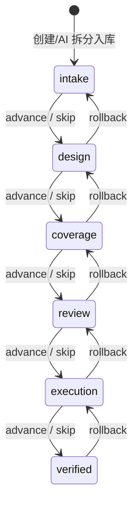
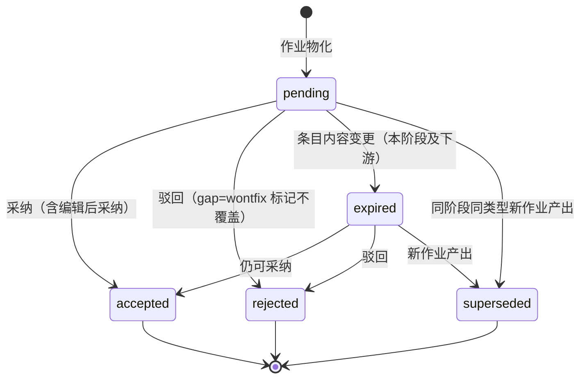

# 软件测试平台——智能用例生成与需求工作流详细设计说明书总览

**文档版本**：V1.0
**日期**：2026-09-23
**状态**：起草中

---

## 1. 引言

### 1.1 编写目的

本文档对 AI 能力域中**需求工作流与围绕脑图编辑器的 AI 功能**进行详细设计：需求工作流（阶段状态机、阶段作业、提案、血缘）、用例子树生成、步骤补全、优先级推荐、AI 拆分，为开发实现提供完整依据。

### 1.2 范围

覆盖 SRS 3.4（智能测试用例生成，含需求工作流 US-AI-004、提案与采纳 US-AI-020、血缘与追溯 US-AI-021、AI 文档拆分 US-AI-019）。公共基础（AI 网关、SSE 帧格式、限流审计、错误码 1000013001–1000013013、异步任务框架）见《AI 基础设施详细设计说明书》，本文档不重复；覆盖确认作业的遗漏分析执行逻辑见《AI 评审与测试计划辅助详细设计说明书》，其作业发起与提案处置接口见本分册。

核心机制约束（概要 AD-3 / 4.2）：**AI 产出进入脑图一律经前端编辑内核挂载**，复用协同广播、diff 持久化与撤销链路，后端不提供批量写节点接口；AI 自主新建文档（结构提案采纳）走常规文档创建业务通道，不写脑图节点。

### 1.3 参考资料

- 《软件测试平台需求规格说明书》（3.4）
- 《软件测试平台概要设计说明书》（4.8、4.9）
- 《AI 基础设施详细设计说明书》
- 《脑图组件详细设计》（`docs/04-detailed-design/99-common/04-mindmap-component.md`）
- 《项目工作区详细设计说明书》（归档，节点模型与 WS 协议）

---

## 2. 数据设计

### 2.1 数据库表设计

新表遵循平台规范（同基础设施文档 2.1）：`id` 使用框架默认 UUID 策略、`created_at`、`updated_at`、`is_deleted`，禁止物理外键（C5）；索引遵循 C9。

#### 2.1.1 需求工作流条目表（requirement）

| 字段 | 类型 | 约束 | 说明 |
| ---- | ---- | ---- | ---- |
| id | UUID | PK | 条目 ID |
| project_id | UUID | NOT NULL | 归属项目 |
| title | VARCHAR(200) | NOT NULL | 条目标题 |
| content | TEXT | NOT NULL | 需求文本（Markdown，长度上限见 `requirementContentMaxLength` 配置键） |
| source_url | VARCHAR(500) | NULL | 来源 URL（仅记录出处，平台不抓取） |
| stage | VARCHAR(20) | NOT NULL DEFAULT 'intake' | 工作流阶段：intake（沉淀）/ design（用例设计）/ coverage（覆盖确认）/ review（评审就绪）/ execution（计划执行）/ verified（验收），取值见 2.3 |
| stage_entered_at | TIMESTAMP | NOT NULL DEFAULT CURRENT_TIMESTAMP | 当前阶段进入时间（看板阶段停留与过期提醒直接可查，免联时间线） |
| status | VARCHAR(20) | NOT NULL DEFAULT 'active' | 归档维：active / archived（与阶段正交） |
| ai_generated | BOOLEAN | NOT NULL DEFAULT FALSE | AI 拆分产生的条目标识（仅用于展示徽标，不影响业务规则） |
| created_by | UUID | NOT NULL | 创建人（编辑/删除/归档权限判定依据） |
| updated_by | UUID | NOT NULL | 最后更新人 |
| is_deleted | BOOLEAN | NOT NULL DEFAULT FALSE | 是否删除 |
| created_at | TIMESTAMP | NOT NULL DEFAULT CURRENT_TIMESTAMP | 创建时间 |
| updated_at | TIMESTAMP | NOT NULL DEFAULT CURRENT_TIMESTAMP | 更新时间 |

**索引**：`idx_requirement_project_stage` (project_id, stage)，`idx_requirement_list` (project_id, status, updated_at)

> 基线表 `requirement_pool_item` 原地重命名为 `requirement` 并增列 `stage` / `stage_entered_at`（迁移见 4 实施说明）；原单列索引 `idx_rpi_project_id` (project_id) 由 `idx_requirement_project_stage` 左前缀覆盖，迁移时删除重建，列表查询由 `idx_requirement_list` 承载（阶段看板与列表默认按更新时间倒序）。标题关键字检索用 `title ILIKE '%kw%'`（项目内条目量级小，不建全文索引）；条目不建向量索引（AD-5）。`ai_generated` 仅用于渲染，不作独立查询条件，不建索引。合计 2 个索引，符合 C9。

#### 2.1.2 阶段事件（复用项目动态表 ws_project_activity）

阶段操作（推进 / 跳过 / 回退）留痕，即阶段时间线的数据源；事件与项目动态共用同一张表（表定义见 `docs/04-detailed-design/03-function-testing/03-project-workspace-workbench.md` 数据设计），以 `resource_type = 'requirement'` 写入资源事件：

| 阶段事件字段 | 落列 | 说明 |
| ---- | ---- | ---- |
| 事件 ID | id | 主键（表既有列） |
| 所属条目 | resource_id | 即 requirement_id（`resource_type = 'requirement'`） |
| 条目标题 | resource_name | 写入时快照，时间线展示免回查 |
| 归属项目 | project_id | 表既有列（隔离查询用） |
| 操作人 | actor_id / actor_name | 表既有列 |
| 操作 | action | advance（推进）/ skip（跳过）/ rollback（回退） |
| 可读摘要 | summary | 表既有列，如「推进：design → coverage」 |
| 发生时间 | occurred_at | 表既有列（时间线排序键） |
| 变更前阶段 | payload.from_stage | 阶段语义见 2.3 状态机 |
| 变更后阶段 | payload.to_stage | 同上 |
| 原因 | payload.reason | 跳过/回退原因（必填校验在应用层） |
| 出口证据快照 | payload.evidence | 推进时附缺失清单为空的证据快照；跳过附被豁免项清单 |

**本表变更**：`ADD COLUMN payload JSONB NOT NULL DEFAULT '{}'`（结构化事件负载，项目动态的既有消费方不受影响）。**索引**：`idx_project_activity_resource` (resource_type, resource_id, occurred_at DESC)，时间线按条目倒序读取；与既有动态流索引合计 2 个，符合 C9。

> `from_stage` / `to_stage` 冗余存于 payload（阶段语义由 2.3 定义），便于时间线直接读取，不建额外索引。项目动态的既有条目（用例文档、评审等资源事件）`payload` 取默认空对象。

#### 2.1.3 提案表（requirement_proposal）

| 字段 | 类型 | 约束 | 说明 |
| ---- | ---- | ---- | ---- |
| id | UUID | PK | 提案 ID |
| project_id | UUID | NOT NULL | 归属项目 |
| requirement_id | UUID | NOT NULL | 所属条目 |
| stage | VARCHAR(20) | NOT NULL | 产出提案的阶段（结构见 2.3 状态机） |
| kind | VARCHAR(20) | NOT NULL | 提案类型：clarify（澄清）/ structure（结构）/ case（用例）/ gap（遗漏点）/ review_plan（评审方案）/ plan_plan（计划方案） |
| task_id | UUID | NULL | 产出该提案的作业 ID（ai_analysis_task.id，无则为空） |
| seq | INT | NOT NULL DEFAULT 0 | 同批次内序号（展示排序） |
| payload | JSONB | NOT NULL | 提案内容快照（按 kind 区分，结构见 2.2） |
| status | VARCHAR(20) | NOT NULL DEFAULT 'pending' | 状态：pending（待处置）/ accepted（已采纳）/ rejected（已驳回）/ superseded（被替代）/ expired（已过期） |
| resolution | VARCHAR(20) | NULL | 处置细分：gap 提案 to_case / wontfix；其余为空 |
| reason | VARCHAR(500) | NULL | 驳回/不覆盖原因（可选，留痕） |
| fingerprint | VARCHAR(64) | NULL | 内容指纹（SHA-256，规范化摘要；仅 case/structure/gap 计算），用于重复提议抑制 |
| resolved_by | UUID | NULL | 处置人 |
| resolved_at | TIMESTAMP | NULL | 处置时间 |
| is_deleted | BOOLEAN | NOT NULL DEFAULT FALSE | 是否删除 |
| created_at | TIMESTAMP | NOT NULL DEFAULT CURRENT_TIMESTAMP | 创建时间 |
| updated_at | TIMESTAMP | NOT NULL DEFAULT CURRENT_TIMESTAMP | 更新时间 |

**索引**：`idx_rp_req_stage_status` (requirement_id, stage, status)，`idx_rp_fingerprint` (requirement_id, kind, fingerprint)

> `task_id` 不建索引（不按作业反查提案，提案列表一律按条目查询）；指纹重复抑制在应用层查询比对（同条目同 kind 同指纹已存在 rejected/accepted 提案时跳过产出），不加唯一约束以容纳 superseded 历史共存。合计 2 个索引，符合 C9。

#### 2.1.4 需求血缘表（requirement_lineage）

| 字段 | 类型 | 约束 | 说明 |
| ---- | ---- | ---- | ---- |
| id | UUID | PK | 主键 |
| project_id | UUID | NOT NULL | 归属项目 |
| requirement_id | UUID | NOT NULL | 需求条目 |
| artifact_type | VARCHAR(20) | NOT NULL | 关联对象类型：document（脑图文档）/ case（用例节点）/ review（评审）/ plan（计划）/ bug（缺陷） |
| artifact_id | UUID | NOT NULL | 关联对象 ID |
| source | VARCHAR(20) | NOT NULL | 来源：generated（提案采纳自动写入）/ manual（手动关联） |
| is_deleted | BOOLEAN | NOT NULL DEFAULT FALSE | 是否删除 |
| created_at | TIMESTAMP | NOT NULL DEFAULT CURRENT_TIMESTAMP | 创建时间 |
| updated_at | TIMESTAMP | NOT NULL DEFAULT CURRENT_TIMESTAMP | 更新时间 |

**索引**：`uk_rl_req_artifact` UNIQUE (requirement_id, artifact_type, artifact_id) WHERE is_deleted = false，`idx_rl_artifact` (artifact_type, artifact_id)

> 血缘仅记录关系不承载状态（SRS 1.6）；`idx_rl_artifact` 支撑反向追溯（对象详情查关联需求）与对象删除时的联动清理。基线表 `requirement_document_rel` 原地泛化为本表——增列 `artifact_type` / `source`（存量关联即 document + manual 血缘）、`document_id` 重命名为 `artifact_id`、表与索引重命名，存量数据零搬迁（见 4 实施说明）。合计 2 个索引，符合 C9。

#### 2.1.5 既有表变更

| 表 | 变更 | 说明 |
| ---- | ---- | ---- |
| ai_analysis_task | `type` 枚举扩展 4 项：case_generation / missing_point_analysis / review_planning / plan_planning；`ADD COLUMN stage VARCHAR(20)`、`ADD COLUMN trigger VARCHAR(20) NOT NULL DEFAULT 'manual'` | 需求工作流阶段作业复用本表，`target_id` = 需求条目 ID；`stage` 记录发起阶段，`trigger` 区分人工发起与「自动推进」去抖重跑；执行形态与登记同步回补《AI 基础设施详细设计说明书》2.1.3 |
| ws_project | `ADD COLUMN requirement_auto_advance BOOLEAN NOT NULL DEFAULT FALSE` | 项目级「自动推进」开关（阶段驻留期间内容变更后自动重跑作业，见 2.3），默认关闭 |
| ws_project_activity | `ADD COLUMN payload JSONB NOT NULL DEFAULT '{}'`、`CREATE INDEX idx_project_activity_resource` (resource_type, resource_id, occurred_at DESC) | 阶段事件与项目动态共表，payload 承载结构化事件负载（2.1.2） |
| requirement_document_rel | 原地泛化为 `requirement_lineage`：增列 `artifact_type` / `source`、`document_id` 重命名 `artifact_id`、表与索引重命名 | 关联语义并入血缘，存量数据零搬迁（2.1.4 / 4 实施说明） |

`requirement` 与 test_case_node / test_review_node_snapshot / test_plan_node_snapshot 的 `ai_generated` 为基线既有列，仅用于渲染、不建索引；评审/计划的快照拷贝 SQL 包含该列。

### 2.2 结构化输出与提案 payload

#### 2.2.1 用例树结构断言（生成作业与步骤补全共用）

用例子树生成、步骤补全共用同一输出结构（网关侧按下述规则校验，见基础设施文档 4.4）：

```json
{
  "nodes": [
    {
      "type": "case",
      "title": "邮箱登录成功",
      "priority": "P1",
      "children": [
        { "type": "precondition", "title": "用户已注册且处于登录页", "children": [] },
        { "type": "step", "title": "输入正确邮箱和密码，点击登录", "children": [] },
        { "type": "expected", "title": "跳转到首页，显示用户昵称", "children": [] }
      ]
    }
  ]
}
```

**校验规则**（Bean Validation + 自定义结构断言）：

- `type` ∈ `case / normal / precondition / step / expected`（`@InEnum`，与 V1.0 节点模型一致）；
- `title` 非空且 ≤ 200 字符；超长在 Schema 校验**前**的宽容规整步骤中截断（与基础设施 4.4 的剥离 think 段/代码围栏同层处理），截断计入 warnings，不触发校验失败与带错重试；
- `priority` 仅允许出现在 `case` 节点，∈ P0–P3；非 case 节点出现 priority 视为校验失败；
- 父子合法性：`precondition / step / expected` 只能是 `case` 的直接子节点且自身无子节点；`case` 下不得再嵌套 `case`（与既有编辑器约束一致）；`normal` 可嵌套 `normal / case`；
- 树深度 ≤ 5、单次节点总数 ≤ 200，超限校验失败（防失控输出）；
- 步骤补全场景额外约束：`nodes` 仅允许 `precondition / step / expected` 类型的扁平数组。

#### 2.2.2 阶段作业产出与提案 payload

阶段作业成功后，执行器将作业结果（ai_analysis_task.result）物化为提案行（同事务）。各类型的作业结果与提案 payload 结构：

**case_generation（作业结果）**：

```json
{
  "targetMode": "document",
  "modules": [ { "modulePath": "订单模块/支付流程", "documentTitle": "支付用例集" } ],
  "cases": [
    { "deltaType": "new", "modulePath": "订单模块/支付流程", "nodes": { "type": "case", "title": "支付失败回滚", "priority": "P1", "children": [] } }
  ],
  "staleTitles": ["旧场景用例标题"],
  "clarifies": [ { "topic": "库存扣减时机", "message": "需求未说明下单与扣库存的先后关系，影响用例设计" } ],
  "warnings": []
}
```

- `targetMode` ∈ `document`（指定文档，作业发起时确定）/ `auto`（AI 自主规划，采纳时确定落位）；
- `deltaType` ∈ `new`（新增）/ `modified`（既有用例变更）/ `stale`（疑似失效）。服务端比对规则：与该条目血缘用例按「标题规范化指纹」匹配——未匹配 → `new`；匹配但子节点结构指纹不一致 → `modified`（payload 携带既有节点 ID）；血缘中存在但本次输出未覆盖且未被 `staleTitles` 声明 → 视为未变更、不产出提案；`staleTitles` 命中血缘用例 → `stale` 提案。**比对为近似算法**（标题/结构指纹），不比较文本语义，允许误报由用户取舍兜底；
- `clarifies`：条目信息不足时的澄清提示，逐条物化为 clarify 提案。

**case 提案 payload**：

```json
{
  "deltaType": "new",
  "targetMode": "document",
  "documentId": "0198…",
  "targetNodeId": "0199…",
  "modulePath": "订单模块/支付流程",
  "nodes": { "type": "case", "title": "支付失败回滚", "priority": "P1", "children": [] },
  "existingNodeId": null
}
```

- `document` 模式：`documentId` 为发起时指定的目标文档、`targetNodeId` 为该文档根节点；`auto` 模式：`documentId` 为空，落位由所采纳的 structure 提案决定；
- `deltaType = modified / stale` 时 `existingNodeId` 为既有用例节点 ID（modified 更新该节点内容、stale 删除该节点，均经编辑内核执行），落位以 `existingNodeId` 所在文档为准（前端按节点解析，`documentId` 可为空）。

**structure 提案 payload**（仅 `targetMode = auto` 产出）：

```json
{
  "modules": [
    { "modulePath": "订单模块/支付流程", "documentTitle": "支付用例集" }
  ]
}
```

采纳时由后端按常规文档创建通道落库（创建/复用项目模块与用例文档），返回新建文档清单；`document` 模式不产出结构提案。

**gap 提案 payload**（遗漏分析产出，见《AI 评审与测试计划辅助详细设计说明书》）：

```json
{
  "title": "短信验证码超时后重新发送",
  "description": "需求提及验证码有效期5分钟，现有用例未覆盖超时重发场景",
  "suggestedModulePath": "登录模块/验证码登录",
  "relatedCaseTitles": ["验证码登录成功"]
}
```

**review_plan / plan_plan 提案 payload**（评审规划 / 计划规划产出）：

```json
{
  "title": "登录模块回归评审",
  "description": "覆盖登录、验证码、异常分支共 18 条用例……",
  "participantIds": ["0195…", "0196…"],
  "caseNodeIds": ["0198…", "0199…"],
  "startTime": "2026-10-08T02:00:00Z",
  "endTime": "2026-10-08T03:00:00Z"
}
```

- `participantIds` 由 LLM 建议的成员名解析为用户 ID（无法解析的丢弃并在 warnings 提示）；采纳时用户可在弹窗内编辑全部字段；
- `caseNodeIds` 为建议纳入范围（默认全选该条目血缘用例），采纳时以用户勾选为准。

**clarify 提案 payload**：`{ "topic": "库存扣减时机", "message": "……" }`——无独立采纳落库动作，接受即标记已采纳（提示用户补充条目内容），驳回即忽略。

### 2.3 阶段状态机与出口证据

#### 2.3.1 状态机

条目主状态即工作流阶段，顺序固定、不允许跳跃设置：



- **阶段操作三种**：`advance`（推进到下一阶段，须通过出口证据校验）、`skip`（跳过到下一阶段，免证据校验但 `reason` 必填）、`rollback`（回退到上一阶段，`reason` 必填）；均为单步操作，多步回退多次调用；**不提供任意阶段直设**；
- 每次阶段操作写入一条阶段事件（`ws_project_activity`，`resource_type = 'requirement'`，见 2.1.2），推进时在 `payload.evidence` 附出口证据快照；
- `verified` 为终态（advance 被拒），仍可 rollback 回 execution；`intake` 上 rollback 被拒；
- 归档（archived）条目禁止一切阶段操作；AI 总开关关闭不影响阶段操作本身（仅作业不发起，见 2.3.3）。

#### 2.3.2 出口证据（advance 校验）

| 迁移 | 出口证据（全部满足才可 advance） |
| ---- | ---- |
| intake → design | 无（条目内容非空恒满足） |
| design → coverage | ① 血缘用例 ≥ 1（artifact_type = case，generated/manual 均计）；② 本阶段（design）提案无 pending / expired |
| coverage → review | 本阶段（coverage）gap 提案无 pending / expired（从未发起作业时空集恒真） |
| review → execution | 血缘评审（artifact_type = review）中存在状态为 completed（通过）的评审 |
| execution → verified | 血缘计划（artifact_type = plan）关联的、条目血缘用例的执行记录 ≥ 1 且全部为 pass |

- review_plan / plan_plan 提案的采纳是该阶段的**启动动作**（创建评审/计划实例），不计入出口证据；
- 校验失败返回错误码 **1000011029**（阶段出口证据未满足）；前端先经 `GET /:id/stage-status` 预检渲染按钮态与缺失清单，接口为防御性兜底；
- 缺失证据的补通道：手动关联用例/文档（血缘手动关联）、处置提案、创建并完成评审/计划、显式 `skip`；
- 人工关口：**提案采纳、阶段确认（advance/skip/rollback）、创建评审与计划实例永不自动执行**——自动推进开关不改变本条。

#### 2.3.3 阶段作业触发

| 阶段 | 作业 type | 说明 |
| ---- | ---- | ---- |
| design | case_generation | 用例设计（含结构规划） |
| coverage | missing_point_analysis | 覆盖确认（遗漏分析） |
| review | review_planning | 评审规划 |
| execution | plan_planning | 计划规划 |
| intake / verified | — | 无阶段作业（AI 拆分为独立入口，不属阶段作业） |

触发规则（作业创建均为**尽力而为**，不阻塞阶段操作）：

1. **阶段操作触发**：advance / skip / rollback 进入有作业的阶段时，立即尝试发起该阶段作业；发起结果随响应返回（`job` 对象或 `jobSkipReason` ∈ `ai_disabled`（AI 未启用）/ `duplicate_in_flight`（同类型作业进行中，沿用既有任务）/ `no_job_for_stage`）；
2. **自动重跑**：项目级「自动推进」开关（`ws_project.requirement_auto_advance`，默认关闭）开启时，条目内容变更后自动（再）发起当前阶段作业；去抖：距同条目同阶段最近一次作业创建不足 `workstream.autoRerunDebounceSeconds`（默认 60 秒，基础设施 2.2 配置键）则跳过；同类型进行中作业存在时跳过；开关关闭时需用户手动「重跑作业」；
3. **手动发起/重跑**：工作台「运行作业」显式调用创建接口，同类型进行中返回 1000013005；成本护栏复用 `rateLimit.task` 限流类别；
4. **记录覆盖**：同条目同类型仅保留最新一条任务记录——新建时逻辑删除同 `(type, target_id)` 的既往终态（success/failed/cancelled）记录；进行中记录不覆盖（走 1000013005 去重）；
5. 作业成功 → 物化提案（同事务）：同 `(stage, kind)` 的既有 pending / expired 提案置 `superseded`；与已 rejected/accepted 提案指纹重复的产出跳过（2.1.3）。

#### 2.3.4 提案生命周期



- **过期**：条目内容（标题/内容）变更时，所处阶段及下游阶段（阶段顺序 ≥ 当前阶段，见 2.3.1）的 pending 提案置 expired；过期提案仍可采纳/驳回，且计入出口证据的未处置计数；
- **忽略**（遗漏点的第三种处置）：仅前端本地隐藏，提案保持 pending（保留待处理），因此仍阻塞出口证据——确需通过时使用 `skip` 留痕绕过；
- 出口证据「无 pending / expired」按 (stage) 维度统计本阶段提案。

---

### 2.4 脑图操作指令集（DSL）完整定义

通用约定、SSE 帧格式、错误码见《AI 基础设施详细设计说明书》2.6 / 2.7。本章接口均为项目级（`/api/project/**`，头 `Authorization` + `X-Active-Workspace` + `X-Active-Project`）。

#### 2.4.1 结构

```typescript
interface MinderCommand {
  selector: {
    types?: NodeType[]        // case/normal/precondition/step/expected
    priorities?: Priority[]   // P0-P3，仅对 case 生效
    keyword?: string          // 标题包含（忽略大小写）
    subtreeRootTitle?: string // 以标题引用限定子树范围（默认全文档），解析规则见下
    aiGenerated?: boolean     // 按 AI 标识筛选
  }
  action:
    | { type: 'mark_type'; params: { nodeType: NodeType } }
    | { type: 'mark_priority'; params: { priority: Priority } }
    | { type: 'highlight'; params: {} }
    | { type: 'move'; params: { targetParentTitle: string } }  // 仅文档内，标题引用
    | { type: 'add_child'; params: { nodes: AiNodeTree[] } }   // 结构同 2.2.1
}
```

- selector 各条件为 AND 关系；`commands` 数组按序执行，上限 10 条；
- **节点引用解析规则**：LLM 不接触节点 ID（翻译上下文仅含骨架统计与一级标题清单），`subtreeRootTitle` / `targetParentTitle` 由 `dslRunner.ts` 在当前树内按标题精确匹配（忽略首尾空白）解析；指令含「当前/选中节点」语义时 LLM 输出保留值 `@selected`——该保留值仅允许作为 `subtreeRootTitle` / `targetParentTitle` 的取值出现（提示词模板中声明此约定，后端结构校验对其显式放行，不当作真实标题），前端替换为请求随附的 `selectedNodeId` 对应节点；
- **解析中止粒度**：全部标题引用（含 `@selected`）在**预览阶段一次性解析**：唯一命中则使用；任一命令出现零命中、多义或 `@selected` 无对应选中节点，则**整批不进入预览**、直接提示改写（前端本地等同 `clarification` 分支），不做部分执行；
- 当前版本不支持跨文档操作：标题引用只在当前文档树内解析，跨文档语义的指令由 LLM 按歧义处理（`ambiguous = true`）。

#### 2.4.2 分工与执行

- **LLM 只做翻译**（`dsl_translation`，同步调用 + 结构校验：action 枚举、selector 字段类型、优先级枚举、`add_child.nodes` 套用 2.2.1 结构断言、标题引用字段放行保留值 `@selected`）；后端翻译时附带文档骨架上下文（模块下节点类型/优先级分布统计与一级标题清单，不传全量节点，控制 token）；
- **前端确定性执行**：`dslRunner.ts` 遍历当前 minder 树计算命中集合 → 弹出**影响范围预览**（命中数量 + 节点标题清单，可展开；含「将跳过」清单，见下）→ 用户确认 → 经编辑内核批量执行（单撤销组，同《AI 生成用例》第 3 节）；`add_child` 新增节点写 `aiGenerated: true`；
- **mark_type 合法性联动**：执行前逐节点校验类型变更的父子合法性（2.2.1 约束）：变更导致自身或子孙节点关系非法的节点（如把带 step 子节点的 case 改为 step、把父节点为 case 的节点标为 case）跳过执行，在预览弹窗中单列「将跳过」清单及原因；case 改为非用例类型时复用编辑内核既有联动清除优先级；DSL 批量 `mark_type` 标记为 case **不触发**《AI 生成用例》第 4 节的优先级推荐（推荐仅由手工单节点标记触发）；
- **move 合法性联动**：执行前对每个命中节点校验移动后的父子合法性（2.2.1 约束）并做环检测（目标父节点不得位于被移动节点自身子树内），非法者跳过并进「将跳过」清单；
- **add_child 多目标语义**：selector 命中多个节点时，`params.nodes` 为**每个**命中节点各挂载一份独立副本（节点 ID 各异，均写 `aiGenerated: true`）；命中节点为 precondition / step / expected（自身不得有子节点）或挂载后违反 2.2.1 父子约束的跳过并进「将跳过」清单；
- **highlight 语义**：本地临时视觉态——仅当前用户视图内高亮呈现（样式复用搜索命中态），不写节点数据、不广播、不产生撤销历史，刷新或执行下一次 DSL 后清除；其余 action 均为编辑操作，参与单撤销组；
- 命中为空 → 提示"未找到匹配节点"；`ambiguous` → 展示 `clarification` 要求改写。


### 2.5 AI 标识（aiGenerated）全链路

- **协议**：WS `add_node` / `update_attrs` 帧的节点属性集扩展 `aiGenerated`（布尔，缺省 false）；后端 diff 持久化写入 `test_case_node.ai_generated`；Yjs 协同帧为二进制透传，无需变更；
- **渲染**：`badges.ts` 徽标体系新增「AI」徽标（注册规则同既有类型徽标，读取节点 data 的 `aiGenerated`）；
- **移除**：节点标记面板（右键菜单标记域）增加「移除 AI 标识」操作，仅当 `aiGenerated = true` 时显示；执行 `update_attrs` 置 false；**前端任何入口不提供置 true 的操作**（仅挂载执行器写入），移除后不可恢复（撤销操作除外——撤销属于编辑历史回退，不视为"重新添加"）；服务端对 `update_attrs` 不校验 `aiGenerated` 的变更方向——绕过前端置 true 属编辑权限内的低危伪造（不影响任何业务规则），接受该风险，不做后端拦截；
- **复制/粘贴**：`clipboard.ts` 既有实现复制节点全部 data，`aiGenerated` 随之保留到副本（SRS 数据继承规则），无需改动，补充单测断言；
- **快照继承**：评审/计划创建快照的字段拷贝清单加入 `ai_generated`。


### 2.6 文件与组件

| 文件 | 说明 |
| ---- | ---- |
| `pages/project/RequirementWorkstreamPage.vue` | 需求工作流页：阶段看板（六阶段列，卡片角标 = 待处置提案数；stale/过期提醒）与列表双视图 + 阶段/状态/关键字筛选 + 新建/编辑抽屉（MarkdownEditor 复用）+ 归档/取消归档 + **AI 拆分入口** + 项目「自动推进」开关（项目管理权限可见）；项目工作区侧边菜单入口，**不受 AI 开关控制** |
| `components/project/requirement/RequirementWorkbench.vue` | 条目工作台（工作流页内路由，左/中/右三栏）：左 = 阶段时间线与阶段操作，中 = 当前阶段提案队列，右 = 血缘视图 |
| `components/project/requirement/StageTimeline.vue` | 阶段时间线：六阶段节点（当前高亮 + 事件留痕），出口证据缺失清单，主按钮 [推进]（证据齐才可用）、[跳过] [回退]（弹窗必填原因），阶段作业状态卡（类型/进度/失败原因，2 秒轮询至终态）+ [运行作业] [取消] [重试] |
| `components/project/requirement/ProposalQueue.vue` | 提案队列：按 kind 分组、作业进行中展示进度条；逐条 [采纳]（结构化预览弹窗内可编辑后接受）/ [驳回]（原因可选），支持同批次勾选 [一键全收]；gap 提案展示三选一（转为用例 / 标记不覆盖 / 忽略）；含阶段作业的展示与发起（见 59），**不含**阶段流转（阶段操作在 StageTimeline） |
| `components/project/requirement/ProposalReviewDialog.vue` | 提案预览与采纳弹窗：case 提案以 kityminder 只读实例渲染（`aiPreviewRender.ts` 复用）并勾选取舍；structure/gap/review_plan/plan_plan 提案以表单渲染可编辑后接受；review_plan/plan_plan 内嵌参与人选择与用例范围勾选 |
| `components/project/requirement/LineagePanel.vue` | 血缘视图：按 artifactType 分组（用例/评审/计划/缺陷/文档，含展示名与跳转），手动 [关联条目] 与 [解除关联]（仅 source = manual 可解除） |
| `components/project/requirement/RequirementSplitDialog.vue` | AI 文档拆分对话框（US-AI-019）：文本域粘贴文档 → [AI 拆分]（SSE 消费 `useAiStream()`）→ 模块分组预览（逐条编辑/删除/勾选 + 全选）→ [批量入库] 调 59 批量接口，入库即 intake 阶段 |
| `components/project/RequirementSelector.vue` | 条目选取器弹窗（多选 + 关键字过滤，**仅展示 active 条目**），供各 AI 入口与血缘手动关联复用 |
| `components/project/minder/ai/AiGeneratePanel.vue` | 「AI 补全用例」抽屉（右侧滑出约 640px、透明遮罩不压暗画布，常驻挂载、关闭仅隐藏）：提供补全（complete）模式，由右键 case 节点触发，目标节点变化（`resetToken` 自增）时重置 |
| `components/project/minder/ai/aiPanelModes.ts` | 面板模式配置表：complete 模式的标题 / 主按钮 / 确认按钮 / placeholder / buildBody / SSE 路径等字段 |
| `components/project/minder/ai/AiPreviewDialog.vue` | 独立预览弹窗（宽 70% × 高 80%（视口））：kityminder 只读实例渲染节点树快照，勾选框按来源区分（补全 = 全部节点逐项取舍；提案采纳 = 用例节点级联），底部「已勾选 N/M」[确认挂载] [关闭]；提案采纳与补全共用 |
| `components/project/minder/ai/aiPreviewRender.ts` | 预览脑图渲染支撑：`AiPreviewNode[]` → kityminder `importJson` 结构转换；勾选框渲染器注册（仿 `badges.ts` 的 `defineBadgeRenderer`，读取节点 `data.aiSelected` 绘制 ☑/☐） |
| `components/project/minder/ai/aiMount.ts` | 挂载执行器（见 60 第 3 节）：`buildPreviewTree` / `filterCheckedTree` 按勾选状态过滤，写入 `aiGenerated: true` |
| `components/project/minder/ai/dslRunner.ts` | DSL 标题引用解析、命中计算与合法性过滤（2.4.2，纯函数便于单测） |
| `components/project/minder/badges.ts` | 扩展 AI 徽标 |
| `services/project.ts` / `types/index.ts` | 59 / 60 接口封装与类型（无 `any`，C1） |

### 2.7 交互要点

- **阶段看板**：需求工作流页以阶段为列展示条目卡片，角标显示待处置提案数，内容过期/提案 expired 时卡片显示 stale 提醒；列表视图保留（阶段列 + 归档筛选）；点卡片进入条目工作台；
- **推进主按钮**：工作台阶段时间线的主 CTA 一个字——**推进**；证据未齐时按钮置灰并列出缺失清单（调 59 `GET /:id/stage-status`）；推进/跳过/回退成功后，阶段作业按 2.3.3 触发，作业卡即时出现（AI 不可用时仅提示"AI 不可用，作业未发起"，阶段操作照常成功）；
- **提案队列**：作业进行中每 2 秒轮询任务状态（终态停止），成功后刷新提案列表；采纳弹窗确认后，case/structure 提案跳转目标文档脑图页执行挂载（见 60 第 2 节，挂载成功回执采纳）；review_plan/plan_plan 提案在弹窗内编辑并确认即由后端创建实例（不跳转）；
- **脑图工具栏 AI 入口**：命令组为 [关联需求]（常规业务，不随 `aiEnabled` 显隐）；AI 入口为右键菜单 case 节点「AI 补全步骤」（随 `aiEnabled` 显隐）；补全/DSL 翻译为交互式功能，`AiGeneratePanel` 内嵌 `AiModelSelect`（基础设施 2.8），阶段作业为异步任务、固定系统默认模型，不展示选择器；
- 全部 SSE 消费走基础设施的 `useAiStream()`（支持取消按钮、超 10 秒未见首帧提示可取消重试）；
- 预览纯本地：预览弹窗内为 kityminder 只读实例渲染的本地快照，不落库、不产生撤销历史；确认挂载后才经编辑内核写入；预览勾选状态随弹窗销毁即丢弃；
- DSL 执行预览用独立确认弹窗（命中数量醒目 + 清单折叠 + 「将跳过」清单及原因），确认后关闭并聚焦首个受影响节点；
- **AI 拆分（US-AI-019）**：`RequirementSplitDialog` 为独立对话框（非抽屉），入口在需求工作流页工具栏，与新建/编辑共用 `canEdit`（条目创建人或项目管理权限）控制显隐；SSE 消费 `useAiStream()`（60 第 1 节），预览按模块分组渲染，流式期间行内进度占位 + [停止]；逐条编辑/删除/勾选均为本地状态，关闭对话框即丢弃；[批量入库] 将勾选条目按「模块名 · 需求点标题」拼接标题后调 59 批量接口，成功后关闭对话框并刷新列表；拆分结果先以预览呈现，入库前不落库；
- **自动推进开关**：需求工作流页工具栏开关（项目管理权限可改），文案说明其语义 = 条目内容变更后自动重跑当前阶段作业（去抖、增量），阶段确认与提案采纳永不自动（2.3.2 / 2.3.3）。

---


## 3. 测试设计（C8）

### 3.1 前端单元测试

- `dslRunner.ts`：selector 组合命中、空命中、标题引用解析（唯一命中/零命中/多义/`@selected` 替换/解析失败整批中止）、mark_type 非法变更跳过与优先级清除联动、move 非法移动与环检测跳过、add_child 多目标挂载与非法目标跳过、执行为单撤销组；
- `aiPanelModes.ts`：complete 模式配置字段齐全（构造未知模式在编译期暴露）；
- `aiMount.ts`：勾选过滤规则（`aiSelected` 父子联动、提案采纳模式仅 case 子树默认勾选、补全模式 selectAll 全节点默认勾选且逐项取舍）、aiGenerated 写入、目标节点缺失分支；
- `badges.ts`：AI 徽标注册与移除后消失；`clipboard` 断言 aiGenerated 随复制保留；
- 阶段看板与工作台：看板角标与 stale 提醒计算、stage-status 缺失清单渲染与推进按钮置灰、提案队列分组与一键全收勾选态、gap 三选一交互分支、时间线事件渲染。

### 3.2 后端单元测试

- 条目 Service：创建/更新的长度校验分支、非创建人且无项目管理权限的 1000002001 分支、archived 条目更新被拒分支、归档/取消归档、删除条目级联逻辑删除（提案/阶段事件/血缘）、requireByIds 过滤 archived 条目；
- 阶段状态机：各阶段 advance 出口证据满足/不满足（1000011029）分支、skip 必填 reason、rollback 边界（intake 拒绝、verified 回退）、verified 终态 advance 拒绝（1000011030）、归档条目阶段操作拒绝、阶段事件留痕字段；
- 作业触发：2.3.3 五条触发规则分支（ai_disabled / duplicate_in_flight / 1000013005 去重、开关开自动重跑去抖、同类型终态记录覆盖式新建）；
- 提案物化：supersede 旧 pending/expired、指纹重复抑制（rejected/accepted 跳过）、内容变更过期范围（仅本阶段及下游）、delta 比对（new/modified/stale 三类与未变更不产出）；
- 提案处置：accept 幂等（重复提交跳过）、rejected/accepted 再处置返回 1000011031、gap to_case 发起作业的权限分支、review_plan/plan_plan 采纳同事务创建实例 + 血缘 + 提案置 accepted、失败整体回滚；
- 血缘：手动关联去重（唯一索引命中）、generated 血缘解除被拒（1000011032）、对象删除联动清理、反向追溯查询；
- 批量创建（59）：items 空列表拒绝、单条长度超限拒绝、aiGenerated 透传落库；
- 结构化输出校验：2.2.1 断言（父子合法性、深度 ≤ 5、总数 ≤ 200、非 case 节点带 priority 失败、title 超长截断计入 warnings）；
- 拆分输出校验（60）：modules 为空/超 50 失败、module 超长截断、items 为空/超 50 失败、title/content 超长截断计入 warnings、整体结构不合规返回 error 帧；
- DSL 翻译结构校验：action / selector 枚举断言、`add_child.nodes` 套用 2.2.1 断言、`@selected` 保留值放行。

---


## 4. 实施说明

- **数据库迁移**：遵循脚本版本化约定（基础设施文档第 6 章），全部 DDL 写入 `server/src/main/resources/db/v1.1.sql`：
  - `requirement_pool_item` **原地重命名**为 `requirement`，增列 `stage`（默认 `'intake'`）与 `stage_entered_at`（存量行以 `updated_at` 回填），删除原索引 `idx_rpi_project_id`、新建 `idx_requirement_project_stage` 与 `idx_requirement_list`；
  - 新表 requirement_proposal（2.1.3）——本次迁移的唯一新表；
  - `requirement_document_rel` **原地泛化**为 `requirement_lineage`（迁移语句排在条目表重命名之后，`project_id` 回填依赖条目表）：`ADD COLUMN artifact_type VARCHAR(20) NOT NULL DEFAULT 'document'` + `ADD COLUMN source VARCHAR(20) NOT NULL DEFAULT 'manual'` + `ADD COLUMN project_id UUID`（由 `requirement` 回填后置 NOT NULL）+ `RENAME COLUMN document_id TO artifact_id` + `RENAME TO requirement_lineage`，删除旧索引 `uk_requirement_document_rel` / `idx_requirement_document_rel_requirement_id`、新建 `uk_rl_req_artifact`（部分唯一）与 `idx_rl_artifact`；
  - `ws_project_activity` 增列 `payload JSONB NOT NULL DEFAULT '{}'`、新建 `idx_project_activity_resource` (resource_type, resource_id, occurred_at DESC)；
  - `ai_analysis_task` 增列 `stage VARCHAR(20)` 与 `trigger VARCHAR(20) NOT NULL DEFAULT 'manual'`（`type` 枚举随代码登记，无 DDL）；
  - `ws_project` 增列 `requirement_auto_advance`（默认 false，存量行零影响）；
  - `v1.sql`（V1.0 基线）内容保持不变；首次建库按 `v1.sql` → `v1.1.sql` 顺序执行后自动包含全部结构；
- **错误码**：新增 1000011029–1000011032（阶段出口证据未满足 / 阶段状态非法 / 提案状态非法 / 血缘来源不允许），登记于 `ErrorCodeConstants` 并回补《项目工作区详细设计说明书》02 总览错误码表；1000011028（需求条目不存在）同步补登记；作业去重沿用 1000013005；
- **配置键**：`workstream.autoRerunDebounceSeconds`（默认 60）随基础设施 2.2 键清单与 settings-schema 表单定义一同注册（分组「需求工作流」，数字输入 5–3600）；
- **提示词模板**：case_generation / missing_point_analysis 既有模板保留并按 delta 输出结构修订；review_planning / plan_planning 新增模板种子（ai_prompt_template 初始化落库，见基础设施 2.1.2）；
- **实施梯队**：M1 骨架（条目重命名 + 阶段状态机 + 提案/血缘表 + 阶段操作与作业触发接口）→ M2（design / coverage 阶段作业打通：用例生成作业、遗漏分析作业、提案采纳与挂载链路）→ M3（review / plan 阶段作业 + 评审/计划规划提案 + 看板与工作台完整交互）；补全、优先级推荐、AI 拆分、DSL 随各梯队沿用既有归类；
- **依赖**：无新增前后端依赖。

---

**文档结束**

## 分册-章节对照表

| 分册 | 文件 | 覆盖内容 |
|---|---|---|
| 总览 | `08-ai-case-generation-overview.md` | 1 引言、2 数据设计（条目/阶段事件/提案/血缘、输出与 payload、阶段状态机与出口证据）、2.4 脑图操作指令集、2.5 AI 标识、2.6 文件与组件、2.7 交互要点、3 测试设计、4 实施说明 |
| 需求工作流 | `09-ai-case-generation-pool.md` | 需求工作流接口：条目 CRUD 与归档、阶段操作与状态预检、阶段事件、阶段作业发起与查询、提案处置、血缘关联、文档关联、批量创建、项目开关 |
| AI 生成用例 | `10-ai-case-generation-ai-gen.md` | 生成类接口说明（阶段作业）、补全步骤、AI 拆分、生成-提案-采纳-挂载链路、挂载执行器、优先级推荐、生成作业上下文组装 |
| 同步建议 | `11-ai-case-generation-sync.md` | 同步建议类接口 |
