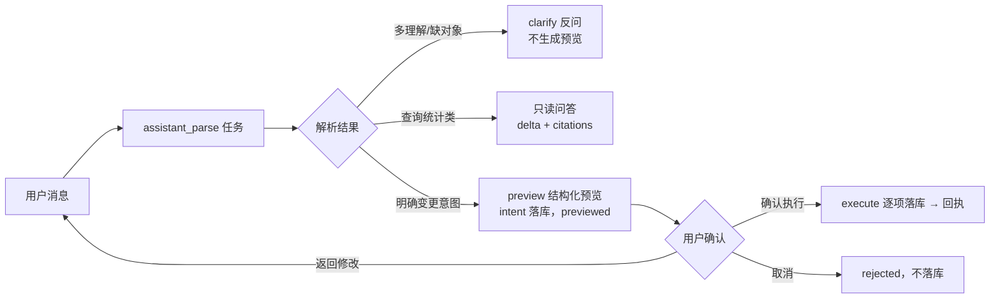

# 软件测试平台——智能助手

**文档版本**：V1.0
**日期**：2026-10-02
**状态**：起草中

---

## 1. 引言

### 1.1 编写目的

对**智能助手**能力域进行详细设计：定义按用户归属的会话与消息接口、SSE 流式协议、意图解析与变更预览结构、确认执行与回执规则。会话 / 消息表（`ai_assistant_conversation` / `ai_assistant_message`）与任务资源（`type = assistant_parse`）的 DDL 与公共协议见总册 `docs/04-detailed-design/07-ai-capability/02-ai-infra-overview.md`，本文档不重复定义。

### 1.2 范围与对应设计

- 对应需求：`docs/01-requirements/07-ai-capability/04-srs-ai-assistant.md`（US-AI-010 ~ 013）。
- 对应概要：`docs/02-high-level-design/07-ai-capability/02-hld-ai-capability.md` 第 4.2 节。
- 落库对象为**测试用例、测试评审、测试计划**三类业务数据：执行时复用既有业务服务与校验（快照语义沿用既有机制），助手不自建落库通道。

### 1.3 参考资料

- 总册：`docs/04-detailed-design/07-ai-capability/02-ai-infra-overview.md`（2.9 助手表、3.6 任务资源、错误码 101–123）
- `docs/00-spec/20-contracts/01-api.md` 9（WebSocket 与实时协议）、`docs/02-high-level-design/04-hld-data-interface.md` 2.1（`/api/ai` 分类与上下文头）

---

## 2. 数据设计

本分册**不新增表**：

- 会话与消息：`ai_assistant_conversation`（`user_id` 唯一归属 + `context_snapshot`）、`ai_assistant_message`（`intent` 预览 / `execution` 回执 / `citations` 来源引用），DDL 见总册 2.9；
- 意图解析执行：`ai_task`（`type = assistant_parse`，`workspace_id` 取 `X-Active-Workspace` 头，`project_id` 取执行上下文）。

---

## 3. 接口详细设计

### 3.1 通用约定

- 基础路径：`/api/ai/conversations`；响应 `Result<T>`，示例**仅展示 `data`**。
- **上下文头按操作分层**（C4）：

| 操作 | 请求头 | 理由 |
| ---- | ---- | ---- |
| 会话列表 / 创建 / 重命名 / 删除 / 消息历史 | 仅 `Authorization` | 会话按人归属，不带工作空间 / 项目条件 |
| 发送消息 | + `X-Active-Workspace` | 只读问答与意图解析的 RAG 限权作用域 |
| 执行落库 | + `X-Active-Workspace` + `X-Active-Project` | 执行范围限于预览目标所属工作空间与项目，服务端强校验（4.2） |

- 全部接口先校验会话 `user_id = 当前用户`，否则 1000018251（防 IDOR，管理员同样不越权）。

### 3.2 会话列表

- **路径**：`GET /api/ai/conversations`
- **参数**：`keyword`（标题包含，可选）、`pageNo`、`pageSize`（默认 20）。
- **响应**（按 `created_at` 倒序）：

```json
{
  "list": [
    {
      "id": "…",
      "title": "生成登录模块用例",
      "status": "active",
      "lastMessageAt": "2026-10-02T09:10:00Z",
      "messageCount": 8
    }
  ],
  "total": 12
}
```

### 3.3 创建会话

- **路径**：`POST /api/ai/conversations`
- **请求**（`context` 为页面实体引用，非上下文标识；工作空间标识由服务端从请求头写入 `context_snapshot`）：

```json
{
  "title": "生成登录模块用例",
  "context": { "entityType": "mindmap_document", "entityId": "…", "entityTitle": "登录用例文档" }
}
```

- **响应**：会话对象（同 3.2 单条）；`context_snapshot = { workspaceId, context, capturedAt }`。
- **校验**：`title` ≤ 100 字符（缺省「新会话」，首问后回填）；`context.entityId` 可选，须属当前用户可见范围。

### 3.4 会话重命名 / 归档 / 删除

- `PATCH /api/ai/conversations/{conversationId}` `{ "title": "…" }` —— 重命名。
- `PATCH /api/ai/conversations/{conversationId}` `{ "status": "archived" }` —— 归档（归档后不可发消息，1000018259）。
- `DELETE /api/ai/conversations/{conversationId}` —— 逻辑删除会话与全部消息；**不影响任何已确认落库的数据**（需求分册口径）。

### 3.5 发送消息（SSE 流式）

- **路径**：`POST /api/ai/conversations/{conversationId}/messages`
- **请求**：

```json
{
  "content": "给登录模块补全验证码过期的用例",
  "attachments": [{ "entityType": "mindmap_document", "entityId": "…" }]
}
```

- **响应**：`Content-Type: text/event-stream`，SSE 契约（本文档为唯一定义处，其他分册引用）：

| event | data | 说明 |
| ---- | ---- | ---- |
| `delta` | `{ "text": "…" }` | 助手正文增量（只读问答与澄清文本） |
| `clarify` | `{ "question": "…", "options": ["…"] }` | 解析不明确时的反问（同时落 `content`） |
| `preview` | `{ …intent 结构见 4.3 }` | 变更预览生成完毕（落消息 `intent` 字段） |
| `citations` | `[{ "type": "requirement", "id": "…", "title": "REQ-001", "quote": "…" }]` | 来源引用（只读问答必带；落 `citations` 字段） |
| `done` | `{ "messageId": "…" }` | 本条助手消息完成落盘（`status = done`） |
| `error` | `{ "code": 1000018255, "msg": "意图解析失败" }` | 流终止错误 |
| 心跳 | `: ping` 注释行 | 每 15s，防中间层断连 |

- **服务端流程**：
  1. 落用户消息（`role = user`、`attachments`）→ 创建 `assistant_parse` 任务（总册 3.6.1）；
  2. 订阅任务流式输出转发为 SSE；`status = streaming` → 完成后置 `done`；
  3. 三种产物分流：变更意图（`intent`）/ 澄清反问（`clarify`）/ 只读问答（`delta` + `citations`）；
  4. **断线恢复**：客户端断连后通过 3.6 消息历史轮询至 `status = done`，内容不丢失；服务端不因断连中止解析任务。
- **校验**：会话可发消息（1000018259）、`content` 非空且 ≤ 4000 字符（1000018260）、附件引用合法（1000018262）；RAG 不可用时只读问答按总册 4.5 降级（1000018258），**不编造数据**。

### 3.6 消息历史

- **路径**：`GET /api/ai/conversations/{conversationId}/messages`
- **参数**：`pageNo`、`pageSize`（默认 20，倒序）。
- **响应**：

```json
{
  "list": [
    {
      "id": "…",
      "role": "assistant",
      "content": "已解析为以下变更…",
      "status": "done",
      "citations": [{ "type": "requirement", "id": "…", "title": "REQ-001", "quote": "…" }],
      "intent": {
        "kind": "create_plan",
        "targetType": "test_plan",
        "targetTitle": "登录回归计划",
        "createCount": 1,
        "changes": [
          { "field": "caseIds", "op": "add", "value": 8 },
          { "field": "startAt", "op": "add", "value": "2026-10-05T00:00:00Z" }
        ],
        "scope": { "workspaceId": "…", "projectId": "…", "projectName": "电商商城" },
        "expiresAt": "2026-10-02T09:20:00Z"
      },
      "execution": null,
      "createdAt": "2026-10-02T09:10:00Z"
    }
  ],
  "total": 8
}
```

- `scope` 为预览时点的目标作用域**展示与校验依据**（数据引用），执行时以请求头为准比对（4.2）。

### 3.7 确认执行

- **路径**：`POST /api/ai/conversations/{conversationId}/messages/{messageId}/execute`
- **请求头**：`X-Active-Workspace` + `X-Active-Project`（须与 `intent.scope` 一致）。
- **请求**：`{ }`（无业务参数，参数已在 `intent` 中固化）。
- **响应**（回执，整体 200；逐项成败，部分失败成功项保留）：

```json
{
  "execution": {
    "status": "executed",
    "executedBy": "…",
    "executedAt": "2026-10-02T09:12:00Z",
    "results": [
      { "action": "create_plan", "success": true, "createdId": "…", "link": "/projects/…/plans/…" },
      { "action": "add_case", "caseId": "…", "success": false, "errorCode": 1000018257, "errorMsg": "无权限执行该操作" }
    ]
  }
}
```

- **校验顺序**：会话归属（1000018251）→ 消息存在（1000018252）→ `intent` 非空（1000018255）→ 时效（`expiresAt` 超时 1000018253）→ 未执行过（1000018254）→ 作用域一致（`intent.scope` 与请求头不一致 1000018256）→ 权限（1000018257）。

### 3.8 取消预览

- **路径**：`POST /api/ai/conversations/{conversationId}/messages/{messageId}/cancel`
- **响应**：`execution = { status: "rejected", rejectedBy, rejectedAt }`；取消不产生任何数据（1000018254 防重复）。

---

## 4. 业务逻辑设计

### 4.1 意图解析与分流



- 解析失败或存在多种理解 → 不生成预览，输出 `clarify`；**无明确业务对象的模糊指令不予执行**；
- 只读问答不进入预览流程，直接流式返回答案 + 来源引用；数据超权限范围时明确拒绝并说明（总册 4.4 限权检索）。

### 4.2 确认执行的校验与作用域

1. **预览阶段不产生任何落库数据**；`intent` 一经生成即固化（动作、目标、字段级变更、创建数量、scope 与过期时间）；
2. 执行时服务端**独立校验**：`intent.scope` 与请求头 `X-Active-Workspace / X-Active-Project` 一致，不一致拒绝（1000018256）——历史会话在新作用域下可继续问答，落库动作须回到目标作用域；
3. 落库走**既有业务服务**，权限、必填、合法性校验与界面操作完全一致（参与者须空间成员、计划时间合法、圈选用例存在等），助手不放宽任何约束；
4. **逐项事务**：成功项落库保留，失败项不落库，回执附原因与可单项重试；
5. 每次执行（含部分失败）记审计；执行回执写 `execution` 后不可变更，单项重试产生新的执行子动作追加到 `results`。

### 4.3 预览（intent）结构

| 字段 | 说明 |
| ---- | ---- |
| kind | 动作类型：`create_case / update_case / complete_case / batch_tag / create_review / adjust_review / view_review_progress / create_plan / adjust_plan / view_plan_progress` |
| targetType / targetTitle | 目标对象类型与名称 |
| createCount | 将创建的记录数量 |
| changes[] | 字段级变更：`field`、`op`（`add / replace`）、`value`（新增展示完整字段，修改展示原值 → 新值） |
| scope | 预览时点作用域（workspaceId / projectId 展示名） |
| expiresAt | 时效（默认生成后 10 分钟），超时需重新解析 |

- 首批支持的任务类型以需求分册 1.3 为准（用例新建 / 修改 / 补全 / 批量标记，评审创建与调整，计划创建与调整及进度查看）；进度查看类 `kind` 无 `changes`，执行即跳转查询（不落库，`results` 为空数组并附跳转链接）。

### 4.4 会话与上下文规则

- `context_snapshot` 仅作默认上下文与来源展示，**不参与权限判定**；切换活跃工作空间后，新消息按新上下文解析，跨工作空间指代被拒绝（1000018261）；
- 删除会话只删会话与消息，已落库数据与执行审计不受影响；
- 多轮对话：`assistant_parse` 携带同会话近 N 条消息作为上下文（N = 20），澄清消息计入。

---

## 5. 前端设计

### 5.1 全局入口与布局

- **入口**：全局常驻右下悬浮球，任意业务页面可唤起，不随路由销毁（挂在 `AppLayout` 层）；默认收起，点击展开无遮罩浮层卡片。

```
AiAssistantPanel（浮层卡片：400×560、无遮罩、可拖动、默认收起）
├── PanelHeader（会话标题、重命名、归档、删除、新会话）
├── SessionList（历史会话，时间倒序，检索）
├── MessageTimeline
│   ├── UserMessage（正文 + 附件引用）
│   ├── AssistantMessage（Markdown + citations 来源链接）
│   ├── ClarifyCard（反问 + 快捷选项回填输入框）
│   ├── PreviewCard（变更预览：目标、字段级 diff、创建数量；确认执行 / 取消 / 返回修改）
│   └── ReceiptCard（执行回执：逐项成败、对象跳转链接、单项重试）
├── ComposerInput（输入框 + 上下文附件选择 + 发送）
└── StreamIndicator（流式打字动画、断线后“恢复中…”状态）
```

### 5.2 状态管理与交互

- Pinia store `aiAssistant`：面板开合、会话列表、当前会话消息、流式缓冲、`previewing / executing` 状态；
- SSE 客户端：`fetch` + `ReadableStream` 解析事件；断连 → 标记 `interrupted` → 按 3.6 轮询消息至 `done` 自动补齐；
- 预览卡片倒计时展示 `expiresAt`；超时置灰「确认执行」并提供「重新解析」；
- 浮层卡片无遮罩：点击卡片外部不关闭，底层页面保持可交互；`[—]` / `[✕]` 或再点悬浮球收起（会话保留）；开合与拖动位置不持久化，每次进入默认收起、默认右下定位；
- 执行回执内对象链接点击跳转并收起面板（保留会话可回看）。

### 5.3 状态分支

- 空会话引导（示例指令）、流式进行中、澄清反问、预览过期、执行部分失败、只读问答无引用（RAG 未就绪提示 1000018258）、会话归档态（只读）、权限不足（回执失败项说明）。

---

## 6. 错误码定义

号段：**1000018251–1000018279（智能助手）**，以 `ErrorCodeConstants` 实际登记为准，冲突时顺延。

| 错误码 | HTTP | 说明 |
| ---- | ---- | ---- |
| 1000018251 | 404 | 会话不存在或非本人会话 |
| 1000018252 | 404 | 消息不存在 |
| 1000018253 | 409 | 预览不存在或已过期 |
| 1000018254 | 409 | 预览已执行或已取消 |
| 1000018255 | 400 | 意图解析失败，无法生成预览 |
| 1000018256 | 409 | 执行作用域与预览目标不一致 |
| 1000018257 | 403 | 无权限执行该操作 |
| 1000018258 | 400 | 只读问答检索不可用（向量能力未就绪） |
| 1000018259 | 409 | 会话已归档，不可发送消息 |
| 1000018260 | 400 | 消息内容为空或超过长度限制 |
| 1000018261 | 409 | 跨工作空间指代被拒绝，请切换作用域 |
| 1000018262 | 400 | 附件引用非法 |

---

## 7. 实施说明

**新增 / 修改文件**

| 文件 | 说明 |
| ---- | ---- |
| `server/.../controller/ai/AiAssistantController` | 会话 / 消息 / 执行 / 取消路由（仅路由，C2） |
| `server/.../service/ai/assistant/AssistantService + Impl` | 会话归属校验、消息落盘、SSE 桥接 |
| `server/.../service/ai/assistant/AssistantExecuteService + Impl` | 预览校验、作用域比对、分发既有业务服务落库 |
| `server/.../service/ai/task/handler/AssistantParseHandler` | 解析执行器（分流：意图 / 澄清 / 问答） |
| `server/.../framework/common/ErrorCodeConstants` | 登记 1000018251–1000018262 |
| `web/src/components/ai/assistant/*`（Panel、Timeline、PreviewCard、ReceiptCard） | 助手前端 |
| `web/src/stores/aiAssistant.ts`、`web/src/services/aiAssistant.ts` | 状态与 API（含 SSE 客户端封装） |

- **数据库**：无新增表（复用总册 2.9 两张表）。
- **OpenAPI**：SSE 接口以 `text/event-stream` 单独标注（springdoc `@ApiResponse` content 为 `text/event-stream`）；execute / cancel 标注幂等语义。

**测试要点（C8 ≥ 70%）**

- 后端：会话归属越权全矩阵（1000018251）、SSE 事件序列与断线后消息完整、预览时效与重复执行拦截、作用域不一致拒绝、执行逐项事务与部分失败回执、只读问答引用必带、删除会话不触碰落库数据；
- 前端：SSE 解析与断连恢复轮询、预览倒计时与过期降级、回执跳转与单项重试、归档态只读、全部状态分支。

---

## 修改记录

| 版本 | 日期 | 说明 |
| ---- | ---- | ---- |
| V1.0 | 2026-10-02 | 初始版本 |
| V1.0 | 2026-10-03 | 助手面板由右侧抽屉改为无遮罩浮层卡片（可拖动、默认收起） |
