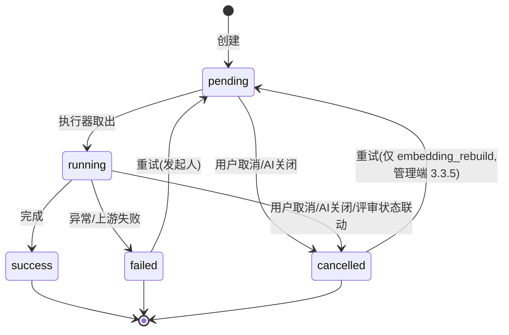

# 软件测试平台——（分册：异步任务）

**文档版本**：V1.0
**日期**：2026-09-23
**状态**：起草中

> 本分册由《》按功能模块拆分而来。前言、引言、数据设计与公共约定见总览分册 `51-ai-infrastructure-overview.md`；原章节编号保持不变，分册-章节对照见总览分册。

---

### 3.5 异步任务通用接口（项目级）

任务的**创建**接口由各业务功能定义（评审检查、缺陷聚类等，见对应文档）；本节定义统一的查询与控制接口，适用于全部 `ai_analysis_task` 记录。

#### 3.5.1 查询任务状态

- **路径**：`GET /api/project/ai/tasks/:id`
- **响应**：

```json
{
  "id": "0198…",
  "type": "review_check",
  "targetId": "0197…",
  "status": "running",
  "progress": 40,
  "result": null,
  "errorMessage": null,
  "createdBy": "0195…",
  "createdAt": "2026-07-31T10:00:00Z",
  "updatedAt": "2026-07-31T10:01:12Z"
}
```

- **说明**：任务归属项目须与 `X-Active-Project` 一致，否则 3001；全局任务（`embedding_rebuild`）不经本组接口，见 3.3.5；`result` 常规仅在 `success` 时非空，例外：`review_check` 分批累计写入，`running` / `cancelled` 状态亦可含已产出的部分结果（见 3.5.2 取消保留豁免与《AI 评审与测试计划辅助详细设计说明书》2.2.1）。前端轮询间隔 2 秒，任务终态后停止。

#### 3.5.2 取消任务

- **路径**：`POST /api/project/ai/tasks/:id/cancel`
- **约束**：仅 `pending` / `running` 可取消，且仅任务发起人可操作；其余状态返回 6006。
- **处理**：置 `cancelled` 并中断执行线程的后续批次（见 4.6）；取消后中间产物的保留策略由各任务类型定义：`review_check` 分批累计写入的已产出建议**保留可查看**（SRS 3.5.1「此前已产出的检查结果仍可查看」，见《AI 评审与测试计划辅助详细设计说明书》2.2.1/4.1），其余任务类型的中间产物不保留；历史已完成任务的 `success` 结果快照均不受取消影响。

#### 3.5.3 重试任务

- **路径**：`POST /api/project/ai/tasks/:id/retry`
- **约束**：仅 `failed` 可重试，且仅任务发起人可操作；若同 type + target 已有进行中任务返回 6005。
- **处理**：原记录重置为 `pending`（progress 0、清空 error），重新入队执行。


### 4.6 异步任务生命周期



- **创建约束**：同 `type` + `target_id`（聚类为 `type` + `project_id`，`embedding_rebuild` 为 `type` 全局唯一）同时至多一个 `pending/running` 任务，插入前 `SELECT … FOR UPDATE` 校验防并发双创建。冲突处理分两类：
  - **业务任务**（review_check / bug_clustering 等）：存在进行中同类任务时**拒绝**新建，返回 6005；
  - **`embedding_rebuild`**：为**覆盖式创建**——管理员再次变更 Embedding 配置时，先将进行中的旧重建任务置 `cancelled`（4.6 协作式取消）再建新任务，不返回 6005（系统自动触发，语义为"以最新配置为准"）；
- **created_by 归属**：`embedding_rebuild` 由保存 AI 配置的动作触发（3.3.2），`created_by` 记该管理员 id；其余任务记发起用户 id；
- **执行**：独立线程池 `aiTaskExecutor`（核心 2、最大 4、有界队列 20，拒绝时任务保持 pending 等待下轮拾取）；创建/重试时即时尝试提交线程池，另有 **pending 拾取定时任务**（每 30 秒）扫描未被抢占的 `pending` 记录重新提交，兜底队列拒绝与实例重启丢失的内存队列；任务方法内部分批调用 LLM，每批结束更新 `progress` 并检查 `status` 是否已被置 `cancelled`（协作式取消，取消只在批次边界生效）；
- **多实例防重**：任务启动时以 `UPDATE … SET status='running', executor_instance=:me WHERE id=:id AND status='pending'` 抢占（乐观更新，影响行数为 0 即放弃）；`executor_instance` 取「主机名:端口:启动UUID」；
- **孤儿回收**：定时任务（每 5 分钟）将 `running` 且 `updated_at` 超过 10 分钟未推进的任务置 `failed`（error_message = "执行实例失联"），覆盖实例宕机场景——任务执行中每批次必须触发 `updated_at` 更新；
- **联动取消**：AI 总开关关闭 → 全部 `pending/running` 置 `cancelled`；评审离开「评审中」状态 → 该评审的进行中 `review_check` 任务置 `cancelled`（由评审状态变更事务后置钩子触发，见评审辅助文档）。


