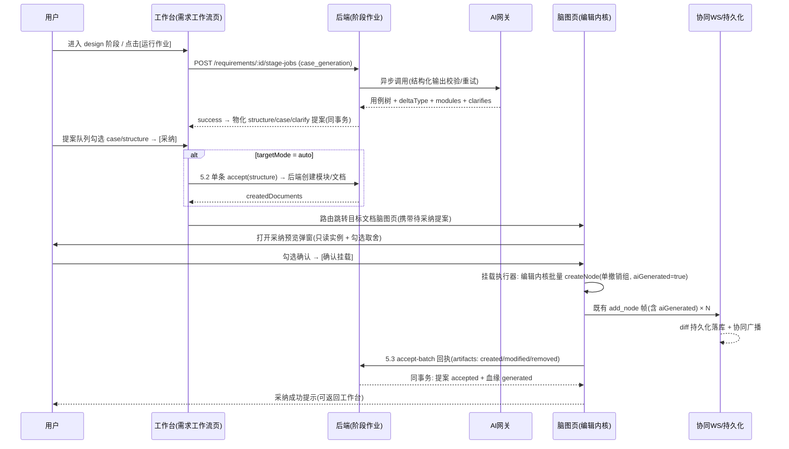

# 软件测试平台——AI 生成用例

**文档版本**：V1.0
**日期**：2026-09-23
**状态**：起草中

---

## 1. AI 生成类接口

### 1.1 用例生成（阶段作业，无独立接口）

用例生成是需求工作流 `design` 阶段的**阶段作业**（type = `case_generation`，异步执行）：

- **发起**：`POST /api/project/requirements/:id/stage-jobs`（见《需求工作流》4.1，含落位目标 `targetMode` / `documentId` 与 `extraText`）；阶段推进时按总览 2.3.3 尽力自动发起；
- **进度/取消/重试**：复用异步任务通用接口（《AI 基础设施》55 /《需求工作流》4.3），前端经 `GET /api/project/requirements/:id/stage-jobs` 轮询（2 秒间隔，终态停止）；
- **执行**：按 `targetMode` 组装上下文（见 5）调用 LLM，输出结构 = 2.2 断言 + `deltaType` / `modules` / `staleTitles` / `clarifies`（总览 2.2.2），网关侧结构校验与重试同《AI 基础设施》4.4；
- **产出**：作业 success 后同事务物化为 structure / case / clarify 提案（重复抑制见总览 2.3.3 规则 5），**不直接写任何业务数据**；落库由提案采纳链路完成（见 2）；
- 作业的发起、进度与提案处置均在条目工作台（《需求工作流》4.1 / 5.2，交互总览 2.6 / 2.7）；
- 生成期间目标文档可继续编辑（作业只读上下文，不锁定文档）。

### 1.2 补全步骤

- **路径**：`POST /api/project/ai/cases/complete-steps`（SSE）
- **请求体**：`{ "documentId", "nodeId", "extraText": "临时补充上下文，可空", "requirementIds": [], "modelId": "0198…" }`
- `modelId`：对话模型标识，取当前生效模型——用户记忆值，无记忆或失效时为系统默认模型 id，始终携带非空值（交互式功能通用约定，见基础设施 2.6 / 4.11；字段契约仍可缺省，缺省或失效时后端回退系统默认模型）；本节 1.3 的请求体同样支持该字段，不再逐一标注。
- **校验**：`nodeId` 必须为 case 类型节点；文档编辑权限。
- **上下文取材**：节点标题 + 祖先路径 + 同级节点标题（SRS 3.4.2，≤ 50 条）+ 既有子节点（去重参考，提示"已有前置/步骤/预期不重复输出"）+ 需求条目/临时文本。
- **done 帧**：`{ "nodes": [ {type: "precondition"|"step"|"expected", title, children: []} ] }`（扁平数组，见总览 2.2.1 校验）。

### 1.3 需求文档拆分（US-AI-019）

- **路径**：`POST /api/project/ai/requirements/split`（SSE）
- **请求体**：`{ "text": "整份需求文档（Markdown）", "modelId": "0198…" }`
- **校验**：`text` 非空；长度上限复用 `importTextMaxLength`（默认 20000 字符，定义见基础设施文档 2.2），超限**截断 + warning 提示，不拒绝**；需求工作流条目创建权限（与《需求工作流》2.3 一致）。
- **拆分粒度**：固定细粒度——一个需求点 = 一个可测试功能行为（如「用户管理」拆为新增/编辑/删除/查询用户四条），模块仅作归属分组，不提供粗/细切换（SRS 3.4.4）。
- **done 帧**：

```json
{
  "modules": [
    {
      "module": "用户管理",
      "items": [
        { "title": "新增用户", "content": "……（Markdown）" },
        { "title": "编辑用户", "content": "……" }
      ]
    }
  ],
  "warnings": ["文档超出输入预算，已截断"]
}
```

- **结构化输出校验**（AiOutputValidator 复用，见基础设施文档 4.4）：`modules` 非空且 ≤ 50；`module` 非空且 ≤ 100；`items` 非空且每模块 ≤ 50；`title` 非空且 ≤ 200；`content` 非空；超长字段截断并计入 `warnings`；结构不合规整体返回 error 帧，不产出部分结果。
- **说明**：拆分结果为纯预览，**不落库**；勾选入库走《需求工作流》2.7 批量接口（入库即 intake 阶段）。模块名不入库为独立字段，由前端拼接为标题前缀（「用户管理 · 新增用户」）。


## 2. 生成-提案-采纳-挂载总链路



- **预览纯本地**：预览弹窗为 kityminder 只读实例渲染的本地快照（仅本次提案内容，文档既有数据不并入），不写编辑内核、不产生撤销历史、不广播、不落库；勾选状态（`aiSelected`）仅存于该弹窗实例内存，关闭即丢弃（纯预览约束，见 `docs/05-interaction-design/01-readme.md` §2.2）；
- **挂载先于回执**：先经编辑内核写节点、后提交采纳回执；回执失败不回滚挂载（节点保留、提案待处置，回执幂等可重试，《需求工作流》5.3）；
- **stale / modified 提案**：`modified` 经编辑内核更新既有节点内容、`stale` 经编辑内核删除既有节点（整批单撤销组），回执携带 `modifiedCaseNodeIds` / `removedCaseNodeIds` 收敛血缘；
- **挂载前目标节点已被协同用户删除**：生成类提案（挂载目标为文档根节点）提示重选挂载位置（弹出节点选择器，回执按新 `documentId` 提交）；补全步骤的挂载目标只能是原 case 节点，该节点已被协同删除时提示"节点已被删除，无法挂载"，不提供重选；
- **评审/计划方案提案不走本链路**：在提案弹窗内编辑确认后由后端单事务创建实例（《需求工作流》5.2），不跳转、不挂载；
- **会话生命周期**（`docs/05-interaction-design/01-readme.md` §2.2）：补全面板常驻（非 v-if 销毁），关闭抽屉仅隐藏，**不中断进行中的 SSE、不丢弃已完成结果**；watch `docId`，仅切换文档时 `controller.cancel()` 断开 SSE 并全量重置；补全按「目标节点变化 → 重置」处理（右键新节点即重置）。


## 3. 挂载执行器（前端 `aiMount.ts`）

「补全步骤」「用例/结构提案采纳」「对话式编辑新增节点」共用同一执行器：

- 入参：目标节点 ID + 总览 2.2.1 结构的节点数组（经用户勾选过滤后）；
- 执行：`history.ts` 开启批量事务 → 深度优先逐个经编辑内核 `createNode` 创建，同步写入节点属性 `type / priority / aiGenerated: true` → 提交事务，**整批作为单条撤销历史**；
- 每个新节点触发既有 `add_node` WS 帧，帧内节点数据携带 `aiGenerated` 字段（协议扩展见总览 2.5）；
- 预览阶段（`buildPreviewTree`）仅组装本次节点树，可勾选节点按来源区分：**用例提案采纳仅 case 节点可勾选**（`aiSelected: true` 默认选中），其 precondition/step/expected 内部结构随所属用例节点级联挂载，孤立的非用例节点（分组等）不可勾选、不参与挂载；**补全模式全部生成节点可勾选**（`aiSelectable: true` 且默认选中，逐项取舍无级联）；**预览纯本地组装，不调用编辑内核**，勾选过滤（`filterCheckedTree`）仅提取 `aiGenerated && aiSelected` 的节点，仅确认挂载后才执行本节的批量写入；
- 勾选取舍规则：用例提案模式仅 case 节点可勾选，取消用例则其整棵内部结构（precondition/step/expected）一并排除，恢复勾选时整组恢复，非用例节点无勾选框、点击无效；补全模式全部生成节点可勾选（默认全选），逐项独立取舍无级联；可勾选性由 `AiPreviewNode.aiSelectable` 标记决定，勾选框渲染与点击响应均以该标记为准；
- 挂载成功后由调用方（脑图页）提交《需求工作流》5.3 采纳回执；目标节点缺失处理按场景区分（见 2）。


## 4. 优先级推荐（规则前置 + LLM 兜底）

- **规则表**：内置于后端常量（关键词 → 优先级），首发版本：

| 优先级 | 命中关键词（标题含任一） |
| ---- | ---- |
| P0 | 登录、支付、下单、密码、权限、安全、数据丢失、崩溃 |
| P1 | 提交、保存、删除、审核、导出、同步 |
| P3 | 提示文案、样式、排版、颜色、占位符 |

规则按 P0 → P1 → P3 顺序短路匹配，其余不命中（规则表不产出 P2，P2 仅来自 LLM；规则未命中且 LLM 失败/超时时无推荐，属预期行为）；
- **触发时机**：前端在节点被**手工单节点**标记为用例类型时调用接口（含手工标记与既有节点重标记）；触发判定基于标记面板的用户操作事件而非编辑内核数据变更事件，因此撤销/重做的事件重放不触发；AI 生成的节点已带优先级，不触发；DSL 批量 `mark_type` 不触发（见总览 2.4.2，避免瞬时批量请求冲击 suggestion 限流）；
- **前端呈现**：标记面板优先级按钮区上方显示推荐标签（如「推荐 P0」），点击即完成标记；用户已手工选择后到达的 LLM 结果直接丢弃；推荐请求进行中不阻塞任何操作。


## 5. 生成作业 Prompt 上下文组装

| 要素 | 内容 | 裁剪策略 |
| ---- | ---- | ---- |
| 需求上下文 | 当前条目（标题 + 内容，标题定界）+ `extraText` 附加文本 | 单条目截断至 8000 token，超限截断并在作业结果 warning 提示 |
| 结构上下文（document 模式） | 目标文档根节点标题 + 其直接子节点标题（作为新子树的同级参照，≤ 50 条） | 超出取前 50 |
| 结构上下文（auto 模式） | 项目模块树骨架（模块/文档标题清单，不传节点） | 超出取前 100 |
| 去重参考（delta） | 该条目血缘用例的标题清单 + 血缘文档名 | 全量（条目级用例有限，超出截断并在 warning 提示） |
| 既有评审/计划 | 血缘评审/计划名称清单（避免重复建议已存在的实例） | 全量 |
| 补全步骤 | case 节点标题 + 祖先路径标题链 + 同级节点标题（≤ 50 条）+ 该 case 已有前置/步骤/预期标题 | 结构上下文超出取前 50；去重参考全量（单用例子节点有限） |

- **增量（delta）约定**：Prompt 要求模型**只输出新增与变更的用例**并列出疑似失效的既有用例标题（`staleTitles`）；服务端按总览 2.2.2 的标题/结构指纹比对落定 `deltaType`，未变更的血缘用例不产出提案；
- 补全步骤的 `requirementIds` 条目内容与 `extraText` 并入需求上下文（沿用上表第一行裁剪规则）。

---

## 修改记录

| 版本 | 日期 | 说明 |
| --- | --- | --- |
| V1.0 | 2026-09-30 | 补建修改记录；请求体示例与 modelId 说明改为始终携带生效模型 id（无记忆时为系统默认） |
| V1.0 | 2026-10-01 | 用例生成改为需求工作流 design 阶段作业（移除 SSE 生成端点与工具栏入口），总链路改写为生成-提案-采纳-挂载，上下文组装改为阶段作业口径并新增 delta 约定 |
