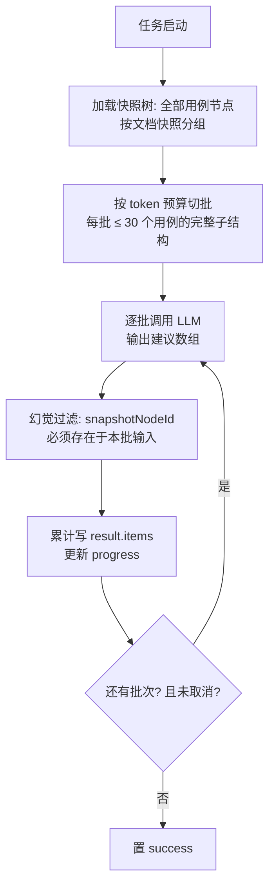

# 软件测试平台——（分册：评审一键检查）

**文档版本**：V1.0
**日期**：2026-09-23
**状态**：起草中

---

### 3.1 评审一键检查

#### 3.1.1 发起检查

- **路径**：`POST /api/project/ai/reviews/:id/check`
- **响应**：`{ "taskId": "0198…" }`
- **校验**：仅评审发起人（2001）；评审状态为 `new` / `in_progress`，已完成 `completed` 不可发起（6012）；同评审无进行中检查任务（6005）。

#### 3.1.2 查询检查结果

- **路径**：`GET /api/project/ai/reviews/:id/check-result`
- **响应**：该评审最近一次 review_check 任务（含 status/progress/result，result 结构见 2.2.1）；无记录返回 `null`。
- **权限**：仅评审发起人可查看（与发起权限一致）。

### 4.1 评审检查任务（分批执行）

- 批输入为用例节点及其 precondition/step/expected 子节点标题 + 同批相似标题分组（供优先级冲突判断）；`priority_conflict` 维度只在同批内比较（跨批冲突不检测，属已知精度取舍）；
- 单批 LLM 失败重试 1 次，仍失败跳过该批并在 result 记录 `skippedBatches`，不整体失败；全部批次跳过才置 failed；
- **联动取消**：评审离开 `in_progress` 的全部路径均须在事务提交后调用 `AiTaskService.cancelByTypeAndTarget(review_check, reviewId)`（基础设施 4.6 协作式取消）。现行评审状态机为 `new / in_progress / completed`，出口共两条：① 完成评审（`completeReview` 方法，覆盖 `new / in_progress → completed`）；② 删除评审（既有 `deleteReview` 方法，实体级出口）。检查可在 `new` 状态发起，故进行中任务无论起步于 `new` 还是 `in_progress`，评审完成或删除时均被该钩子终止。SRS 3.5.1「完成或结束」在现行模型中即上述两条；后续若评审新增其他终态，须同步挂接本钩子；
- 前端结果面板按 dimension 过滤，点击建议项经 `jumping.ts` 定位并高亮对应快照节点。

