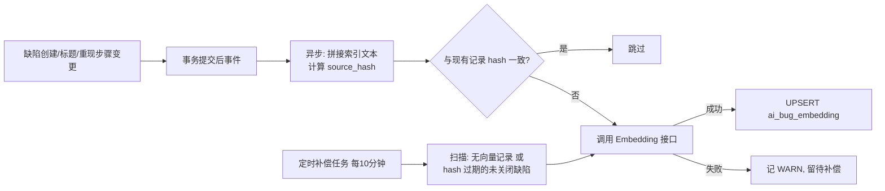

# 软件测试平台——缺陷智能分析与向量检索详细设计说明书总览

**文档版本**：V1.0
**日期**：2026-09-23
**状态**：起草中

---

## 1. 引言

### 1.1 编写目的

本文档对 AI 能力域中的**缺陷智能分析功能与向量检索基建**进行详细设计：缺陷表单智能建议、语义查重、缺陷聚类分析，以及缺陷库/用例库向量索引的写入、补偿与全量重建机制，为开发实现提供完整依据。

### 1.2 范围

覆盖 SRS 3.6（缺陷智能分析与去重）与概要 4.11（向量检索机制）。用例向量（ai_case_embedding）的**消费方**（遗漏测试点分析、用例规划推荐）见《AI 评审与测试计划辅助详细设计说明书》，其索引对象与写入时机在本文档定义（向量基建统一收口）。

公共基础（网关、限流、审计、异步任务框架、错误码、`semanticSearch` 降级状态）见《AI 基础设施详细设计说明书》。

### 1.3 参考资料

- 《软件测试平台需求规格说明书》（3.6、2.4、2.5–2.6）
- 《软件测试平台概要设计说明书》（2.5、4.11）
- 《AI 基础设施详细设计说明书》（4.6 任务框架、4.10 降级状态）
- 《工程规范 — 数据库》（向量表与 HNSW 索引规范）

---


## 2. 数据设计

### 2.1 数据库表设计

向量表与业务表一对一独立建表（数据库规范强制），无物理外键。`CREATE EXTENSION IF NOT EXISTS vector;` 与本章两张向量表 DDL 均写入 `v1.1.sql`（脚本版本化约定见《AI 基础设施详细设计说明书》第 6 章，`v1.sql` 基线不改动）。

#### 2.1.1 缺陷向量表（ai_bug_embedding）

| 字段 | 类型 | 约束 | 说明 |
| ---- | ---- | ---- | ---- |
| id | UUID | PK | 主键 |
| bug_id | UUID | NOT NULL | 对应缺陷（1:1） |
| project_id | UUID | NOT NULL | 冗余项目归属（检索前置过滤，防跨项目泄漏） |
| embedding | vector(1024) | NOT NULL | 语义向量（维度随配置，见 2.2） |
| source_hash | VARCHAR(64) | NOT NULL | 源文本 SHA-256（含模型名，判断过期） |
| model | VARCHAR(100) | NOT NULL | 生成向量的模型名 |
| is_deleted | BOOLEAN | NOT NULL DEFAULT FALSE | 是否删除 |
| created_at | TIMESTAMP | NOT NULL DEFAULT CURRENT_TIMESTAMP | 创建时间 |
| updated_at | TIMESTAMP | NOT NULL DEFAULT CURRENT_TIMESTAMP | 更新时间 |

**索引**：`uk_ai_bug_embedding_bug_id` UNIQUE (bug_id) WHERE is_deleted = false，`idx_ai_bug_embedding_project_id` (project_id)，
`idx_ai_bug_embedding_hnsw` USING hnsw (embedding vector_cosine_ops)

#### 2.1.2 用例向量表（ai_case_embedding）

| 字段 | 类型 | 约束 | 说明 |
| ---- | ---- | ---- | ---- |
| id | UUID | PK | 主键 |
| node_id | UUID | NOT NULL | 对应用例节点（test_case_node，type=case，1:1） |
| project_id | UUID | NOT NULL | 冗余项目归属 |
| embedding | vector(1024) | NOT NULL | 语义向量 |
| source_hash | VARCHAR(64) | NOT NULL | 源文本 SHA-256（含模型名） |
| model | VARCHAR(100) | NOT NULL | 模型名 |
| is_deleted | BOOLEAN | NOT NULL DEFAULT FALSE | 是否删除 |
| created_at | TIMESTAMP | NOT NULL DEFAULT CURRENT_TIMESTAMP | 创建时间 |
| updated_at | TIMESTAMP | NOT NULL DEFAULT CURRENT_TIMESTAMP | 更新时间 |

**索引**：`uk_ai_case_embedding_node_id` UNIQUE (node_id) WHERE is_deleted = false，`idx_ai_case_embedding_project_id` (project_id)，
`idx_ai_case_embedding_hnsw` USING hnsw (embedding vector_cosine_ops)

> 不冗余 `document_id`：现有消费方（遗漏分析、用例规划推荐）均为项目内过滤，无按文档过滤的检索；将来需要时可经 `test_case_node` JOIN 获取（文档删除时的向量批量清理同理），避免无消费方的冗余列与索引。

### 2.2 向量维度与索引对象

- **维度**：DDL 以默认 1024 建列；`ai_config.embedding_dimension` 与列定义不一致时，由 `embedding_rebuild` 任务执行 `ALTER COLUMN embedding TYPE vector(N)`（见 4.4），运行期二者始终一致；
- **缺陷索引对象**：`title + "\n" + repro_steps 前 2000 字符` 拼接文本；
- **用例索引对象**：`祖先路径标题链 + case 标题 + 子节点（precondition/step/expected）标题拼接`，总长截断 2000 字符——带路径与步骤能显著提升语义匹配质量；
- **source_hash** = SHA-256(`model 名 + ":" + 索引对象文本`)：模型或文本任一变化即判定过期。hash **不含维度**——该设计依赖「维度变更必然触发 `embedding_rebuild` 全量 TRUNCATE 重建（4.4）」的前提，若未来引入不重建的维度调整，须将维度纳入 hash。

### 2.3 聚类结果快照结构（ai_analysis_task.result，type=bug_clustering）

```json
{
  "generatedAt": "2026-07-31T10:00:00Z",
  "bugCount": 87,
  "clusters": [
    {
      "label": "登录态失效类问题",
      "labeled": true,
      "rootCause": "会话超时策略与前端缓存不一致（疑似）",
      "bugs": [ { "id": "0198…", "title": "登录页白屏无响应", "severity": "serious", "status": "active" } ],
      "severityDist": { "fatal": 1, "serious": 3, "general": 2, "minor": 0 },
      "moduleDist": [ { "moduleId": "0197…", "moduleName": "登录模块", "count": 4 } ]
    }
  ],
  "unclustered": ["019a…"]
}
```

`module_id` 为空的缺陷（未指定模块）在 `moduleDist` 中聚合为一项：`moduleId = null`、`moduleName = "未指定模块"`。

- `labeled` 字段（boolean）：LLM 归纳成功为 `true`；归纳失败（4.3 步骤 3 的异常兜底）或超出 `clustering.maxLabeledClusters` 未归纳、回退占位「未命名主题 N」时为 `false`。前端据此在主题卡片上明示「标签生成失败」，避免把占位标签误读为正常归纳结果（`labeled=false` 时 `rootCause` 恒为 `null`）。
- `clusters[].bugs`（`{id, title, severity, status}` 数组）携带标题/严重度/状态供前端聚类明细直接渲染（缺陷实体在任务执行期已驻内存，组装快照时零额外查询）；`unclustered` 保持纯 ID 数组（未聚类缺陷不展示明细，仅计数）。

---


均为项目级接口；语义检索类接口在降级状态下返回 `"semanticDegraded": true` 并附关键词模式结果（基础设施 4.10）。


### 2.4 向量写入与补偿链路



- 写入异步化（事务提交后 `@Async`），失败不阻断缺陷业务（SRS 4.4）；
- **重建互斥**：存在进行中（pending/running）的 `embedding_rebuild` 任务时，增量写入与补偿任务**直接跳过**——避免新旧维度/模型混写、以及与重建的 TRUNCATE/ALTER DDL 互相阻塞；空窗期的变更在重建成功后由补偿任务追平；
- 补偿扫描 SQL 按项目分组、每轮上限 200 条，避免长时间占用；扫描范围含用例节点（ai_case_embedding 同链路）；hash 过期判定需对全量未关闭缺陷与 case 节点重算索引文本 hash，千级规模成本可接受；多实例部署下补偿任务须经分布式锁（Redis `SET NX` + TTL）保证单实例执行，避免重复调用 Embedding 浪费额度；
- **用例向量写入时机**：文档节点 diff 持久化提交后，对本次变更涉及的 case 节点（标题或子节点变更、含新增）触发异步向量更新；删除节点时逻辑删除对应向量记录；
- **祖先/模块标题重命名不触发子树 case 向量的即时更新**（有意取舍：避免大子树引发同步写入风暴），此类节点因索引文本含祖先路径链，其 hash 过期由补偿任务兜底追平（最长约 10 分钟 + 批次时延，可接受）；
- 缺陷逻辑删除时同步逻辑删除 ai_bug_embedding（同事务）。


### 2.5 文件与组件

| 文件 | 说明 |
| ---- | ---- |
| `components/project/BugAiSuggest.vue` | 表单 AI 结果面板（建议区 + 查重区合一）：标题替换/等级采纳交互 + 内嵌 BugDedupList；头部 [收起/展开] 整体折叠面板（结果保留、不重新请求） |
| `components/project/BugDedupList.vue` | 疑似重复缺陷卡片列表（纯展示：相似度徽标、状态、处理人；点击打开缺陷详情抽屉；降级模式提示条；卡片 [忽略] 从本次结果移除），数据由 BugAiSuggest 注入 |
| `components/project/BugClusterPanel.vue` | 缺陷看板「AI 分析」面板：汇总条 + 报告式主题卡片（序号/主题名/缺陷数徽章/严重度内联分布点，首个默认展开；展开明细行 = 严重度色点 + 缺陷标题（快照 `bugs`）+ 状态 + 短 ID，点击跳转）+ 分布图 + 生成时间 + 刷新按钮 + 任务进行中进度条 |
| `composables/useBugDedup.ts` | 查重组合式函数：单次执行、并发过期响应丢弃（抽取以便单测，见 2.7） |
| `services/project.ts` / `types/index.ts` | 3.1–3.3 接口封装与类型 |


### 2.6 交互要点

- **查重触发**：随表单「AI 建议」按钮触发，与建议请求并发发起（无独立自动触发/防抖）；标题少于 5 字符不发起查重；查重请求进行中不阻塞输入与提交（连续触发以最后一次为准，过期响应丢弃）；
- **面板收起**：AI 结果面板头部 [收起/展开] 折叠为标题行，仅本地 UI 状态（收起不清除、不重新请求）；默认展开；
- **查重忽略**：卡片 [忽略] 将该条从本次结果移除（前端过滤，不请求后端），被忽略条目不参与提交确认；重新触发查重后按最新数据恢复展示；
- **聚类分布图**：不引入图表库，用 CSS/SVG 轻量自绘——按模块的水平条形分布（宽度比例 + 数量标签）与按严重等级的分段色条，配色沿用 `variables.scss` 语义色；
- 聚类任务轮询复用基础设施任务接口（2s 间隔）；面板打开时若无结果且无进行中任务，展示空态与「开始分析」按钮。


### 2.7 单元测试点（C8）

- 查重并发过期响应丢弃逻辑与最小长度拦截（组合式函数抽取 `useBugDedup.ts` 便于单测）；
- 建议卡片采纳/忽略的表单回填；降级提示条渲染分支；
- 查重卡片忽略过滤（忽略条目不参与提交确认）；面板收起/展开状态切换；
- 聚类分布图数据变换纯函数（moduleDist/severityDist → 渲染模型）。

---


## 3. 实施说明

- **数据库迁移**：`CREATE EXTENSION IF NOT EXISTS vector` + 2.1 两张向量表（默认 vector(1024)）DDL 写入 `v1.1.sql`（遵循基础设施文档第 6 章脚本版本化约定）；存量缺陷/用例向量经 `embedding_rebuild` 任务一次性回填；部署说明需注明 pgvector 版本要求（≥ 0.8，迭代索引扫描）；
- **UPSERT 实现提示**：向量表唯一约束为部分索引（`WHERE is_deleted = false`），`INSERT … ON CONFLICT` 须显式携带 conflict target 的 WHERE 子句（如 `ON CONFLICT (bug_id) WHERE is_deleted = false`），MyBatis-Plus 无原生支持，需手写 SQL；
- **实施梯队**：表单建议属梯队二；语义查重属梯队三（向量基建随之上线）；聚类分析属梯队四；用例向量的消费功能（遗漏分析语义版、用例规划推荐）属梯队三，见计划辅助文档；
- **依赖**：无新增依赖（pgvector 为数据库扩展；分布图自绘）。

---

**文档结束**

## 分册-章节对照表

| 分册 | 文件 | 覆盖章节 |
|---|---|---|
| 总览 | `68-bug-ai-analysis-overview.md` | 前言、1. 引言、2. 数据设计、2.4 向量写入与补偿链路、2.5 文件与组件、2.6 交互要点、2.7 单元测试点、6. 实施说明、3. 接口详细设计 |
| 表单智能建议 | `69-bug-ai-analysis-form-suggestion.md` | 3.1 缺陷表单智能建议、4.5 表单建议 Prompt 与交互 |
| 语义查重 | `70-bug-ai-analysis-semantic-dedup.md` | 3.2 缺陷语义查重、4.2 语义查重执行 |
| 聚类分析 | `71-bug-ai-analysis-clustering.md` | 3.3 缺陷聚类分析、4.3 聚类分析任务 |
| 向量重建 | `72-bug-ai-analysis-vector-rebuild.md` | 3.4 向量重建任务、4.4 向量全量重建任务 |
