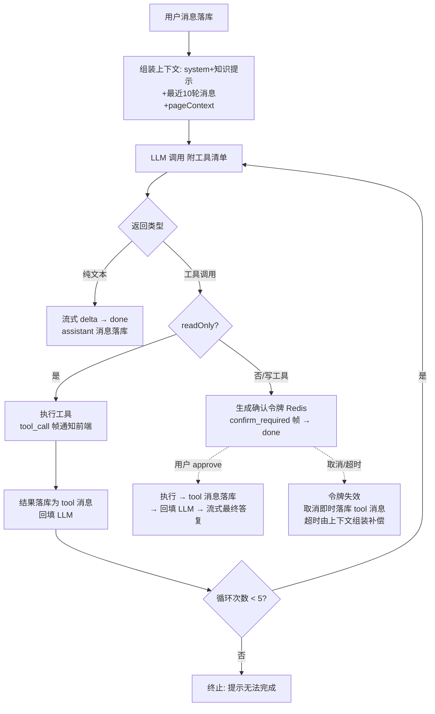

# 软件测试平台——（分册：工具调用与写确认）

**文档版本**：V1.0
**日期**：2026-09-23
**状态**：起草中

---

### 3.3 写操作确认 / 取消

#### 3.3.1 确认执行

- **路径**：`POST /api/workspace/ai/confirmations/approve`（SSE），请求体 `{"confirmToken": "…"}`——令牌经请求体传递，不入 URL（避免进入网关/反向代理访问日志）。
- **处理**：校验 token 存在（不存在/超时/已消费返回 6011）、归属当前用户，且令牌 `workspaceId` 与 `X-Active-Workspace` 一致（用户切换空间后不可确认，同样返回 6011）→ 以当前 LoginUser 执行工具（既有 Service 方法）→ 结果作为 tool 消息落库（`tool_call_id` 取令牌中的 `toolCallId`）并回填 LLM → 流式生成最终答复（帧同 3.2）；执行结果含平台内跳转链接（如新建缺陷详情路由）。
- 确认动作本身写入平台 sys_audit_log（操作类型 ai_tool_confirm）。

#### 3.3.2 取消

- **路径**：`POST /api/workspace/ai/confirmations/cancel`，请求体 `{"confirmToken": "…"}`
- **处理**：删除令牌，落一条 tool 消息（`tool_call_id` 取令牌中的 `toolCallId`，内容为"用户已取消该操作"）供后续上下文感知；返回 200。

---


### 4.1 工具注册表

```java
record ToolDefinition(
    String name,             // 唯一名，snake_case
    String description,      // 供 LLM 理解的用途描述
    Map<String, Object> paramsSchema,  // OpenAI tools 参数 JSON Schema（手写常量）
    boolean readOnly,
    String requiredPermission // 平台权限码，null 表示仅需登录
)
```

**首期工具清单**：

| 工具 | 读/写 | 参数（摘要） | 实现（复用既有 Service） |
| ---- | ---- | ---- | ---- |
| query_reviews | 只读 | status? / participatedByMe? / dateRange? | 评审列表查询（空间内全项目聚合） |
| query_plans | 只读 | status? / ownedByMe? | 计划列表查询 |
| query_bugs | 只读 | status? / severity? / assigneeIsMe? / keyword? / countOnly? | 缺陷列表/计数查询 |
| query_cases | 只读 | keyword / projectId? | 用例节点标题检索 |
| get_platform_guide | 只读 | topic | 使用指引知识片段检索（4.5） |
| translate_minder_command | 只读 | instruction（需 pageContext.documentId） | DSL 翻译（同 dsl_translation 链路），结果经 minder_commands 帧交前端 |
| create_bug | **写** | projectId / title / severity / priority / reproSteps? | 缺陷创建 Service |
| create_plan_draft | **写** | projectId / name / description? | 计划创建 Service（status=new） |

- 写工具实际可用集 = 注册表 ∩ `assistantWriteToolWhitelist`（系统配置，默认即上表两项）；白名单外的写工具不进入 LLM 工具清单；
- 跨项目查询：只读查询工具在空间内聚合时，逐项目按用户成员身份过滤（复用既有数据隔离查询），无权项目自然不可见；
- 工具执行以当前 LoginUser 走 Service 层——权限校验、业务规则、审计与人工操作完全一致（AD-6）；权限不足时工具返回错误文本（"无权执行"），由 LLM 转述，不抛异常中断会话。


### 4.2 Function Calling 执行循环



- 上下文窗口：最近 10 轮（user+assistant 对），tool 消息随所属轮次带入；超预算从最旧轮次丢弃；
- 工具调用上限 5 次/轮（防死循环），达到上限时的"无法完成"提示同样作为 assistant 消息落库并以 done 帧结束；LLM 单次返回多个工具调用时串行执行；串行途中遇到写工具即触发确认中断，同批剩余未执行的调用直接丢弃（已执行的只读结果照常落库，approve 后由 LLM 在新一轮自行决策是否重新调用）；
- **写工具中断语义**：`confirm_required` 后本轮 SSE 结束，助手状态由前端维持"等待确认"卡片；approve 开启新 SSE 流继续；同一 assistant 轮次的 tool_calls 载荷在两段间经数据库消息记录衔接（无内存态依赖，实例重启不影响待确认操作——令牌在 Redis）；
- **超时悬空补偿**：令牌超时是 Redis TTL 静默过期，不产生回调，不即时落库消息。组装上下文时检测带 `tool_calls` 但缺少对应 tool 消息的 assistant 消息，为其补一条"操作已超时未执行"的 tool 消息落库后再回填——保证送入 LLM 的消息序列始终满足 tool_calls 后必跟 tool 消息的协议约束；
- **防虚构**：system 指令强制"数据必须来自工具结果，工具查不到必须明确告知查询不到"；回复中的实体链接由工具结果携带的路由数据生成（4.6），不允许 LLM 自造 URL。


### 4.6 回复链接安全

- 工具结果中的实体统一携带 `routePath` 字段（后端由路由模板生成，如 `/project/bugs/{id}`）；
- system 约束 LLM 仅使用工具提供的 routePath 组装 Markdown 链接；
- **前端兜底**：消息 Markdown 渲染时链接白名单过滤——仅渲染站内相对路径（`/` 开头且匹配已注册路由前缀），外部 URL 一律降级为纯文本（概要 8 输出防护）。

---


