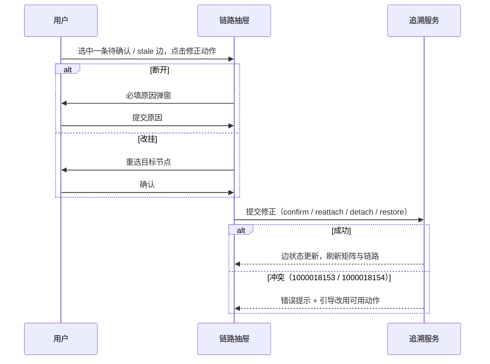
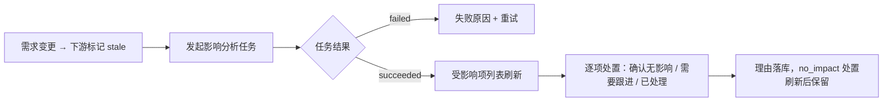

# 软件测试平台——追溯矩阵

**文档版本**：V1.0  
**日期**：2026-10-03  
**状态**：起草中

---

## 1. 概述

追溯矩阵为平台级页面，展示需求 → 模块/文档/用例 → 缺陷的全链路关系，提供矩阵与链路两种视图，以及人工建边、边修正、覆盖修正、缺口引导与变更影响处置。权限：`trace:view` 可查看矩阵/链路/覆盖/缺口/受影响项；`trace:edit` 可进行建边、修正与处置，无编辑权限时写操作入口隐藏、视图只读。视觉遵循《视觉设计》（`docs/05-interaction-design/03-visual-design.md`）。

**路由**：`/workspace/projects/trace`

**入口**：需求详情「查看追溯」（以该条目为起点定位只读链路）、分析页缺口引导、任务完成后「查看影响」链接。AI 未启用时覆盖统计与影响分析入口降级（覆盖列展示「—」）。

## 2. 页面设计

### 2.1 矩阵视图

#### 2.1.1 布局

```
┌──────────────────────────────────────────────────────────────────┐
│ 追溯矩阵        [矩阵] [缺口]        状态▾ 覆盖▾ 关键词[__] [查询]  │
├──────────────────────────────────────────────────────────────────┤
│ 需求 \ 下游      模块   脑图文档   测试用例   缺陷    覆盖状态       │
│ REQ-001 登录      1       1         12      —      ● 部分覆盖      │
│ REQ-002 订单      1       1          0      —      ● 未覆盖        │
│ REQ-003 支付      1       1          8      2      ● 完整覆盖      │
├──────────────────────────────────────────────────────────────────┤
│ 图例：链路有效 ○  待确认 ◐  stale ⚠  conflict ⚠⚠  覆盖：— 表示AI关闭 │
└──────────────────────────────────────────────────────────────────┘
```

| 区块 | 交互 |
| ---- | ---- |
| 筛选 | 状态、覆盖、关键词三项 + 查询/重置，入口角标显示条件数 |
| 单元格 | 展示该需求到该下游类型的有效边计数；点击打开链路抽屉并定位对应类型 |
| 覆盖徽标 | `covered / partial / uncovered / pending / —`，悬浮展示判定依据 |
| stale / conflict 高亮 | 行或单元格警示高亮（`--color-warning` / `--color-danger`），悬浮解释成因（版本比对失效 / 人工与 AI 结论冲突），点击进入链路处理 |
| 行点击 | 打开链路抽屉（以该需求为起点） |

### 2.2 链路视图抽屉（TraceChainDrawer）

```
┌──────────────────────────────────────────────────────────────────┐
│ 链路视图：REQ-001 登录验证码                     [关闭]            │
├──────────────────────────────────────────────────────────────────┤
│ 需求 REQ-001                                                     │
│  ├─ 模块 登录  ─○─ 脑图文档 登录脑图                              │
│  │                  └─ 用例 12（属性徽标）                        │
│  │                       └─ 缺陷 BUG-12（BUG-12 已解决）         │
│  └─ 用例 CASE-9 ◐（待确认，建议生成）    [确认] [改挂] [断开]       │
├──────────────────────────────────────────────────────────────────┤
│ 图例：○有效  ◐待确认  ⚠stale  ⚠⚠conflict  ⋯已断开                 │
│         [+ 人工建边]                                             │
└──────────────────────────────────────────────────────────────────┘
```

| 交互 | 说明 |
| ---- | ---- |
| 节点树 | 按关系层级展开/折叠；节点类型图标区分，下游节点点击跳对应详情（跨页可返回） |
| 边状态 | 每条边显示状态徽标；`stale`（版本比对失效）与 `conflict`（人工与 AI 结论冲突）行内高亮并提供处理动作 |
| 修正动作 | 确认（待确认边转有效）、改挂（重选目标节点）、断开（必填原因）、恢复（已断开边重新生效）；冲突边可采纳人工结论或保留 AI 结论 |
| 人工建边 | `trace:edit` 可见；选择源/目标节点与关系类型；同一对节点已存在有效边时提示（1000018153）并引导改用修正动作 |
| 权限降级 | 无 `trace:edit` 时隐藏全部写动作，仅浏览 |

### 2.3 覆盖修正（CoveragePanel）

| 项 | 交互 |
| ---- | ---- |
| 依据展示 | 展示 AI 覆盖判定的依据（关联用例、判定说明与引用来源） |
| 人工修正 | 表单选择覆盖结论 + 修正说明；保存后标记为人工结论，后续 AI 分析不再自动覆盖 |
| 空态 | 该需求无覆盖分析记录 → 「未分析」+「发起覆盖分析」 |

### 2.4 缺口清单（GapList）

| 项 | 交互 |
| ---- | ---- |
| 缺口列表 | 按缺口类型分组（未生成用例 / 未评审 / 未进计划等），行内展示需求条目 |
| 引导动作 | 「发起生成」跳生成配置、「发起评审」「加入计划」接入既有创建入口；已具备条件的项置灰 |
| 空态 | 「当前无追溯缺口」 |

### 2.5 影响处置（ImpactDispositionPanel）

| 项 | 交互 |
| ---- | ---- |
| 受影响项列表 | 需求变更标记后，沿追溯边列出下游受影响项（模块/文档/用例/缺陷），含影响路径 |
| 三类处置 | 逐项选择「确认无影响」「需要跟进」「已处理」；`no_impact` 处置在刷新后保留 |
| 理由录入 | 跟进与已处理须填理由；提交后写处置记录 |
| 影响分析任务 | 「发起影响分析」走通用任务口径，完成后面板数据刷新，失败可重试 |

### 2.6 状态分支

- **矩阵空态**：项目无需求 → 引导「新建需求」；
- **链路空态**：该需求无下游关系 → 引导「发起 AI 生成」；
- **任务进行中**：覆盖/影响分析进度条，完成刷新、失败重试；
- **stale / conflict**：图例常驻，未处理项高亮计数；
- **权限不足**：`trace:view` 之外不可见；无 `trace:edit` 写动作隐藏（只读降级）；
- **AI 未启用**：覆盖列「—」，影响分析入口隐藏。

## 3. 核心交互流程

### 3.1 边修正



### 3.2 影响分析与处置



## 4. 视觉与状态要求

- 链路边状态：有效 `--color-success`、待确认 `--color-info`、stale `--color-warning`、conflict `--color-danger`、已断开 `--color-neutral-400`（图例常驻，图标 + 文字不单靠颜色表意）；
- 覆盖徽标沿用《视觉设计》4.1 状态色（完整 `--color-success`、部分 `--color-warning`、未覆盖 `--color-danger`、待分析 `--color-info`、AI 关闭中性灰）；
- 单元格警示高亮用 `--color-warning-light` / `--color-danger-light` 底；
- 抽屉、弹窗与表格样式沿用 Element Plus 体系及《视觉设计》中性色阶。

## 5. 状态管理

- Pinia store `traceMatrix`：矩阵分页数据、当前链路缓存、缺口与受影响项；
- 与 `aiTask` store 联动：覆盖 / 影响分析任务 `succeeded` 后触发矩阵与覆盖数据刷新；
- 链路抽屉内修正动作成功后原位更新边状态并同步矩阵计数；跨页跳转返回时保留筛选与视图。

## 修改记录

| 版本 | 日期 | 说明 |
| ---- | ---- | ---- |
| V1.0 | 2026-10-03 | 初始版本 |
