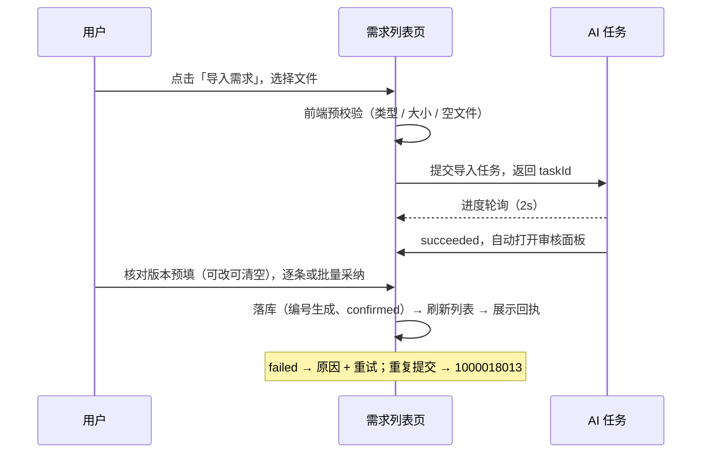
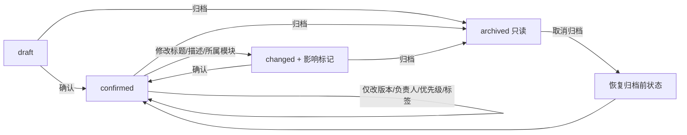

# 软件测试平台——需求管理

**文档版本**：V1.0  
**日期**：2026-10-02  
**状态**：起草中

---

## 1. 概述

需求管理为项目模式顶部菜单首位入口（链路上游：需求 → 用例 → 缺陷），包含需求列表页、需求详情与编辑页两页，以及导入对话框、AI 导入/拆分审核面板两个跨页浮层。视觉与状态色遵循《视觉设计》（`docs/05-interaction-design/03-visual-design.md`），不另行定义颜色值。

| 页面 / 浮层 | 路由或形态 | 职责 |
| ---- | ---- | ---- |
| 需求列表页 | `/workspace/projects/requirements` | 检索、筛选、确认、归档与导入入口 |
| 需求详情与编辑页 | `/workspace/projects/requirements/:requirementId` | 属性、描述、来源附件、变更时间线与追溯入口 |
| 导入对话框 | 列表页浮层 | 文件选择、预校验与任务进度 |
| AI 导入/拆分审核面板 | 任务完成后浮层 | 建议逐条/批量采纳，含系统版本预填 |
| 变更影响确认 | 详情页保存时 | 标题/描述/所属模块变更前的影响提示 |

**入口显隐**按权限点过滤：`requirement:view` 可见列表与详情；`requirement:create` 显示「新建需求」「导入需求」；`requirement:edit` 显示属性编辑、取消归档与「AI 拆分」；`requirement:confirm` 显示「确认」「归档」。AI 总开关关闭或未配置模型时，「导入需求」与「AI 拆分」入口隐藏（总册 4.5，`docs/01-requirements/07-ai-capability/02-srs-ai-capability.md`），覆盖状态列展示「—」。

## 2. 页面设计

### 2.1 需求列表页

**路由**：`/workspace/projects/requirements`

#### 2.1.1 布局

```
┌──────────────────────────────────────────────────────────────────┐
│ 需求管理               [＋ 新建需求] [⇪ 导入需求]                  │
├──────────────────────────────────────────────────────────────────┤
│ 状态▾ 所属模块▾ 负责人▾ 版本▾   关键词[________]  [查询] [重置] (2)│
├──────────────────────────────────────────────────────────────────┤
│ 编号 │ 标题 │ 所属模块 │ 版本 │ 状态 │ 覆盖状态 │ 负责人 │ 更新时间 │ 操作 │
│REQ-001│…  │ 登录模块 │ V2.3 │已确认│ 部分覆盖  │ 张三  │ 10-02  │详情 归档 更多│
│REQ-002│…  │ 订单模块 │      │草稿  │ 待分析    │ 李四  │ 10-01  │详情 确认 归档 更多│
├──────────────────────────────────────────────────────────────────┤
│ 共 42 条    每页 [20▾]     < 1  2  3 >      ▶                    │
└──────────────────────────────────────────────────────────────────┘
```

#### 2.1.2 交互说明

| 区块 | 交互 |
| ---- | ---- |
| 工具栏 | 「新建需求」打开创建抽屉；「导入需求」打开导入对话框（见 2.3） |
| 筛选栏 | 状态、所属模块、负责人、版本四项下拉 + 关键词；入口角标显示已设置条件数；关键词输入 1 秒防抖自动查询；「查询」按当前条件刷新，「重置」清空全部条件并恢复第 1 页 |
| 状态徽标 | `draft` 草稿 / `confirmed` 已确认 / `changed` 已变更 / `archived` 已归档 |
| 覆盖状态徽标 | `covered` 完整覆盖 / `partial` 部分覆盖 / `uncovered` 未覆盖 / `pending` 待分析 / `—`（AI 关闭时无统计）；悬浮显示判定依据 |
| 标题列 | 点击进入详情页；标题超长截断，悬浮完整显示 |
| 行操作 | 「详情」进详情；「确认」仅 `draft / changed` 可用；「归档」非归档态可用（需二次确认）；「更多」含「编辑」「取消归档」 |
| 分页 | 20 / 50 / 100 每页可切；筛选条件与页码在返回列表时保留 |

#### 2.1.3 状态分支

- **空态**：项目内无需求 → 引导区提示「暂无需求」+「新建需求」「导入需求」按钮；带筛选条件且无匹配 → 「无匹配结果」+「重置筛选」；
- **加载**：表格骨架屏，筛选刷新时表格局部 loading；
- **错误**：列表加载失败 → 错误提示条 +「重试」；不展示空态以避免误导；
- **权限不足**：无 `requirement:view` 不进入本页；无写权限时隐藏对应操作列按钮，只读浏览。

### 2.2 需求详情与编辑页

**路由**：`/workspace/projects/requirements/:requirementId`

#### 2.2.1 布局

```
┌──────────────────────────────────────────────────────────────────┐
│ ← 返回列表   REQ-001   登录验证码 [✎内联编辑]   [状态徽标]        │
│                                              [确认] [归档] [查看追溯] │
├─────────────────────────────────┬────────────────────────────────┤
│ 描述（Markdown 渲染，编辑切换）  │ 属性                            │
│                                 │ 所属模块  [选择器]              │
│                                 │ 版本      [V2.3____] ≤50 字符   │
│                                 │ 负责人    优先级    标签         │
│                                 │ 来源：导入 / 手工               │
├─────────────────────────────────┴────────────────────────────────┤
│ 来源附件（source = import 时展示：预览 / 下载）                    │
├──────────────────────────────────────────────────────────────────┤
│ 变更记录时间线：操作人 · 时间 · 变更内容 · 状态流转                 │
└──────────────────────────────────────────────────────────────────┘
```

#### 2.2.2 交互说明

| 区块 | 交互 |
| ---- | ---- |
| 标题 | 详情页内联编辑，失焦或回车保存，Esc 取消 |
| 属性栏 | 模块、版本、负责人、优先级、标签均可编辑；**仅提交变更字段**，保存成功 toast；版本超 50 字符前端即时校验并提示（1000018010） |
| 状态流转 | 修改标题、描述或所属模块且变更前为 `confirmed` → 保存前弹出**变更影响确认**（说明将流转 `changed` 并沿追溯边标记下游受影响项，展示受影响项数量）；「确认保存」提交并流转，「取消」放弃修改。仅改版本、负责人、优先级、标签等属性不触发流转与影响标记 |
| 确认 | `draft / changed` 显示「确认」；确认成功流转 `confirmed` |
| 归档 / 取消归档 | 归档需二次确认；归档后全页只读降级（编辑控件隐藏），仅保留「取消归档」「查看追溯」；取消归档恢复至归档前状态 |
| 来源附件 | 预览与下载；附件不存在时降级提示（1000018011） |
| 变更时间线 | 按时间倒序展示字段级变更与状态流转；「AI 拆分」产生的归档记录保留来源关联 |
| AI 拆分 | `requirement:edit` 可见；条目为 `archived` 或不满足拆分条件时置灰并提示（1000018009）；发起后进入任务进度，完成后打开审核面板（见 2.4） |
| 查看追溯 | 跳转追溯矩阵并以本条目为起点定位只读链路（`docs/04-detailed-design/05-trace-matrix.md`） |

#### 2.2.3 状态分支

- **条目不存在**（越权或已删除）→ 404 提示 + 返回列表；
- **归档只读**：全部编辑控件与写按钮隐藏，属性展示为纯文本；
- **权限不足**：无 `requirement:edit` 属性只读；无 `requirement:confirm` 隐藏「确认 / 归档」；
- **并发编辑**：保存冲突时提示「该需求已被他人更新」，提供「查看最新」刷新后重编辑。

### 2.3 导入对话框与任务进度

#### 2.3.1 流程与交互

1. **文件选择**：点击或拖拽上传；支持 Markdown、Word 文档与图片附件（多模态），单文件不超过 20MB；前端预校验类型（1000018006）、大小（1000018007）、空文件（1000018008），不满足即时提示、不发请求；
2. **提交**：返回 `taskId`，对话框切换为进度视图；同项目已有进行中导入/拆分任务时拒绝（1000018013），提示「存在进行中的导入任务」并提供任务中心入口；
3. **进度视图**：阶段文字 + 进度百分比，按通用任务口径 2 秒轮询；进行中可「取消」；失败展示原因摘要 +「重试」，原始文件保留；
4. **完成**：任务 `succeeded` 自动打开 AI 审核面板（见 2.4）。

#### 2.3.2 状态分支

- 预校验失败（即时提示，不关闭对话框）；
- 重复提交被拒（1000018013，引导任务中心）；
- 任务失败（原因 + 重试，可关闭对话框后从任务中心继续）；
- 网络异常（进度轮询中断 → 「连接中断，恢复中…」，自动续轮询）。

### 2.4 AI 导入/拆分审核面板

复用通用产物审核面板（`AiArtifactReviewPanel`，见 `docs/05-interaction-design/07-ai-capability/03-ai-task-ui.md`），需求域扩展如下：

#### 2.4.1 布局

```
┌──────────────────────────────────────────────────────────────────┐
│ 导入结果审核            版本[V2.3____]（识别依据：…）  ⓘ 可修改/清空│
├──────────────────────────────────────────────────────────────────┤
│ ☐ REQ建议1  登录验证码   模块：登录模块   来源：P3 §2.1 [定位]      │
│ ☐ REQ建议2  订单超时     模块：订单模块   来源：P5 §3.2 [定位]      │
│   …                                                             │
├──────────────────────────────────────────────────────────────────┤
│ [批量采纳] [全部驳回]                      已选 N 条 / 共 M 条     │
└──────────────────────────────────────────────────────────────────┘
```

#### 2.4.2 交互说明

| 区块 | 交互 |
| ---- | ---- |
| 版本输入框 | 预填 AI 从文档识别的被测业务系统版本，悬浮展示识别依据引语；可修改、可清空；识别不到时为空并提示「未识别到版本，采纳后可手工补录」 |
| 建议列表 | 每条含标题、描述、所属模块与来源原文定位；支持逐条「采纳」「修改后采纳」「驳回（可附反馈）」 |
| 批量操作 | 全选/半选勾选后「批量采纳」「全部驳回」；拆分场景提示「新条目将继承原条目版本（可在上方覆盖）、原条目将归档」 |
| 确认落库 | 采纳项生成 `REQ-` 编号、进入 `confirmed`，`systemVersion` 取面板当前值；完成后刷新列表并展示回执（逐项成败），失败项可单项重试 |

#### 2.4.3 状态分支

- 产物为空（解析未产出建议）→ 空态说明 +「关闭」；
- 全部驳回 → 回执「已全部驳回，未创建需求」；
- 部分采纳失败 → 回执逐项成败 + 单项重试；
- 任务失败（无产物）→ 从任务中心重试。

## 3. 核心交互流程

### 3.1 导入与采纳



### 3.2 需求状态流转



## 4. 视觉与状态要求

- 状态徽标：`draft` → `--color-info`；`confirmed` → `--color-success`；`changed` → `--color-warning`；`archived` → `--color-neutral-400`；口径见《视觉设计》4.1 状态色；
- 覆盖状态徽标：完整覆盖 → `--color-success`；部分覆盖 → `--color-warning`；未覆盖 → `--color-danger`；待分析 → `--color-info`；「—」用中性灰；
- 主操作（新建、导入、确认）用 Element Plus 主按钮（`--color-primary-500` 体系）；归档等收敛操作用文字按钮 + danger 确认；
- 错误提示条底色 `--color-danger-light`，AI 关闭提示条底色 `--color-warning-light`；空态、加载态遵循《视觉设计》中性色体系（`--color-neutral-*`）。

## 5. 状态管理

- Pinia store `requirement`：列表分页与筛选条件（返回列表保活）、详情缓存、导入/拆分任务引用与拆解记录；
- 复用 `aiTask` store 订阅任务进度（2 秒轮询、`terminal` 态停止），完成回调刷新列表与审核面板数据；
- 关键词输入 1 秒防抖自动查询；写操作按钮提交期间 loading 防重复点击；
- 审核面板采纳回执仅存组件本地状态，关闭即释放，任务产物状态以服务端确认结果为准。

## 修改记录

| 版本 | 日期 | 说明 |
| ---- | ---- | ---- |
| V1.0 | 2026-10-02 | 初始版本 |
