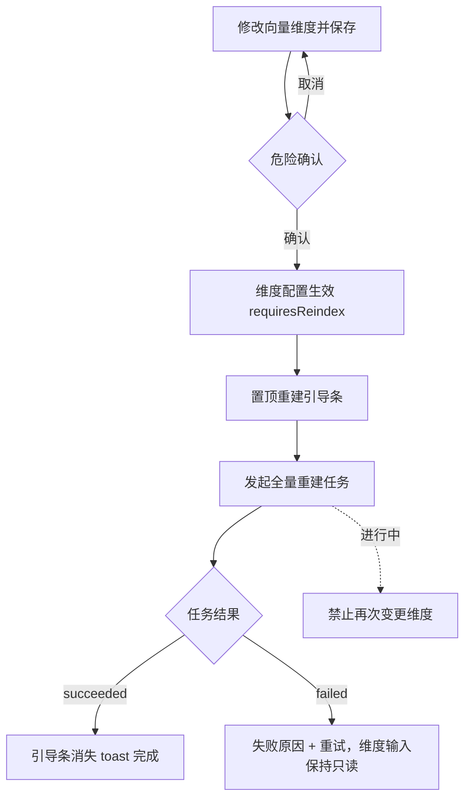
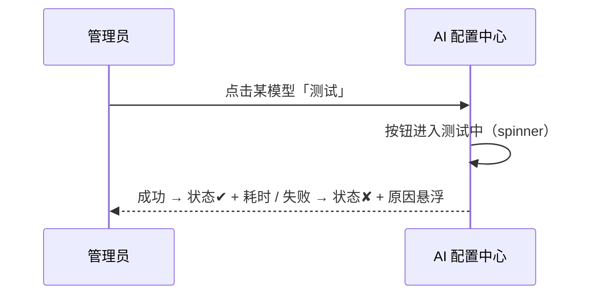

# 软件测试平台——AI 配置中心

**文档版本**：V1.0  
**日期**：2026-10-02  
**状态**：起草中

---

## 1. 概述

AI 配置中心为管理端唯一 AI 配置页，单页纵向承载五大区块：开关与默认模型、模型配置、向量 API、场景提示词、用量分析。模型供给自由配置、不锁定供应商；页面按管理端权限过滤，无权限时侧栏菜单不渲染、路由守卫拦截。视觉遵循《视觉设计》（`docs/05-interaction-design/03-visual-design.md`）。

**路由**：`/admin/ai`（管理端侧栏「AI 能力」分组）

## 2. 页面设计

### 2.1 布局

```
┌──────────────────────────────────────────────────────────────────┐
│ AI 配置                                                          │
├──────────────────────────────────────────────────────────────────┤
│ ① 开关与默认模型                                                  │
│    AI 总开关 [●]     默认模型 [gpt-4o-mini ▾]                      │
├──────────────────────────────────────────────────────────────────┤
│ ② 模型配置                          [+ 添加模型]                   │
│    名称 │ 供应商 │ 模型标识 │ 默认 │ 启用 │ 连通性 │ 操作            │
│    …    │ 自由填 │ …       │ ○   │ ●   │ ✔/✘  │ 编辑 测试 停用    │
├──────────────────────────────────────────────────────────────────┤
│ ③ 向量 API                                                       │
│    API 地址 [____]  Key [____]  维度 [1536]  批量 [____] [保存]     │
│    ⚠ 维度变更需全量重建（引导条：[发起重建]）                        │
├──────────────────────────────────────────────────────────────────┤
│ ④ 场景提示词                        （场景列表 + 编辑/恢复默认）    │
├──────────────────────────────────────────────────────────────────┤
│ ⑤ 用量分析   范围[近7天▾]   指标：次数│tokens│耗时│成本              │
│    趋势图 + 按任务类型下钻表                                       │
└──────────────────────────────────────────────────────────────────┘
```

### 2.2 开关与默认模型

| 项 | 交互 |
| ---- | ---- |
| AI 总开关 | 关闭需二次确认，提示「关闭后业务端 AI 入口将隐藏，历史任务与产物保留」；关闭后业务端各 AI 入口隐藏（配置未就绪 `available = false`） |
| 默认模型 | 从「已启用」模型中单选；无启用模型时禁用并提示「请先添加并启用模型」 |

### 2.3 模型配置

| 项 | 交互 |
| ---- | ---- |
| 列表 | 列：名称、供应商、BaseURL、模型标识、默认标记、启用开关、连通性状态、操作（编辑 / 测试 / 停用）；连通性三态：未知（中性）/ 成功（`--color-success`，含耗时）/ 失败（`--color-danger`，悬浮原因） |
| 添加/编辑弹窗 | 供应商、BaseURL、APIKey、模型标识、超时时间；供应商为自由文本，不锁定；APIKey 已配置时输入框显示占位「已配置（输入新值以替换）」，提交为空则不修改 |
| 连通性测试 | 单模型发起，按钮进入测试中（spinner）；成功显示耗时，失败展示原因摘要；测试不阻塞其他操作 |
| 停用 | 已被设为默认的模型不可直接停用，提示先切换默认；停用后业务端不可选 |
| 保存失败 | 弹窗内联错误保留输入值，不关闭弹窗 |

### 2.4 向量 API 与重建引导

| 项 | 交互 |
| ---- | ---- |
| 配置表单 | API 地址、Key（同密钥占位口径）、向量维度、批量大小；保存成功 toast |
| 维度变更 | 保存时弹危险确认：「维度变更将使既有向量失效，需全量重建后方可继续检索」；确认后配置生效并出现重建引导条 |
| 重建引导条 | `requiresReindex` 置顶提示条（`--color-warning-light` 底）：「向量维度已变更，需全量重建」+「发起重建」；点击发起全量重建任务，进度走通用任务口径；重建期间禁止再次变更维度、引导条显示进行中 |
| 重建完成 | 引导条消失，toast「向量重建完成」 |

### 2.5 场景提示词

| 项 | 交互 |
| ---- | ---- |
| 列表 | 列：场景、内容摘要、更新人、更新时间、操作（编辑 / 恢复默认） |
| 编辑弹窗 | 多行编辑器 + 底部「可用变量」占位说明（悬浮替换）；保存校验非空 |
| 恢复默认 | 二次确认「恢复后自定义内容将丢失」；成功后行内更新并提示 |

### 2.6 用量分析

| 项 | 交互 |
| ---- | ---- |
| 范围选择 | 预设「近 7 天 / 近 30 天」+ 自定义起止日期 |
| 指标切换 | 调用次数、tokens、耗时、成本四个指标页签，切换保留时间范围 |
| 下钻 | 趋势图数据点或「按任务类型」行点击 → 下钻任务明细表（类型、状态、耗时、tokens） |
| 空区间 | 补 0 展示连续曲线，不出现断点 |

### 2.7 状态分支

- 配置未就绪（未启用 / 无启用模型）：业务端 AI 入口隐藏并按总册 4.5 提示，管理端首页显示引导（先添加模型）；
- 配置保存失败：表单内联错误、保留输入；
- 连通性测试失败：原因展示，不阻塞保存；
- 重建进行中：引导条进度态，维度输入只读；
- 用量空数据：图表区空态提示 + 范围调整引导；
- 权限不足：侧栏「AI 能力」分组不渲染，直达路由 403。

## 3. 核心交互流程

### 3.1 维度变更与全量重建



### 3.2 模型连通性测试



## 4. 视觉与状态要求

- 连通性与开关状态：成功 `--color-success`、失败 `--color-danger`、未知 `--color-info`；
- 重建引导条：底色 `--color-warning-light`、边框 `--color-warning-border`，进行中含进度条（`--color-primary-500`）；
- 主操作按钮（保存、发起重建）用 Element Plus 主按钮体系（`--color-primary-*`）；危险确认的确认按钮用 `--color-danger`；
- 禁用与只读控件用中性色阶（`--color-neutral-300` 边框、`--color-neutral-400` 文本）。

## 5. 状态管理

- Pinia store `aiAdmin`：设置、模型、向量、提示词、用量，**仅管理端装载**，离开管理模式即卸载；
- 密钥类字段不入 store 明文缓存，仅保留 `keyConfigured` 标记；
- 用量图表按范围懒加载，切换页签复用缓存；重建任务进度复用 `aiTask` store 轮询。

## 修改记录

| 版本 | 日期 | 说明 |
| ---- | ---- | ---- |
| V1.0 | 2026-10-02 | 初始版本 |
