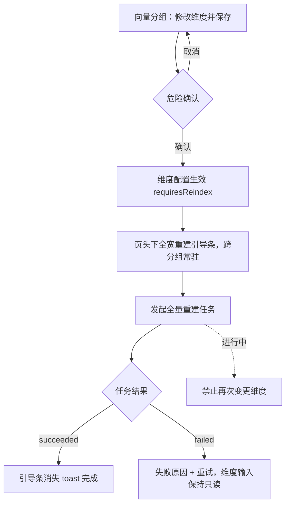
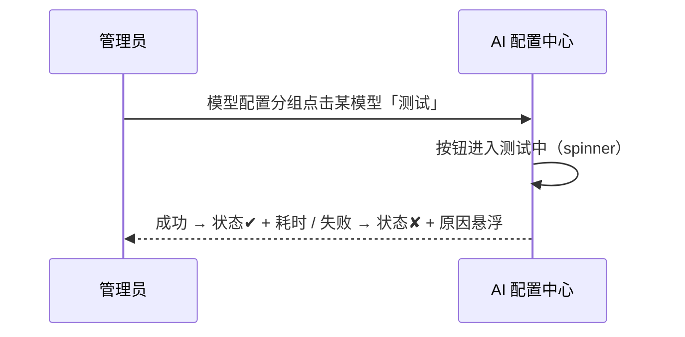

# 软件测试平台——AI 配置中心

**文档版本**：V1.0  
**日期**：2026-10-03  
**状态**：起草中

---

## 1. 概述

AI 配置中心为管理端唯一 AI 配置页，信息架构为**页头常驻全局项 + 左侧分组导航 + 右侧内容区**：AI 总开关与默认模型是跨分组的全局项，提升至页头常驻；模型配置、向量 API、场景提示词、用量分析四个分组经子路由切换，右侧只渲染当前分组。模型供给自由配置、不锁定供应商；页面按管理端权限过滤，无权限时侧栏菜单不渲染、路由守卫拦截。视觉遵循《视觉设计》（`docs/05-interaction-design/03-visual-design.md`）。

**路由**（管理端侧栏「AI 能力」分组）：

| 路由 | 分组 |
| ---- | ---- |
| `/admin/ai` | 重定向至 `/admin/ai/models` |
| `/admin/ai/models` | 模型配置（默认分组） |
| `/admin/ai/embedding` | 向量 API |
| `/admin/ai/prompts` | 场景提示词 |
| `/admin/ai/usage` | 用量分析 |

## 2. 页面设计

### 2.1 页面壳层

#### 2.1.1 布局

```
┌──────────────────────────────────────────────────────────────────────┐
│ AI 配置        AI 总开关 [●]      默认模型 [gpt-4o-mini ▾]            │
├──────────────────────────────────────────────────────────────────────┤
│ ⚠ 向量维度已变更，需全量重建   [发起重建]   （仅 requiresReindex 时出现）│
├─────────────┬────────────────────────────────────────────────────────┤
│ 模型配置  ◀  │  模型配置                              [+ 添加模型]    │
│ 向量 API    │  名称│供应商│模型标识│默认│启用│连通性 │ 操作            │
│ 场景提示词   │  …   │自由填│  …    │ ○ │ ● │ ✔ / ✘ │ 编辑 测试 停用  │
│ 用量分析     │                                                        │
│             │                                                        │
└─────────────┴────────────────────────────────────────────────────────┘
   左侧分组导航（与子路由一一对应，当前项高亮）  右侧仅渲染当前分组内容
```

#### 2.1.2 页头（跨分组常驻）

| 元素 | 交互 |
| ---- | ---- |
| AI 总开关 | 关闭需二次确认，提示「关闭后业务端 AI 入口将隐藏，历史任务与产物保留」；关闭后业务端各 AI 入口隐藏（配置未就绪 `available = false`） |
| 默认模型 | 从「已启用」模型中单选；无启用模型时禁用并提示「请先添加并启用模型」 |

#### 2.1.3 重建引导条（条件显示，跨分组常驻）

| 项 | 交互 |
| ---- | ---- |
| 触发 | 向量维度变更保存成功后 `requiresReindex` 置顶于页头下方，**全宽横幅**，切换分组不消失 |
| 内容 | 「向量维度已变更，需全量重建」+「发起重建」；点击发起全量重建任务，进度走通用任务口径 |
| 进行中 | 横幅转进度态；期间禁止再次变更维度（向量分组表单只读） |
| 终态 | 成功 → 横幅消失并 toast「向量重建完成」；失败 → 原因摘要 +「重试」，维度输入保持只读 |

#### 2.1.4 分组导航

- 左侧竖排四项（模型配置 / 向量 API / 场景提示词 / 用量分析），与子路由一一对应，当前项高亮；
- 切换分组仅替换右侧内容，页头与重建横幅保持；直达、刷新、浏览器前进后退均保留当前分组；
- 分组不设独立权限，页面级权限统一由路由守卫拦截。

### 2.2 模型配置（/admin/ai/models）

| 项 | 交互 |
| ---- | ---- |
| 列表 | 列：名称、供应商、BaseURL、模型标识、默认标记、启用开关、连通性状态、操作（编辑 / 测试 / 停用）；连通性三态：未知（中性）/ 成功（`--color-success`，含耗时）/ 失败（`--color-danger`，悬浮原因） |
| 添加/编辑弹窗 | 名称、供应商、BaseURL、APIKey、模型标识、能力、优先级、启用、输入 / 输出单价（每百万 token）；供应商为自由文本，不锁定；APIKey 已配置时输入框显示占位「已配置（输入新值以替换）」，提交为空则不修改 |
| 连通性测试 | 单模型发起，按钮进入测试中（spinner）；成功显示耗时，失败展示原因摘要；测试不阻塞其他操作 |
| 停用 | 已被设为默认的模型不可直接停用，提示先切换默认；停用后业务端不可选 |
| 保存失败 | 弹窗内联错误保留输入值，不关闭弹窗 |
| 空态 | 无模型时引导「添加第一个模型」，页头默认模型同步禁用 |

### 2.3 向量 API（/admin/ai/embedding）

| 项 | 交互 |
| ---- | ---- |
| 配置表单 | 服务商、API 地址、Key（同密钥占位口径）、向量模型、向量维度、算子、启用；保存成功 toast |
| 维度变更 | 保存时弹危险确认：「维度变更将使既有向量失效，需全量重建后方可继续检索」；确认后配置生效并触发重建引导条（见 2.1.3） |
| 重建完成 | 引导条消失，toast「向量重建完成」 |

### 2.4 场景提示词（/admin/ai/prompts）

| 项 | 交互 |
| ---- | ---- |
| 列表 | 列：场景、内容摘要、更新人、更新时间、操作（编辑 / 恢复默认） |
| 编辑弹窗 | 多行编辑器 + 底部「可用变量」占位说明（悬浮替换）；保存校验非空 |
| 恢复默认 | 二次确认「恢复后自定义内容将丢失」；成功后行内更新并提示 |

### 2.5 用量分析（/admin/ai/usage）

| 项 | 交互 |
| ---- | ---- |
| 范围选择 | 预设「近 7 天 / 近 30 天」+ 自定义起止日期 |
| 指标切换 | 调用次数、tokens、耗时、成本四个指标页签，切换保留时间范围 |
| 下钻 | 趋势图数据点或「按调用类型」行点击 → 下钻任务明细表（类型、状态、耗时、tokens） |
| 空区间 | 补 0 展示连续曲线，不出现断点 |

### 2.6 状态分支

- 配置未就绪（未启用 / 无启用模型）：业务端 AI 入口隐藏并按总册 4.5 提示，管理端页头显示引导（先添加模型）；
- 配置保存失败：表单内联错误、保留输入；
- 连通性测试失败：原因展示，不阻塞保存；
- 重建进行中：引导条进度态，跨分组可见，向量分组维度输入只读；
- 用量空数据：图表区空态提示 + 范围调整引导；
- 分组直达不存在的路径：重定向默认分组 `/admin/ai/models`；
- 切换分组存在未保存编辑：离开前拦截提示（保存后离开 / 放弃修改 / 取消）；
- 权限不足：侧栏「AI 能力」分组不渲染，直达路由 403。

## 3. 核心交互流程

### 3.1 维度变更与全量重建



### 3.2 模型连通性测试



## 4. 视觉与状态要求

- 分组导航当前项：主色文字 + 指示条，沿用《视觉设计》6.2 导航选中口径（`--color-primary-500`），悬浮态用中性色阶；
- 连通性与开关状态：成功 `--color-success`、失败 `--color-danger`、未知 `--color-info`；
- 重建引导条：底色 `--color-warning-light`、边框 `--color-warning-border`，进行中含进度条（`--color-primary-500`）；
- 主操作按钮（保存、发起重建）用 Element Plus 主按钮体系（`--color-primary-*`）；危险确认的确认按钮用 `--color-danger`；
- 禁用与只读控件用中性色阶（`--color-neutral-300` 边框、`--color-neutral-400` 文本）。

## 5. 状态管理

- Pinia store `aiAdmin`：设置、模型、向量、提示词、用量，**仅管理端装载**，离开管理模式即卸载；单 store 服务全部分组，切换分组复用缓存不重复请求；
- 当前分组由路由派生（`route.meta` → 导航高亮），不设独立真相源；
- 密钥类字段不入 store 明文缓存，仅保留 `keyConfigured` 标记；
- 用量分组按激活懒加载，切换指标页签复用缓存；重建任务进度复用 `aiTask` store 轮询；
- 未保存编辑挂表单组件本地，切分组前拦截（见 2.6）。

## 修改记录

| 版本 | 日期 | 说明 |
| ---- | ---- | ---- |
| V1.0 | 2026-10-03 | 初始版本 |
| V1.0 | 2026-10-03 | 信息架构改为页头常驻全局项 + 左侧分组导航 + 子路由 |
| V1.0 | 2026-10-04 | 模型弹窗与向量表单字段对齐详设 3.3 / 3.4：去掉超时时间与批量大小，补全实际字段与单价项 |
| V1.0 | 2026-10-04 | 2.5 下钻口径勘误：「按任务类型」实为「按调用类型」（`callType` = chat / embedding），详设 3.7 下钻同步补 `callType` 筛选 |
