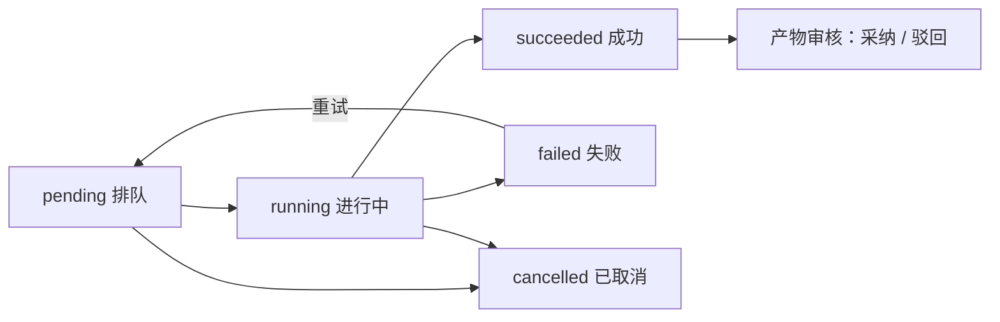
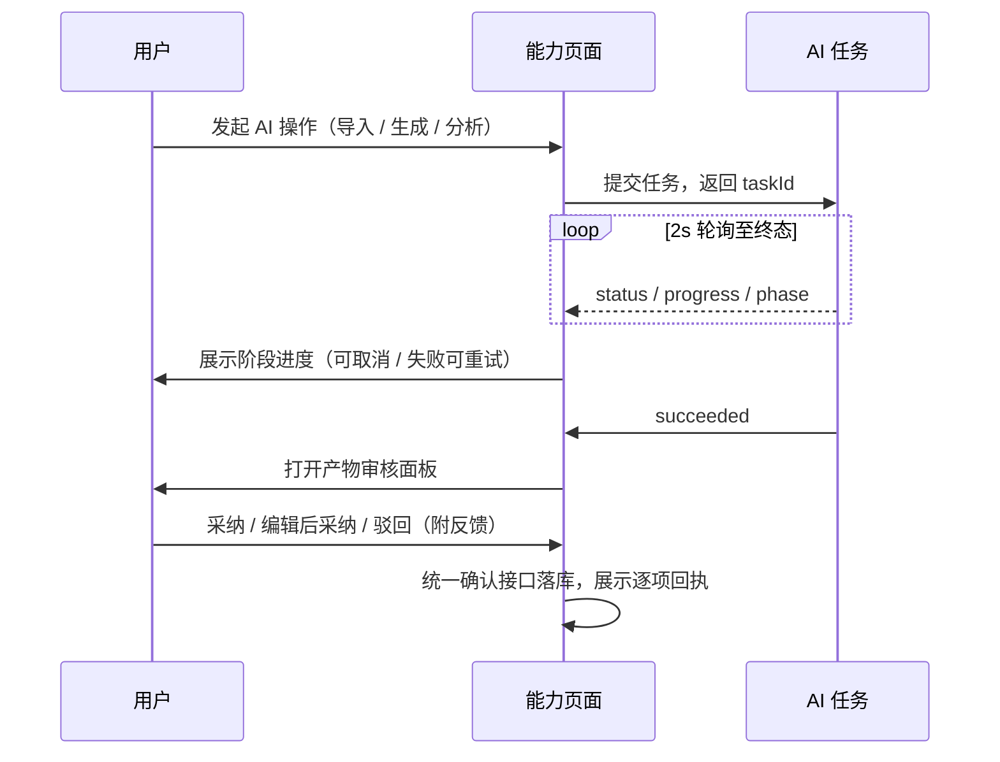

# 软件测试平台——AI 任务中心与产物审核

**文档版本**：V1.0  
**日期**：2026-10-03  
**状态**：起草中

---

## 1. 概述

AI 任务中心是项目内全部 AI 任务的统一入口，任务统一经 `POST /api/ai/tasks` 提交、`GET /api/ai/tasks/{id}` 查询；任务详情与进度弹窗共用同一套阶段展示。通用产物审核面板（`AiArtifactReviewPanel`）为各能力域复用组件，本分册定义其通用交互，生成链、导入拆解、缺陷批量分类等域扩展见各自分册。

**路由**：`/workspace/projects/ai/tasks`

**入口**：不占顶部动态菜单；由各能力页的任务入口下钻（需求导入、生成发起、影响分析、批量分类等），页面内提供「任务中心」链接。AI 未启用或未配置模型时，任务入口与本页内容按总册 4.5 隐藏或降级提示。

## 2. 页面设计

### 2.1 任务中心页

#### 2.1.1 布局

```
┌──────────────────────────────────────────────────────────────────┐
│ AI 任务中心                                                       │
├──────────────────────────────────────────────────────────────────┤
│ 类型▾  状态▾      [查询] [重置]                          [刷新]    │
├──────────────────────────────────────────────────────────────────┤
│ 任务名 │ 类型 │ 状态 │ 进度/阶段 │ 发起人 │ 发起时间 │ 操作         │
│ 导入PRD│需求导入│进行中│ ▓▓▓░ 解析中│ 张三 │ 10-02 09:00│ 详情 取消   │
│ 生成用例│生成链 │失败  │ 原因摘要  │ 李四 │ 10-01 14:20│ 详情 重试   │
├──────────────────────────────────────────────────────────────────┤
│ 共 28 条    每页 [20▾]     < 1  2 >                              │
└──────────────────────────────────────────────────────────────────┘
```

#### 2.1.2 交互说明

| 区块 | 交互 |
| ---- | ---- |
| 筛选 | 任务类型、任务状态两项下拉 + 查询/重置；状态取值 `pending / running / succeeded / failed / cancelled` |
| 状态徽标 | `pending` 排队（等待动画）/ `running` 进行中（进度条 + 当前阶段 `phase`）/ `succeeded` 成功 / `failed` 失败（悬浮原因摘要）/ `cancelled` 已取消（中性灰） |
| 行操作 | 「详情」打开任务详情抽屉；`pending / running` 显示「取消」（二次确认）；`failed` 显示「重试」；`succeeded` 且有产物显示「审核」 |
| 分页 | 20 / 50 / 100 每页；筛选与页码离开页面保活 |

#### 2.1.3 状态分支

- 空态：无任务 → 「暂无 AI 任务」+ 各能力入口引导；
- 加载：表格骨架屏；刷新失败错误条 + 重试；
- 权限不足：无权限不展示任务中心入口，直达路由 403；
- AI 未启用：整页降级提示「AI 能力未启用 / 未配置模型」。

### 2.2 任务详情抽屉（AiTaskDetailDrawer）

任务中心行「详情」与各能力页进度弹窗共用。

```
┌──────────────────────────────────────────────┐
│ 任务详情                    [关闭]            │
│ 名称 / 类型 / 发起人 / 发起时间                │
│ 进度条 ▓▓▓▓▓▓░░░░            62%             │
│ 当前阶段：生成脑图文档                        │
│ 失败原因：（失败时展示，含错误码）              │
├──────────────────────────────────────────────┤
│ 阶段时间线                                    │
│  ● 解析需求   ● 生成模块结构   ◐ 生成脑图文档   │
│  ○ 标记用例节点  ○ 填充用例属性  ○ 建立追溯边    │
├──────────────────────────────────────────────┤
│ 产物计数：[模块 2] [文档 3] [用例 47]           │
│                    [取消] [重试] [进入审核]     │
└──────────────────────────────────────────────┘
```

| 区块 | 交互 |
| ---- | ---- |
| 阶段时间线 | 生成链任务展示六阶段：当前阶段高亮、完成阶段打勾、失败阶段标红并停住；其他类型任务展示其自有阶段，均由任务 `phase` 驱动 |
| 操作 | `pending / running` 可取消；`failed` 可重试（回到排队）；`succeeded` 有产物时「进入审核」打开产物审核面板 |
| 产物计数 | 徽标点击直达审核面板对应节点 |

### 2.3 通用产物审核面板（AiArtifactReviewPanel）

```
┌──────────────────────────────────────────────────────────────────┐
│ 产物审核（任务：导入 PRD 解析）                    已处理 N / 共 M │
├──────────────────────────┬───────────────────────────────────────┤
│ 产物树                    │ 内容预览 / 与既有数据对比              │
│ ▸ ▢ 模块：登录             │ AI 建议：…                            │
│   ▢ 文档：验证码            │ 既有数据：…（编辑后采纳时并排 diff）    │
│     ○ 用例节点（属性徽标）  │ 来源引用：[P3 §2.1]（点击跳原文）       │
│   ⚠ 疑似重复 / 来源已变更   │                                       │
├──────────────────────────┴───────────────────────────────────────┤
│ [单条采纳] [编辑后采纳] [整树采纳] [驳回（可附反馈）]  [批量操作▾]    │
└──────────────────────────────────────────────────────────────────┘
```

| 区块 | 交互 |
| ---- | ---- |
| 产物树 | 按能力域结构渲染，`kind` 图标区分；半选态支持树级批量选择；警示标记（疑似重复 `suspectedDuplicateOf`、来源需求已变更）行内高亮 |
| 内容预览 | 只读渲染单条产物；「编辑后采纳」进入可编辑态并展示 AI 建议 vs 既有数据并排对比 |
| 来源引用 | `sourceRefs` 引用链接点击跳需求原文定位（跨页后可返回面板，面板状态保留） |
| 动作 | 单条采纳 / 编辑后采纳 / 整树采纳 / 驳回附反馈（驳回反馈可触发重新生成）；批量操作：批量采纳、批量驳回 |
| 确认协议 | 全部动作统一走产物确认接口，确认过的产物不可重复确认（1000018113）；任务非 `succeeded` 不可确认（1000018111） |
| 回执 | 提交后展示逐项成败回执；失败项可单项重试；全驳回回执明确「未创建任何数据」 |

### 2.4 状态分支汇总

- 任务失败：详情抽屉展示原因与错误码，重试后回到 `pending`；
- 产物全驳回：回执 + 面板空态（「已全部驳回」）；
- 部分采纳：回执逐项成败，树上残留未处理项保持待确认态；
- 确认冲突（并发或重复确认）：提示「该产物已确认」并刷新面板状态；
- 权限不足：隐藏审核动作，产物只读预览。

## 3. 核心交互流程

### 3.1 任务生命周期



> 终态（`succeeded / failed / cancelled`）停止详情轮询；超时任务由服务端清扫置 `failed`（1000018117），前端以最新查询结果为准。

### 3.2 任务进度与审核时序



## 4. 视觉与状态要求

- 进度条与阶段高亮：`--color-primary-500` 体系；完成阶段 `--color-success`、失败阶段 `--color-danger`、排队 `--color-info`、已取消中性灰 `--color-neutral-400`；
- 状态徽标与失败原因悬浮层遵循《视觉设计》4.1 状态色与中性色体系；
- 产物树警示标记用 `--color-warning`（疑似重复）与 `--color-danger`（来源已变更）图标 + 文字，不单靠颜色表意；
- 回执列表成功项 `--color-success`、失败项 `--color-danger-light` 底。

## 5. 状态管理

- Pinia store `aiTask`：任务详情 2 秒轮询（`GET /api/ai/tasks/{id}`），`terminal` 态停止；任务中心列表与筛选条件；产物确认状态缓存；
- 跨页面任务进度联动：能力页通过 `aiTask` 订阅自己提交的 `taskId`，完成后回调刷新来源列表；
- 审核面板选择态与编辑态存组件本地，切换产物时提示未保存编辑；
- 确认动作成功后以服务端返回的确认状态覆盖本地缓存，避免重复确认。

## 修改记录

| 版本 | 日期 | 说明 |
| ---- | ---- | ---- |
| V1.0 | 2026-10-03 | 初始版本 |
