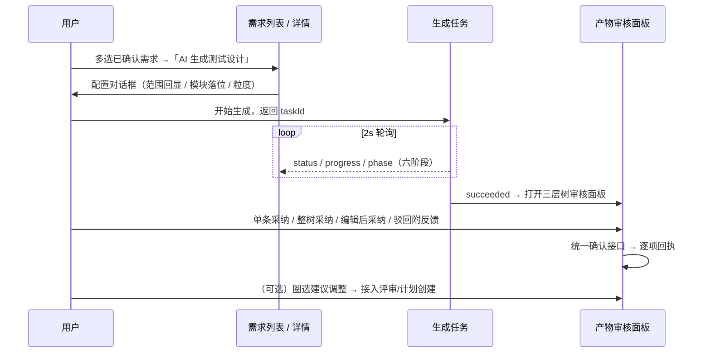

# 软件测试平台——AI+需求 生成链交互

**文档版本**：V1.0  
**日期**：2026-10-02  
**状态**：起草中

---

## 1. 概述

生成链从需求列表/详情发起，将**已确认的需求**生成模块、脑图用例文档与测试用例，并推荐评审/计划圈选；产物为待确认态，经人工审核采纳后落库。任务进度、确认协议与通用审核面板复用 `docs/05-interaction-design/07-ai-capability/03-ai-task-ui.md`，本分册只定义生成链特有交互。视觉遵循《视觉设计》（`docs/05-interaction-design/03-visual-design.md`）。

**入口**：需求列表多选 / 详情页「AI 生成测试设计」按钮；AI 未启用或未配置模型时入口隐藏（总册 4.5）。

## 2. 页面设计

### 2.1 发起配置对话框（GenerationConfigDialog）

```
┌──────────────────────────────────────────────────────────────────┐
│ AI 生成测试设计                                                    │
├──────────────────────────────────────────────────────────────────┤
│ 生成范围（已选 3 条需求）                                          │
│   ☑ REQ-001 登录验证码                                            │
│   ☑ REQ-002 订单超时                                              │
│   ☐ REQ-003 草稿需求   （置灰：草稿状态不可生成）                   │
│ 目标模块落位：[自动识别 ▾ / 指定模块 ▾]                             │
│ 用例粒度偏好：[标准 ▾]                                             │
├──────────────────────────────────────────────────────────────────┤
│                              [取消]  [开始生成]                    │
└──────────────────────────────────────────────────────────────────┘
```

| 区块 | 交互 |
| ---- | ---- |
| 生成范围 | 回显已选需求；不可选需求置灰并提示原因（草稿 / 已变更 / 已归档）；空选时「开始生成」禁用 |
| 目标模块 | 默认自动识别（AI 归入模块树），可切换指定已有模块 |
| 粒度偏好 | 影响生成用例的详细程度，沿用既有口径选项 |
| 提交 | 成功返回 `taskId`，对话框切换为进度视图（复用任务详情抽屉）；同项目已有进行中生成任务（1000018013 的通用任务口径）时提示先处理 |

### 2.2 任务进度（复用 AiTaskDetailDrawer）

- 六阶段时间线：解析需求 → 生成模块结构 → 生成脑图文档 → 标记用例节点 → 填充用例属性 → 建立追溯边；当前阶段高亮、失败阶段标红（阶段文案以任务 `phase` 返回为准）；
- ProgressHeader：进度条、失败原因摘要、产物计数徽标（模块 / 文档 / 用例）；
- Actionbar：进行中「取消」、失败「重试」、成功「进入审核」。

### 2.3 产物审核面板（三层树扩展）

复用通用产物审核面板，生成链渲染为**三层树**：模块 → 文档 → 节点（用例节点带优先级、自动化状态等属性徽标）。

| 扩展点 | 交互 |
| ---- | ---- |
| 三层树 | 模块/文档节点支持整树采纳；节点级单条采纳、驳回 |
| 对比视图 | 「编辑后采纳」并排展示 AI 建议 vs 既有数据 diff |
| 来源引用 | 用例节点 `sourceRefs` 点击回跳需求原文定位 |
| 警示标记 | 「来源需求已变更」行内提示；`suspectedDuplicateOf` 疑似重复警示（`--color-warning` 图标 + 文字） |
| 批量动作 | 批量采纳、批量驳回（驳回附反馈可触发重新生成） |
| 回执 | 逐项成败回执；全驳回明确未创建数据 |

### 2.4 圈选建议审核

| 项 | 交互 |
| ---- | ---- |
| 卡片列表 | 每条含用例条目摘要 + 推荐理由（推荐进评审 / 推荐进计划两个分组） |
| 调整 | 支持移除不认可的卡片、手动添加范围内用例 |
| 提交 | 确认前展示「将创建 N 条评审记录 / M 条计划记录」，接入既有评审/计划创建弹窗完成落库 |
| 状态 | 无推荐（圈选为空）→ 空态说明；提交后跳转对应评审/计划页 |

### 2.5 状态分支

- 任务排队 / 进行中（阶段进度）/ 失败（原因 + 重试）/ 已取消（灰态）；
- 产物审核：全部驳回、部分采纳回执（逐项成败）；
- 发起时所选需求状态已变化（不再满足条件）→ 提交报错并刷新范围回显；
- AI 未启用 / 未配置模型 → 发起入口隐藏（总册 4.5）；
- 权限不足 → 隐藏「AI 生成测试设计」，已打开的任务只读。

## 3. 核心交互流程



## 4. 视觉与状态要求

- 阶段时间线：完成 `--color-success`、当前 `--color-primary-500`、失败 `--color-danger`、未开始 `--color-neutral-300`；
- 置灰不可选项：`--color-neutral-300` 边框 + `--color-neutral-400` 文本，悬浮显示原因；
- 疑似重复与来源变更警示：`--color-warning` / `--color-danger` 图标 + 文字（不单靠颜色表意）；
- 属性徽标（优先级等）沿用《视觉设计》用例优先级色（`--color-priority-p0` ~ `--color-priority-p3`）。

## 5. 状态管理

- 复用 `aiTask` store：进度轮询、终态停止、重试后任务引用更新；
- 配置对话框状态（范围、落位、粒度）存组件本地，提交成功即释放；
- 审核面板树选择态、编辑态存组件本地；采纳回执以服务端确认结果为准；
- 圈选建议列表存组件本地，提交成功后释放并跳转。

## 修改记录

| 版本 | 日期 | 说明 |
| ---- | ---- | ---- |
| V1.0 | 2026-10-02 | 初始版本 |
