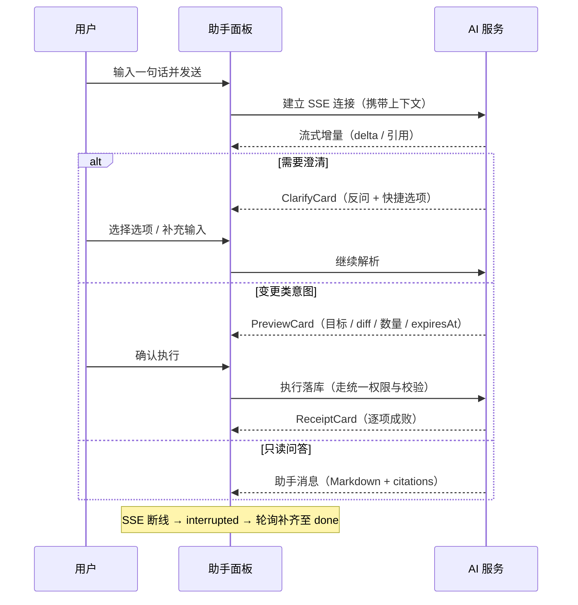

# 软件测试平台——智能助手

**文档版本**：V1.0  
**日期**：2026-10-03  
**状态**：起草中

---

## 1. 概述

智能助手为平台级全局能力，核心链路：**一句话 → 意图解析 → 变更预览 → 人工确认 → 落库 → 回执**（总册 1.5 口径，`docs/01-requirements/07-ai-capability/02-srs-ai-capability.md`）。助手不绕过任何权限与业务校验；会话与消息**仅创建人可见**。入口挂载应用壳层，不随路由销毁。视觉遵循《视觉设计》（`docs/05-interaction-design/03-visual-design.md`）。

**入口**：全局常驻侧边悬浮球（`AppLayout` 层）；AI 总开关关闭或未配置模型时入口隐藏（总册 4.5）。

## 2. 页面设计

### 2.1 全局入口与面板布局

```
                                    ┌──────────────────────────────────────┐
 [业务页面]                    ┌──▶ │ 助手   [会话▾] [✎][📦][🗑][＋新会话]  │
                               │    ├──────────────────────────────────────┤
                               │    │ 历史会话（时间倒序，检索）            │
 [🤖 悬浮球] ──点击展开右侧抽屉 ─┘    ├──────────────────────────────────────┤
                                    │ 消息流                               │
                                    │  👤 用户：帮我建一个登录评审           │
                                    │  🤖 助手：已解析意图，生成预览如下…    │
                                    │     [变更预览卡] [确认执行][取消][修改] │
                                    │  🤖 [回执卡：成功3项 · 失败1项][重试]   │
                                    ├──────────────────────────────────────┤
                                    │ [📎 附件] [输入一句话…____] [发送]      │
                                    └──────────────────────────────────────┘
```

| 区块 | 交互 |
| ---- | ---- |
| 悬浮球 | 右下角常驻；未启用 AI 或无权限时不渲染；点击展开抽屉，再点或点遮罩收起（会话保留） |
| PanelHeader | 会话标题（可重命名）、归档、删除、新会话；归档会话转只读 |
| SessionList | 历史会话时间倒序 + 关键词检索；仅展示本人创建的会话；点击切换，切换时保留未发送草稿 |
| MessageTimeline | 消息类型见 2.2；新消息自动滚动到底部，用户上滑查看历史时暂停自动跟随并显示「回到最新」 |
| ComposerInput | 输入框 + 上下文附件选择 + 发送（Enter 发送 / Shift+Enter 换行）；流式生成中禁用发送 |
| StreamIndicator | 流式打字动画；断线后显示「恢复中…」 |

### 2.2 消息类型

| 类型 | 呈现与交互 |
| ---- | ---- |
| 用户消息 | 正文 + 附件引用 |
| 助手消息 | Markdown 渲染 + `citations` 来源引用链接（点击展开来源摘要 / 跳转定位） |
| 澄清反问卡（ClarifyCard） | 反问文案 + 快捷选项；点击选项回填输入框并发送，也可自行输入 |
| 变更预览卡（PreviewCard） | 变更目标、字段级 diff、将创建的记录数量；动作：确认执行 / 取消 / 返回修改；顶部倒计时展示 `expiresAt` |
| 执行回执卡（ReceiptCard） | 逐项成败、对象跳转链接、单项重试；点击对象链接跳转并收起面板（会话保留可回看） |

### 2.3 变更预览与执行

1. 意图解析产出变更类操作时，以 PreviewCard 展示预览，**预览阶段不产生任何落库数据**；
2. 「确认执行」→ 进入 `executing`，回执生成前 ComposerInput 禁用；
3. 「取消」→ 丢弃本次变更；「返回修改」→ 将解析摘要回填输入框供修改重发；
4. 预览超时（`expiresAt` 到期）→ 确认按钮置灰，提供「重新解析」；
5. 执行结果以 ReceiptCard 展示，失败项可单项重试；助手调用落库同样受权限与校验约束，失败原因如实回执。

### 2.4 状态分支

- **空会话引导**：展示示例指令（创建评审、生成计划、查数据等），点击填入输入框；
- **流式进行中**：打字动画 + 输入禁用；
- **澄清反问**：等待用户选择或输入；
- **预览过期**：确认置灰 + 重新解析；
- **执行部分失败**：回执逐项标注 + 单项重试；
- **只读问答无引用**：RAG 未就绪时提示（1000018258），仅给出通用回答；
- **会话归档**：只读可回看，不可续写；
- **权限不足**：执行回执失败项展示具体原因，不产生任何数据；
- **断线**：SSE 中断 → 消息标记「恢复中」→ 自动轮询补齐至 `done`，无需用户干预。

## 3. 核心交互流程

### 3.1 一次问答（含变更确认）



## 4. 视觉与状态要求

- 流式光标与进行态用 `--color-primary-500`；回执成功项 `--color-success`、失败项 `--color-danger-light` 底；
- 字段级 diff：新增/变更以 `--color-success-light` 与 `--color-danger-light` 背景区分并附 +/- 图标（不单靠颜色表意）；
- 引用链接用主色文字 + 下划线悬浮态（`--color-primary-500`）；
- 预览过期、会话归档等收敛态用中性色阶（`--color-neutral-400` 文本）。

## 5. 状态管理

- Pinia store `aiAssistant`：面板开合、会话列表、当前会话消息、流式缓冲、`previewing / executing` 状态；
- SSE 客户端：`fetch` + `ReadableStream` 解析事件；断连标记 `interrupted` → 按通用口径轮询消息至 `done` 自动补齐；
- 悬浮球与抽屉挂 `AppLayout` 层，路由切换不重置会话；草稿输入按会话暂存；
- 预览倒计时由 `expiresAt` 驱动，到期仅置灰确认并提示重新解析。

## 修改记录

| 版本 | 日期 | 说明 |
| ---- | ---- | ---- |
| V1.0 | 2026-10-03 | 初始版本 |
