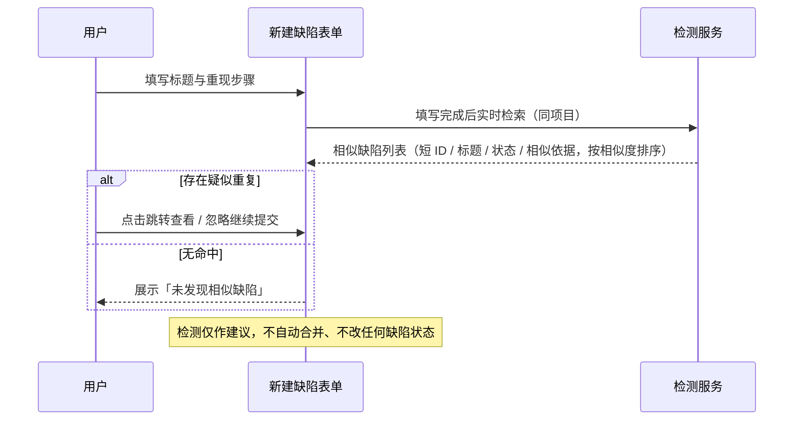
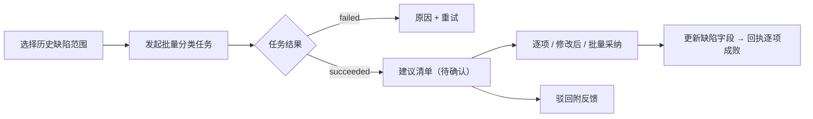

# 软件测试平台——AI 缺陷分析

**文档版本**：V1.0  
**日期**：2026-10-03  
**状态**：起草中

---

## 1. 概述

缺陷分析面向缺陷管理模块提供三类能力：趋势与质量度量、自动分类与分诊、重复缺陷检测（`docs/01-requirements/07-ai-capability/05-srs-ai-defect-analysis.md`）。承载形态为独立分析页 + 新建缺陷表单建议区 + 存量扫描入口。拥有缺陷查看权限的用户可见分析入口；统计与建议范围限于当前项目。视觉遵循《视觉设计》（`docs/05-interaction-design/03-visual-design.md`）。

**路由**：`/workspace/projects/bugs/analysis`（缺陷管理工具栏「AI 分析」进入）

## 2. 页面设计

### 2.1 缺陷分析页

#### 2.1.1 布局

```
┌──────────────────────────────────────────────────────────────────┐
│ AI 缺陷分析     范围[近30天▾] 分组[按周▾]      ⓘ口径脚注           │
├──────────────────────────────────────────────────────────────────┤
│ 趋势：新增 / 关闭 / 存量 折线图（数据点可点击下钻）                 │
├───────────────────────┬──────────────────────────────────────────┤
│ 度量卡片               │ AI 摘要                                   │
│ 修复时长 p50 / p90     │ [生成] / [重新生成] [引用来源]             │
│ 重开率 / 重复占比      │ 生成中… / 失败[重试]                      │
│ 等级分布环图           │                                          │
├───────────────────────┴──────────────────────────────────────────┤
│ 分诊队列（激活未指派）        [批量分类] [存量重复扫描]              │
│ 1. BUG-12 致命 · 已放置3天（同模块热点）      ← 可拖拽调整         │
└──────────────────────────────────────────────────────────────────┘
```

#### 2.1.2 交互说明

| 区块 | 交互 |
| ---- | ---- |
| 范围与分组 | 时间范围 + 分组维度（周/月等），口径以页脚注说明；切换后全页数据重取 |
| 趋势图 | 新增/关闭/存量折线；点击数据点 → 下钻缺陷列表（携带时间与分组参数） |
| 度量卡片 | 修复时长 p50/p90、重开率、重复占比、等级分布环图；悬浮显示取数口径 |
| AI 摘要 | 只读建议，不写入任何数据；「生成 / 重新生成」按当前范围计算，附引用来源链接；失败展示原因 + 重试 |
| 分诊队列 | 激活未指派缺陷的处理顺序建议（结合严重等级、存放时长、模块热点），悬浮显示建议理由；可拖拽调整，调整仅作用于跟进视图，AI 不自动改派缺陷 |
| 批量分类 | 对未分类或分类存疑的历史缺陷发起后台任务 → 待确认清单 → 复用通用审核面板（列表模式）逐项/批量采纳后更新缺陷字段 |
| 存量重复扫描 | 发起后台扫描 → 疑似重复分组待确认 → 人工确认分组后按既有重复缺陷机制逐条处理 |

### 2.2 新建缺陷表单建议区

| 组件 | 交互 |
| ---- | ---- |
| SuggestBadge | 基于标题、重现步骤与所属模块，为缺陷类型、严重等级、优先级、所属模块、关键词给出建议值，行内标记展示；点击一键采纳；用户已填值与建议不一致时以用户值为准，不覆盖 |
| AssigneeCandidateChips | 指派候选（依据同模块历史缺陷处理人），悬浮展示理由与来源引用；点击采纳填入指派人 |
| DuplicateCheckPanel | 标题与重现步骤填写后实时检索同项目相似存量缺陷，按相似度排序展示（短 ID、标题、状态、相似依据）；点击跳转查看；检测结果仅作建议，不自动合并、不改状态 |

### 2.3 批量分类审核（复用通用审核面板）

- 列表模式渲染缺陷建议清单：缺陷短 ID、当前分类 vs AI 建议分类、理由；
- 动作：单条采纳、修改后采纳、批量采纳、驳回附反馈；回执逐项成败；
- 任务进度与确认协议见 `docs/05-interaction-design/07-ai-capability/03-ai-task-ui.md`。

### 2.4 状态分支

- **范围无数据**：图表补 0 展示或空态提示（随分组连续）；
- **摘要生成中 / 失败**：卡片内 loading / 失败原因 + 重试；
- **批量任务**：排队、进行中、失败重试、部分采纳回执（通用任务口径）；
- **向量未就绪**：录入检测与重复扫描入口置灰 + 「向量索引未就绪」提示；
- **权限不足**：无缺陷查看权限不显示分析入口，直达路由 403；
- **AI 未启用**：入口隐藏（总册 4.5）。

## 3. 核心交互流程

### 3.1 录入时重复检测



### 3.2 批量分类采纳



## 4. 视觉与状态要求

- 趋势线与度量卡片数值用中性色为主，异常波动以 `--color-warning` / `--color-danger` 强调；
- 建议值标记（SuggestBadge）用 `--color-primary-*` 浅底徽标 + 图标，区别于用户已填值；
- 相似度排序：高相似项前置并以 `--color-warning` 图标标注（不单靠颜色表意）；
- 等级分布环图沿用缺陷等级色（`--color-bug-fatal / serious / general / minor`，见《视觉设计》4.3）。

## 5. 状态管理

- Pinia store `bugAnalysis`：范围与分组条件、趋势/度量数据、摘要任务状态、批量任务引用（轮询复用 `aiTask` store）；
- 新建表单建议与检测结果存组件本地，提交后释放；
- 批量分类/扫描完成后刷新分析页与缺陷列表数据；
- 范围切换取消上一请求（防竞态），以最新范围结果为准。

## 修改记录

| 版本 | 日期 | 说明 |
| ---- | ---- | ---- |
| V1.0 | 2026-10-03 | 初始版本 |
