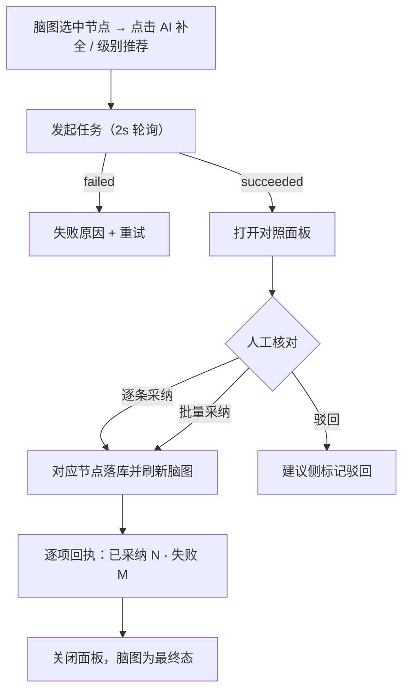

# 软件测试平台——AI 辅助功能

**文档版本**：V1.0  
**日期**：2026-10-03  
**状态**：起草中

---

## 1. 概述

辅助功能面向脑图用例编辑与测试计划执行，提供三项轻量交互式建议：**用例补全**、**用例级别推荐**、**执行顺序建议**。建议不直接生效，经人工采纳后落库，人工编辑过的内容 AI 不自动覆盖（总册 1.5，`docs/01-requirements/07-ai-capability/02-srs-ai-capability.md`）。AI 未启用时入口隐藏（总册 4.5）；视觉遵循《视觉设计》（`docs/05-interaction-design/03-visual-design.md`）。

**入口**：

```
脑图编辑器工具栏
├── 「AI 补全」（选中节点，case_complete）
└── 「级别推荐」（选中节点，case_priority）

测试计划详情
└── 「执行顺序建议」（plan_order）
```

## 2. 页面设计

### 2.1 对照面板（AssistComparePanel，补全与级别推荐复用）

#### 2.1.1 布局

```
┌──────────────────────────────────────────────────────────────────┐
│ AI 补全建议              来源：[REQ-001 登录验证码]（点击跳详情）    │
├──────────────────────────────┬───────────────────────────────────┤
│ 现有内容                      │ AI 建议                           │
│ ▢ 登录-验证码失效             │ ▢ 登录-验证码失效                  │
│ ▢ 登录-连续错误锁定    （同）   │ ▢ 登录-验证码重发   ← 新增         │
│ ▢ —                          │ ▢ 登录-图形验证码   ← 新增          │
│                              │ 级别相同项默认折叠（展开共有 N 项） │
├──────────────────────────────┴───────────────────────────────────┤
│ 补充节点树预览（用例 / 结构图标区分）                              │
├──────────────────────────────────────────────────────────────────┤
│ [逐条采纳] [批量采纳] [驳回]                     已采纳 N / 共 M   │
└──────────────────────────────────────────────────────────────────┘
```

#### 2.1.2 交互说明

| 区块 | 交互 |
| ---- | ---- |
| 两栏对照 | 左现有、右 AI 建议；级别推荐场景中级别相同项折叠为「无变化 N 项」，可展开核对 |
| 补充节点预览 | 补全建议渲染为节点树，用例节点与结构节点图标区分；不直接写入脑图 |
| 来源引用 | `sourceRefs` 点击跳需求详情定位 |
| 动作 | 逐条采纳、批量采纳、驳回；采纳后右侧对应项标记已处理，回执逐项展示成败 |
| 脑图联动 | 采纳成功后脑图对应节点即时刷新；进行中任务期间展示进度入口（超交互等待） |

### 2.2 执行顺序建议面板（PlanOrderPanel）

```
┌──────────────────────────────────────────────────────────────────┐
│ 执行顺序建议                                                       │
├──────────────────────────────────────────────────────────────────┤
│ 1  BUG-32 相关用例 · 理由：阻塞面最广（悬浮查看完整理由）   ≡拖拽    │
│ 2  BUG-07 相关用例 · 理由：核心链路                       ≡拖拽    │
│ 3  冒烟用例集                                          ≡拖拽    │
├──────────────────────────────────────────────────────────────────┤
│ 采纳前 vs 采纳后 顺序对照                                          │
├──────────────────────────────────────────────────────────────────┤
│                                   [应用建议] [放弃]                │
└──────────────────────────────────────────────────────────────────┘
```

| 区块 | 交互 |
| ---- | ---- |
| 顺序列表 | AI 建议顺序带序号徽标，行悬浮展示建议理由；可拖拽调整 |
| 前后对照 | 应用前展示「采纳前/采纳后」顺序 diff，便于核对变化 |
| 应用 / 放弃 | 「应用建议」按当前（含人工拖拽调整后）顺序生效并 toast 提示；「放弃」关闭面板不产生变更 |

### 2.3 状态分支

- **任务进行中**：入口处展示进度入口（复用任务进度），完成后面板打开；
- **全部建议与现状一致**：折叠展示 + 「无变化」提示，仅可关闭；
- **部分采纳**：回执逐项成败，未处理项保留在建议侧；
- **只读节点**：补全 / 级别推荐入口对只读或未保存节点置灰并提示原因；
- **权限不足**：隐藏入口；
- **AI 未启用 / 未配置模型**：入口隐藏（总册 4.5）；
- **来源需求已变更**：面板顶部提示，建议仅供残考、可继续采纳。

## 3. 核心交互流程



## 4. 视觉与状态要求

- 新增/变更建议项以 `--color-primary-*` 浅底标记 + 「新增」小徽标；级别变化用《视觉设计》用例优先级色（`--color-priority-p0` ~ `--color-priority-p3`）；
- 无变化折叠项用中性色阶（`--color-neutral-400` 文本）；
- 拖拽手柄与序号徽标：当前排序 `--color-primary-500`，调整中目标位 `--color-primary-100` 底；
- 回执成功 `--color-success`、失败 `--color-danger-light` 底。

## 5. 状态管理

- 任务进度复用 `aiTask` store 轮询（终态停止）；
- 对照面板与顺序面板私有状态（选择、采纳进度、拖拽顺序）挂组件本地，不入全局 store；
- 采纳成功即时刷新脑图 store / 计划详情数据；关闭面板释放本地状态。

## 修改记录

| 版本 | 日期 | 说明 |
| ---- | ---- | ---- |
| V1.0 | 2026-10-03 | 初始版本 |
