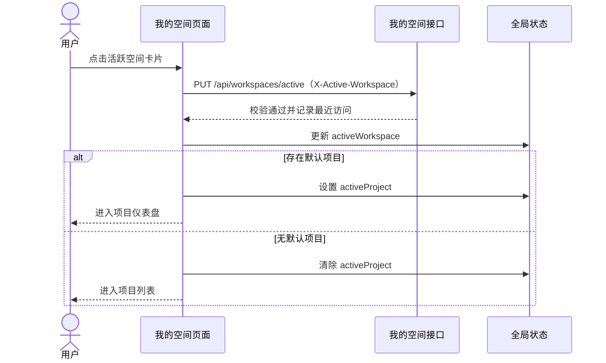

# 软件测试平台——我的空间页面

**文档版本**：V1.0  
**日期**：2026-09-23  
**状态**：已发布

---

## 1. 我的空间页面

**路由**：`/workspaces`

点击顶部导航栏[我的空间]进入。页面布局以 `web/demos/workspace/list.html` 为基准，使用真实业务数据展示当前用户归属的工作空间。

### 1.1 页面布局

```text
┌──────────────────────────────────────────────────────────────┐
│ 我的空间                                      [新建空间]     │
│ 选择一个工作空间开始协作，或创建新的空间                    │
├──────────────────────────────────────────────────────────────┤
│ [🔍 搜索空间名称] [全部（6）][我管理的（2）][已归档（1）]      │
│                                           按最近访问排序      │
├──────────────────────────────────────────────────────────────┤
│ ┌──────────────────────┐  ┌──────────────────────┐            │
│ │ [文件夹]     管理员  │  │ [文件夹]       成员  │            │
│ │ 质量中台              │  │ 供应链测试组          │            │
│ │ 核心业务线质量保障…   │  │ 仓储、履约与结算…     │            │
│ │ 24 成员 6 项目 1,024 用例 │ │ 17 成员 4 项目 736 用例 │         │
│ └──────────────────────┘  └──────────────────────┘            │
│ ┌ - - - - - - - - - - - ┐                                    │
│ │       [＋]            │                                    │
│ │   新建工作空间         │                                    │
│ │ 从空间开始组织项目与成员 │                                    │
│ └ - - - - - - - - - - - ┘                                    │
├──────────────────────────────────────────────────────────────┤
│                       分页（需要时显示）                      │
└──────────────────────────────────────────────────────────────┘
```

- 页头[新建空间]与末尾创建卡片仅对拥有 `workspace:create` 权限的用户显示。
- 卡片角色标签展示真实角色名称：预置角色为“管理员”“成员”，不显示“我管理”。
- 演示稿中的静态名称、描述、成员数、项目数、用例数均由接口真实数据替换。

### 1.2 查询工具栏

| 控件 | 交互 | 反馈 |
| ---- | ---- | ---- |
| 名称搜索 | 输入后 300ms 防抖；Enter 立即查询；清空立即查询 | 列表按名称包含匹配刷新，页码重置为 1 |
| 全部 | 点击分段按钮 | 展示当前用户全部空间，包含已归档空间 |
| 我管理的 | 点击分段按钮 | 展示当前用户担任管理员的活跃空间 |
| 已归档 | 点击分段按钮 | 展示已归档空间，卡片只读 |
| 排序说明 | 固定文案 | 显示“按最近访问排序” |

分段计数与当前名称关键词组合同步更新；计数不受当前选中分段影响。无权限用户不展示创建入口，卡片网格仍保持完整数据布局。

### 1.3 空间卡片

| 元素 | 规则 |
| ---- | ---- |
| 文件夹图标 | 管理员角色使用品牌蓝底；其他角色使用中性深灰底 |
| 角色标签 | 展示后端返回的真实角色名称，不使用行为文案替代 |
| 名称 | 单行优先，空间不足时省略；完整名称通过 `title` 提示 |
| 描述 | 最多两行；空描述显示“暂无描述” |
| 统计 | 依次显示成员数、项目数、用例数，数字使用千分位与等宽数字 |
| 活跃卡片 | 原生按钮结构；点击或 Enter/Space 切换空间并进入目标项目 |
| 当前活跃空间 | 显示现有活跃态标识，与其他卡片区分 |
| 已归档卡片 | 同时显示“已归档”“只读”文字；非交互，无悬停位移，不可进入 |

角色名称、归档状态均使用文字表达，不仅依赖颜色。

### 1.4 创建工作空间

1. 点击页头[新建空间]或末尾[新建工作空间]卡片，打开创建弹窗。
2. 弹窗字段：名称（必填，2~50 字符）、管理员（必填，默认当前用户，可搜索并改选其他活跃用户）、描述（可选，最多 200 字符）。
3. 点击[确定]后校验并提交，按钮显示 loading 并阻止重复提交。
4. 创建成功提示“工作空间已创建”，关闭弹窗并刷新“我的空间”列表。
5. 创建失败保留表单内容并显示后端错误信息。

### 1.5 进入工作空间



- 切换请求失败时不更新本地活跃空间、不跳转，显示错误提示。
- 已归档卡片不进入该流程。
- 卡片不展示默认项目名称，但默认项目自动进入规则保持不变。

### 1.6 分页与排序

- 默认每页 12 条，可切换 12/24/48；仅当前筛选结果超过单页容量时显示分页器。
- 翻页或修改每页数量后保留名称关键词与范围筛选。
- 后端按最近访问时间倒序；无访问记录时按加入时间、创建时间与 ID 稳定排序。

### 1.7 状态与异常

| 状态 | 页面反馈 |
| ---- | ---------- |
| 首次加载 | 卡片骨架屏，查询控件禁用 |
| 刷新 | 保留当前内容并显示加载反馈，忽略过期请求响应 |
| 从未归属空间 | “暂无归属的工作空间，请联系管理员”；有创建权限时展示创建入口 |
| 搜索/筛选无结果 | “未找到匹配的工作空间”；提供清除筛选操作 |
| 列表加载失败 | 错误提示并提供重试 |
| 归档空间 | 只读卡片，不调用切换接口 |
| 切换空间失败 | 保留原页面与原全局上下文，显示错误提示 |
| 创建失败 | 弹窗保持打开，保留输入，显示错误提示 |

### 1.8 响应式与可访问性

- 卡片网格使用 `repeat(auto-fill, minmax(300px, 1fr))`；中等宽度两列，窄屏单列。
- 窄屏页头纵向排列，搜索框占满可用宽度，分段控件允许换行。
- 活跃卡片使用原生按钮并提供“进入工作空间：{空间名称}”可访问名称；分段按钮提供 `aria-pressed`。
- 所有交互保留清晰焦点态；动画仅作用于边框、阴影与位移，并尊重 `prefers-reduced-motion`。
- 角色与归档状态均有文字，不以颜色作为唯一信息载体。

---

**文档结束**
