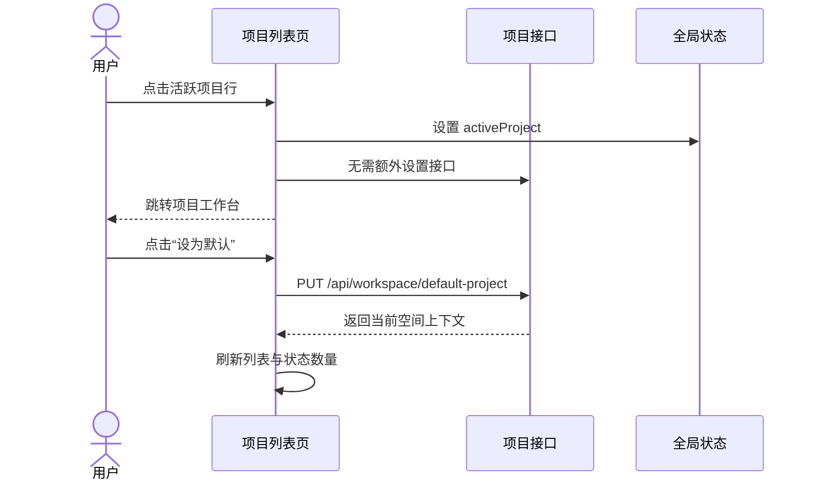

# 软件测试平台——项目管理

**文档版本**：V1.0  
**日期**：2026-09-23  
**状态**：已发布

---

## 1. 项目列表页

**路由**：`/workspace/projects`

页面布局以 `web/demos/workspace/projects.html` 为基准，使用当前工作空间的真实项目数据。首次切换到没有项目的空间时，在当前路由内展示引导态；不新增独立的 onboarding 或 select 路由。

### 1.1 页面结构

```text
┌──────────────────────────────────────────────────────────────┐
│ 项目列表                                      [新建项目]     │
│ 质量中台空间下的全部项目                                      │
├──────────────────────────────────────────────────────────────┤
│ [活跃（N）] [已归档（N）] [搜索项目名称 / 描述]  按最近更新排序 │
├──────────────────────────────────────────────────────────────┤
│ 项目名称                         描述       开始时间  结束时间 操作 │
│ 电商核心系统                     …           2026-06-01 … 进入 设为默认 │
│ 开放平台                         …           2026-07-15 … 进入 设为默认 │
├──────────────────────────────────────────────────────────────┤
│                              共 N 个项目                    │
└──────────────────────────────────────────────────────────────┘
```

- 页头展示当前工作空间名称和项目列表说明。
- “新建项目”按钮对所有工作空间成员显示。
- 工具栏提供“活跃”和“已归档”两个状态分段，不提供“全部”分段。
- 搜索同时匹配项目名称和描述；输入采用 300ms 防抖，Enter 立即查询，清空立即查询。
- 列表固定按最近更新时间排序；后端无更新时间时按 ID 稳定排序。
- 表格列为项目名称、描述、开始时间、结束时间和操作；窄屏时允许横向滚动，不改变数据顺序。

### 1.2 状态分段与数量

- 默认选中“活跃”。
- `GET /api/workspace/projects` 只返回当前状态和关键词对应的分页数据，响应为标准 `PageResult<ProjectRespDTO>`。
- `GET /api/workspace/projects/counts` 独立返回应用关键词后的 `active`、`archived` 数量，忽略当前选中的状态。
- 创建、编辑、归档、启封、删除、设置默认项目后同时刷新列表和数量。
- 数量请求与列表请求均使用请求序号保护，旧请求晚到时不得覆盖新筛选结果。
- 空间完全没有项目（`active + archived = 0`）时展示引导态；当前状态或关键词无结果时展示筛选空态，不误显示“创建第一个项目”。

### 1.3 项目行与操作

| 操作 | 触发方式 | 反馈 |
| ---- | -------- | ---- |
| 进入项目 | 点击行或“进入” | 设置活跃项目，跳转项目工作台 |
| 设为默认 | 点击“设为默认” | 调用默认项目接口，刷新当前列表并显示默认标识 |
| 编辑 | 管理员或项目创建者点击“编辑” | 打开预填表单，保存后刷新列表和数量 |
| 归档 | 空间管理员点击“归档” | 二次确认；成功后切换为“已归档”，并清除相关个人默认项目 |
| 启封 | 空间管理员点击“启封” | 二次确认；成功后切换为“活跃” |
| 删除 | 空间管理员点击“删除” | 二次确认；成功后从列表移除，并清除相关个人默认项目 |

- 活跃行可进入；已归档行只读，不显示“进入”“设为默认”“编辑”。
- “设为默认”表示设为当前用户的个人默认项目，不表示立即进入项目。
- 只有活跃且尚未设为默认的项目显示“设为默认”。
- 默认项目标识由后端根据 `workspace_user.default_project_id` 计算，前端不自行推断。
- 项目创建者信息缺失时显示“未知创建人”，不得因空对象导致列表渲染失败。

### 1.4 创建与编辑

1. 点击“新建项目”打开表单弹窗。
2. 填写名称、描述、开始时间和结束时间；名称必填且在工作空间内唯一。
3. 点击“确定”后校验并提交，按钮显示 loading 并阻止重复提交。
4. 创建或编辑成功后关闭弹窗，刷新列表与状态数量。
5. 失败时保留表单内容并显示后端错误信息。

### 1.5 进入项目与默认项目



- 设置默认项目不会改变当前活跃项目，也不会触发页面跳转。
- 归档或删除项目后，后端清除所有空间成员对该项目的默认项目引用，列表刷新后默认标识立即消失。
- 从工作空间列表进入空间时，仍遵循“有默认项目进入工作台、无默认项目进入项目列表”的既有规则。

### 1.6 状态与异常

| 状态 | 页面反馈 |
| ---- | -------- |
| 首次加载 | 表格骨架或加载指示，筛选控件禁用 |
| 刷新 | 保留当前表格并显示刷新反馈，忽略过期响应 |
| 空间无项目 | 展示创建第一个项目的引导态 |
| 筛选无结果 | 展示未找到匹配的项目，提供清除筛选操作 |
| 列表或数量加载失败 | 显示错误提示并提供重试 |
| 已归档项目 | 只读行，不显示进入、设置、编辑操作 |
| 归档/启封/删除失败 | 保留原列表并显示后端错误信息 |
| 设置默认失败 | 保留原列表并显示后端错误信息 |

### 1.7 响应式与可访问性

- 表格外层使用横向滚动容器，窄屏不挤压日期和操作列。
- 活跃状态分段使用 `aria-pressed`，搜索框提供明确标签。
- 每一行的项目名称提供可访问名称；行点击与操作按钮通过事件阻止冒泡区分。
- 状态、默认标记和只读信息同时使用文字表达，不仅依赖颜色。
- 所有可操作元素保留清晰焦点态，动画尊重 `prefers-reduced-motion`。

---

**文档结束**
