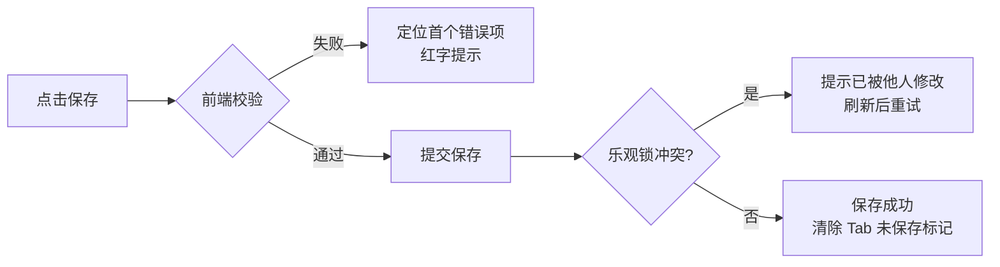

# 软件测试平台——接口定义编辑器

**文档版本**：V1.0  
**日期**：2026-09-23  
**状态**：起草中

---

## 1. 接口定义编辑器

> 当前版本按 MeterSphere 参考重设计。交互原型见 `docs/05-interaction-design/接口编辑器原型.html`。

编辑器在「接口管理」内以**多 Tab 并存**方式打开，不跳转独立路由页：编辑器 Tab 条头部最右侧固定展示 **[导入] [+ 新建接口]** 按钮；列表页行内 [编辑] / 模块树右键 [新建接口]、以及头部 [+ 新建接口] 会生成**一个新的编辑器 Tab**，可同时打开多个接口定义并在顶部 Tab 条切换（`keep-alive` 保留各 Tab 状态）。[导入] 始终优先切回列表 Tab 再弹出导入弹窗。

**刷新/直链恢复**：以 `?tab=interfaces&interfaceId=<id>`（编辑）或 `?tab=interfaces&action=create`（新建，可附加 `&moduleId=`）恢复并打开对应编辑器 Tab，约定同 `docs/05-interaction-design/01-readme.md` 场景编辑器。

### 1.1 页面布局

```
┌──────────────────────────────────────────────────────────────────┐
│ [全部接口] │ ▶ 用户登录 × │ ▶ 创建订单(未保存) × │   [导入] [+ 新建接口] │ ← 编辑器 Tab 条
├──────────────────────────────────────────────────────────────────┤
│ http▾ [GET▾] [/api/auth/login      ]  接口名称[用户登录]  [保存]    │ ← 协议+方法+路径+名称+保存
├──────────────────────────────────────────────────────────────────┤
│ 基本信息 │ 请求头(3) │ Query 参数(1) │ 请求体 │ 认证 │ 设置        │ ← 请求 Tab(带徽标)
│ 验证器 │ 提取器                                                  │ ← 配置 Tab
├──────────────────────────────────────────────────────────────────┤
│ 请求内容编辑区（当前激活请求 Tab 的配置）                          │
├──────────────────────────────────────────────────────────────────┤
│ 响应内容/执行结果       [上下 ▤ 布局]            200 · 39ms · 1.2KB │ ← 响应区头部
│ 状态码[200▾]   响应头[+添加]    响应体[JSON|XML|Raw]  ✎格式化 ⧉复制  │
│ ┌──────────────────────────────────────────────────────────────┐ │
│ │ 响应体代码编辑器（JSON/XML/Raw，暗色/浅色，语法高亮）          │ │
│ └──────────────────────────────────────────────────────────────┘ │
└──────────────────────────────────────────────────────────────────┘
```

- **编辑器 Tab 条**：首个固定为「全部接口」列表 Tab；其后为各接口定义编辑 Tab。Tab 名默认为接口名（新建为「新接口」），未保存时 Tab 上显示未保存圆点；Tab 可关闭，关闭未保存 Tab 时弹离开确认。头部**最右侧**固定 [导入] [+ 新建接口]，始终可见（不随激活 Tab 变化）。
- **接口级信息行**：协议、方法、路径、接口名称在同一头部输入行（对齐 MeterSphere），行尾为 [保存] 按钮（新建/编辑共用，见 3.9）；**编辑器不再有 card 头部**（无返回列表 / 关注 / 版本 / 变更历史 / 删除入口，删除/关注移步列表页行内操作）。
- 编辑器内部 **上下分区**：上方请求信息区（请求 Tab + 配置 Tab），下方**独立响应区**。

### 1.2 接口级信息

| 项 | 交互 |
| ---- | ---- |
| 接口名称 | 头部输入框，必填，≤200 字符；失焦校验非空与所属模块内唯一（错误码 7102） |
| 协议 | 头部下拉：**当前版本仅 http 可选**（jdbc 为占位不可选，随场景模块开放后启用）；预留 jdbc 时隐藏方法、路径、请求体等 HTTP 配置，仅保留描述 |
| 方法 | 头部下拉：GET/POST/PUT/PATCH/DELETE（另提供 HEAD/OPTIONS），切换即时生效 |
| 路径 | 头部输入框；输入时校验以 `/` 开头；输入含 `?a=b` 时自动解析到 Query 参数并跳转 Query Tab（对齐 MeterSphere） |
| 所属模块 | 基本信息 Tab 内下拉选择模块树（含 [未分组]），新建时预填来源模块 |
| 描述 | 基本信息 Tab 内多行输入框 |

### 1.3 请求信息区（请求 Tab + 数量徽标）

请求配置按 **Tab 组织**（对齐 MeterSphere），每个 Tab 右侧显示**当前有效条目数量徽标**，为空不显示：

| 请求 Tab | 徽标口径 |
| ---- | ---- |
| 基本信息 | 无徽标；承载所属模块、描述 |
| 请求头 | 有效请求头条数（启用且名称非空） |
| Query 参数 | 有效 Query 条数 |
| 请求体 | 请求体类型非「无」时显示 1 |

- 切换 Tab 即时生效；头部输入框中包含 `?` 的路径会被拆分到 Query 参数并自动跳转 Query Tab。
- 新建接口默认激活请求头 Tab（有已填请求体时激活请求体 Tab）。

请求 Tab 之后为**接口级配置 Tab**（见 §1.6）：`验证器 / 提取器`，配置数据随接口定义整体保存。

### 1.4 请求头与 Query 参数（键值对编辑器）

| 操作 | 触发方式 | 反馈 |
| ---- | ---- | ---- |
| 添加条目 | 点击 [+ 添加] | 表格末尾追加空行进入编辑态；名称下拉自动补全常用请求头（Content-Type、Authorization、Accept 等） |
| 批量添加 | 点击 [批量添加] | 打开文本编辑弹窗，粘贴 `key: value` 多行文本，解析后预览新增清单，确认后追加 |
| 启用/禁用 | 行首开关 | 即时切换；禁用条目置灰、执行时不发送 |
| 删除条目 | 行内 [删除] | 直接删除（无二次确认，可撤销） |
| 排序 | 行内拖拽手柄 | 上下拖拽调整顺序，松开即时保存 |
| 值引用 | 值输入框输入 `$` 或 `${` | 弹出变量自动补全下拉（环境变量/场景参数/步骤级变量/提取器变量，标注来源层级） |

### 1.5 请求体编辑器

请求体编辑器**对齐快速调试**（见 `docs/05-interaction-design/01-readme.md`），类型互斥为 **none / x-www-form-urlencoded / raw**，切换类型时**保留各类型已填内容**，切回后恢复：

| 类型 | 编辑器形态 |
| ---- | ---- |
| none | 无请求体，仅提示文案「该请求不携带请求体」 |
| x-www-form-urlencoded | 键值对表格（字段名/值）+ 启用开关 |
| raw | 深色代码编辑器（等宽字体、暗色背景、纵向伸缩）；顶部 **subtype** 下拉（text/json/xml/html/javascript）+ JSON 时「格式化」按钮 |

- 后端子域映射（对齐快速调试）：x-www-form-urlencoded → 后端 `{type:'form', content:[k=v…]}`；raw 且 subtype=json → `{type:'json'}`，其余 subtype → `{type:'raw'}`。
- 深色编辑器参考快速调试 `DebugRequestPanel` 的 raw 编辑区（近黑深色背景、等宽字体、resize）。

### 1.6 接口级配置 Tab（验证器、提取器）

接口定义在请求 Tab 之后提供 **接口级配置 Tab**，配置随接口定义整体保存、回显；本期**仅定义存储**，不带入请求执行链路（执行消费留待测试场景模块，边界见 `docs/04-detailed-design/01-readme.md`）。

**Tab 结构：`验证器 / 提取器`**。

#### 1.6.1 验证器

**验证器标签**：编辑交互**对齐场景步骤的验证器面板**（复用共享面板 `ValidatorsExtractorsPanes`，样式与场景步骤一致）：

| 项 | 交互 |
| ---- | ---- |
| 验证器列表 | 行卡片列表：启用开关 + 验证目标下拉（占位符）+ 比较条件下拉（占位符）+ 表达式输入 + 期望值输入 + 行内 [删除]；Tab 标签显示有效条数徽标 |
| 添加验证器 | [+ 添加验证器] 新建空行（开关默认开启），填写即生效 |
| 从全局资产引入 | [从公共组件获取] 打开资产选择器，以**复制**方式引入 |
| 序列化 | 与场景步骤同口径：`target` 有值即计入计数与存储；行内配置变更即时写回本地副本，保存时整表提交 |

#### 1.6.2 提取器

**提取器标签**：交互与验证器一致（引用共享面板）：

| 项 | 交互 |
| ---- | ---- |
| 提取器列表 | 行卡片列表：启用开关 + 提取来源下拉（占位符）+ 表达式输入 + 目标变量名输入 + 行内 [删除]；Tab 标签显示有效条数徽标 |
| 添加提取器 | [+ 添加提取器] 新建空行，填写即生效 |
| 从全局资产引入 | [从公共组件获取] 打开资产选择器，以**复制**方式引入 |
| 序列化 | 与场景步骤同口径：`source` 有值即计入计数与存储 |

- 存储：上述两组配置分别落库为接口的 `validators`、`extractors` 两列 JSONB；可空、默认空数组。字段结构对齐场景步骤（含 `enabled` 启用开关；禁用条目保留不参与序列化计数）。

### 1.7 独立响应区（多响应定义）

响应区**独立于请求信息区**（上下分区），仅**单条响应**，存储为接口的 `responseExample`，展示形态与 `docs/05-interaction-design/01-readme.md` 响应查看器一致：

| 项 | 交互 |
| ---- | ---- |
| 响应内容 / 执行结果 | 响应区头部两态切换：`响应内容`（编辑定义）/ `执行结果`（执行接口后的结果，见 §3.9 调试） |
| 布局切换 | 响应区右上 [上下 ▤] 切换上下 / 左右布局（默认上下） |
| 响应预览 | Pretty / Raw 两态：Pretty 暗色 JSON 树 / Raw 原文编辑，支持格式化与复制 |

响应定义区（单条响应体）：

```
响应内容/执行结果       [上下 ▤ 布局]
[Pretty] [Raw]  ✎格式化 ⧉复制
┌──────────────────────────────────────────────────────────────┐
│ 响应体：Pretty 暗色 JSON 树 / Raw 原文编辑                     │
└──────────────────────────────────────────────────────────────┘
```

### 1.8 保存、取消与执行

| 操作 | 触发方式 | 反馈 |
| ---- | ---- | ---- |
| 关闭 Tab | 点击编辑器 Tab × | 存在未保存修改时弹离开确认「有未保存的修改，确定离开？」 |
| 保存 | 点击 [保存] / Ctrl+S | 前端全量校验（名称非空且模块内唯一、路径格式、请求体/响应体 JSON 合法）→ 提交；成功 Toast + 清除 Tab 未保存标记；乐观锁冲突（409）提示「接口已被他人修改，请刷新后重试」 |
| 执行 | 点击 [▶ 执行] | 将当前请求配置发送调试，结果展示于响应区「执行结果」态（复用 `docs/05-interaction-design/01-readme.md` 执行链路与结果查看器） |

保存流程：



### 1.9 页面状态

| 状态 | 表现 |
| ---- | ---- |
| 正常态 | 编辑器 Tab 条 + 头部 + 请求 Tab + 独立响应区正常渲染；未保存 Tab 显示圆点；响应默认 Tab 显示默认标记 |
| 空态 | 新建接口：各请求 Tab 为空占位（请求头/Query 展示「暂无配置，点击添加」）；验证器、提取器为空展示「暂无配置，点击添加」 |
| 加载态 | 打开已保存接口编辑器整体骨架屏；保存/执行按钮 loading + 禁用；响应体编辑器加载中占位 |
| 错误态 | 详情加载失败：Tab 内全屏错误占位 + [重试]；保存失败：Toast 明确原因（名称重复 7102、校验错误定位首个错误项红字）；接口不存在（7101）：提示并关闭该 Tab |

---


